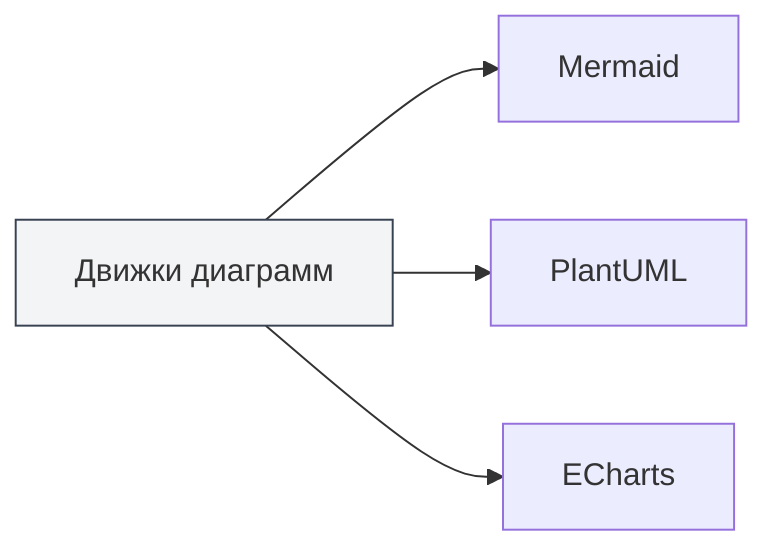
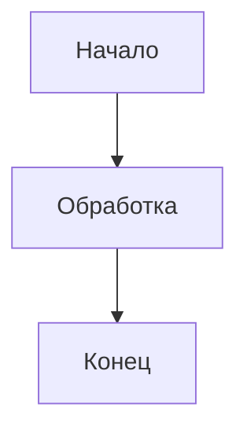

# Функции диаграмм

## Обзор

MetaDoc поддерживает несколько движков для построения диаграмм, позволяя вставлять и отображать различные типы диаграмм в документах Markdown. Функционал диаграмм позволяет создавать блок-схемы, UML-диаграммы, диаграммы для визуализации данных и другие, обогащая содержание документа.

<GraphWindow mode="demo" />

## Поддерживаемые движки диаграмм

<ChartGenerationDisplay mode="demo" />

### Типы диаграмм

MetaDoc поддерживает следующие движки диаграмм:

- **Mermaid**: блок-схемы, UML-диаграммы, диаграммы Ганта и другие
- **PlantUML**: профессиональные UML-диаграммы для моделирования
- **ECharts**: диаграммы для визуализации данных
- **Flowchart**: базовые блок-схемы
- **Graphviz**: визуализация графов
- **Mindmap**: интеллект-карты
- **Markmap**: интеллект-карты на основе Markdown
- **SMILES**: химические структурные формулы
- **ABC**: нотные записи

### Сравнение движков

<DataAnalysisDisplay mode="demo" />

| Движок     | Применение                                   | Способ рендеринга |
| ---------- | -------------------------------------------- | ----------------- |
| Mermaid    | Блок-схемы, диаграммы последовательностей, диаграммы классов, диаграммы Ганта | Рендеринг в браузере |
| PlantUML   | Профессиональное UML-моделирование           | Рендеринг в основном процессе |
| ECharts    | Визуализация данных (линейные диаграммы, гистограммы и т.д.) | Рендеринг в основном процессе |
| Flowchart  | Базовые блок-схемы                           | Рендеринг Vditor |
| Graphviz   | Визуализация графов                          | Рендеринг Vditor |
| Mindmap    | Интеллект-карты                              | Рендеринг Vditor |

### Диаграмма сравнения движков

<OutlineTreeDisplay mode="demo" />



## Вставка диаграмм

<DataAnalysisWindow mode="demo" />

### Синтаксис блоков кода

Используйте блоки кода в документах Markdown для вставки диаграмм:

````markdown

````

### Идентификаторы типов диаграмм

Для разных типов диаграмм используются разные идентификаторы блоков кода:

- **Mermaid**: ` ```mermaid `
- **PlantUML**: ` ```plantuml `
- **ECharts**: ` ```echarts `
- **Flowchart**: ` ```flowchart `
- **Graphviz**: ` ```graphviz `
- **Mindmap**: ` ```mindmap `

## Рендеринг диаграмм

<ChartGenerationDisplay mode="demo" />

### Рендеринг в реальном времени

Диаграммы рендерятся в редакторе в реальном времени:

- **Автоматический рендеринг**: автоматически после ввода кода диаграммы
- **Предпросмотр в реальном времени**: диаграмма отображается в окне предпросмотра
- **Индикация ошибок**: отображение подсказок при синтаксических ошибках

### Способы рендеринга

Для разных диаграмм используются разные способы рендеринга:

- **Рендеринг в браузере**: Mermaid и другие используют API браузера
- **Рендеринг в основном процессе**: PlantUML, ECharts используют рендеринг в основном процессе
- **Рендеринг Vditor**: Flowchart и другие используют рендеринг Vditor

### Форматы рендеринга

Диаграммы могут быть отрендерены в разных форматах:

- **SVG**: векторный формат (по умолчанию)
- **PNG**: растровый формат (можно конвертировать)

## Экспорт диаграмм

<OutlineTreeDisplay mode="demo" />

### Поддержка экспорта

Диаграммы поддерживают экспорт в различные форматы:

- **Экспорт в PDF**: диаграммы включаются в PDF-файл
- **Экспорт в HTML**: диаграммы включаются в HTML-файл
- **Экспорт изображений**: диаграммы можно экспортировать отдельно как изображения

### Качество экспорта

Качество диаграмм сохраняется при экспорте:

- **Векторные изображения**: формат SVG сохраняет четкость
- **Растровые изображения**: формат PNG подходит для печати
- **Разрешение**: разрешение регулируется в зависимости от формата экспорта

## Редактирование диаграмм

<DataAnalysisDisplay mode="demo" />

### Редактирование кода

Код диаграмм можно редактировать напрямую:

- **Подсветка синтаксиса**: блоки кода поддерживают подсветку синтаксиса
- **Автодополнение**: некоторые редакторы поддерживают автодополнение
- **Проверка ошибок**: проверка синтаксических ошибок в реальном времени

### Обновление предпросмотра

Предпросмотр автоматически обновляется после редактирования кода:

- **Обновление в реальном времени**: предпросмотр обновляется сразу после изменения кода
- **Отображение ошибок**: отображение информации об ошибках при синтаксических ошибках
- **Статус рендеринга**: отображение статуса рендеринга диаграммы

## Поддержка нескольких языков

<DataAnalysisWindow mode="demo" />

### Многоязычный код диаграмм

Код диаграмм поддерживает несколько языков:

- **Поддержка китайского**: можно использовать китайские метки и текст
- **Поддержка английского**: можно использовать английские метки и текст
- **Смешанное использование**: можно смешивать китайский и английский

### Интернационализация

Функционал диаграмм поддерживает интернационализацию:

- **Язык интерфейса**: интерфейс, связанный с диаграммами, следует языку системы
- **Сообщения об ошибках**: сообщения об ошибках отображаются на текущем языке
- **Документация**: документация поддерживает несколько языков

## Рекомендации

1. **Выбор подходящего движка**: выбирайте подходящий движок диаграмм в соответствии с потребностями
2. **Соблюдение синтаксиса**: следуйте синтаксическим правилам каждого движка
3. **Четкость кода**: сохраняйте код диаграмм четким и легко читаемым
4. **Тестирование рендеринга**: проверяйте результат рендеринга диаграммы после редактирования
5. **Тестирование экспорта**: проверяйте отображение диаграммы в целевом формате перед экспортом

## Важные замечания

1. **Корректность синтаксиса**: убедитесь, что синтаксис кода диаграммы корректен, иначе рендеринг не произойдет
2. **Производительность рендеринга**: сложные диаграммы могут влиять на производительность рендеринга
3. **Совместимость экспорта**: некоторые форматы диаграмм могут быть несовместимы с определенными форматами экспорта
4. **Безопасность кода**: обратите внимание на безопасность кода диаграмм, избегайте вредоносного кода
5. **Совместимость версий**: разные версии движков диаграмм могут иметь синтаксические различия

## Связанная документация

- [[charts.mermaid|Диаграммы Mermaid]]
- [[charts.plantuml|Диаграммы PlantUML]]
- [[charts.echarts|Диаграммы ECharts]]
- [[markdown.features|Функции редактора Markdown]]