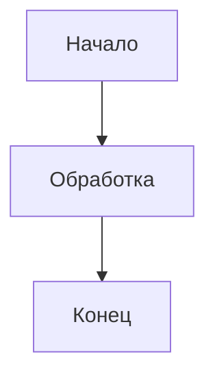
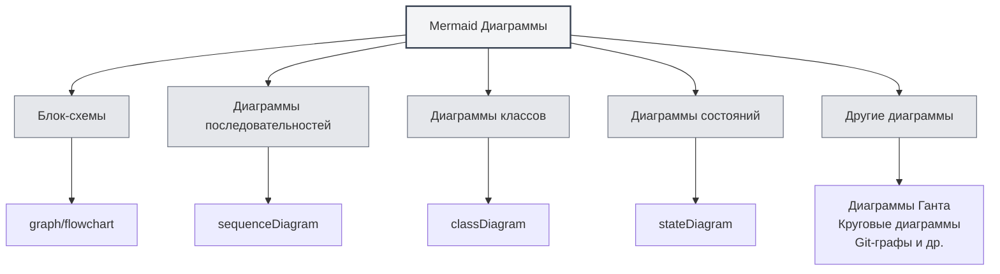
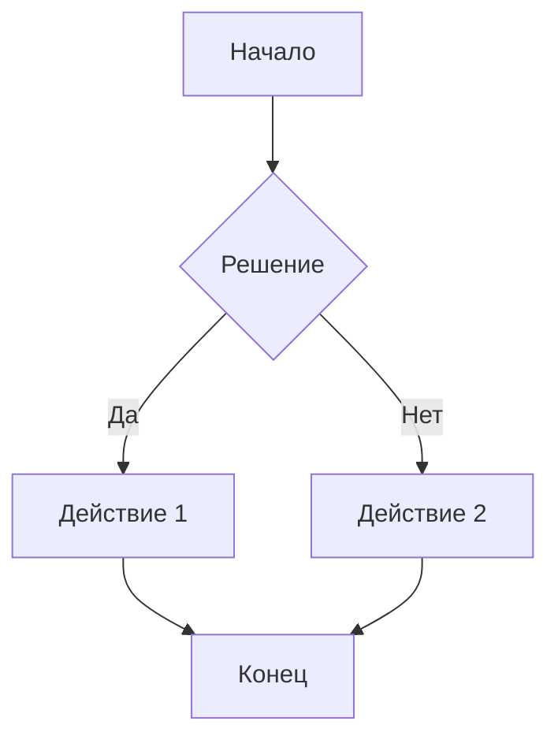
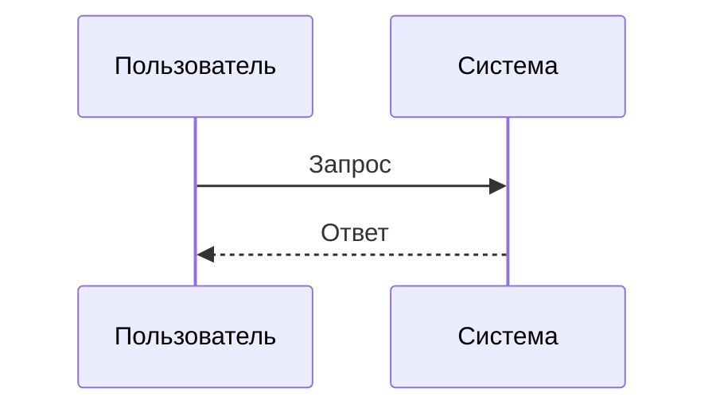
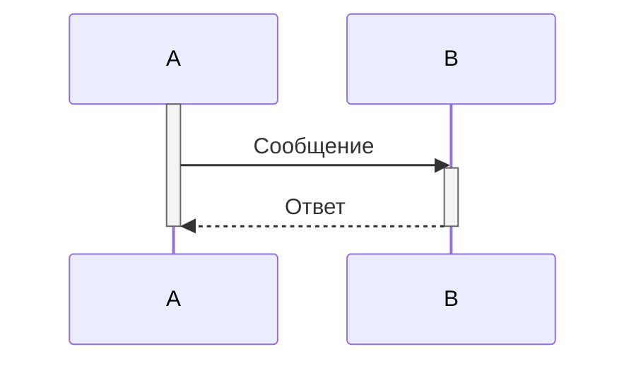
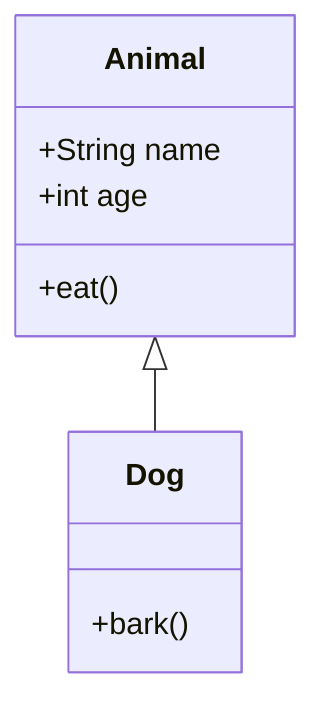
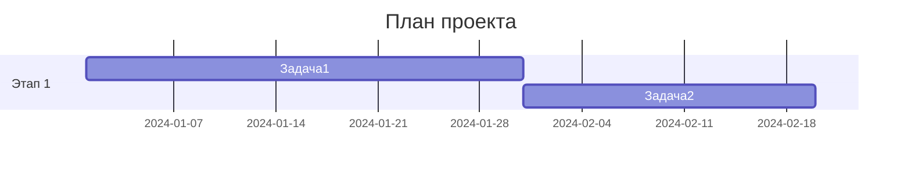
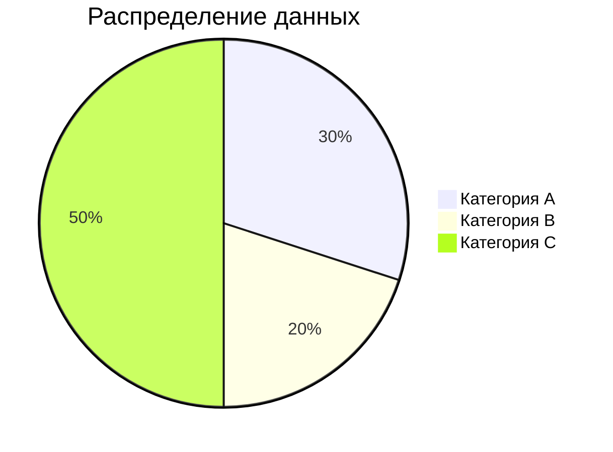
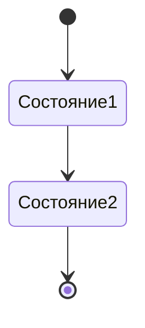
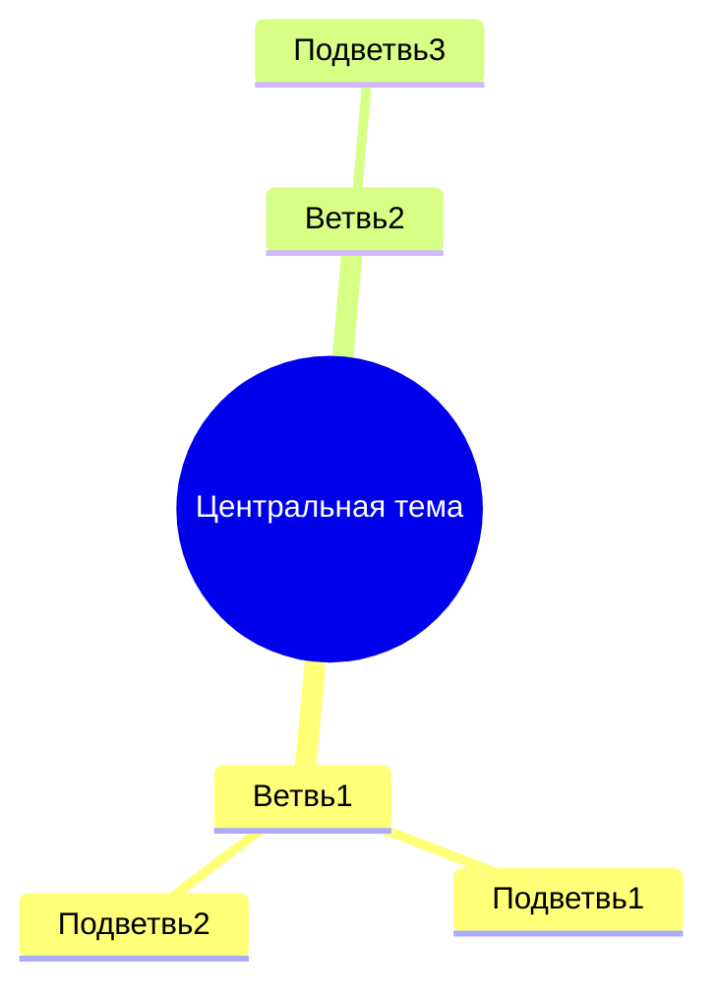

# Диаграммы Mermaid

## Обзор

Mermaid — популярный инструмент для создания диаграмм, подходящий для быстрого рисования блок-схем, диаграмм последовательностей, диаграмм классов, диаграмм Ганта и других. MetaDoc поддерживает диаграммы Mermaid, позволяя непосредственно в документах Markdown использовать синтаксис Mermaid для создания различных диаграмм.

<GraphWindow mode="demo" initialTool="mermaid" />

## Синтаксис Mermaid

<OutlineTreeDisplay mode="demo" />

### Базовый синтаксис

Mermaid использует простой текстовый синтаксис для описания диаграмм:

````markdown

````

### Типы диаграмм

<ChartGenerationDisplay mode="demo" />

Mermaid поддерживает множество типов диаграмм:

- **Блок-схемы** (graph/flowchart)
- **Диаграммы последовательностей** (sequenceDiagram)
- **Диаграммы классов** (classDiagram)
- **Диаграммы состояний** (stateDiagram)
- **Диаграммы "сущность-связь"** (erDiagram)
- **Диаграммы Ганта** (gantt)
- **Круговые диаграммы** (pie)
- **Git-графы** (gitgraph)
- **Диаграммы пользовательского пути** (journey)
- **Интеллект-карты** (mindmap)
- **Временные шкалы** (timeline)



## Блок-схемы

<OutlineTreeDisplay mode="demo" />

### Базовая блок-схема

Создание базовой блок-схемы:

````markdown

````

### Направление блок-схемы

Можно задать направление блок-схемы:

- **TD**: сверху вниз (Top Down)
- **BT**: снизу вверх (Bottom Top)
- **LR**: слева направо (Left Right)
- **RL**: справа налево (Right Left)

### Формы узлов

Можно использовать различные формы узлов:

- **Прямоугольник**: `[текст]`
- **Прямоугольник со скругленными углами**: `(текст)`
- **Ромб**: `{текст}`
- **Круг**: `((текст))`
- **Шестиугольник**: `{{текст}}`
- **Трапеция**: `[/текст\]`
- **Перевернутая трапеция**: `[\текст/]`

## Диаграммы последовательностей

<DataAnalysisDisplay mode="demo" />

### Базовая диаграмма последовательностей

Создание диаграммы последовательностей:

````markdown

````

### Типы сообщений

Можно использовать различные типы сообщений:

- **Сплошная стрелка**: `->>` синхронное сообщение
- **Пунктирная стрелка**: `-->>` асинхронное сообщение
- **Сплошная линия**: `->` синхронное сообщение (без возврата)
- **Пунктирная линия**: `-->` асинхронное сообщение (без возврата)

### Активационные блоки

Можно добавлять активационные блоки для обозначения активности объекта:

````markdown

````

## Диаграммы классов

<ChartGenerationDisplay mode="demo" />

### Базовая диаграмма классов

Создание диаграммы классов:

````markdown

````

### Отношения классов

Можно отображать различные отношения классов:

- **Наследование**: `<|--` или `--|>`
- **Реализация**: `<|..` или `..|>`
- **Композиция**: `*--` или `--*`
- **Агрегация**: `o--` или `--o`
- **Ассоциация**: `-->` или `<--`
- **Зависимость**: `..>` или `<..`

### Члены класса

Можно определять члены класса:

- **Атрибуты**: `+name: String` (публичный), `-name: String` (приватный)
- **Методы**: `+method()` (публичный), `-method()` (приватный)

## Диаграммы Ганта

<OutlineTreeDisplay mode="demo" />

### Базовая диаграмма Ганта

Создание диаграммы Ганта:

````markdown

````

### Формат дат

Можно задать формат дат:

- **YYYY-MM-DD**: год-месяц-день
- **MM/DD/YYYY**: месяц/день/год
- **Другие форматы**: поддерживаются различные форматы дат

### Отношения задач

Можно задавать отношения между задачами:

- **after**: после определенной задачи
- **Веха**: используйте `milestone` для отметки вех

## Круговые диаграммы

<DataAnalysisDisplay mode="demo" />

### Базовая круговая диаграмма

Создание круговой диаграммы:

````markdown

````

## Диаграммы состояний

<ChartGenerationDisplay mode="demo" />

### Базовая диаграмма состояний

Создание диаграммы состояний:

````markdown

````

## Интеллект-карты

<OutlineTreeDisplay mode="demo" />

### Базовая интеллект-карта

Создание интеллект-карты:

````markdown

````

## Важные замечания

<DataAnalysisDisplay mode="demo" />

### Замечания по синтаксису

1. **Обрамление строк**: рекомендуется использовать `["..."]` для обрамления строк во избежание ошибок экранирования
2. **Идентификаторы**: в диаграммах классов избегайте идентификаторов с пробелами или специальными символами
3. **Поддержка кириллицы**: можно использовать кириллицу, но рекомендуется использовать английские идентификаторы
4. **Версия синтаксиса**: обратите внимание на версию синтаксиса Mermaid, различия могут быть в разных версиях

### Замечания по отрисовке

1. **Синтаксические ошибки**: при наличии синтаксических ошибок диаграмма не отрисуется
2. **Сложные диаграммы**: чрезмерно сложные диаграммы могут повлиять на производительность отрисовки
3. **Совместимость браузеров**: некоторые браузеры могут не поддерживать определенные функции Mermaid
4. **Совместимость экспорта**: при экспорте убедитесь, что диаграмма корректно отображается в целевом формате

## Рекомендации

1. **Стандарты синтаксиса**: следуйте официальной спецификации синтаксиса Mermaid
2. **Чистота кода**: сохраняйте код диаграммы чистым и легко читаемым
3. **Тестирование отрисовки**: после редактирования проверяйте результат отрисовки диаграммы
4. **Использование примеров**: обращайтесь к примерам в официальной документации Mermaid
5. **Совместимость версий**: учитывайте совместимость версий Mermaid

## Связанная документация

- [[charts.introduction|Введение в функции диаграмм]]
- [[charts.plantuml|Диаграммы PlantUML]]
- [[charts.echarts|Диаграммы ECharts]]