# Диаграммы PlantUML

## Обзор

PlantUML — это профессиональный инструмент для моделирования UML, поддерживающий множество типов UML-диаграмм. MetaDoc поддерживает диаграммы PlantUML, позволяя создавать профессиональные UML-диаграммы с использованием синтаксиса PlantUML прямо в Markdown-документах.

<GraphWindow mode="demo" initialTool="plantuml" />

## Синтаксис PlantUML

<OutlineTreeDisplay mode="demo" />

### Базовый синтаксис

PlantUML использует специальные маркеры и синтаксис:

````markdown
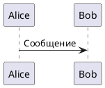
````

### Обязательные маркеры

<ChartGenerationDisplay mode="demo" />

Диаграмма PlantUML должна содержать:

- **@startuml**: маркер начала диаграммы
- **@enduml**: маркер конца диаграммы

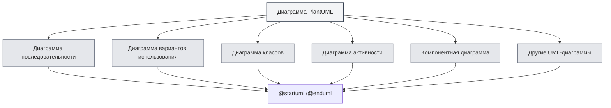

## Поддерживаемые типы диаграмм

<DataAnalysisDisplay mode="demo" />

### Диаграмма последовательности

Создание диаграммы последовательности:

````markdown
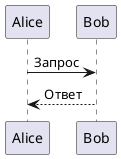
````

### Диаграмма вариантов использования

<OutlineTreeDisplay mode="demo" />

Создание диаграммы вариантов использования:

````markdown
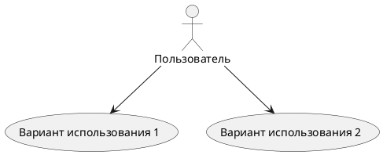
````

### Диаграмма классов

<ChartGenerationDisplay mode="demo" />

Создание диаграммы классов:

````markdown
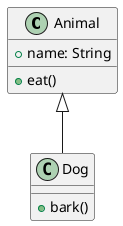
````

### Диаграмма активности

<DataAnalysisDisplay mode="demo" />

Создание диаграммы активности:

````markdown
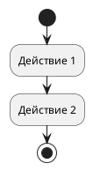
````

### Компонентная диаграмма

<OutlineTreeDisplay mode="demo" />

Создание компонентной диаграммы:

````markdown
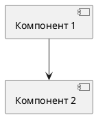
````

### Диаграмма развертывания

<ChartGenerationDisplay mode="demo" />

Создание диаграммы развертывания:

````markdown
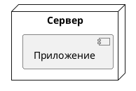
````

### Диаграмма состояний

<DataAnalysisDisplay mode="demo" />

Создание диаграммы состояний:

````markdown
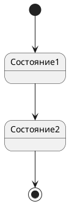
````

## Подробнее о диаграммах последовательности

<OutlineTreeDisplay mode="demo" />

### Участники

Определение участников:

````markdown
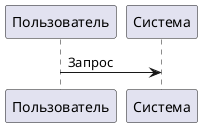
````

### Типы сообщений

Можно использовать различные типы сообщений:

- **Синхронное сообщение**: `->`
- **Асинхронное сообщение**: `-->`
- **Возвращаемое сообщение**: `<-` или `<--`
- **Самовызов**: `->`, направленное на себя

### Фокусы активности (активации)

Добавление фокуса активности:

````markdown
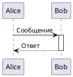
````

## Подробнее о диаграммах классов

<ChartGenerationDisplay mode="demo" />

### Определение класса

Определение класса:

````markdown
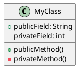
````

### Отношения между классами

Обозначение отношений между классами:

- **Наследование**: `<|--` или `--|>`
- **Реализация**: `<|..` или `..|>`
- **Композиция**: `*--` или `--*`
- **Агрегация**: `o--` или `--o`
- **Ассоциация**: `-->` или `<--`
- **Зависимость**: `..>` или `<..`

### Интерфейсы и абстрактные классы

Определение интерфейсов и абстрактных классов:

````markdown
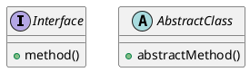
````

## Подробнее о диаграммах активности

### Базовые действия

Определение действий:

````markdown

````

### Узел принятия решения

Добавление условия:

````markdown
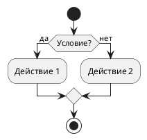
````

### Цикл

Добавление цикла:

````markdown
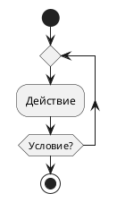
````

## Стили и темы

### Настройка темы

Можно задать тему:

````markdown
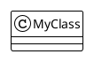
````

### Настройка цвета

Можно задать цвет:

````markdown
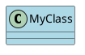
````

## Способ отрисовки

### Отрисовка в основном процессе

PlantUML использует отрисовку в основном процессе:

- **Отрисовка на стороне сервера**: диаграмма отрисовывается в основном процессе
- **Формат SVG**: по умолчанию отрисовывается в формате SVG
- **Формат PNG**: можно конвертировать в формат PNG

### Производительность отрисовки

Особенности отрисовки PlantUML:

- **Скорость отрисовки**: отрисовка в основном процессе выполняется быстро
- **Использование ресурсов**: при отрисовке используются ресурсы основного процесса
- **Обработка ошибок**: ошибки отрисовки отображаются в консоли

## Важные замечания

### Замечания по синтаксису

1. **Обязательные маркеры**: обязательно должны присутствовать `@startuml` и `@enduml`
2. **Синтаксические правила**: следуйте официальной спецификации синтаксиса PlantUML
3. **Поддержка кириллицы**: можно использовать кириллицу, но рекомендуется использовать идентификаторы на английском
4. **Совместимость версий**: обратите внимание на совместимость версий PlantUML

### Замечания по отрисовке

1. **Извлечение кода**: убедитесь, что код извлекается корректно, избегайте включения XML-тегов
2. **Синтаксические ошибки**: при наличии синтаксических ошибок диаграмма не отрисуется
3. **Сложные диаграммы**: слишком сложные диаграммы могут повлиять на производительность отрисовки
4. **Совместимость при экспорте**: при экспорте убедитесь, что диаграмма корректно отображается в целевом формате

## Рекомендации

1. **Синтаксические правила**: следуйте официальной спецификации синтаксиса PlantUML
2. **Читаемость кода**: сохраняйте код диаграммы чистым и легко читаемым
3. **Использование маркеров**: всегда используйте маркеры `@startuml` и `@enduml`
4. **Тестирование отрисовки**: после редактирования проверяйте результат отрисовки диаграммы
5. **Справочная документация**: обращайтесь к официальной документации PlantUML

## Связанные документы

- [[charts.introduction|Введение в функции диаграмм]]
- [[charts.mermaid|Диаграммы Mermaid]]
- [[charts.echarts|Диаграммы ECharts]]
