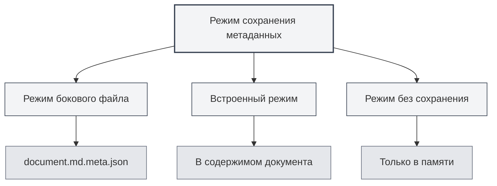

# Метаданные документа

## Обзор

Метаданные документа — это данные, описывающие основные свойства документа, включая заголовок, автора, описание, ключевые слова и т.д. Правильная настройка метаданных способствует управлению и поиску документов, а также они автоматически включаются при экспорте документа.

MetaDoc поддерживает настройку метаданных для каждого документа. Эта информация может сохраняться в боковом файле, встраиваться в содержимое документа или не сохраняться вовсе. Вы также можете использовать ИИ для автоматического создания метаданных.

<MetaInfoPanel mode="demo" :meta='{"title": "", "author": "", "description": "", "keywords": []}' :outlineJson='""' />

## Введение в метаданные

### Заголовок (Title)

Заголовок документа, обычно отображается в верхней части документа и на вкладках.

- **Назначение**: Идентификация основного содержания документа.
- **Место отображения**: Заголовок вкладки, титульная страница экспортированного документа.
- **Пример**: `"Руководство пользователя MetaDoc"`

<MetaInfoPanel mode="demo" :meta='{"title": "Руководство пользователя MetaDoc", "author": "", "description": "", "keywords": []}' :outlineJson='""' />

### Автор (Author)

Автор или создатель документа.

- **Назначение**: Идентификация создателя документа.
- **Место отображения**: Информация об авторе в экспортированном документе.
- **Пример**: `"Иван Иванов"`

<MetaInfoPanel mode="demo" :meta='{"title": "Пример документа", "author": "Иван Иванов", "description": "", "keywords": []}' :outlineJson='""' />

### Описание (Description)

Краткое описание или аннотация документа.

- **Назначение**: Обобщение основного содержания документа.
- **Место отображения**: Раздел аннотации в экспортированном документе.
- **Пример**: `"В этом документе описаны основные способы использования MetaDoc"`

<MetaInfoPanel mode="demo" :meta='{"title": "Пример документа", "author": "Имя автора", "description": "В этом документе описаны основные способы использования MetaDoc", "keywords": []}' :outlineJson='""' />

### Ключевые слова (Keywords)

Список ключевых слов документа, используемый для поиска и классификации документов.

- **Назначение**: Помощь в поиске и классификации документов.
- **Формат**: Массив строк.
- **Пример**: `["MetaDoc", "Руководство пользователя", "Редактирование документов"]`

<MetaInfoPanel mode="demo" :meta='{"title": "Пример документа", "author": "Имя автора", "description": "Описание документа", "keywords": ["MetaDoc", "Руководство пользователя", "Редактирование документов"]}' :outlineJson='""' />

## Настройка метаданных

### Ручная настройка

1. **Откройте панель метаданных**:
   - Нажмите кнопку "Метаданные" на панели инструментов редактора.
   - Или используйте сочетание клавиш (если настроено).

2. **Заполните метаданные**:
   - **Заголовок**: Введите заголовок документа.
   - **Автор**: Введите имя автора.
   - **Описание**: Введите описание документа (поддерживается многострочный ввод).
   - **Ключевые слова**: Введите ключевые слова, разделяя их запятыми.

3. **Сохранение**: Нажмите кнопку "Сохранить", чтобы сохранить метаданные.

Интерфейс панели метаданных выглядит следующим образом:

<MetaInfoPanel mode="demo" :meta='{"title": "Пример документа", "author": "Имя автора", "description": "Описание документа", "keywords": ["Ключевое слово1", "Ключевое слово2"]}' :outlineJson='""' />

### Пакетная настройка

Вы можете настроить все поля метаданных за один раз:

1. Откройте панель метаданных.
2. Заполните все поля.
3. Нажмите кнопку "Сохранить".

<MetaInfoPanel mode="demo" :meta='{"title": "Пример пакетной настройки", "author": "Администратор", "description": "Пример настройки всех полей метаданных", "keywords": ["Пакетная", "Настройка", "Метаданные"]}' :outlineJson='""' />

### Редактирование метаданных

Установленные метаданные можно изменить в любое время:

1. Откройте панель метаданных.
2. Измените необходимые поля.
3. Нажмите кнопку "Сохранить".

Измененные метаданные вступят в силу немедленно и будут сохранены при следующем сохранении документа.

## Режимы сохранения метаданных

MetaDoc поддерживает три режима сохранения метаданных, которые можно настроить в [[settings.basic|Базовых настройках]]:



### Режим бокового файла

Метаданные сохраняются в боковом файле с тем же именем, что и документ (`.meta.json`).

<MetaInfoPanel mode="demo" :meta='{"title": "Пример режима бокового файла", "author": "Система", "description": "Метаданные сохраняются в файле .meta.json", "keywords": ["Боковой файл", "Метаданные"]}' :outlineJson='""' />

**Преимущества**:
- Не изменяет исходное содержимое документа.
- Можно в любой момент удалить боковой файл для восстановления исходного документа.
- Подходит для систем контроля версий.

**Недостатки**:
- Создает дополнительные файлы.
- При перемещении документа необходимо перемещать и боковой файл.

**Пример**:
- Документ: `document.md`
- Файл метаданных: `document.md.meta.json`

### Встроенный режим

Метаданные встраиваются в содержимое документа (front matter в Markdown или комментарии в LaTeX).

<MetaInfoPanel mode="demo" :meta='{"title": "Пример встроенного режима", "author": "Встроенный автор", "description": "Метаданные встроены в документ", "keywords": ["Встроенный", "front matter"]}' :outlineJson='""' />

**Преимущества**:
- Документ и метаданные находятся вместе, что удобно для управления.
- Не требуются дополнительные файлы.

**Недостатки**:
- Изменяет исходное содержимое документа.
- Некоторые форматы могут не поддерживать встраивание.

**Пример** (Markdown):

```markdown
---
title: Заголовок документа
author: Имя автора
description: Описание документа
keywords: [Ключевое слово1, Ключевое слово2]
---

Содержимое документа...
```

### Режим без сохранения

Метаданные используются только во время редактирования и не сохраняются в файл.

<MetaInfoPanel mode="demo" :meta='{"title": "Режим без сохранения", "author": "Временный", "description": "Метаданные сохраняются только в памяти", "keywords": ["Временный", "Без сохранения"]}' :outlineJson='""' />

**Преимущества**:
- Не влияет на исходный документ.
- Не создает дополнительных файлов.

**Недостатки**:
- Метаданные теряются после закрытия документа.
- Невозможно использовать метаданные при экспорте.

## Генерация метаданных с помощью ИИ

MetaDoc поддерживает автоматическую генерацию метаданных документа с помощью ИИ на основе содержимого документа и структуры оглавления.

### Генерация отдельного поля

Сгенерировать метаданные для конкретного поля:

1. Откройте панель метаданных.
2. Нажмите кнопку "Сгенерировать ИИ" рядом с полем.
3. Дождитесь результата генерации ИИ.
4. Просмотрите сгенерированное содержимое, можно принять или сгенерировать заново.

### Генерация всех полей

Сгенерировать все поля метаданных за один раз:

1. Откройте панель метаданных.
2. Нажмите кнопку "Сгенерировать всё ИИ".
3. Дождитесь результата генерации ИИ.
4. Просмотрите сгенерированное содержимое, можно принять, изменить или сгенерировать заново.

<MetaInfoPanel mode="demo" :meta='{"title": "Пример генерации ИИ", "author": "ИИ-помощник", "description": "Метаданные, сгенерированные автоматически с помощью ИИ", "keywords": ["ИИ", "Автогенерация", "Интеллектуальный"]}' :outlineJson='""' />

### Принцип генерации

Генерация метаданных ИИ основана на:
- **Оглавлении документа**: Анализ структуры заголовков документа.
- **Содержимом документа**: Анализ основного содержания документа.
- **Понимании контекста**: Понимание темы и цели документа.

Сгенерированный результат автоматически корректируется в соответствии с содержимым документа, чтобы метаданные точно отражали содержание документа.

## Применение метаданных при экспорте

Экспортированные документы автоматически включают метаданные:

### Экспорт в PDF
- **Заголовок**: Отображается в свойствах PDF-документа.
- **Автор**: Отображается в свойствах PDF-документа.
- **Описание**: Используется как тема (Subject) PDF.
- **Ключевые слова**: Отображаются в свойствах PDF-документа.

### Экспорт в DOCX
- **Заголовок**: Отображается в свойствах документа Word.
- **Автор**: Отображается в свойствах документа Word.
- **Описание**: Используется как аннотация в Word.
- **Ключевые слова**: Отображаются в свойствах документа Word.

### Экспорт в HTML
- **Заголовок**: Отображается в теге `<title>` HTML.
- **Автор**: Отображается в теге `<meta>` HTML.
- **Описание**: Отображается в теге `<meta>` HTML.
- **Ключевые слова**: Отображаются в теге `<meta>` HTML.

## Советы по использованию

### Правильная настройка заголовка
- **Краткость и ясность**: Заголовок должен кратко обобщать содержание документа.
- **Избегайте длинных заголовков**: Слишком длинный заголовок может ухудшить отображение.
- **Используйте ключевые слова**: Включайте важные ключевые слова в заголовок.

### Настройка ключевых слов
- **Умеренное количество**: Рекомендуется устанавливать 3-10 ключевых слов.
- **Высокая релевантность**: Ключевые слова должны быть тесно связаны с содержанием документа.
- **Избегайте повторов**: Избегайте установки повторяющихся или похожих ключевых слов.

### Оптимизация генерации ИИ
- **Проверка после генерации**: Сгенерированное ИИ содержимое требует ручной проверки.
- **Соответствующее редактирование**: Изменяйте сгенерированное содержимое в соответствии с фактическими потребностями.
- **Многократная генерация**: Если результат неудовлетворителен, можно генерировать несколько раз для выбора наилучшего результата.

<MetaInfoPanel mode="demo" :meta='{"title": "Полный пример метаданных", "author": "Демонстрационный пользователь", "description": "Пример полной конфигурации метаданных", "keywords": ["Метаданные", "Конфигурация", "Пример"]}' :outlineJson='""' />

## Часто задаваемые вопросы

### В: Где сохраняются метаданные?

О: В зависимости от режима сохранения, метаданные могут сохраняться в боковом файле, встраиваться в содержимое документа или не сохраняться вовсе. Режим сохранения можно настроить в настройках.

### В: Как удалить метаданные?

О: Очистите все поля на панели метаданных и нажмите "Сохранить", чтобы удалить метаданные.

### В: Что делать, если ИИ сгенерировал неточное содержимое?

О: Содержимое, сгенерированное ИИ, предназначено только для справки. Вы можете изменить его вручную или сгенерировать заново. Рекомендуется проверять и корректировать после генерации.

### В: Влияют ли метаданные на содержимое документа?

О: При использовании встроенного режима метаданные встраиваются в содержимое документа. При использовании режима бокового файла или режима без сохранения исходное содержимое документа не затрагивается.

### В: Теряются ли метаданные при экспорте?

О: Нет. При экспорте метаданные автоматически включаются и отображаются в свойствах экспортированного документа.

## Связанная документация

- [[core.file-operations|Операции с файлами]]
- [[core.export|Функция экспорта]]
- [[settings.basic|Базовые настройки]]
- [[ai.assistants|Функции ИИ-помощника]]
