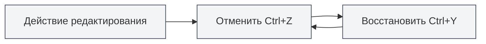
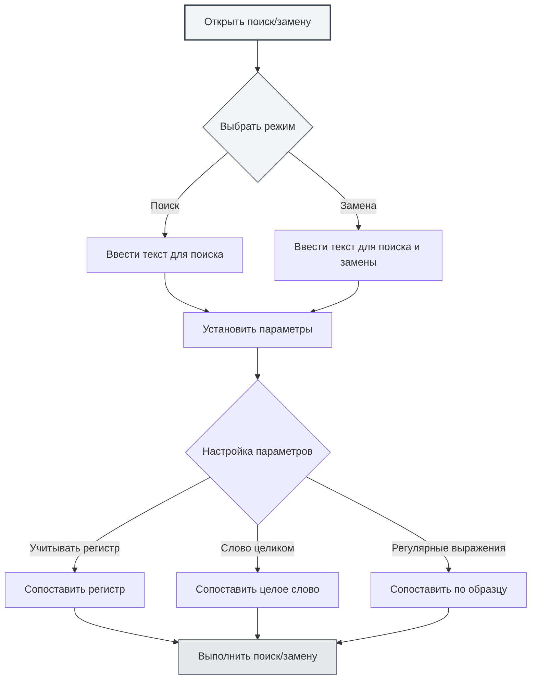

# Основные операции редактора

## Обзор

Основные операции редактора — это базовые навыки редактирования документов в MetaDoc. Освоение этих операций значительно повысит вашу эффективность редактирования.

Редактор MetaDoc поддерживает стандартные операции редактирования текста, включая отмену, повтор, копирование, вставку, вырезание, выделение всего и поиск с заменой.

<SearchReplaceMenu mode="demo" :position='{"top": 100, "left": 200}' :adapter='null' />

<MenuItemsDemo mode="demo" :items='[{"id": "edit"}]' />

## Отмена и повтор

### Отмена операции

Отменить последнее действие редактирования:

- **Горячие клавиши**: `Ctrl+Z` (Windows/Linux) или `Cmd+Z` (macOS)
- **Меню**: Нажмите "Правка" → "Отменить"

Можно последовательно отменить несколько действий, пока документ не вернется в исходное состояние.

### Повтор операции

<MenuItemsDemo mode="demo" :items='[{"id": "edit"}]' />

Восстановить отмененное действие:

- **Горячие клавиши**: `Ctrl+Y` или `Ctrl+Shift+Z` (Windows/Linux) или `Cmd+Shift+Z` (macOS)
- **Меню**: Нажмите "Правка" → "Повторить"

Повтор восстанавливает действия в порядке, обратном их отмене.

## Копирование, вставка, вырезание

<MenuItemsDemo mode="demo" :items='[{"id": "edit"}]' />

### Копирование

Скопировать выделенный текст в буфер обмена:

- **Горячие клавиши**: `Ctrl+C` (Windows/Linux) или `Cmd+C` (macOS)
- **Меню**: Нажмите "Правка" → "Копировать"
- **Контекстное меню**: Выделите текст, щелкните правой кнопкой мыши и выберите "Копировать"

### Вставка

<MenuItemsDemo mode="demo" :items='[{"id": "edit"}]' />

Вставить содержимое буфера обмена в текущую позицию:

- **Горячие клавиши**: `Ctrl+V` (Windows/Linux) или `Cmd+V` (macOS)
- **Меню**: Нажмите "Правка" → "Вставить"
- **Контекстное меню**: Щелкните правой кнопкой мыши и выберите "Вставить"

При вставке содержимое вставляется в позицию курсора. Если текст выделен, он будет заменен.

### Вырезание

<MenuItemsDemo mode="demo" :items='[{"id": "edit"}]' />

Вырезать выделенный текст в буфер обмена (удалить содержимое из исходного места):

- **Горячие клавиши**: `Ctrl+X` (Windows/Linux) или `Cmd+X` (macOS)
- **Меню**: Нажмите "Правка" → "Вырезать"
- **Контекстное меню**: Выделите текст, щелкните правой кнопкой мыши и выберите "Вырезать"

При вырезании текст удаляется из исходного места и сохраняется в буфер обмена, после чего его можно вставить в другое место.

## Выделить все

<MenuItemsDemo mode="demo" :items='[{"id": "edit"}]' />

Выделить все содержимое документа:

- **Горячие клавиши**: `Ctrl+A` (Windows/Linux) или `Cmd+A` (macOS)
- **Меню**: Нажмите "Правка" → "Выделить все"

После выделения всего вы можете:

- Скопировать все содержимое документа
- Удалить все содержимое документа
- Единообразно отформатировать весь текст

## Поиск и замена

### Поиск

<SearchReplaceMenu mode="demo" :position='{"top": 100, "left": 200}' :adapter='null' />

Найти указанный текст в документе:

- **Горячие клавиши**: `Ctrl+F` (Windows/Linux) или `Cmd+F` (macOS)
- **Меню**: Нажмите "Правка" → "Найти"

Функция поиска поддерживает:

- **Учет регистра**: Поиск с учетом регистра
- **Слово целиком**: Поиск только целых слов
- **Регулярные выражения**: Расширенный поиск с использованием регулярных выражений
- **Подсветка**: Результаты поиска подсвечиваются в документе

### Замена

<SearchReplaceMenu mode="demo" :position='{"top": 100, "left": 200}' :adapter='null' />

Найти и заменить текст:

- **Горячие клавиши**: `Ctrl+H` (Windows/Linux) или `Cmd+H` (macOS)
- **Меню**: Нажмите "Правка" → "Найти и заменить"

Функция замены поддерживает:

- **Замена по одному**: Последовательно заменять найденный текст
- **Заменить все**: Заменить все совпадения сразу
- **Предварительный просмотр**: Просмотреть результат замены перед выполнением

### Параметры поиска и замены

Диалоговое окно поиска и замены предоставляет следующие параметры:

- **Учитывать регистр**: Сопоставлять только текст с точно таким же регистром
- **Слово целиком**: Сопоставлять только целые слова (не часть слова)
- **Регулярные выражения**: Использовать регулярные выражения для сопоставления с образцом
- **Циклический поиск**: Автоматически начинать поиск сначала после достижения конца документа

Интерфейс меню поиска и замены выглядит следующим образом:

<SearchReplaceMenu mode="demo" :position='{"top": 100, "left": 200}' :adapter='null' />

## Выделение текста

### Базовое выделение

- **Одиночный щелчок**: Установить курсор в место щелчка
- **Перетаскивание**: Выделить текст от начальной до конечной позиции
- **Двойной щелчок**: Выделить все слово
- **Тройной щелчок**: Выделить всю строку

### Расширенное выделение

- **Shift+щелчок**: Расширить область выделения до места щелчка
- **Ctrl+щелчок**: Добавить несколько несмежных областей выделения (если редактор поддерживает)
- **Alt+перетаскивание**: Режим колоночного выделения (если редактор поддерживает)

## Перемещение курсора

### Базовое перемещение

- **Клавиши со стрелками**: Переместить курсор вверх, вниз, влево, вправо
- **Home/End**: Перейти в начало/конец строки
- **Ctrl+Home/End**: Перейти в начало/конец документа
- **Page Up/Page Down**: Пролистать страницу вверх/вниз

### Перемещение по словам

- **Ctrl+стрелка влево/вправо**: Перемещать курсор по словам
- **Ctrl+стрелка вверх/вниз**: Перемещаться вверх/вниз по абзацам

## Операции удаления

### Базовое удаление

- **Backspace**: Удалить символ перед курсором
- **Delete**: Удалить символ после курсора
- **Ctrl+Backspace**: Удалить целое слово перед курсором
- **Ctrl+Delete**: Удалить целое слово после курсора

## Различия редакторов

MetaDoc предоставляет два основных редактора:

### Редактор Markdown (Vditor)

- Поддерживает предварительный просмотр в реальном времени
- Предоставляет панель инструментов форматирования
- Поддерживает несколько режимов редактирования (IR/WYSIWYG/SV)
- Подробнее см. [[markdown.editor|Руководство по использованию редактора Markdown]]

### Редактор LaTeX (Monaco)

- Профессиональный опыт редактирования кода
- Подсветка синтаксиса и автодополнение
- Поддерживает свертку кода
- Подробнее см. [[latex.editor|Руководство по использованию редактора LaTeX]]

Базовые операции в обоих редакторах в основном одинаковы, но расширенные функции различаются.

## Справочник горячих клавиш

### Общие горячие клавиши

| Действие | Windows/Linux              | macOS         |
| -------- | -------------------------- | ------------- |
| Отмена   | `Ctrl+Z`                   | `Cmd+Z`       |
| Повтор   | `Ctrl+Y` или `Ctrl+Shift+Z` | `Cmd+Shift+Z` |
| Копировать | `Ctrl+C`                   | `Cmd+C`       |
| Вставить | `Ctrl+V`                   | `Cmd+V`       |
| Вырезать | `Ctrl+X`                   | `Cmd+X`       |
| Выделить все | `Ctrl+A`                   | `Cmd+A`       |
| Найти    | `Ctrl+F`                   | `Cmd+F`       |
| Найти и заменить | `Ctrl+H`                   | `Cmd+H`       |

## Важные замечания

1. **История отмены**: История отмены очищается после закрытия документа, рекомендуется своевременно сохранять документ.
2. **Буфер обмена**: Содержимое копирования и вырезания сохраняется в системном буфере обмена и может быть потеряно после закрытия приложения.
3. **Поиск и замена**: При использовании регулярных выражений обратите внимание на экранирование специальных символов.
4. **Большие документы**: При работе с большими документами операции поиска и замены могут занять некоторое время.

## Связанная документация

- [[core.file-operations|Операции с файлами]]
- [[core.editor-settings|Настройки редактора]]
- [[markdown.editor|Руководство по использованию редактора Markdown]]
- [[latex.editor|Руководство по использованию редактора LaTeX]]