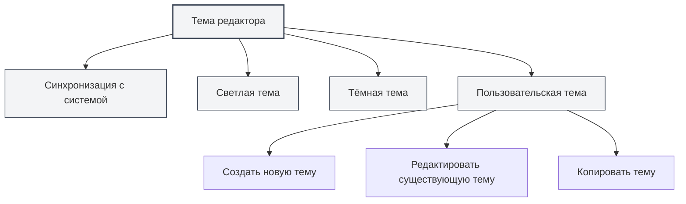
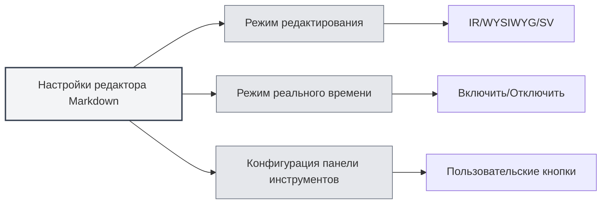

# Настройки редактора

## Обзор

Настройки редактора позволяют настроить внешний вид и поведение редактора, включая тему, шрифт, отображение номеров строк и другое. Правильные настройки могут улучшить ваш опыт редактирования и повысить производительность.

Настройки редактора делятся на глобальные и специфичные для редактора. Глобальные настройки влияют на все редакторы, в то время как некоторые настройки могут применяться только к определённым типам редакторов (например, редактору Markdown или редактору LaTeX).

<MenuItemsDemo mode="demo" :items='[{"id": "settings"}]' />

## Тема редактора

<MenuItemsDemo mode="demo" :items='[{"id": "settings"}]' />

### Типы тем

MetaDoc поддерживает несколько режимов тем:

- **Синхронизация с системой**: автоматическое следование системной теме (светлая/тёмная)
- **Светлая тема**: всегда использовать светлую тему
- **Тёмная тема**: всегда использовать тёмную тему
- **Пользовательская тема**: использовать пользовательскую конфигурацию цветов

### Установка темы

<SettingThemeSection mode="demo" />

1.  Откройте страницу настроек (нажмите меню "Настройки" или используйте горячую клавишу)
2.  Перейдите в раздел "Настройки темы"
3.  Выберите понравившуюся тему

Вы можете получить доступ к настройкам через верхнюю строку меню:

Нажав на меню "Настройки" в верхней строке меню, вы можете открыть панель настроек и сконфигурировать такие опции, как тема редактора, тема содержимого, тема кода и другие.

<MenuItemsDemo mode="demo" :items='[{"id": "settings"}]' />

Настройки темы вступают в силу немедленно, перезапуск приложения не требуется.

### Пользовательская тема

<SettingThemeSection mode="demo" />

Вы можете создавать и редактировать пользовательские темы:

1.  На странице настроек темы нажмите "Создать тему"
2.  Установите название темы и цвета темы
3.  После сохранения тема будет готова к использованию

Пользовательские темы поддерживают:

- **Редактирование**: изменение названия и цветов темы
- **Копирование**: копирование существующей темы в качестве основы для новой
- **Удаление**: удаление ненужных пользовательских тем

## Тема содержимого

<SettingThemeSection mode="demo" />

Тема содержимого управляет стилем отображения области предпросмотра документа:

- **Авто**: автоматический выбор на основе глобальной темы
- **Светлая**: всегда использовать светлый стиль предпросмотра
- **Тёмная**: всегда использовать тёмный стиль предпросмотра

Тема содержимого в основном влияет на отображение предпросмотра Markdown и PDF.

## Тема кода

<SettingThemeSection mode="demo" />

Тема кода управляет стилем подсветки синтаксиса для блоков кода:

- **Авто**: автоматический выбор на основе глобальной темы
- **Предустановленные темы**: выбор предустановленной темы кода (например, GitHub, Monokai, Solarized и др.)

Тема кода влияет на:

-   Подсветку синтаксиса в блоках кода Markdown
-   Подсветку кода в редакторе LaTeX
-   Стиль отображения вывода консоли

## Настройки шрифта

<SettingBasicSection mode="demo" />

### Шрифт редактора

Шрифт, используемый редактором, можно настроить в системных настройках. По умолчанию используется моноширинный шрифт, например:

-   JetBrains Mono
-   Consolas
-   Courier New
-   Microsoft YaHei Mono

### Размер шрифта

-   **Увеличить**: используйте `Ctrl+=` или `Ctrl+Колесо мыши вверх`
-   **Уменьшить**: используйте `Ctrl+-` или `Ctrl+Колесо мыши вниз`
-   **Сбросить**: используйте `Ctrl+0` для возврата к размеру по умолчанию

Изменение размера шрифта вступает в силу немедленно, но не сохраняется в настройках.

## Отображение номеров строк

<SettingBasicSection mode="demo" />

### Показать/скрыть номера строк

Настройка отображения номеров строк управляет тем, показывает ли редактор номера строк:

-   **Включить**: показывать номера строк для удобства навигации по коду
-   **Отключить**: скрыть номера строк для увеличения области редактирования

### Настройка отображения номеров строк

1.  Откройте страницу настроек
2.  В разделе "Настройки редактора" найдите "Отображение номеров строк"
3.  Переключите переключатель, чтобы включить или отключить номера строк

Настройка номеров строк влияет на:

-   Редактор LaTeX
-   Редактор простого текста
-   Область предпросмотра кода

Примечание: Отображение номеров строк в редакторе Markdown (Vditor) управляется его собственной конфигурацией.

## Отображение мини-карты

Мини-карта (Minimap) — это миниатюрное изображение кода справа от редактора, помогающее быстро просматривать и находить содержимое документа.

### Показать/скрыть мини-карту

Настройки отображения мини-карты:

-   **Включить**: показывать мини-карту для удобного просмотра длинных документов
-   **Отключить**: скрыть мини-карту для увеличения области редактирования

### Настройка мини-карты

Настройки мини-карты обычно находятся в контекстном меню редактора или на панели инструментов:

1.  Щёлкните правой кнопкой мыши в редакторе
2.  Найдите опцию "Мини-карта" или "Minimap"
3.  Переключите состояние отображения

Функция мини-карты в основном применима для:

-   Редактора LaTeX (Monaco)
-   Редактора простого текста (Monaco)

## Специфичные настройки редактора

### Настройки редактора Markdown

Специфичные настройки редактора Markdown (Vditor):

-   **Режим редактирования**: IR-режим, WYSIWYG-режим, SV-режим
-   **Режим реального времени**: включить/отключить функцию предпросмотра в реальном времени
-   **Конфигурация панели инструментов**: настройка кнопок панели инструментов

Подробнее см. [[markdown.editor|Руководство по использованию редактора Markdown]].

### Настройки редактора LaTeX

Специфичные настройки редактора LaTeX (Monaco):

-   **Сворачивание кода**: включить/отключить функцию сворачивания кода
-   **Перенос строк**: управление отображением длинных строк
-   **Проверка синтаксиса**: включить/отключить проверку синтаксиса LaTeX

Подробнее см. [[latex.editor|Руководство по использованию редактора LaTeX]].

## Синхронизация настроек

Настройки редактора сохраняются в локальной конфигурации, включая:

-   Выбор темы
-   Предпочтения по отображению номеров строк
-   Размер шрифта (текущая сессия)
-   Состояние отображения мини-карты

Настройки автоматически восстанавливаются после перезапуска приложения.

## Справочник горячих клавиш

### Регулировка шрифта

| Действие               | Windows/Linux | macOS        |
| ---------------------- | ------------- | ------------ |
| Увеличить шрифт        | `Ctrl+=`      | `Cmd+=`      |
| Уменьшить шрифт        | `Ctrl+-`      | `Cmd+-`      |
| Сбросить шрифт         | `Ctrl+0`      | `Cmd+0`      |
| Масштабирование колёсиком мыши | `Ctrl+Колесо` | `Cmd+Колесо` |

## Рекомендации

1.  **Выбор темы**:

    -   Для длительного редактирования рекомендуется использовать тёмную тему, чтобы уменьшить усталость глаз
    -   Для предпросмотра перед печатью используйте светлую тему для лучшего результата печати

2.  **Отображение номеров строк**:

    -   При написании кода рекомендуется включить номера строк для удобного поиска ошибок
    -   При редактировании простого текста можно отключить номера строк для увеличения области редактирования

3.  **Мини-карта**:

    -   Включите мини-карту при редактировании длинных документов для быстрого просмотра структуры
    -   При редактировании коротких документов мини-карту можно отключить

4.  **Размер шрифта**:
    -   Настройте размер шрифта в зависимости от размера экрана и личных привычек
    -   Рекомендуется использовать размер шрифта 14-16px для баланса между читаемостью и пространством на экране

## Важные замечания

1.  **Синхронизация темы**: после выбора "Синхронизация с системой" тема будет автоматически переключаться в соответствии с системными настройками
2.  **Область действия настроек**: некоторые настройки влияют только на определённые редакторы и не затрагивают другие
3.  **Влияние на производительность**: включение некоторых функций (например, предпросмотра в реальном времени) может повлиять на производительность редактирования
4.  **Пользовательская тема**: цвета пользовательской темы влияют на цветовую схему всего приложения

## Связанная документация

-   [[core.editor-basics|Основные операции редактора]]
-   [[settings.basic|Базовые настройки]]
-   [[settings.theme|Настройки темы]]
-   [[markdown.editor|Руководство по использованию редактора Markdown]]
-   [[latex.editor|Руководство по использованию редактора LaTeX]]