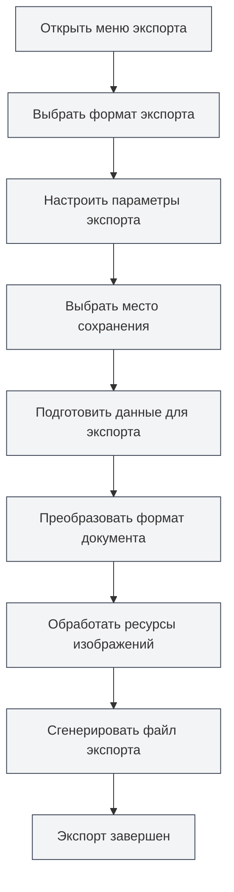

# Функция экспорта

## Обзор

MetaDoc поддерживает экспорт документов в различные форматы, включая PDF, HTML, DOCX, LaTeX, Markdown, JSON и другие. Функция экспорта предоставляет различные параметры в зависимости от формата документа, обеспечивая сохранение исходного форматирования и стилей.

Функция экспорта автоматически включает метаинформацию документа (заголовок, автор, описание, ключевые слова) и обрабатывает такие элементы, как изображения, таблицы, математические формулы, в процессе экспорта.

<MenuItemsDemo mode="demo" :items='[{"id": "file", "items": ["export"]}]' />

<MetaInfoPanel mode="demo" :meta='{"title": "Пример экспорта", "author": "Автор", "description": "Описание документа", "keywords": ["экспорт", "PDF"]}' :outlineJson='""' />

<MenuItemsDemo mode="demo" :items='[{"id": "file", "items": ["export"]}]' />

<MetaInfoPanel mode="demo" :meta='{"title": "Форматы экспорта", "author": "MetaDoc", "description": "Описание поддерживаемых форматов экспорта", "keywords": ["экспорт", "формат"]}' :outlineJson='""' />

## Поддерживаемые форматы экспорта

<MenuItemsDemo mode="demo" :items='[{"id": "file", "items": ["export"]}]' />

### Экспорт документов Markdown

Документы Markdown (`.md`) можно экспортировать в следующие форматы:

- **PDF**: подходит для печати и обмена
- **HTML**: подходит для отображения на веб-странице
- **DOCX**: подходит для редактирования в Word
- **LaTeX**: подходит для академических статей
- **JSON**: подходит для программной обработки

<MetaInfoPanel mode="demo" :meta='{"title": "Экспорт LaTeX", "author": "Система", "description": "Параметры экспорта документов LaTeX", "keywords": ["LaTeX", "экспорт"]}' :outlineJson='""' />

### Экспорт документов LaTeX

Документы LaTeX (`.tex`) можно экспортировать в следующие форматы:

- **PDF**: генерируется путем компиляции LaTeX
- **Markdown**: преобразуется в формат Markdown
- **HTML**: преобразуется в формат HTML
- **DOCX**: преобразуется в формат Word

<MenuItemsDemo mode="demo" :items='[{"id": "file", "items": ["export"]}]' />

### Экспорт документов JSON

Документы JSON (`.json`) можно экспортировать как:

- **JSON**: сохраняет формат JSON

## Операции экспорта

### Базовый экспорт

1. **Откройте меню экспорта**:
   - Нажмите "Файл" → "Экспорт" в строке меню
   - Или используйте сочетание клавиш (если настроено)

Параметры экспорта в меню "Файл":

<MenuItemsDemo mode="demo" :items='[{"id": "file", "items": ["export"]}]' />

2. **Выберите формат экспорта**:

   - В меню экспорта выберите целевой формат
   - Система отобразит доступные параметры экспорта в зависимости от текущего формата документа

3. **Выберите место сохранения**:

   - В диалоговом окне сохранения файла выберите место сохранения
   - Введите имя файла (система автоматически добавит правильное расширение)

4. **Дождитесь завершения экспорта**:
   - Во время экспорта будет отображаться индикатор выполнения
   - По завершении экспорта появится уведомление об успехе

### Быстрый экспорт

Для часто используемых форматов можно использовать сочетания клавиш для быстрого экспорта:

- **Экспорт в PDF**: `Ctrl+Shift+E` (если настроено)
- **Экспорт в HTML**: через выбор в меню

## Подробнее об экспорте Markdown

<MenuItemsDemo mode="demo" :items='[{"id": "file", "items": ["export"]}]' />

### Экспорт в PDF

Экспорт в PDF преобразует Markdown в формат PDF:

- **Содержимое**: основной текст документа, изображения, таблицы, математические формулы
- **Метаинформация**: заголовок, автор, описание, ключевые слова
- **Стили**: используются специальные стили для PDF, подходящие для печати
- **Обработка изображений**: изображения автоматически масштабируются для соответствия странице

**Сценарии использования**:

- Печать документа
- Обмен документом с другими
- Архивное хранение

### Экспорт в HTML

<MetaInfoPanel mode="demo" :meta='{"title": "Экспорт HTML", "author": "Система", "description": "Настройки и параметры экспорта HTML", "keywords": ["HTML", "экспорт"]}' :outlineJson='""' />

Экспорт в HTML преобразует Markdown в веб-формат:

- **Содержимое**: основной текст документа, изображения, таблицы, математические формулы
- **Метаинформация**: заголовок, автор, описание, ключевые слова (в метатегах HTML)
- **Стили**: используются стили HTML, подходящие для отображения на веб-странице
- **Обработка изображений**: можно выбрать сохранение исходного URL, преобразование в base64 или сохранение в папку

**Сценарии использования**:

- Публикация на сайте
- Просмотр в браузере
- Обмен с другими

### Экспорт в DOCX

<MenuItemsDemo mode="demo" :items='[{"id": "file", "items": ["export"]}]' />

Экспорт в DOCX преобразует Markdown в формат Word:

- **Содержимое**: основной текст документа, изображения, таблицы, математические формулы
- **Метаинформация**: заголовок, автор, описание, ключевые слова (в свойствах документа Word)
- **Стили**: используются стили Word, позволяющие дальнейшее редактирование в Word
- **Обработка изображений**: изображения встраиваются в документ Word

**Сценарии использования**:

- Дальнейшее редактирование в Word
- Совместное редактирование с другими
- Отправка документа

### Экспорт в LaTeX

<MetaInfoPanel mode="demo" :meta='{"title": "Экспорт LaTeX", "author": "Академия", "description": "Экспорт Markdown в LaTeX", "keywords": ["LaTeX", "академический"]}' :outlineJson='""' />

Экспорт в LaTeX преобразует Markdown в формат LaTeX:

- **Содержимое**: основной текст документа, изображения, таблицы, математические формулы
- **Метаинформация**: заголовок, автор, описание, ключевые слова (в документе LaTeX)
- **Преобразование формата**: синтаксис Markdown преобразуется в соответствующие команды LaTeX
- **Математические формулы**: сохраняется формат математических формул LaTeX

**Сценарии использования**:

- Написание академических статей
- Ситуации, требующие формата LaTeX
- Дальнейшее редактирование документов LaTeX

### Экспорт в JSON

<MenuItemsDemo mode="demo" :items='[{"id": "file", "items": ["export"]}]' />

Экспорт в JSON сохраняет документ в формате JSON:

- **Содержимое**: все данные документа (содержимое, метаинформация, структура и т.д.)
- **Формат**: структурированные данные JSON
- **Назначение**: программная обработка, резервное копирование данных

## Подробнее об экспорте LaTeX

<MetaInfoPanel mode="demo" :meta='{"title": "Подробнее об экспорте LaTeX", "author": "Система", "description": "Подробное описание экспорта документов LaTeX", "keywords": ["LaTeX", "PDF", "экспорт"]}' :outlineJson='""' />

### Экспорт в PDF

Экспорт документов LaTeX в PDF требует компиляции LaTeX:

1. **Компиляция LaTeX**: система автоматически компилирует документ LaTeX
2. **Генерация PDF**: после успешной компиляции генерируется PDF-файл
3. **Метаинформация**: свойства PDF-документа включают метаинформацию

**Важные замечания**:

- Требуется установленный дистрибутив LaTeX (например, TeX Live)
- Компиляция может занять некоторое время
- В случае сбоя компиляции будет отображено сообщение об ошибке

### Экспорт в Markdown

Документы LaTeX можно преобразовать в формат Markdown:

- **Преобразование формата**: команды LaTeX преобразуются в синтаксис Markdown
- **Математические формулы**: формулы LaTeX преобразуются в формат математических формул Markdown
- **Таблицы**: таблицы LaTeX преобразуются в таблицы Markdown

### Экспорт в HTML

Документы LaTeX можно преобразовать в формат HTML:

- **Преобразование формата**: команды LaTeX преобразуются в HTML-теги
- **Математические формулы**: рендеринг с использованием MathJax или KaTeX
- **Стили**: отображение с использованием стилей HTML

### Экспорт в DOCX

Документы LaTeX можно преобразовать в формат Word:

- **Преобразование формата**: команды LaTeX преобразуются в формат Word
- **Математические формулы**: преобразуются в формат математических формул Word
- **Таблицы**: преобразуются в формат таблиц Word

## Настройка параметров экспорта

### Параметры обработки изображений

При экспорте можно настроить способ обработки изображений:

- **Сохранить исходный URL**: сохраняет исходный URL изображений (подходит для экспорта HTML)
- **Преобразовать в Base64**: встраивает изображения в документ (подходит для экспорта HTML, DOCX)
- **Сохранить в папку**: сохраняет изображения в указанную папку (подходит для экспорта HTML)

### Параметры экспорта PDF

Экспорт в PDF поддерживает следующие параметры:

- **Размер страницы**: A4, Letter и др.
- **Поля**: пользовательские поля
- **Шрифт**: выбор шрифта и размера
- **Качество изображений**: настройка качества изображений

### Параметры экспорта HTML

Экспорт в HTML поддерживает следующие параметры:

- **Стили**: выбор темы стилей HTML
- **Рендеринг математических формул**: выбор MathJax или KaTeX
- **Подсветка синтаксиса**: включение или отключение подсветки кода

## Ход выполнения экспорта

Во время экспорта отображается индикатор выполнения:

- **Этап подготовки**: подготовка данных для экспорта
- **Этап преобразования**: преобразование формата документа
- **Обработка изображений**: обработка изображений в документе
- **Генерация файла**: создание итогового файла

Если экспорт занимает много времени, вы можете:

- **Просмотреть ход выполнения**: посмотреть текущий прогресс на индикаторе
- **Отменить экспорт**: нажать кнопку "Отмена" для отмены операции экспорта

## Именование экспортируемых файлов

Экспортируемые файлы именуются автоматически:

- **Имя по умолчанию**: используется заголовок документа или имя файла
- **Автоматическое расширение**: расширение добавляется автоматически в зависимости от формата экспорта
- **Пользовательское имя**: можно выбрать пользовательское имя в диалоговом окне сохранения

## Советы по использованию

### Выбор подходящего формата

- **PDF**: подходит для печати и официального обмена
- **HTML**: подходит для отображения на веб-странице и онлайн-просмотра
- **DOCX**: подходит для ситуаций, требующих дальнейшего редактирования
- **LaTeX**: подходит для академического письма и ситуаций, требующих формата LaTeX

### Рекомендации по обработке изображений

- **Экспорт HTML**: для отображения на веб-странице рекомендуется использовать Base64 или сохранение в папку
- **Экспорт DOCX**: изображения встраиваются автоматически, дополнительная обработка не требуется
- **Экспорт PDF**: изображения автоматически масштабируются для соответствия странице

### Пакетный экспорт

Если необходимо экспортировать несколько документов:

1. Откройте документы по одному
2. Экспортируйте каждый в нужный формат
3. Или используйте скрипт для пакетной обработки (для продвинутых пользователей)

## Часто задаваемые вопросы

### В: Что делать, если экспорт не удался?

О: Проверьте, нет ли ошибок в документе, убедитесь, что все изображения и ресурсы доступны. Если экспорт в PDF не удался, проверьте, нет ли ошибок компиляции LaTeX.

### В: Экспортированный PDF имеет неправильный формат?

О: Проверьте настройки параметров экспорта PDF, отрегулируйте размер страницы и поля. Убедитесь, что содержимое документа отформатировано правильно.

### В: Изображения не отображаются после экспорта?

О: Проверьте правильность пути к изображениям, убедитесь, что файлы изображений существуют. Для экспорта HTML выберите подходящий способ обработки изображений.

### В: Можно ли настроить стили экспорта?

О: Некоторые форматы поддерживают настройку стилей, их можно настроить в параметрах экспорта. Экспорт в PDF и HTML поддерживает пользовательскую настройку стилей.

### В: Будет ли включена метаинформация при экспорте?

О: Да, при экспорте автоматически включается метаинформация документа (заголовок, автор, описание, ключевые слова), которая отображается в свойствах экспортированного документа.

## Связанная документация

- [[core.file-operations|Операции с файлами]]
- [[core.document-metadata|Метаинформация документа]]
- [[markdown.basics|Синтаксис Markdown]]
- [[latex.basics|Синтаксис LaTeX]]
- [[latex.compilation|Компиляция и предпросмотр LaTeX]]