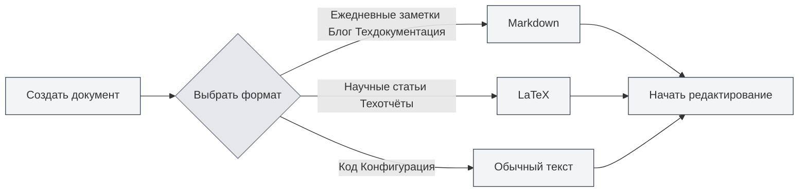
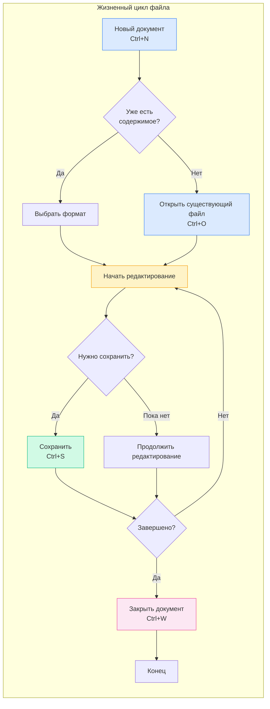

# Работа с файлами

## Обзор

Работа с файлами — это базовая функция MetaDoc. Независимо от того, пишете ли вы техническую документацию, научную статью или ведёте ежедневные заметки, уверенное владение операциями с файлами сделает процесс создания более плавным. В этой статье подробно описано, как создавать, открывать, сохранять и управлять документами.

## Создание нового документа

<MainTabs mode="demo" />

<MenuItemsDemo mode="demo" :items='[{"id": "file", "items": ["new"]}]' />

### Создание пустого документа

MetaDoc предлагает несколько удобных способов создания нового документа. Вы можете выбрать наиболее подходящий метод в зависимости от текущих привычек работы:

**Способ 1: Горячие клавиши (самый быстрый)**

-  Нажмите `Ctrl+N`, чтобы немедленно создать новый документ.
-  Подходит для быстрого создания нового документа во время редактирования.

**Способ 2: Меню "Файл"**

-  Нажмите на значок "Файл" в левой панели меню.
-  В раскрывающемся меню выберите "Создать".

**Способ 3: Вход с главной страницы**

-  Нажмите кнопку "Новый документ" на главной странице.
-  Подходит для начала работы сразу после открытия приложения.

Ниже показан интерфейс меню "Файл", содержащий часто используемые операции, такие как создание, открытие, сохранение:

<MenuItemsDemo mode="demo" :items='[{"id": "file", "items": ["new", "open", "save", "save-as", "save-all", "close"]}]' />

<MainTabs mode="demo" />

**Состояние после создания документа**:

После создания нового документа вы увидите:

-  Вверху появится новая вкладка с заголовком "Без имени".
-  Система предложит выбрать формат документа (Markdown, LaTeX или обычный текст).
-  На этом этапе документ находится только в памяти; чтобы сохранить его на диск, необходимо выполнить сохранение.

```mermaid
graph LR
    A[Создать новый документ] --> B{Выбрать способ}
    B -->|Горячие клавиши| C[Ctrl+N]
    B -->|Меню| D[Файл→Создать]
    B -->|Главная| E[Кнопка "Новый документ"]
    C --> F[Выбрать формат]
    D --> F
    E --> F
    F --> G[Создать вкладку]
    G --> H[Инициализировать документ]
    style A fill:#f3f4f6,stroke:#374151
    style B fill:#f3f4f6,stroke:#374151
    style C fill:#f3f4f6,stroke:#374151
    style D fill:#f3f4f6,stroke:#374151
    style E fill:#f3f4f6,stroke:#374151
    style F fill:#f3f4f6,stroke:#374151
    style G fill:#f3f4f6,stroke:#374151
    style H fill:#f3f4f6,stroke:#374151
```

### Выбор формата документа

При создании документа необходимо выбрать его формат. Разные форматы подходят для разных сценариев:

**Markdown (.md)** — самый популярный облегчённый формат

-  Подходит для: ежедневных заметок, постов в блог, технической документации, документации по проектам.
-  Преимущества: простой синтаксис, легко читается, множество форматов экспорта.
-  Примеры использования: запись ключевых моментов встречи, написание технического блога, систематизация учебных заметок.

**LaTeX (.tex)** — профессиональный формат для академической вёрстки

-  Подходит для: научных статей, диссертаций, технических отчётов, математических документов.
-  Преимущества: качественная вёрстка, отличная поддержка формул, автоматическое создание оглавления и ссылок.
-  Примеры использования: написание научной статьи, создание учебника по математике, подготовка академического доклада.

**Обычный текст (.txt)** — самый простой текстовый формат

-  Подходит для: фрагментов кода, конфигурационных файлов, временных заметок.
-  Преимущества: высокая универсальность, открывается в любом редакторе.
-  Примеры использования: сохранение фрагментов кода, запись временной информации.



## Открытие документа

<MenuItemsDemo mode="demo" :items='[{"id": "file", "items": ["open"]}]' />

### Открытие существующего файла

1.  **С помощью горячих клавиш**: нажмите `Ctrl+O`, чтобы открыть диалоговое окно выбора файла.
2.  **Через меню**: нажмите "Файл" → "Открыть".
3.  **С главной страницы**: нажмите кнопку "Открыть файл" на главной странице.

### Поддерживаемые форматы файлов

MetaDoc поддерживает открытие файлов следующих форматов:

-  `.md` — документы Markdown
-  `.tex` — документы LaTeX
-  `.txt` — файлы обычного текста
-  `.json` — файлы в формате JSON

### Список последних файлов

На главной странице отображается список недавно открытых документов для быстрого доступа:

-  Нажмите на карточку недавнего документа, чтобы быстро открыть его.
-  Щёлкните правой кнопкой мыши, чтобы удалить запись о недавнем документе.
-  Отображается не более 12 последних документов.

### Связывание файлов

MetaDoc поддерживает функцию связывания файлов:

-  Двойной щелчок по файлу `.md` или `.tex` в системе автоматически откроет его в MetaDoc.
-  Если файл уже открыт в другом окне, вам будет предложено сообщение о том, что файл уже открыт в другом окне.

## Сохранение документа

<MenuItemsDemo mode="demo" :items='[{"id": "file", "items": ["save", "save-as", "save-all"]}]' />

### Сохранение текущего документа

Привычка часто сохраняться помогает избежать потери результатов работы из-за непредвиденных обстоятельств.

**Способы сохранения**:

-  **Горячие клавиши** (рекомендуется): `Ctrl+S` — самый распространённый способ сохранения, не отрывая рук от клавиатуры.
-  **Действие в меню**: нажмите меню "Файл" → "Сохранить".

**Первое сохранение**:
Если документ новый, при первом сохранении откроется диалоговое окно "Сохранить как". Вам необходимо:

1.  Выбрать место сохранения (например, папку "Документы").
2.  Ввести имя файла (например, "План_проекта.md").
3.  Нажать кнопку "Сохранить".

**Обновление сохранённого документа**:
Если документ уже сохранялся ранее, нажатие `Ctrl+S` напрямую перезапишет исходный файл без появления диалогового окна.

### Сохранить как — создание копии документа

Используйте функцию "Сохранить как", когда нужно сохранить исходный документ и одновременно создать его новую версию.

**Сценарии использования**:

-  Создание резервной копии перед изменением документа.
-  Сохранение документа в другое место.
-  Сохранение разных версий документа под разными именами.

**Способы выполнения**:

-  **Горячие клавиши**: `Ctrl+Shift+S`
-  **Меню**: нажмите "Файл" → "Сохранить как"

**Пример**:
Вы редактируете "Отчёт_v1.md" и хотите сохранить резервную копию перед внесением значительных изменений:

1.  Нажмите `Ctrl+Shift+S`.
2.  Введите новое имя файла "Отчёт_v1_резервная_копия.md".
3.  Нажмите "Сохранить".
4.  Продолжайте редактировать исходный документ, внося изменения без опасений.

### Сохранить всё — сохранение всех документов одним нажатием

Если у вас открыто несколько документов одновременно, вы можете использовать функцию "Сохранить всё", чтобы сохранить все документы за один раз.

**Способы выполнения**:

-  **Горячие клавиши**: `Ctrl+K S` (сначала нажмите `Ctrl+K`, затем `S`).
-  **Меню**: нажмите "Файл" → "Сохранить всё".

**Сценарии использования**:

-  Быстрое сохранение всех открытых документов в конце работы.
-  Гарантия того, что все изменения сохранены.

### Автосохранение — позвольте системе сохранять за вас

MetaDoc поддерживает функцию автосохранения, которая может автоматически сохранять документы, пока вы сосредоточены на творчестве.

**Настройка**:
Перейдите в [[settings.basic|Основные настройки]], найдите опцию "Автосохранение" и выберите подходящий интервал времени:

-  **Выключено**: ручное управление моментом сохранения.
-  **1 минута**: самый безопасный вариант, но увеличивает количество операций записи на диск.
-  **5 минут**: сбалансированный вариант (рекомендуется).
-  **10 минут / 30 минут / 1 час**: подходит для длинных документов, уменьшает частоту сохранения.

**Принцип работы**:

-  Автосохранение происходит в фоновом режиме и не прерывает ваше редактирование.
-  При автосохранении метка "Не сохранено" на вкладке исчезает.
-  Вы можете в любой момент сохранить вручную (`Ctrl+S`), независимо от автосохранения.

**Рекомендации**:

-  Для важных документов рекомендуется включить автосохранение с интервалом 5 минут.
-  Даже при включённом автосохранении в ключевые моменты (например, после завершения главы) всё равно рекомендуется сохранять вручную.

## Закрытие файла

<MainTabs mode="demo" />

### Закрытие текущей вкладки

-  **Горячие клавиши**: `Ctrl+W`
-  **Нажатие кнопки закрытия на вкладке**: нажмите кнопку × справа от вкладки.

### Предупреждение перед закрытием

Если в документе есть несохранённые изменения, при закрытии вам будет предложено:

-  **Сохранить**: сохранить изменения и закрыть.
-  **Не сохранять**: закрыть, отказавшись от изменений.
-  **Отмена**: отменить операцию закрытия.

### Повторное открытие закрытой вкладки

-  **Горячие клавиши**: `Ctrl+Shift+T`

Можно восстановить недавно закрытые вкладки (максимум 20).

## Управление несколькими вкладками

<MainTabs mode="demo" />

MetaDoc поддерживает одновременное открытие нескольких документов, каждый из которых отображается на отдельной вкладке:

На панели вкладок отображаются все открытые документы, поддерживаются операции переключения, закрытия, перетаскивания и другие:

<MainTabs mode="demo" />

-  **Переключение вкладок**: используйте `Ctrl+Tab` для перехода к следующей вкладке, `Ctrl+Shift+Tab` — к предыдущей.
-  **Сортировка перетаскиванием**: перетащите вкладку, чтобы изменить её порядок.
-  **Закрепление вкладки**: щёлкните правой кнопкой мыши по вкладке и выберите "Закрепить". Закреплённая вкладка всегда отображается слева и не может быть закрыта.

Подробнее об операциях с вкладками см. в разделе [[core.multi-tab|Управление несколькими вкладками]].



## Индикация состояния файла

На вкладке отображается состояние документа:

-  **Не сохранено**: рядом с заголовком вкладки отображается точка (●), что указывает на наличие несохранённых изменений.
-  **Сохранено**: специальной метки нет.
-  **Только для чтения**: отображается значок замка, что означает, что файл открыт в режиме только для чтения.

## Важные замечания

1.  **Путь к файлу**: при сохранении файла убедитесь, что на диске достаточно места и есть права на запись.
2.  **Формат файла**: при сохранении обратите внимание на выбор подходящего формата файла, чтобы избежать несовместимости форматов.
3.  **Резервное копирование**: важные документы рекомендуется регулярно резервировать; для создания копий можно использовать функцию "Сохранить как".
4.  **Конфликт файлов**: если файл был изменён извне, MetaDoc обнаружит это и предложит вам разрешить конфликт.

## Связанная документация

- [[core.editor-basics|Основные операции редактора]]
- [[core.multi-tab|Управление несколькими вкладками]]
- [[core.document-metadata|Метаданные документа]]
- [[core.export|Функция экспорта]]
- [[settings.basic|Основные настройки]]