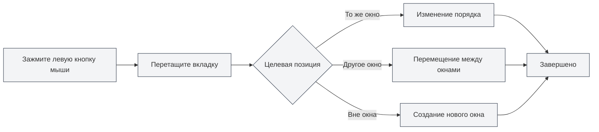

# Управление несколькими вкладками

## Обзор

MetaDoc поддерживает управление несколькими вкладками, позволяя вам открывать несколько документов одновременно, каждый из которых отображается на отдельной вкладке. Освоение операций с вкладками может значительно повысить вашу производительность.

Управление вкладками включает такие функции, как создание, переключение, закрытие, перетаскивание для сортировки, закрепление и другие, что позволяет гибко организовывать и управлять несколькими документами.

<MainTabs mode="demo" />

<AIChat mode="demo" />

<KnowledgeBase mode="demo" />

<ProofreadView mode="demo" />

<GraphWindow mode="demo" />

<OcrWindow mode="demo" />

<DataAnalysisWindow mode="demo" />

<AgentView mode="demo" />

<MenuItemsDemo mode="demo" :items='[{"id": "file", "items": ["new", "open", "save"]}]' />

<ViewMenuItemsDemo mode="demo" :items='["editor", "outline"]' />

<Outline mode="demo" />

<ResizableDivider mode="demo" />

<TitleMenu mode="demo" title="Пример вкладок" :position='{"top": 100, "left": 200}' path="1" :tree='{}' />

## Создание новой вкладки

### Создание новой вкладки

Существует несколько способов создания новой вкладки:

1.  **Горячая клавиша**: Нажмите `Ctrl+T` для быстрого создания новой вкладки.
2.  **Кнопка**: Нажмите кнопку "+" справа на панели вкладок.
3.  **Меню**: Нажмите "Файл" → "Создать".

На панели вкладок отображаются все открытые документы, поддерживаются операции создания, переключения, закрытия и другие:

<MainTabs mode="demo" />

Новая вкладка откроет пустой документ, вы можете выбрать формат документа (Markdown/LaTeX/Простой текст).

### Создание вкладки из файла

При открытии файла автоматически создается новая вкладка:

1.  **Горячая клавиша**: Нажмите `Ctrl+O` для открытия диалога выбора файла.
2.  **Меню**: Нажмите "Файл" → "Открыть".
3.  **Главная страница**: Нажмите кнопку "Открыть файл" на главной странице.

Открытый файл будет отображен на новой вкладке.

## Переключение между вкладками

### Переключение с помощью горячих клавиш

-   **Следующая вкладка**: `Ctrl+Tab` для переключения на следующую вкладку.
-   **Предыдущая вкладка**: `Ctrl+Shift+Tab` для переключения на предыдущую вкладку.

Переключение происходит циклически: после достижения последней вкладки происходит автоматический переход к первой.

### Переключение с помощью мыши

-   **Клик по вкладке**: Просто щелкните по заголовку вкладки, чтобы переключиться на нее.
-   **Колесико мыши**: Прокрутка колесика мыши на панели вкладок позволяет переключать вкладки.
    -   **Прокрутка вниз**: Переключение на следующую вкладку.
    -   **Прокрутка вверх**: Переключение на предыдущую вкладку.

### Индикатор переключения вкладок

При использовании горячих клавиш для переключения вкладок отображается индикатор переключения, показывающий текущую выбранную вкладку, что облегчает быструю навигацию.

## Закрытие вкладок

### Закрытие текущей вкладки

-   **Горячая клавиша**: `Ctrl+W` закрывает текущую активную вкладку.
-   **Кнопка закрытия**: Нажмите кнопку × справа от вкладки.
-   **Клик средней кнопкой мыши**: Щелкните средней кнопкой мыши по вкладке, чтобы закрыть ее.

### Предупреждение перед закрытием

Если в документе на вкладке есть несохраненные изменения, при закрытии появится запрос:

-   **Сохранить**: Сохранить изменения и закрыть вкладку.
-   **Не сохранять**: Закрыть вкладку, отбросив изменения.
-   **Отмена**: Отменить операцию закрытия и продолжить редактирование.

### Повторное открытие закрытой вкладки

-   **Горячая клавиша**: `Ctrl+Shift+T` повторно открывает последнюю закрытую вкладку.

Система сохраняет до 20 последних закрытых вкладок, вы можете восстановить их в порядке, обратном закрытию.

## Перетаскивание вкладок

### Изменение порядка

Вы можете перетаскивать вкладки, чтобы изменить их порядок:

1.  **Зажмите левую кнопку мыши**: Нажмите и удерживайте левую кнопку мыши на заголовке вкладки.
2.  **Перетащите**: Перетащите вкладку в нужное место.
3.  **Отпустите**: Отпустите левую кнопку мыши, чтобы завершить сортировку.

При перетаскивании будет визуальная подсказка, показывающая целевую позицию вкладки.

### Перетаскивание между окнами

Вкладки можно перетаскивать в другие окна:

1.  **Перетащите вкладку**: Зажмите левую кнопку мыши и перетащите вкладку.
2.  **Переместите в другое окно**: Перетащите вкладку в другое окно MetaDoc.
3.  **Отпустите**: Отпустите кнопку мыши в целевом окне, и вкладка переместится в него.

Перетаскивание между окнами позволяет гибко организовывать документы в нескольких окнах.

### Создание нового окна

Перетаскивание вкладки за пределы окна создает новое окно:

1.  **Перетащите вкладку**: Зажмите левую кнопку мыши и перетащите вкладку.
2.  **Переместите за пределы окна**: Перетащите вкладку за пределы текущего окна.
3.  **Отпустите**: Отпустите кнопку мыши, система создаст новое окно и откроет в нем эту вкладку.

## Закрепление вкладок

### Закрепление вкладки

Закрепленная вкладка всегда отображается слева на панели вкладок и не может быть закрыта:

-   **Двойной клик по вкладке**: Двойной щелчок по заголовку вкладки закрепляет ее.
-   **Контекстное меню**: Щелкните правой кнопкой мыши по вкладке и выберите "Закрепить".

Закрепленная вкладка:
-   Отображается слева на панели вкладок.
-   Показывает значок замка.
-   Не может быть закрыта обычным способом.
-   Не может быть перемещена перетаскиванием.

### Открепление вкладки

-   **Контекстное меню**: Щелкните правой кнопкой мыши по закрепленной вкладке и выберите "Открепить".

После открепления вкладка возвращается в нормальное состояние, когда ее можно закрывать и перетаскивать.

## Состояние вкладок

### Состояние "Не сохранено"

Вкладка отображает состояние сохранения документа:
-   **Не сохранено**: Рядом с заголовком вкладки отображается точка (●), указывающая на наличие несохраненных изменений.
-   **Сохранено**: Специальной отметки нет.

### Состояние "Только для чтения"

Если документ доступен только для чтения, на вкладке отображается значок замка:
-   **Документ только для чтения**: Отображается значок замка, указывающий, что документ нельзя редактировать.
-   **Редактируемый документ**: Специальной отметки нет.

### Состояние предпросмотра

Вкладка в состоянии предпросмотра:
-   **Режим предпросмотра**: Файлы, открытые одним щелчком, отображаются в режиме предпросмотра.
-   **Двойной клик для активации**: Двойной щелчок по вкладке предпросмотра активирует ее как обычную вкладку.
-   **Автоматическая активация**: Автоматически активируется после редактирования или переключения вида.

## Контекстное меню вкладки

Щелчок правой кнопкой мыши по вкладке открывает контекстное меню со следующими действиями:
-   **Закрыть**: Закрыть текущую вкладку.
-   **Закрыть другие**: Закрыть все вкладки, кроме текущей.
-   **Закрыть справа**: Закрыть все вкладки справа от текущей.
-   **Закрепить/Открепить**: Закрепить или открепить вкладку.
-   **Переместить в новое окно**: Переместить вкладку в новое окно.
-   **Копировать путь**: Скопировать путь к документу в буфер обмена.

## Ограничение количества вкладок

MetaDoc не имеет строгого ограничения на количество одновременно открытых вкладок, но рекомендуется:
-   **Разумное количество**: Одновременное открытие 10-20 вкладок является разумным.
-   **Влияние на производительность**: Открытие слишком большого количества вкладок может повлиять на производительность приложения.
-   **Использование памяти**: Каждая вкладка потребляет определенный объем памяти.

Если вкладок слишком много, рекомендуется закрывать ненужные.

## Справочник по горячим клавишам

### Горячие клавиши для работы с вкладками

| Действие               | Windows/Linux      | macOS             |
| ---------------------- | ------------------ | ----------------- |
| Новая вкладка          | `Ctrl+T`           | `Cmd+T`           |
| Закрыть вкладку        | `Ctrl+W`           | `Cmd+W`           |
| Переключить на следующую | `Ctrl+Tab`         | `Cmd+Tab`         |
| Переключить на предыдущую | `Ctrl+Shift+Tab`   | `Cmd+Shift+Tab`   |
| Повторно открыть закрытую | `Ctrl+Shift+T`     | `Cmd+Shift+T`     |

### Действия мышью

| Действие         | Способ                          |
| ---------------- | ------------------------------- |
| Переключить вкладку | Щелчок по заголовку вкладки     |
| Закрыть вкладку  | Щелчок по кнопке × или средней кнопкой мыши |
| Закрепить вкладку | Двойной щелчок по заголовку вкладки |
| Перетащить для сортировки | Удерживая левую кнопку, перетащить |
| Переключение колесиком | Прокрутка колесика мыши на панели вкладок |

## Советы по использованию

### Организация вкладок

1.  **Закрепляйте часто используемые документы**: Закрепите документы, которые используете часто, для быстрого доступа.
2.  **Группируйте по проектам**: Размещайте связанные документы вместе, используя перетаскивание для организации.
3.  **Используйте несколько окон**: Размещайте документы разных проектов в разных окнах.

### Быстрое переключение

1.  **Используйте горячие клавиши**: Освойте использование `Ctrl+Tab` для быстрого переключения вкладок.
2.  **Используйте колесико мыши**: Прокручивайте колесико мыши на панели вкладок для быстрого просмотра.
3.  **Используйте индикатор переключения**: При использовании горячих клавиш отображается индикатор переключения, облегчающий навигацию.

### Массовые операции

1.  **Закрытие нескольких вкладок**: Используйте функции "Закрыть другие" или "Закрыть справа" в контекстном меню.
2.  **Сохранение всех вкладок**: Используйте `Ctrl+K S` для сохранения всех открытых документов.
3.  **Повторное открытие**: Используйте `Ctrl+Shift+T` для быстрого восстановления закрытых вкладок.

## Часто задаваемые вопросы

### В: Как быстро найти определенную вкладку?

О: Используйте горячую клавишу `Ctrl+Tab`. Появится индикатор переключения, показывающий все вкладки. Вы можете продолжать нажимать Tab для выбора или просто щелкнуть по нужной.

### В: Что делать, если вкладок слишком много?

О: Можно закрепить часто используемые вкладки, закрыть ненужные или использовать несколько окон для группировки документов.

### В: Как восстановить случайно закрытую вкладку?

О: Используйте горячую клавишу `Ctrl+Shift+T`, чтобы повторно открыть последнюю закрытую вкладку.

### В: Можно ли закрыть закрепленную вкладку?

О: Закрепленную вкладку нельзя закрыть обычным способом, сначала ее нужно открепить. Щелкните правой кнопкой мыши по закрепленной вкладке и выберите "Открепить".

### В: Можно ли перетаскивать вкладки между окнами?

О: Да. Перетащите вкладку в другое окно MetaDoc, чтобы переместить вкладку в это окно.

## Связанная документация

-   [[core.file-operations|Операции с файлами]]
-   [[core.multi-window|Управление несколькими окнами]]
-   [[core.editor-basics|Основные операции редактора]]
