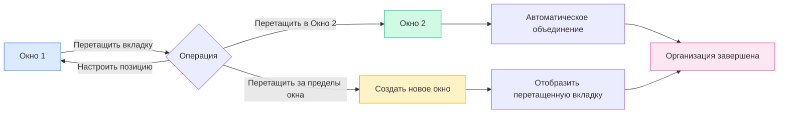

# Управление несколькими окнами

## Обзор

MetaDoc поддерживает управление несколькими окнами, позволяя открывать разные документы в разных окнах. С помощью управления несколькими окнами вы можете одновременно просматривать и редактировать несколько документов, повышая эффективность работы.

## Поддержка нескольких окон

### Типы окон

MetaDoc поддерживает два типа окон:

- **Главное окно**: содержит основные функции, такие как редактирование документов, домашняя страница, поддерживает управление несколькими вкладками.
- **Вспомогательное окно**: окна инструментов, такие как настройки, AI-чат, OCR и т.д., являются одноэкземплярными окнами.

### Особенности окон

Особенности главного окна:

- **Несколько вкладок**: каждое окно имеет независимый список вкладок.
- **Независимое состояние**: каждое окно имеет независимое состояние документа.
- **Поддержка перетаскивания**: поддерживает разделение и объединение вкладок путем перетаскивания.
- **Пул окон**: предварительно создает свободные окна для быстрого отображения.

## Создание нового окна

### Создание путем перетаскивания

Новое окно можно создать путем перетаскивания вкладки:

1. **Перетащите вкладку**: перетащите вкладку за границы окна.
2. **Создание окна**: система автоматически создаст новое окно.
3. **Отображение содержимого**: новое окно отобразит содержимое перетащенной вкладки.

Панель вкладок поддерживает операции перетаскивания, позволяя вытащить вкладку из окна для создания нового окна:

<MainTabs mode="demo" />

**Важные замечания**:

- Окно с одной вкладкой нельзя использовать для создания нового окна путем перетаскивания.
- При перетаскивании система автоматически получает предварительно загруженное окно из пула окон для быстрого отображения.

### Создание через контекстное меню

Новое окно можно создать через контекстное меню:

1. **Щелкните правой кнопкой мыши по вкладке**: щелкните правой кнопкой мыши по вкладке, которую нужно переместить.
2. **Выберите опцию**: выберите "Открыть в новом окне".
3. **Создание окна**: система создаст новое окно и переместит вкладку.

### Механизм пула окон

MetaDoc использует механизм пула окон для оптимизации создания окон:

- **Предварительно загруженные окна**: система предварительно создает 2 свободных окна.
- **Быстрое отображение**: использование предварительно загруженного окна позволяет отобразить его мгновенно (<100 мс).
- **Автоматическое пополнение**: после использования новое окно автоматически добавляется в пул.

## Перетаскивание вкладок между окнами

### Объединение путем перетаскивания

Вы можете перетащить вкладку из одного окна в другое для гибкой организации окон:

**Шаги операции**:

1. **Перетащите вкладку**: перетащите вкладку в исходном окне.
2. **Перетащите в целевое окно**: перетащите вкладку на панель вкладок целевого окна.
3. **Автоматическое объединение**: вкладка автоматически добавится в целевое окно.

### Позиция при перетаскивании

При перетаскивании можно указать позицию вставки:

- **Автоматическое позиционирование**: позиция вставки определяется автоматически по положению курсора.
- **Указанная позиция**: можно перетащить для вставки в определенную позицию.
- **Вставка в конец**: перетаскивание в конец приведет к вставке в конце.

### Объединение окон с одной вкладкой

Если в исходном окне только одна вкладка:

- **Автоматическое объединение**: при перетаскивании в другое окно произойдет автоматическое объединение.
- **Закрытие окна**: исходное окно автоматически закроется после объединения.
- **Избегание пустых окон**: предотвращает появление пустых окон.

## Управление окнами

### Переключение окон

Для переключения окон можно использовать системные горячие клавиши:

- **Alt+Tab** (Windows/Linux): переключение окон.
- **Cmd+Tab** (macOS): переключение окон.

### Состояние окон

Каждое окно имеет независимое состояние:

- **Список вкладок**: каждое окно имеет независимый список вкладок.
- **Состояние документа**: каждое окно имеет независимое состояние документа.
- **Состояние просмотра**: каждое окно имеет независимое состояние просмотра.

### Закрытие окон

Способы закрытия окон:

- **Кнопка закрытия**: нажмите кнопку закрытия окна.
- **Горячие клавиши**: используйте системные горячие клавиши для закрытия окна.
- **Пункт меню**: закройте окно через меню.

**Важные замечания**:

- Перед закрытием окна будет предложено сохранить несохраненные документы.
- Вспомогательные окна при закрытии скрываются, а не закрываются полностью.

## Синхронизация окон

### Синхронизация состояния

Некоторые состояния синхронизируются между окнами:

- **Настройки языка**: смена языка синхронизируется со всеми окнами.
- **Настройки темы**: смена темы синхронизируется со всеми окнами.
- **Системные настройки**: системные настройки синхронизируются со всеми окнами.

### Связь с файлами

Функция связи с файлами:

- **Предотвращение дублирования**: один и тот же файл не будет открыт одновременно в нескольких окнах.
- **Локализация окна**: если файл уже открыт в другом окне, система уведомит и переключится на это окно.
- **Блокировка файла**: при переносе файл временно блокируется для предотвращения конфликтов.

## Рекомендации

1. **Разумное разделение экрана**: используйте несколько окон для раздельного редактирования, чтобы повысить эффективность.
2. **Организация окон**: помещайте связанные документы в одно окно, а несвязанные — в разные.
3. **Управление вкладками**: грамотно используйте перетаскивание вкладок для организации макета окон.
4. **Переключение окон**: освоите быстрое переключение окон с помощью Alt+Tab.
5. **Сохранение состояния**: перед закрытием окна убедитесь, что важные документы сохранены.

## Важные замечания

1. **Количество окон**: слишком много окон может повлиять на производительность, рекомендуется разумно контролировать их количество.
2. **Блокировка файлов**: файлы временно блокируются при переносе, чтобы избежать конфликтов.
3. **Независимость состояния**: состояние каждого окна независимо и не влияет на другие.
4. **Пул окон**: механизм пула окон управляется автоматически, не требует ручного вмешательства.
5. **Вспомогательные окна**: вспомогательные окна являются одноэкземплярными, при закрытии они скрываются.

## Связанная документация

- [[core.multi-tab|Управление несколькими вкладками]]
- [[core.file-operations|Операции с файлами]]

<ViewMenuItemsDemo mode="demo" :items='["home", "outline"]' />

<ViewMenuItemsDemo mode="demo" :items='["chat", "agent"]' />

<MenuItemsDemo mode="demo" :items='[{"id": "file"}]' />

<MenuItemsDemo mode="demo" :items='[{"id": "edit"}]' />

<MenuItemsDemo mode="demo" :items='[{"id": "view"}]' />

<LeftMenu mode="demo" />
