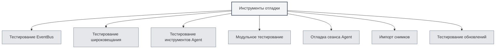

# Инструменты отладки

## Обзор

Инструменты отладки — это функция среды разработки, предоставляемая MetaDoc, для тестирования и отладки функций приложения. Эти инструменты доступны только в среде разработки и помогают разработчикам быстро тестировать и отлаживать код.

<SettingDebugSection mode="demo" />

## Введение в инструменты отладки

<SettingDebugSection mode="demo" />

<ConsoleTerminal mode="demo" consoleKey="debug" :history='[]' />

### Доступ к инструментам отладки

Инструменты отладки доступны только в среде разработки:

1.  **Среда разработки**: Убедитесь, что вы работаете в среде разработки.
2.  **Страница настроек**: Откройте страницу настроек.
3.  **Инструменты отладки**: Найдите опцию "Инструменты отладки" на странице настроек.
4.  **Открыть инструменты**: Нажмите, чтобы открыть интерфейс инструментов отладки.

Вы можете получить доступ к инструментам отладки через верхнюю строку меню (только в среде разработки):

<MenuItemsDemo mode="demo" :items='[{"id": "settings"}]' />

### Типы инструментов

Инструменты отладки включают следующие функциональные модули:

-   **Тестирование EventBus**: Тестирование событий EventBus.
-   **Тестирование широковещания**: Тестирование широковещательных событий.
-   **Тестирование инструментов Agent**: Тестирование инструментов Agent.
-   **Модульное тестирование**: Запуск модульных тестов.
-   **Отладка сеанса Agent**: Отладка сеансов Agent.
-   **Импорт снимков**: Импорт снимков документов.
-   **Тестирование обновлений**: Тестирование функции обновлений.

<SettingDebugSection mode="demo" />

## Тестирование EventBus

### Отправка события

Можно отправлять события EventBus для тестирования:

1.  **Имя события**: Введите имя события для отправки.
2.  **Данные события**: (Опционально) Введите данные события в формате JSON.
3.  **Отправить событие**: Нажмите кнопку "Отправить событие".
4.  **Просмотр результата**: Просмотрите результат отправки события.

<ConsoleTerminal mode="demo" consoleKey="debug" :history='[]' />

### Прослушивание событий

Можно прослушивать события EventBus:

-   **Список событий**: Отображает все отправленные события.
-   **Детали события**: Просмотр подробной информации о событии.
-   **Данные события**: Просмотр содержимого данных события.

## Тестирование широковещания

### Отправка широковещания

Можно отправлять широковещательные события для тестирования:

1.  **Целевое окно**: Выберите цель широковещания (all/home/ai-chat и т.д.).
2.  **Имя события**: Введите имя события для широковещания.
3.  **Данные события**: (Опционально) Введите данные события в формате JSON.
4.  **Отправить широковещание**: Нажмите кнопку "Отправить широковещание".
5.  **Просмотр результата**: Просмотрите результат отправки широковещания.

<ConsoleTerminal mode="demo" consoleKey="debug" :history='[]' />

### Прослушивание широковещания

Можно прослушивать широковещательные события:

-   **Список широковещаний**: Отображает все отправленные широковещания.
-   **Детали широковещания**: Просмотр подробной информации о широковещании.
-   **Целевое окно**: Просмотр целевого окна широковещания.

## Тестирование инструментов Agent

### Тестирование инструмента

Можно тестировать инструменты Agent:

1.  **Выбор инструмента**: Выберите инструмент Agent для тестирования.
2.  **Ввод параметров**: Введите тестовые параметры инструмента (в формате JSON).
3.  **Выбор контекста**: Выберите ID вкладки контекста для тестирования.
4.  **Выполнение теста**: Нажмите кнопку "Выполнить тест".
5.  **Просмотр результата**: Просмотрите результат теста.

### История тестирования

Можно просматривать историю тестирования:

-   **Список истории**: Отображает всю историю тестирования.
-   **Результаты теста**: Просмотр результатов каждого теста.
-   **Информация об ошибках**: Просмотр информации об ошибках теста.

## Модульное тестирование

### Отдельный тест

Можно запускать отдельные модульные тесты:

1.  **Выбор модуля**: Выберите модуль для тестирования.
2.  **Выбор теста**: Выберите тестовую функцию для запуска.
3.  **Редактирование параметров**: Отредактируйте параметры тестовой функции.
4.  **Выполнение теста**: Нажмите кнопку "Выполнить тест".
5.  **Просмотр результата**: Просмотрите результат теста.

<ConsoleTerminal mode="demo" consoleKey="debug" :history='[]' />

### Пакетное тестирование

Можно запускать модульные тесты пакетно:

1.  **Выбор модуля**: Выберите один или несколько модулей.
2.  **Выбор контекста**: Выберите ID вкладки контекста для тестирования.
3.  **Начать тестирование**: Нажмите кнопку "Начать пакетное тестирование".
4.  **Просмотр прогресса**: Просмотрите прогресс тестирования.
5.  **Просмотр результатов**: Просмотрите все результаты тестов.

### Результаты тестирования

Результаты тестирования включают:

-   **Статус теста**: Показывает, пройден ли тест.
-   **Вывод теста**: Отображает вывод информации теста.
-   **Информация об ошибках**: Отображает информацию об ошибках теста (если есть).
-   **Время выполнения**: Отображает время выполнения теста.

## Отладка сеанса Agent

### Отладка сеанса

Можно отлаживать сеансы Agent:

1.  **Выбор сеанса**: Выберите сеанс Agent для отладки.
2.  **Просмотр сообщений**: Просмотрите историю сообщений сеанса.
3.  **Отправка сообщения**: Отправьте тестовое сообщение.
4.  **Просмотр ответа**: Просмотрите ответ Agent.

<ConsoleTerminal mode="demo" consoleKey="debug" :history='[]' />

### Информация для отладки

Можно просматривать информацию для отладки:

-   **Статус сеанса**: Отображает текущий статус сеанса.
-   **Вызов инструментов**: Просмотр истории вызовов инструментов.
-   **Информация об ошибках**: Просмотр информации об ошибках.

## Импорт снимков

### Импорт снимка

Можно импортировать снимки документов:

1.  **Выбор снимка**: Выберите файл снимка для импорта.
2.  **Импорт снимка**: Нажмите кнопку "Импортировать снимок".
3.  **Просмотр результата**: Просмотрите результат импорта.

<ConsoleTerminal mode="demo" consoleKey="debug" :history='[]' />

### Формат снимка

Формат файла снимка:

-   **Формат JSON**: Файл снимка в формате JSON.
-   **Содержимое документа**: Содержит полное содержимое документа.
-   **Статус документа**: Содержит информацию о статусе документа.

## Тестирование обновлений

### Тестирование обновления

Можно тестировать функцию обновлений:

1.  **Выбор канала обновлений**: Выберите канал обновлений (release/dev).
2.  **Проверить обновления**: Нажмите кнопку "Проверить обновления".
3.  **Просмотр результата**: Просмотрите результат проверки обновлений.

<SettingDebugSection mode="demo" />

## Рекомендации

1.  **Среда разработки**: Используйте инструменты отладки только в среде разработки.
2.  **Изоляция тестов**: Используйте независимые тестовые данные при тестировании.
3.  **Обработка ошибок**: Обращайте внимание на обработку ошибок во время тестирования.
4.  **Запись результатов**: Записывайте важные результаты тестирования.
5.  **Использование инструментов**: Рационально используйте инструменты отладки для повышения эффективности разработки.

## Важные замечания

1.  **Среда разработки**: Инструменты отладки доступны только в среде разработки.
2.  **Безопасность данных**: Обращайте внимание на безопасность данных при тестировании, избегайте воздействия на производственные данные.
3.  **Влияние на производительность**: Некоторые тесты могут влиять на производительность приложения.
4.  **Обработка ошибок**: Ошибки во время тестирования требуют правильной обработки.
5.  **Ограничения инструментов**: Некоторые инструменты могут иметь ограничения в использовании.

## Связанная документация

-   [[agent.session|Управление сеансами Agent]]
-   [[agent.tools|Управление набором инструментов]]
-   [[settings.basic|Базовые настройки]]