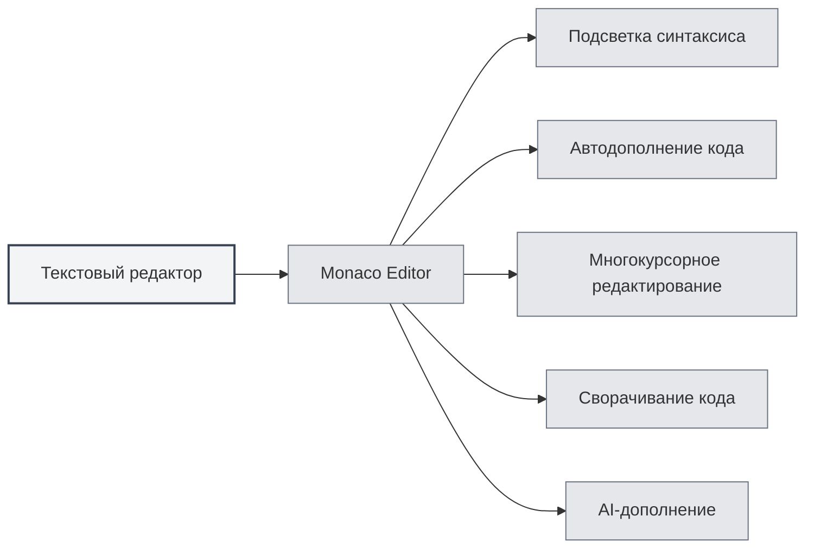
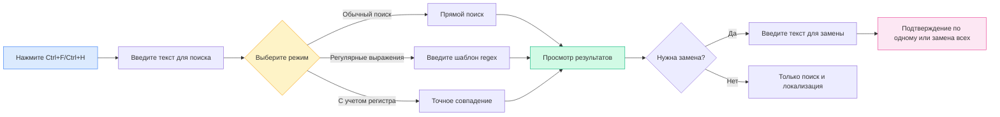

# Текстовый редактор

## Обзор

Текстовый редактор предназначен для редактирования простых текстовых файлов и файлов с кодом. Текстовый редактор MetaDoc основан на Monaco Editor и предоставляет профессиональные возможности редактирования кода, включая подсветку синтаксиса, автодополнение кода, AI-дополнение и другие функции.

Текстовый редактор поддерживает множество форматов файлов, включая файлы с кодом (`.js`, `.py`, `.java` и т.д.) и конфигурационные файлы (`.json`, `.yaml`, `.ini` и т.д.). Язык автоматически распознается по расширению файла, и применяется соответствующая подсветка синтаксиса.

## Функции редактора Monaco

<LaTeXEditorDemo mode="demo" />

<SearchReplaceMenu mode="demo" :position='{"top": 100, "left": 200}' :adapter='null' />

<MenuItemsDemo mode="demo" :items='[{"id": "file"}]' />

<ViewMenuItemsDemo mode="demo" :items='["editor", "outline"]' />

### Введение в редактор

Текстовый редактор использует Monaco Editor и обладает следующими особенностями:

- **Профессиональное редактирование кода**: предоставляет опыт редактирования, аналогичный Visual Studio Code
- **Подсветка синтаксиса**: автоматически применяет подсветку синтаксиса в зависимости от типа файла
- **Автодополнение кода**: поддерживает интеллектуальное автодополнение кода
- **Многокурсорное редактирование**: поддерживает одновременное редактирование с несколькими курсорами
- **Сворачивание кода**: поддерживает сворачивание блоков кода

### Поддерживаемые форматы файлов

Текстовый редактор поддерживает следующие форматы файлов:

**Файлы с кодом**:

- JavaScript/TypeScript: `.js`, `.jsx`, `.ts`, `.tsx`
- Python: `.py`
- Java: `.java`
- C/C++: `.c`, `.cpp`, `.h`, `.hpp`
- C#: `.cs`
- Go: `.go`
- Rust: `.rs`
- Swift: `.swift`
- Kotlin: `.kt`
- Другие: `.php`, `.rb`, `.scala`, `.dart`, `.lua` и т.д.

**Конфигурационные файлы**:

- JSON: `.json`
- YAML: `.yaml`, `.yml`
- XML: `.xml`
- TOML: `.toml`
- INI: `.ini`, `.conf`
- SQL: `.sql`

**Скриптовые файлы**:

- Shell: `.sh`, `.bash`, `.zsh`
- PowerShell: `.ps1`
- Другие: `.vim`, `.diff`, `.patch`, `.log`

### Автоматическое распознавание языка

Редактор автоматически распознает язык по расширению файла:

- **Расширение файла**: выбор соответствующего языкового режима на основе расширения файла
- **Подсветка синтаксиса**: автоматическое применение соответствующих правил подсветки синтаксиса
- **Автодополнение кода**: включение функции автодополнения кода для соответствующего языка

Если у файла нет расширения или расширение не распознано, редактор использует режим простого текста.

## Подсветка кода

### Подсветка синтаксиса

Редактор автоматически применяет подсветку синтаксиса в зависимости от типа файла:

- **Подсветка ключевых слов**: ключевые слова языка отображаются разными цветами
- **Подсветка строк**: строки отображаются определенным цветом
- **Подсветка комментариев**: комментарии отображаются серым цветом
- **Подсветка функций**: имена функций отображаются определенным цветом

Подсветка синтаксиса делает структуру кода более понятной, облегчая чтение и редактирование.

### Синхронизация темы

Тема подсветки кода следует теме редактора:

- **Светлая тема**: используется светлая подсветка синтаксиса в светлой теме
- **Темная тема**: используется темная подсветка синтаксиса в темной теме
- **Автосинхронизация**: автоматическая синхронизация с настройками темы редактора

## Отображение номеров строк

### Показ номеров строк

Номера строк отображаются слева от редактора, помогая вам:

- **Локализовать код**: быстро перейти к определенной строке
- **Ссылаться на код**: удобно ссылаться на конкретные строки кода в документации
- **Отлаживать код**: быстро находить место ошибки

### Настройка номеров строк

Отображение номеров строк можно настроить в настройках:

1. Откройте страницу настроек
2. В разделе "Настройки редактора" найдите "Показ номеров строк"
3. Переключите переключатель, чтобы включить или отключить номера строк

Настройка номеров строк влияет на все редакторы Monaco (текстовый редактор, LaTeX-редактор и т.д.).

<MenuItemsDemo mode="demo" :items='[{"id": "file", "items": ["new", "open", "save"]}]' />

<ViewMenuItemsDemo mode="demo" :items='["editor", "outline"]' />

<MainTabs mode="demo" />

<AISuggestionGhost mode="demo" />

<LaTeXEditorDemo mode="demo" />

## Предпросмотр файлов и статистическая информация

### Статистика файла

Редактор отображает статистическую информацию о файле:

- **Количество символов**: показывает общее количество символов в файле
- **Количество строк**: показывает общее количество строк в файле
- **Количество слов**: показывает общее количество слов в файле (если применимо)

Статистика отображается в строке состояния или в нижней части редактора.

### Предпросмотр файла

При открытии файла редактор:

- **Загружает содержимое**: быстро загружает содержимое файла
- **Применяет подсветку**: применяет подсветку синтаксиса в зависимости от типа файла
- **Показывает статистику**: отображает статистическую информацию о файле

### Определение формата файла

Редактор автоматически определяет формат файла:

- **Определение по расширению**: распознает формат по расширению файла
- **Определение по содержимому**: если расширение неясно, пытается распознать по содержимому
- **Ручной выбор**: можно вручную выбрать формат файла

## Функция AI-дополнения

### Автоматическое AI-дополнение

Текстовый редактор поддерживает функцию автоматического AI-дополнения:

- **Автоматический запуск**: автоматически запускает дополнение после остановки ввода
- **Ручной запуск**: используйте `Shift+Tab` для ручного запуска дополнения
- **Интеллектуальное дополнение**: генерирует предложения по дополнению на основе контекста

Функция AI-дополнения может помочь вам:

- **Генерировать код**: генерировать код на основе комментариев или контекста
- **Дополнять функции**: дополнять определение или вызов функции
- **Генерировать комментарии**: генерировать комментарии к коду

### Настройки дополнения

Настройки AI-дополнения такие же, как у Markdown-редактора:

- **Включить/выключить**: можно включить или выключить в настройках
- **Клавиши запуска**: можно настроить клавиши запуска (Enter, Space, `;`, `,`)
- **Режим дополнения**: можно выбрать полную генерацию или частичную генерацию
- **Максимальное количество токенов**: можно установить максимальное количество токенов для дополнения

Подробнее см. [[ai.completion|AI-дополнение]].

## Функции редактора

### Сворачивание кода

Редактор поддерживает сворачивание блоков кода:

- **Свернуть блок кода**: нажмите значок сворачивания слева от номера строки
- **Развернуть блок кода**: нажмите на маркер сворачивания для разворачивания
- **Горячие клавиши**: `Ctrl+Shift+[` свернуть, `Ctrl+Shift+]` развернуть

Сворачивание кода позволяет сосредоточиться на редактируемой в данный момент части.

### Поиск и замена

Редактор поддерживает мощную функцию поиска и замены, помогающую быстро находить и изменять содержимое в коде:

**Основные операции**:

- **Поиск**: `Ctrl+F` открывает диалоговое окно поиска, введите текст для поиска
- **Замена**: `Ctrl+H` открывает диалоговое окно поиска и замены, введите текст для поиска и замены
- **Замена по одному**: замена с подтверждением каждого случая
- **Заменить все**: замена всех совпадений за один раз

**Дополнительные опции**:

- **Регулярные выражения**: использование регулярных выражений для сложного сопоставления с образцом
- **Учет регистра**: поиск с учетом регистра
- **Точное слово**: сопоставление только полных слов

**Сценарии использования**:

- Массовое переименование переменных
- Поиск конкретных вызовов функций
- Замена строк в коде
- Сложная замена с использованием регулярных выражений

Интерфейс панели поиска и замены выглядит следующим образом:

<SearchReplaceMenu mode="demo" :position='{"top": 100, "left": 200}' :adapter='null' />

### Многокурсорное редактирование

Редактор поддерживает одновременное редактирование с несколькими курсорами:

- **Добавить курсор**: `Alt+щелчок` добавляет новый курсор в месте щелчка
- **Добавить курсор сверху**: `Ctrl+Alt+↑` добавляет курсор сверху
- **Добавить курсор снизу**: `Ctrl+Alt+↓` добавляет курсор снизу
- **Выделить одинаковые слова**: `Ctrl+D` выделяет следующее одинаковое слово

Многокурсорное редактирование позволяет одновременно изменять несколько позиций, повышая эффективность редактирования.

## Советы по использованию

<LaTeXEditorDemo mode="demo" />

<ConsoleTerminal mode="demo" consoleKey="plaintext" :history='[]' />

### Эффективное редактирование

1. **Используйте горячие клавиши**: освоите часто используемые горячие клавиши для повышения эффективности редактирования
2. **Используйте сворачивание кода**: сворачивайте блоки кода, которые не нужно просматривать
3. **Используйте многокурсорное редактирование**: используйте несколько курсоров для одновременного редактирования нескольких позиций

### Автодополнение кода

1. **Включите AI-дополнение**: включите функцию AI-дополнения для получения интеллектуальных предложений
2. **Используйте ручной запуск**: при необходимости используйте `Shift+Tab` для ручного запуска дополнения
3. **Настройте параметры**: настройте параметры дополнения в соответствии с потребностями

### Управление файлами

1. **Распознавайте формат**: убедитесь, что расширение файла правильное, для автоматического распознавания формата
2. **Просматривайте статистику**: просматривайте статистическую информацию о файле, чтобы знать его размер
3. **Сохраняйте файлы**: своевременно сохраняйте файлы, чтобы избежать потери изменений

## Часто задаваемые вопросы

### В: Подсветка синтаксиса некорректна?

О: Проверьте, правильно ли указано расширение файла. Если расширение неверное, редактор может не распознать тип файла. Можно вручную выбрать формат файла.

### В: Автодополнение кода не отображается?

О: Убедитесь, что функция AI-дополнения включена. Некоторые типы файлов могут не поддерживать автодополнение кода.

### В: Как изменить формат файла?

О: Формат файла автоматически распознается по расширению файла. Если нужно изменить, можно переименовать файл или вручную выбрать формат.

### В: Номера строк не отображаются?

О: Проверьте, включена ли опция "Показ номеров строк" в настройках. Настройка номеров строк влияет на все редакторы Monaco.

### В: Файл слишком большой для редактирования?

О: Для очень больших файлов редактор может ограничивать некоторые функции. Рекомендуется использовать специализированные текстовые редакторы для обработки очень больших файлов.

## Связанная документация

- [[core.editor-basics|Основные операции редактора]]
- [[core.editor-settings|Настройки редактора]]
- [[latex.editor|Руководство по использованию LaTeX-редактора]]
- [[ai.completion|AI-дополнение]]