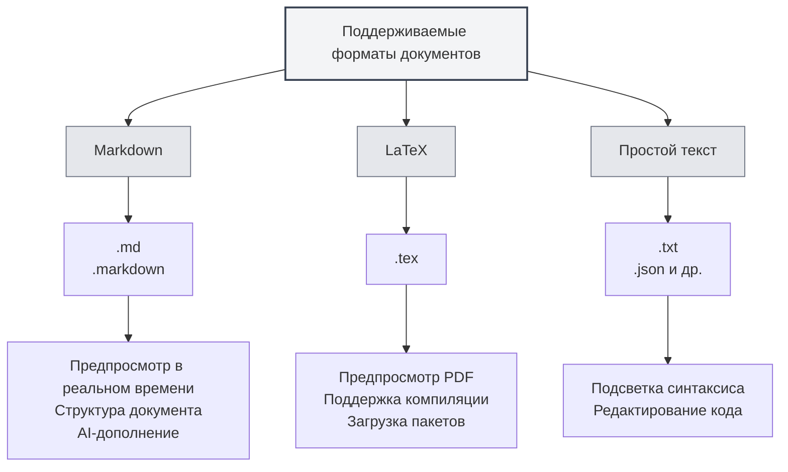

# Поддерживаемые форматы документов

## Обзор

MetaDoc поддерживает различные форматы документов, включая Markdown, LaTeX и простой текст. Система автоматически определяет формат файла, также поддерживается ручной выбор формата.

<MenuItemsDemo mode="demo" :items='[{"id": "file"}]' />

<MenuItemsDemo mode="demo" :items='[{"id": "edit"}]' />

<MenuItemsDemo mode="demo" :items='[{"id": "view"}]' />

<ViewMenuItemsDemo mode="demo" :items='["home", "outline", "chat"]' />

<MainTabs mode="demo" />

<QuickStartPanel mode="demo" />

<QuickStartMarkdown mode="demo" />

<QuickStartLatex mode="demo" />

## Поддерживаемые форматы

### Формат Markdown

**Расширения файлов**: `.md`, `.markdown`

**Особенности**:

- Поддержка стандартного синтаксиса Markdown
- Поддержка расширенного синтаксиса (таблицы, блоки кода, математические формулы и т.д.)
- Поддержка предварительного просмотра в реальном времени
- Поддержка структуры документа
- Поддержка AI-дополнения

**Сценарии использования**:

- Написание технической документации
- Создание статей для блога
- Ведение заметок
- Написание документов

### Формат LaTeX

**Расширения файлов**: `.tex`

**Особенности**:

- Профессиональный формат для написания академических статей
- Поддержка математических формул, таблиц, диаграмм
- Предварительный просмотр PDF в реальном времени
- Поддержка автоматической загрузки пакетов
- Поддержка подсказок об ошибках компиляции

**Сценарии использования**:

- Написание академических статей
- Написание технических отчетов
- Верстка книг
- Верстка сложных документов

### Формат простого текста

**Расширения файлов**: `.txt`, `.json` и др.

**Особенности**:

- Простое редактирование текста
- Поддержка подсветки синтаксиса
- Функции редактирования кода
- Не поддерживает предварительный просмотр и структуру

**Сценарии использования**:

- Редактирование файлов кода
- Редактирование конфигурационных файлов
- Простое редактирование текста
- Редактирование файлов данных

## Определение формата файла

### Автоматическое определение

MetaDoc автоматически определяет формат файла:

1. **Определение по расширению**: В первую очередь формат определяется по расширению файла

   - `.md`, `.markdown` → Формат Markdown
   - `.tex` → Формат LaTeX
   - `.txt`, `.json` и др. → Формат простого текста

2. **Определение по содержимому**: Если расширение не позволяет определить формат, анализируется содержимое файла

   - Содержимое LaTeX в первую очередь распознается как формат LaTeX
   - Остальное содержимое по умолчанию распознается как формат Markdown

3. **Формат по умолчанию**: Если определение невозможно, по умолчанию используется формат Markdown

### Приоритет определения

Определение формата следует следующему приоритету:

1. **Расширение файла**: В первую очередь используется определение по расширению
2. **Содержимое файла**: Если расширение не позволяет определить, анализируется содержимое
3. **Формат по умолчанию**: При невозможности определения используется формат по умолчанию

### Правила определения

- **Определение Markdown**: Распознается как Markdown при расширении `.md` или `.markdown`
- **Определение LaTeX**: Распознается как LaTeX при расширении `.tex` или наличии команд LaTeX в содержимом
- **Определение простого текста**: Распознается как простой текст при других расширениях или невозможности определения

## Ручной выбор формата

### Выбор при открытии файла

При открытии файла можно вручную выбрать формат:

1. **Диалог открытия файла**: В диалоговом окне открытия файла
2. **Выбор формата**: Выберите формат файла (если автоматическое определение некорректно)
3. **Подтверждение открытия**: После подтверждения файл откроется в выбранном формате

### Выбор при создании файла

При создании нового файла можно выбрать формат:

1. **Новый документ**: Нажмите кнопку "Новый документ"
2. **Выбор формата**: В диалоговом окне выбора формата выберите нужный формат
3. **Создание документа**: Создайте документ указанного формата

### Смена формата

Можно сменить формат уже открытого документа:

1. **Открытый документ**: Откройте документ, формат которого нужно сменить
2. **Меню формата**: В меню найдите опцию смены формата
3. **Выбор формата**: Выберите новый формат
4. **Подтверждение смены**: Подтвердите смену формата

**Важные замечания**:

- Смена формата может повлиять на содержимое документа
- Некоторые особенности формата могут не конвертироваться
- Перед сменой рекомендуется создать резервную копию документа

## Сравнение характеристик форматов

### Поддержка функций

| Функция       | Markdown | LaTeX    | Простой текст |
| ------------- | -------- | -------- | ------------- |
| Предпросмотр в реальном времени | ✅       | ✅ (PDF) | ❌            |
| Структура документа | ✅       | ✅       | ❌            |
| AI-дополнение | ✅       | ✅       | ✅            |
| Математические формулы | ✅       | ✅       | ❌            |
| Поддержка таблиц | ✅       | ✅       | ❌            |
| Подсветка кода | ✅       | ✅       | ✅            |
| Поддержка метаинформации | ✅       | ✅       | ❌            |

### Особенности редактора

| Особенность       | Markdown | LaTeX | Простой текст |
| ----------------- | -------- | ----- | ------------- |
| Подсветка синтаксиса | ✅       | ✅    | ✅            |
| Автодополнение    | ✅       | ✅    | ✅            |
| Подсказки об ошибках | ✅       | ✅    | ❌            |
| Сворачивание      | ✅       | ✅    | ✅            |
| Множественное редактирование | ✅       | ✅    | ✅            |

## Конвертация форматов

### Экспорт в форматы

Документ можно экспортировать в другие форматы:

- **Markdown → PDF**: Экспорт в PDF-документ
- **Markdown → HTML**: Экспорт в HTML-документ
- **Markdown → DOCX**: Экспорт в документ Word
- **LaTeX → PDF**: Компиляция в PDF-документ
- **LaTeX → Markdown**: Конвертация в формат Markdown

### Замечания по конвертации

При конвертации форматов необходимо учитывать:

- **Совместимость содержимого**: Некоторые особенности формата могут не конвертироваться
- **Потеря стилей**: После конвертации может быть потеряна часть стилей
- **Корректировка содержимого**: После конвертации может потребоваться ручная корректировка содержимого

## Рекомендации

1. **Выбор подходящего формата**: Выбирайте подходящий формат в зависимости от типа документа
2. **Использование стандартных расширений**: Используйте стандартные расширения файлов для удобства автоматического определения
3. **Единообразие форматов**: Используйте единый формат в рамках одного проекта
4. **Резервное копирование документов**: Перед конвертацией формата создавайте резервную копию исходного документа
5. **Тестирование конвертации**: После конвертации проверяйте корректность содержимого

## Важные замечания

1. **Определение формата**: Автоматическое определение может быть неточным, можно выбрать вручную
2. **Смена формата**: Смена формата может повлиять на содержимое документа
3. **Совместимость**: Поддержка функций различается в разных форматах
4. **Расширения файлов**: Рекомендуется использовать стандартные расширения
5. **Конвертация форматов**: При конвертации может быть потеряна часть содержимого или стилей

## Связанная документация

- [[markdown.basics|Синтаксис Markdown]]
- [[latex.basics|Синтаксис LaTeX]]
- [[editor.plain-text|Редактор простого текста]]
- [[core.file-operations|Операции с файлами]]