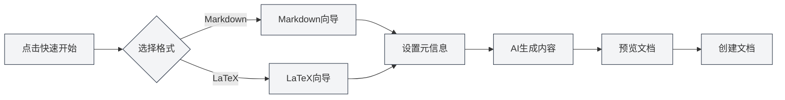

# Функции главной страницы

## Обзор

Главная страница является входным интерфейсом MetaDoc, предоставляя функции быстрого старта, создания нового документа, открытия файлов и другие. Дизайн главной страницы прост и эстетичен, помогая вам быстро начать работу с MetaDoc.

## Быстрый старт

### Мастер быстрого старта

Нажмите кнопку "Быстрый старт", чтобы запустить мастер быстрого старта:

1.  **Выбор формата**: Выберите формат документа (Markdown или LaTeX)
2.  **Настройка метаинформации**: Введите заголовок документа, автора и другую информацию
3.  **Генерация контента с помощью ИИ**: Используйте ИИ для помощи в создании содержимого документа
4.  **Предпросмотр документа**: Просмотрите сгенерированное содержимое документа
5.  **Создание документа**: Подтвердите и создайте документ

Интерфейс выбора формата в мастере быстрого старта:

<QuickStartPanel mode="demo" />

### Быстрый старт для Markdown

После выбора формата Markdown:

-   **Выбор шаблона**: Можно выбрать шаблон Markdown
-   **Генерация контента**: ИИ может сгенерировать содержимое Markdown
-   **Быстрое редактирование**: Начните редактирование сразу после создания

Интерфейс мастера после выбора Markdown:

<QuickStartMarkdown mode="demo" />

### Быстрый старт для LaTeX

После выбора формата LaTeX:

-   **Тип документа**: Можно выбрать тип документа (article, book и т.д.)
-   **Генерация контента**: ИИ может сгенерировать содержимое LaTeX
-   **Компиляция и предпросмотр**: После создания можно скомпилировать и просмотреть PDF

Интерфейс мастера после выбора LaTeX:

<QuickStartLatex mode="demo" />

## Создание документа

### Создание пустого документа

Нажмите кнопку "Создать документ", чтобы быстро создать пустой документ:

1.  Нажмите кнопку "Создать документ"
2.  Выберите формат документа (Markdown/LaTeX/Простой текст)
3.  Документ откроется на новой вкладке

**Горячие клавиши**: Также можно использовать `Ctrl+N` (Windows/Linux) или `Cmd+N` (macOS) для быстрого создания.

## Открытие файла

### Открытие существующего файла

Нажмите кнопку "Открыть файл", чтобы открыть существующий файл:

1.  Нажмите кнопку "Открыть файл"
2.  Выберите файл в диалоговом окне выбора файла
3.  Файл откроется на новой вкладке

**Горячие клавиши**: Также можно использовать `Ctrl+O` (Windows/Linux) или `Cmd+O` (macOS) для быстрого открытия.

### Поддерживаемые форматы файлов

-   **Markdown** (.md)
-   **LaTeX** (.tex)
-   **Простой текст** (.txt)
-   **JSON** (.json)

## Руководство пользователя

### Открытие руководства пользователя

Нажмите кнопку "Руководство пользователя", чтобы открыть его:

1.  Нажмите кнопку "Руководство пользователя"
2.  Руководство пользователя откроется на новой вкладке
3.  Можно просматривать и изучать различные функции

**Горячие клавиши**: Также можно нажать клавишу `F1` для быстрого открытия руководства пользователя.

## Список недавних документов

### Просмотр недавних документов

На главной странице отображается список недавно открытых документов:

-   **Количество отображаемых**: Отображается до 12 последних документов
-   **Карточка документа**: Каждый документ отображается в виде карточки
-   **Быстрое открытие**: Нажмите на карточку, чтобы быстро открыть документ

### Действия с недавними документами

-   **Открытие документа**: Нажмите на карточку документа, чтобы открыть его
-   **Удаление записи**: Нажмите кнопку удаления на карточке, чтобы удалить запись
-   **Контекстное меню**: Щелчок правой кнопкой мыши по карточке может предоставить дополнительные опции

### Управление недавними документами

-   **Автоматическое обновление**: Список автоматически обновляется после открытия документа
-   **Сохранение записей**: Записи о недавних документах сохраняются
-   **Сортировка списка**: Сортировка в обратном хронологическом порядке по времени открытия

## Диалог профиля пользователя

### Открытие профиля пользователя

На главной странице может отображаться диалог профиля пользователя:

-   **Первое использование**: При первом использовании может быть предложено настроить профиль пользователя
-   **Настройка профиля**: Можно настроить пользовательский профиль и предпочтения использования
-   **Оптимизация ИИ**: Профиль пользователя помогает ИИ лучше понимать ваши потребности

### Содержимое профиля пользователя

Профиль пользователя может включать:

-   **Основная информация**: Имя, профессия и т.д.
-   **Пользовательские предпочтения**: Привычки редактирования, часто используемые функции и т.д.
-   **Пользовательский профиль**: Помогает ИИ понять ваш сценарий использования

## Интерфейс главной страницы

### Макет интерфейса

Главная страница использует центрированный макет:

-   **Верхняя часть**: Заголовок и подзаголовок MetaDoc
-   **Центральная часть**: Область кнопок действий
-   **Нижняя часть**: Список недавних документов

### Визуальный дизайн

Главная страница использует простой современный дизайн:

-   **Динамический фон**: Анимационный эффект динамического фона
-   **Сеточный декор**: Минималистичный сеточный декор
-   **Дизайн карточек**: Кнопки действий выполнены в виде карточек

## Рекомендации

1.  **Быстрый старт**: При первом использовании рекомендуется использовать мастер быстрого старта
2.  **Горячие клавиши**: Освойте использование горячих клавиш для повышения эффективности
3.  **Недавние документы**: Используйте список недавних документов для быстрого доступа к часто используемым документам
4.  **Профиль пользователя**: Настройте профиль пользователя для лучшего взаимодействия с ИИ
5.  **Руководство пользователя**: Обращайтесь к руководству пользователя при возникновении вопросов

## Важные замечания

1.  **Отображение главной страницы**: Главная страница отображается только при отсутствии открытых документов
2.  **Быстрый старт**: Мастер быстрого старта можно закрыть в любой момент
3.  **Недавние документы**: В списке недавних документов отображается не более 12 записей
4.  **Профиль пользователя**: Настройка профиля пользователя является необязательной
5.  **Язык интерфейса**: Язык интерфейса главной страницы соответствует настройкам языка системы

## Связанная документация

-   [[quick-start.guide|Руководство по быстрому старту]]
-   [[core.file-operations|Операции с файлами]]
-   [[user.profile|Профиль пользователя]]
-   [[views.types|Типы представлений]]

<MenuItemsDemo mode="demo" :items='[{"id": "file"}]' />

<MenuItemsDemo mode="demo" :items='[{"id": "edit"}]' />

<MenuItemsDemo mode="demo" :items='[{"id": "view"}]' />

<ViewMenuItemsDemo mode="demo" :items='["home", "outline", "chat", "agent"]' />

<MainTabs mode="demo" />

<UserProfileView mode="demo" />