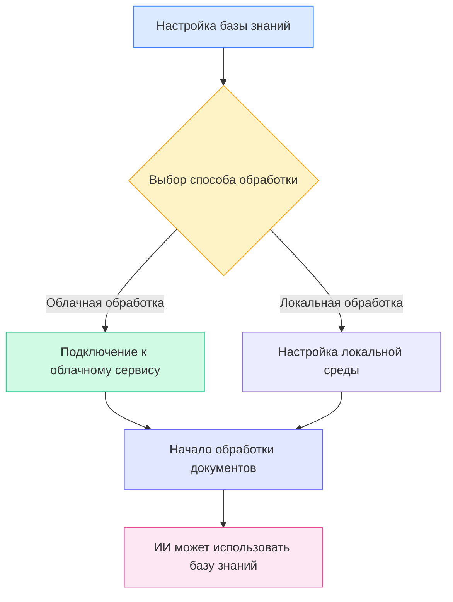
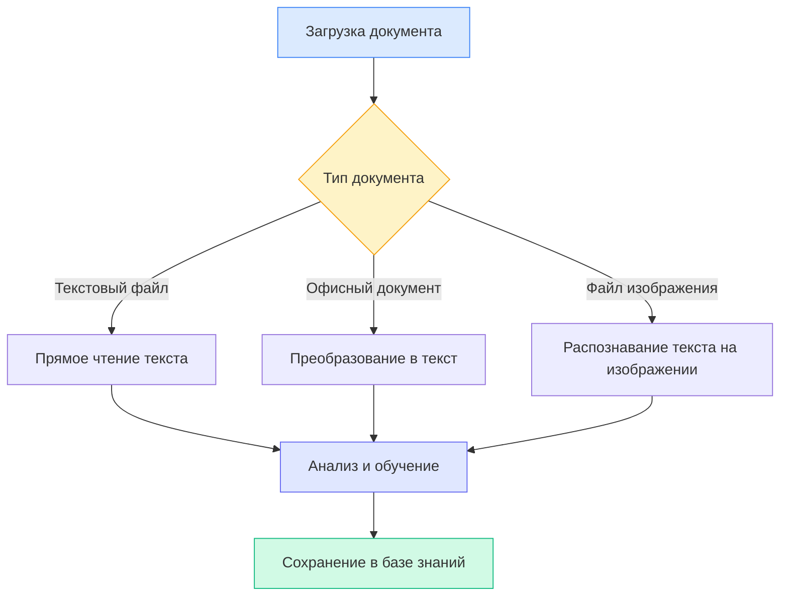
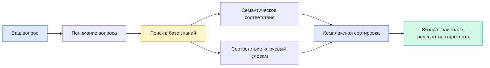

# Настройка базы знаний

## Обзор

База знаний — это интеллектуальная система управления документами MetaDoc. "Обучив" ваши документы в базе знаний, ИИ сможет понимать и ссылаться на их содержимое, предоставляя вам более точные ответы и рекомендации.

Это руководство поможет вам настроить базу знаний для более эффективной работы.

## Включение функции базы знаний

На странице настроек базы знаний сначала необходимо включить эту функцию:

1. Найдите переключатель "Включить базу знаний"
2. Переведите переключатель в положение "Включено"
3. Настройте соответствующие параметры базы знаний

Доступ к управлению базой знаний можно получить через верхнюю панель меню:

<KnowledgeBase mode="demo" />

На изображении выше показаны основные функциональные области интерфейса управления базой знаний:

- **Левая панель**: Список баз знаний и функция поиска
- **Центральная область**: Список добавленных документов
- **Детали справа**: Подробная информация и статус обработки выбранного документа
- **Панель инструментов внизу**: Кнопки действий (добавить документ, начать обработку, удалить и т.д.)

## Выбор способа обработки

### Краткое описание двух способов

MetaDoc предлагает два способа обработки документов:

**Облачная обработка (рекомендуется)**

- Отправка документов в облачный сервис для анализа
- Высокая скорость обработки, не требует локальных ресурсов
- Требуется подключение к интернету

**Локальная обработка (в разработке)**

- Обработка документов непосредственно на вашем компьютере
- Данные полностью локальные, защита конфиденциальности
- Требуется мощная конфигурация компьютера

В текущей версии поддерживается только облачная обработка. Вы можете выбрать её в настройках:

<MenuItemsDemo mode="demo" :items='[{"id": "settings"}]' />

### Преимущества облачной обработки

Для большинства пользователей мы рекомендуем использовать облачную обработку:

- **Быстрый старт**: Не требуется настройка сложной локальной среды
- **Экономия времени**: Более высокая скорость при обработке большого количества документов
- **Экономия ресурсов**: Не занимает оперативную память и процессор компьютера
- **Простое обслуживание**: Автоматические обновления, не требуется ручное управление

### Когда может потребоваться локальная обработка

Если у вас есть следующие потребности, вы можете дождаться выхода функции локальной обработки:

- Обработка документов с высокой степенью секретности
- Частая работа в среде без доступа к интернету
- Наличие высокопроизводительной конфигурации компьютера (с дискретной видеокартой)
- Необходимость обработки огромного объема документов (более 10 ГБ)

<SettingKnowledgeBaseSection mode="demo" />

## Принцип работы базы знаний

### Как документы "обучаются"

<RAGToolDisplay mode="demo" />

Когда вы добавляете документ в базу знаний, MetaDoc выполняет следующие шаги:

1. **Чтение содержимого документа**

   - Извлечение текста из форматов PDF, Word, изображений и т.д.
   - Сохранение структуры и форматирования документа

2. **Понимание смысла документа**

   - Преобразование текста в "семантическое представление", понятное ИИ
   - Это похоже на присвоение документу интеллектуальных меток

3. **Создание индекса**

   - Создание индекса для быстрого поиска
   - Позволяет ИИ мгновенно находить релевантный контент

4. **Сохранение знаний**
   - Сохранение результатов обработки в локальной базе данных
   - Возможность вызова в любое время

<KnowledgeBase mode="demo" />

## Поддерживаемые типы документов

### Форматы, обрабатываемые напрямую

База знаний MetaDoc поддерживает множество распространенных форматов документов:

**Текстовые**

- Документы Markdown (.md) — предпочтительный формат для технической документации
- Документы LaTeX (.tex) — часто используемый формат для научных статей
- Простые текстовые файлы (.txt) — простые текстовые записи

**Офисные документы**

- PDF-файлы (.pdf) — самый универсальный формат документов
- Документы Word (.docx) — формат Microsoft Office

**Изображения**

- Изображения PNG (.png) — скриншоты, диаграммы
- Изображения JPEG (.jpg, .jpeg) — фотографии, сканы

### Способы обработки разных документов

MetaDoc обрабатывает документы разных типов различными способами:

**Текстовые документы** (Markdown, LaTeX, TXT)

- Прямое чтение текстового содержимого
- Сохранение структуры заголовков и форматирования
- Наиболее быстрая обработка

**Офисные документы** (PDF, Word)

- Сначала преобразуются в простой текст
- Извлечение структуры (заголовки, абзацы и т.д.)
- Сохранение логической иерархии документа

**Документы-изображения** (PNG, JPG)

- Использование технологии OCR для распознавания текста на изображениях
- Подходит для обработки сканированных бумажных документов
- Время обработки относительно больше

<RAGToolDisplay mode="demo" />

## Механизм интеллектуального поиска

### Как база знаний находит релевантный контент

Когда ИИ необходимо использовать базу знаний, MetaDoc применяет стратегию интеллектуального поиска:

**Семантическое соответствие**

- Соответствие не только ключевым словам, но и понимание смысла вопроса
- Например: при поиске "как установить" также могут быть найдены "шаги установки", "руководство по развертыванию" и т.д.

**Гибридный поиск**

- Сочетание семантического понимания и соответствия ключевым словам
- Обеспечивает как точность, так и полноту охвата
- Автоматическая сортировка, наиболее релевантный контент отображается первым

**Быстрый отклик**

- Использование эффективных алгоритмов индексирования
- Отклик за миллисекунды, не влияет на плавность диалога

<KnowledgeBase mode="demo" />

## Пояснение по обработке фрагментами

### Зачем нужно разбиение на фрагменты

Для более эффективного поиска MetaDoc разбивает длинные документы на небольшие блоки:

**Преимущества разбиения на фрагменты**

- **Точное определение местоположения**: Можно найти конкретные абзацы в документе
- **Повышение скорости**: Мелкие блоки обрабатываются быстрее, поиск ускоряется
- **Сохранение контекста**: Соседние блоки имеют перекрытие, семантика не обрывается

**Настройки по умолчанию**

- Каждый блок примерно 500 символов (около 250 китайских иероглифов)
- Перекрытие между соседними блоками — 50 символов
- Эти настройки обеспечивают баланс между точностью и эффективностью

### Пример разбиения на фрагменты

Предположим, есть длинная статья:

Оригинал: [Начальный абзац... Средний абзац... Заключительный абзац...]

После разбиения:

- Блок 1: Начальный абзац + часть среднего содержания
- Блок 2: Часть среднего содержания (область перекрытия) + больше среднего содержания
- Блок 3: Больше среднего содержания + заключительный абзац

Таким образом, даже если вопрос касается только "среднего содержания", можно точно найти соответствующую часть.

<SettingKnowledgeBaseSection mode="demo" />

## Рекомендации по настройке

### Рекомендуемые настройки для первого использования

Если вы используете базу знаний впервые, рекомендуется применить следующие настройки:

- **Способ обработки**: Облачная обработка (по умолчанию)
- **Чувствительность поиска**: Средняя (значение по умолчанию)
  - Слишком высокая чувствительность: может возвращать слишком много нерелевантного контента
  - Слишком низкая чувствительность: может пропустить некоторый релевантный контент
  - Средняя настройка: баланс между ними

### Для документов разных типов

**Техническая документация/руководства**

- Подходит для создания специализированной базы знаний
- ИИ может точно отвечать на технические вопросы
- Поддерживает поиск фрагментов кода

**Научные статьи**

- Сохранение полной информации об источниках
- Поддержка связей знаний между документами
- Подходит для обзоров литературы и исследований

**Ежедневные заметки**

- Создание личной базы знаний
- Быстрый поиск прошлых записей
- Поддержка ссылок при творческом письме

### Рекомендации по использованию

**1. Регулярное обслуживание**

- Удаление устаревших или ненужных документов
- Обновление новых версий существующих документов
- Поддержание чистоты и точности базы знаний

**2. Разумная классификация**

- Размещение документов на связанные темы вместе
- Установка четких имен для баз знаний
- Удобство управления и использования

**3. Учет конфиденциальности**

- Осторожная загрузка конфиденциальных документов
- Понимание способов обработки данных
- Выбор подходящего способа обработки

<RAGToolDisplay mode="demo" />

## Важные замечания

### Что нужно знать перед использованием

1. **Время обработки**

   - Малые документы (1-10 страниц): несколько секунд
   - Средние документы (10-50 страниц): десятки секунд
   - Большие документы (более 50 страниц): могут потребовать несколько минут
   - Пожалуйста, дождитесь завершения обработки

2. **Место для хранения**

   - База знаний занимает определенное место на жестком диске
   - Примерно в 2-3 раза больше исходного размера документа
   - Регулярная очистка неиспользуемых документов может освободить место

3. **Требования к сети**

   - Для добавления документов требуется подключение к интернету
   - Для поиска сеть не требуется (данные хранятся локально)
   - Нестабильная сеть может повлиять на скорость обработки

4. **Формат файлов**
   - Убедитесь, что загружаемые файлы имеют правильный формат
   - Поврежденные файлы могут не обрабатываться
   - Зашифрованные PDF требуют предварительного расшифрования

### Часто задаваемые вопросы

**В: Безопасны ли документы в базе знаний?**
О: Векторные данные обработанных документов хранятся локально. При использовании облачной обработки исходные документы отправляются в облачный сервис для обработки и удаляются после её завершения. Рекомендуется не загружать высококонфиденциальное содержимое.

**В: Какой размер документа можно обработать?**
О: Рекомендуется, чтобы отдельный документ не превышал 100 МБ. Очень большие документы можно разделить на несколько меньших для обработки.

**В: Можно ли изменять документы после обработки?**
О: Содержимое в базе знаний — это "снимок" исходного документа. Если документ обновлен, его необходимо повторно добавить в базу знаний.

**В: Почему некоторый контент не находится при поиске?**
О: Возможные причины: 1) Документ еще не завершил обработку; 2) Контент находится в изображении, и распознавание OCR не удалось; 3) Значительная разница в формулировках между поисковым запросом и содержимым документа.

## Связанная документация

- [[knowledge-base.management|Управление базой знаний]] - Узнайте, как добавлять, удалять и управлять документами в базе знаний
- [[knowledge-base.usage|Использование базы знаний]] - Узнайте, как использовать базу знаний в диалоге с ИИ
- [[ai.chat|Функция диалога с ИИ]] - Исследуйте расширенные функции диалога с ИИ