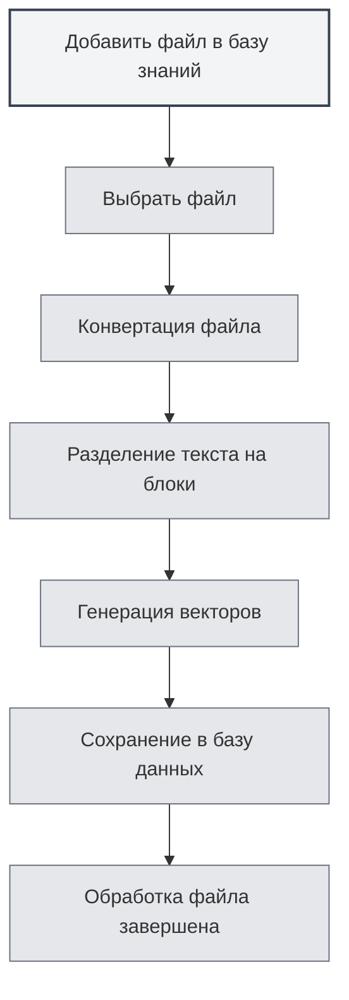

# Использование базы знаний

## Обзор

База знаний — это система RAG (Retrieval-Augmented Generation) MetaDoc, которая предоставляет контекстную информацию для функций ИИ посредством векторного поиска. Грамотное использование базы знаний может значительно повысить точность и релевантность ответов ИИ.

<KnowledgeBase mode="demo" />

## Введение в базу знаний

### Что такое база знаний

База знаний — это система хранения и поиска документов, которая способна:

- **Хранить документы**: преобразовывать документы в векторы и сохранять их
- **Семантический поиск**: искать релевантный контент на основе семантического сходства
- **Усиливать ИИ**: предоставлять контекстную информацию для диалогов с ИИ

### Принцип работы

<RAGToolDisplay mode="demo" />

База знаний использует технологию векторных эмбеддингов:

1. **Обработка документа**: разделение документа на текстовые блоки
2. **Векторизация**: генерация векторных эмбеддингов для каждого текстового блока
3. **Хранение**: сохранение векторов в базе данных
4. **Поиск**: генерация вектора для запроса и поиск схожего контента

<KnowledgeBase mode="demo" />

## Добавление файлов в базу знаний

### Добавление файлов

1. Откройте страницу управления базой знаний
2. Нажмите кнопку "Добавить файл"
3. Выберите файл для добавления
4. Дождитесь завершения обработки файла

### Поддерживаемые форматы файлов

База знаний поддерживает следующие форматы файлов:

- **Markdown** (.md): документы Markdown
- **LaTeX** (.tex): документы LaTeX
- **PDF** (.pdf): PDF-документы
- **Word** (.docx): документы Word
- **Изображения** (.png, .jpg и др.): распознавание текста через OCR
- **Простой текст** (.txt): текстовые файлы

### Обработка файлов

<RAGToolDisplay mode="demo" />

После добавления файла система автоматически:

1. **Преобразует текст**: конвертирует файл в текстовое содержимое
2. **Разделяет текст на блоки**: разбивает текст на блоки фиксированного размера
3. **Генерирует векторы**: создает векторные эмбеддинги для каждого блока
4. **Сохраняет данные**: сохраняет векторы и текст в базе данных

Время обработки зависит от размера файла; для больших файлов может потребоваться больше времени.

<KnowledgeBase mode="demo" />

## Управление файлами в базе знаний

### Список файлов

На странице управления базой знаний отображаются все добавленные файлы:

- **Имя файла**: название файла
- **Размер/Количество блоков**: размер файла и количество блоков данных
- **Статус**: активен ли файл

### Операции с файлами

<RAGToolDisplay mode="demo" />

#### Активация/деактивация файла

- **Активировать**: файл будет использоваться при поиске для функций ИИ
- **Деактивировать**: файл не будет использоваться при поиске, но данные сохранятся

#### Предпросмотр файла

Нажмите на файл, чтобы предварительно просмотреть его содержимое:

- **Просмотр содержимого**: просмотр текста файла на панели предпросмотра
- **Открыть в редакторе**: открыть файл в редакторе

#### Переименование файла

1. Выберите файл для переименования
2. Нажмите кнопку редактирования рядом с именем файла
3. Введите новое имя файла
4. Подтвердите переименование

#### Удаление файла

1. Выберите файл для удаления
2. Нажмите кнопку "Удалить"
3. Подтвердите операцию удаления

Удаление файла приведет к удалению всех связанных векторов и блоков данных.

#### Скачивание файла

Можно скачать файлы из базы знаний:

1. Выберите файл для скачивания
2. Нажмите кнопку "Скачать"
3. Выберите место сохранения

<KnowledgeBase mode="demo" />

## Векторный поиск

### Принцип поиска

Векторный поиск использует алгоритм ANN (приближенный поиск ближайших соседей):

- **Сходство векторов**: вычисление сходства между вектором запроса и векторами документов
- **Косинусное сходство**: использование косинусного сходства для измерения степени похожести
- **Сортировка результатов**: возврат результатов, отсортированных по степени сходства

### Методы поиска

<RAGToolDisplay mode="demo" />

База знаний поддерживает два метода поиска:

- **Векторный поиск**: на основе семантического сходства
- **Гибридный поиск**: комбинация векторного поиска и сопоставления по ключевым словам

### Тестирование поиска

На странице управления базой знаний можно протестировать функцию поиска:

1. Введите текст запроса в поле поиска
2. Отрегулируйте порог уверенности
3. Нажмите кнопку "Поиск"
4. Просмотрите результаты поиска

### Порог уверенности

Порог уверенности контролирует фильтрацию результатов поиска:

- **Низкий порог (0.1-0.3)**: возвращает больше результатов, но может включать нерелевантный контент
- **Средний порог (0.4-0.6)**: баланс между релевантностью и количеством (рекомендуется)
- **Высокий порог (0.7-0.9)**: возвращает только высокорелевантные результаты

<KnowledgeBase mode="demo" />

## Гибридный поиск

### Механизм поиска

Гибридный поиск сочетает два метода:

- **Векторный поиск**: на основе семантического сходства
- **Сопоставление по ключевым словам**: на основе текстового соответствия

### Система оценки

Гибридный поиск использует комплексную оценку:

- **Сходство векторов**: оценка семантического сходства
- **Сопоставление по ключевым словам**: оценка текстового соответствия
- **Комплексная оценка**: итоговая оценка, объединяющая оба показателя

### Преимущества

Преимущества гибридного поиска:

- **Точность**: векторный поиск обеспечивает семантическое понимание
- **Точность соответствия**: сопоставление по ключевым словам обеспечивает точное соответствие
- **Сбалансированность**: сочетает преимущества обоих методов

<RAGToolDisplay mode="demo" />

## Тестирование поиска

### Тестирование поиска

На странице управления базой знаний можно протестировать поиск:

1. **Ввод запроса**: введите запрос в поле поиска
2. **Настройка порога**: используйте ползунок для настройки порога уверенности
3. **Выполнение поиска**: нажмите кнопку "Поиск" или клавишу Enter
4. **Просмотр результатов**: просмотрите результаты поиска в области результатов

### Результаты поиска

Результаты поиска отображают:

- **Совпадающий текст**: фрагменты текста, релевантные запросу
- **Сходство**: оценка сходства текста с запросом
- **Исходный файл**: файл, из которого взят текст

### Сортировка результатов

Результаты поиска сортируются по степени сходства:

- **Наиболее релевантные**: результаты с наивысшим сходством выводятся первыми
- **Убывание релевантности**: сортировка по убыванию сходства

## Реконструкция векторов

### Реконструкция векторов

Если возникли проблемы с векторными данными файла, можно выполнить реконструкцию векторов:

1. Выберите файл для реконструкции
2. Нажмите кнопку "Реконструировать векторы"
3. Дождитесь завершения реконструкции

### Реконструкция всех векторов

Можно реконструировать векторы для всех файлов:

1. Нажмите кнопку "Реконструировать все векторы"
2. Подтвердите операцию
3. Дождитесь завершения реконструкции для всех файлов

### Сценарии реконструкции

Сценарии, требующие реконструкции векторов:

- **Смена модели эмбеддингов**: требуется после смены модели
- **Повреждение векторных данных**: при возникновении проблем с векторными данными
- **Обновление векторного представления**: когда требуется обновить векторное представление

## Очистка базы знаний

### Операция очистки

Если требуется очистить всю базу знаний:

1. Нажмите кнопку "Очистить базу знаний"
2. Подтвердите операцию
3. Дождитесь завершения очистки

### Последствия очистки

Очистка базы знаний приведет к:

- Удалению всех записей о файлах
- Удалению всех блоков данных
- Удалению всех векторов
- Невозможности восстановления операции

**Важные замечания**:

- Операция очистки необратима, выполняйте ее с осторожностью
- Перед очисткой рекомендуется создать резервную копию важных файлов
- После очистки потребуется повторно добавить файлы

<KnowledgeBase mode="demo" />

## Использование в функциях ИИ

### Диалоги с ИИ

База знаний автоматически предоставляет контекст для диалогов с ИИ:

- **Автоматический поиск**: автоматический поиск релевантных знаний на основе содержания диалога
- **Внедрение контекста**: внедрение результатов поиска в контекст диалога
- **Улучшение ответов**: генерация более точных ответов на основе содержимого базы знаний

### Автодополнение ИИ

База знаний может улучшить функцию автодополнения ИИ:

- **Понимание контекста**: понимание контекста на основе содержимого базы знаний
- **Генерация контента**: генерация контента, связанного с содержимым базы знаний
- **Повышение точности**: повышение точности дополняемого контента

### Инструменты агента

База знаний может использоваться как инструмент агента:

- **Инструмент RAG**: использование RAG-поиска в рабочих процессах агента
- **Предоставление контекста**: предоставление агенту релевантной контекстной информации
- **Выполнение задач**: помощь агенту в выполнении задач, требующих знаний

## Рекомендации

1. **Организация файлов**: организуйте файлы по темам или проектам
2. **Регулярное обновление**: своевременно реконструируйте векторы после обновления содержимого файлов
3. **Настройка порога**: настраивайте порог уверенности в зависимости от эффективности использования
4. **Очистка файлов**: регулярно удаляйте ненужные файлы
5. **Тестирование поиска**: регулярно тестируйте функцию поиска для обеспечения хорошей эффективности

## Важные замечания

1. **Активация базы знаний**: перед использованием функций базы знаний ее необходимо активировать
2. **Обработка файлов**: обработка больших файлов требует времени, пожалуйста, наберитесь терпения
3. **Дисковое пространство**: база знаний занимает определенное дисковое пространство
4. **Сетевое подключение**: для использования режима API требуется сетевое подключение
5. **Безопасность данных**: уделяйте внимание защите конфиденциальной информации в базе знаний

## Связанная документация

- [[knowledge-base.management|Управление базой знаний]]
- [[knowledge-base.config|Конфигурация базы знаний]]
- [[settings.llm|Конфигурация LLM]]
- [[ai.chat|Функция диалога с ИИ]]

<KnowledgeBase mode="demo" />

<RAGToolDisplay mode="demo" />