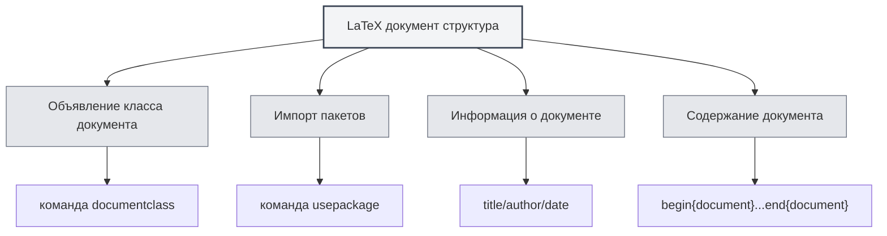

# Синтаксис LaTeX

## Обзор

LaTeX — это система вёрстки на основе TeX, широко используемая для написания академических статей и технических документов. MetaDoc предоставляет полную поддержку редактирования, компиляции и предварительного просмотра LaTeX.

<LaTeXEditorDemo mode="demo" />

<PdfPreviewPanel mode="demo" />

<LaTeXCompilerPanel mode="demo" />

<LaTeXConsole mode="demo" />

## Основной синтаксис

### Структура документа

Базовая структура документа LaTeX:

```latex
\documentclass{article}
\usepackage[utf8]{inputenc}

\title{Заголовок документа}
\author{Автор}
\date{\today}

\begin{document}
\maketitle

\section{Заголовок раздела}
Содержание...

\end{document}
```



### Математические формулы

**Встроенные формулы**:

```latex
Это встроенная формула: $E = mc^2$
```

**Блочные формулы**:

```latex
\begin{equation}
\int_{-\infty}^{\infty} e^{-x^2} dx = \sqrt{\pi}
\end{equation}
```

**Многострочные формулы**:

```latex
\begin{align}
x &= a + b \\
y &= c + d
\end{align}
```

### Таблицы

Используйте окружение `tabular`:

```latex
\begin{tabular}{|c|c|c|}
\hline
Столбец1 & Столбец2 & Столбец3 \\
\hline
Данные1 & Данные2 & Данные3 \\
\hline
\end{tabular}
```

### Вставка изображений

Используйте окружение `figure`:

```latex
\begin{figure}[h]
\centering
\includegraphics[width=0.8\textwidth]{image.png}
\caption{Заголовок изображения}
\label{fig:example}
\end{figure}
```

### Библиография

Используйте `BibTeX` или `natbib`:

```latex
\bibliographystyle{plain}
\bibliography{references}
```

## Компиляция и предварительный просмотр

Документ LaTeX необходимо скомпилировать для создания PDF. Подробнее см. [[latex.compilation|Компиляция и предварительный просмотр LaTeX]].

После компиляции результат можно посмотреть в функции [[latex.pdf-preview|Предварительный просмотр PDF]].

## Связанная документация

- [[latex.editor|Руководство по использованию редактора LaTeX]]
- [[latex.compilation|Компиляция и предварительный просмотр LaTeX]]
- [[latex.pdf-preview|Функция предварительного просмотра PDF]]
- [[latex.console|Вывод консоли]]