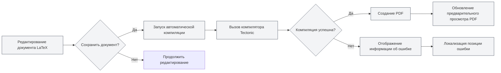
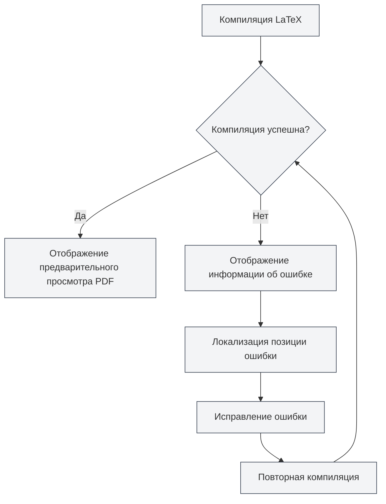

# Компиляция и предварительный просмотр LaTeX

## Обзор

Документы LaTeX требуют компиляции для создания PDF. MetaDoc использует компилятор Tectonic, поддерживая автоматическую компиляцию, предварительный просмотр в реальном времени, локализацию ошибок и другие функции, позволяя вам эффективно писать и отлаживать документы LaTeX.

Процесс компиляции автоматически загружает необходимые пакеты, не требуя ручной настройки, что значительно упрощает процесс использования LaTeX.

## Компиляция документа LaTeX

<LaTeXCompilerPanel mode="demo" />

### Автоматическая компиляция

MetaDoc поддерживает функцию автоматической компиляции:

- **Компиляция при сохранении**: автоматически запускает компиляцию при сохранении документа LaTeX
- **Ручная компиляция**: нажмите кнопку "Компилировать" на панели инструментов для ручного запуска компиляции
- **Статус компиляции**: во время компиляции отображается прогресс и статус

### Процесс компиляции

<LaTeXConsole mode="demo" />

Процесс компиляции включает следующие шаги:

1. **Подготовка среды компиляции**: проверка доступности компилятора Tectonic
2. **Загрузка пакетов**: автоматическая загрузка используемых в документе пакетов LaTeX
3. **Выполнение компиляции**: запуск компилятора Tectonic для создания PDF
4. **Обработка вывода**: обработка журнала компиляции и информации об ошибках
5. **Обновление предварительного просмотра**: если компиляция успешна, обновление предварительного просмотра PDF

### Опции компиляции

<LaTeXEditorDemo mode="demo" />

Компиляция поддерживает следующие опции:

- **Компилятор**: использование компилятора Tectonic (по умолчанию)
- **Режим компиляции**: неинтерактивный режим, остановка при возникновении ошибок
- **Выходной каталог**: PDF-файл сохраняется в том же каталоге, что и документ

### Время компиляции

<ConsoleTerminal mode="demo" consoleKey="demo" :history='[{"content": "Tectonic编译器启动...", "type": "out"}, {"content": "解析文档结构", "type": "out"}]' />

Время компиляции зависит от:

- **Размера документа**: чем больше документ, тем дольше компиляция
- **Количества пакетов**: чем больше используется пакетов, тем дольше первая компиляция (требуется загрузка)
- **Количества изображений**: чем больше изображений, тем дольше компиляция

Первая компиляция может занять больше времени, так как требуется загрузка пакетов. Последующие компиляции будут быстрее.

## Предварительный просмотр PDF

<PdfPreviewPanel mode="demo" pdfUrl="" />

### Автоматическое обновление

Предварительный просмотр PDF автоматически обновляется после успешной компиляции:

- **Просмотр в реальном времени**: немедленное отображение предварительного просмотра PDF после успешной компиляции
- **Автоматическое обновление**: автоматическое обновление предварительного просмотра при изменении содержимого PDF
- **Синхронная прокрутка**: поддержка синхронной навигации между PDF и кодом

### Функции предварительного просмотра

<LaTeXCompilerPanel mode="demo" />

Панель предварительного просмотра PDF предоставляет следующие функции:

- **Навигация по страницам**: предыдущая страница, следующая страница, переход к указанной странице
- **Управление масштабом**: увеличение, уменьшение, сброс масштаба
- **Обновление предварительного просмотра**: ручное обновление предварительного просмотра PDF
- **Переход к коду**: переход от позиции в PDF к соответствующему коду LaTeX

Подробнее см. [[latex.pdf-preview|Функции предварительного просмотра PDF]].

Интерфейс панели предварительного просмотра PDF выглядит следующим образом:

<PdfPreviewPanel mode="demo" pdfUrl="" />

## Вывод консоли

<LaTeXConsole mode="demo" />

### Журнал компиляции

Журнал процесса компиляции отображается на панели вывода консоли:

- **Стандартный вывод**: обычный вывод процесса компиляции
- **Информация об ошибках**: ошибки и предупреждения компиляции
- **Обновление в реальном времени**: журнал обновляется в реальном времени во время компиляции

Интерфейс панели вывода консоли выглядит следующим образом:

<ConsoleTerminal mode="demo" consoleKey="demo" :history='[{"content": "编译开始...", "type": "out"}, {"content": "正在下载宏包: amsmath", "type": "out"}, {"content": "警告: 未定义的引用", "type": "warn"}, {"content": "编译完成", "type": "out"}]' />

### Информация об ошибках

<ConsoleTerminal mode="demo" consoleKey="demo" :history='[{"content": "错误: 未定义的命令", "type": "error"}, {"content": "警告: 超文本引用未找到", "type": "warn"}]' />

Ошибки компиляции отображаются разными цветами:

- **Ошибки**: отображаются красным цветом, указывают на неудачную компиляцию
- **Предупреждения**: отображаются желтым цветом, указывают на возможные проблемы
- **Информация**: отображается серым цветом, указывает на общую информацию

### Локализация ошибок

Ошибки компиляции отображают:

- **Местоположение ошибки**: отображает номер строки и столбца, где произошла ошибка
- **Тип ошибки**: отображает тип и описание ошибки
- **Быстрый переход**: нажатие на информацию об ошибке позволяет перейти к соответствующей позиции в коде

Подробнее см. [[latex.console|Вывод консоли]].

## Переход к PDF

<LaTeXEditorDemo mode="demo" />

### Переход от кода к PDF

В редакторе LaTeX вы можете:

1. **Выделить код**: выделить код LaTeX
2. **Контекстное меню**: щелкнуть правой кнопкой мыши и выбрать "Перейти к PDF"
3. **Переход к просмотру**: предварительный просмотр PDF автоматически перейдет к соответствующей позиции

### Переход от PDF к коду

В предварительном просмотре PDF вы можете:

1. **Щелкнуть позицию в PDF**: щелкнуть определенную позицию в PDF
2. **Автоматический переход**: редактор автоматически перейдет к соответствующей позиции кода LaTeX

Эта функция позволяет быстро переключаться между PDF и кодом, что удобно для отладки и редактирования.

## Обработка ошибок компиляции

<LaTeXConsole mode="demo" />

### Распространенные типы ошибок

При компиляции LaTeX могут возникнуть следующие ошибки:

- **Синтаксические ошибки**: некорректный синтаксис LaTeX
- **Отсутствующие пакеты**: использование не установленных пакетов (Tectonic загрузит их автоматически)
- **Отсутствующие файлы**: ссылки на несуществующие файлы
- **Ошибки кодировки**: некорректная кодировка файла

### Процесс обработки ошибок

### Советы по отладке

1. **Просмотр консоли**: внимательно изучите информацию об ошибках в выводе консоли
2. **Локализация ошибок**: используйте функцию локализации ошибок для быстрого поиска проблемного кода
3. **Постепенное исправление**: начните с первой ошибки и исправляйте их по одной
4. **Проверка синтаксиса**: убедитесь, что синтаксис LaTeX корректен
5. **Проверка файлов**: убедитесь, что ссылаемые файлы существуют и пути к ним верны

## Компилятор Tectonic

<LaTeXCompilerPanel mode="demo" />

### Описание компилятора

MetaDoc использует компилятор Tectonic, который обладает следующими особенностями:

- **Не требует установки дистрибутива TeX**: Tectonic — это автономный исполняемый файл
- **Автоматическая загрузка пакетов**: автоматическая загрузка необходимых пакетов с CTAN во время компиляции
- **Быстрая компиляция**: более высокая скорость компиляции по сравнению с традиционными дистрибутивами TeX
- **Кроссплатформенная поддержка**: полная поддержка Windows, macOS, Linux

### Управление пакетами

Tectonic автоматически управляет пакетами LaTeX:

- **Автоматическая загрузка**: автоматическая загрузка при первом использовании
- **Управление кэшем**: загруженные пакеты кэшируются, что ускоряет последующие компиляции
- **Управление версиями**: автоматическое управление версиями пакетов

Вам не нужно вручную загружать или настраивать какие-либо пакеты, достаточно использовать команду `\usepackage{}` в документе.

## Советы по использованию

<LaTeXEditorDemo mode="demo" />

### Повышение скорости компиляции

1. **Уменьшение количества изображений**: сократите количество изображений в документе
2. **Оптимизация кода**: оптимизируйте структуру кода LaTeX
3. **Использование кэша**: используйте кэш пакетов Tectonic

### Отладка ошибок компиляции

1. **Просмотр полного журнала**: просмотрите полный журнал компиляции в консоли
2. **Проверка синтаксиса**: внимательно проверьте синтаксис LaTeX
3. **Постепенная компиляция**: закомментируйте части кода, чтобы постепенно локализовать проблему
4. **Справочная документация**: обратитесь к документации пакетов LaTeX

### Оптимизация процесса компиляции

1. **Компиляция при сохранении**: включите автоматическую компиляцию при сохранении
2. **Использование предварительного просмотра**: используйте предварительный просмотр PDF для быстрого просмотра результата
3. **Функция перехода**: используйте функцию перехода для быстрого переключения между кодом и PDF

## Часто задаваемые вопросы

### В: Что делать, если компиляция не удалась?

О: Просмотрите информацию об ошибках в выводе консоли и исправьте код в соответствии с указаниями. Распространенные проблемы включают синтаксические ошибки, отсутствующие файлы и т.д.

### В: Компиляция занимает много времени?

О: Первая компиляция требует загрузки пакетов, поэтому длительное время является нормальным. Последующие компиляции будут быстрее. Если компиляция постоянно медленная, проверьте размер документа и количество изображений.

### В: Не удалось загрузить пакет?

О: Проверьте подключение к сети, убедитесь, что доступ к CTAN возможен. Tectonic автоматически повторит попытку загрузки.

### В: Предварительный просмотр PDF не обновляется?

О: Нажмите кнопку "Обновить" для ручного обновления предварительного просмотра или проверьте, успешна ли компиляция.

### В: Как просмотреть журнал компиляции?

О: Журнал компиляции отображается на панели вывода консоли, где можно просмотреть стандартный вывод, информацию об ошибках и предупреждения.

## Связанная документация

- [[latex.editor|Руководство по использованию редактора LaTeX]]
- [[latex.basics|Синтаксис LaTeX]]
- [[latex.pdf-preview|Функции предварительного просмотра PDF]]
- [[latex.console|Вывод консоли]]

<LaTeXCompilerPanel mode="demo" />

<LaTeXEditorDemo mode="demo" />