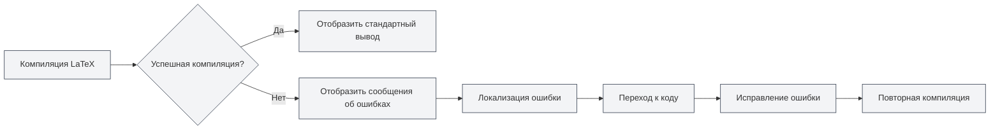

# Вывод консоли

## Обзор

Панель вывода консоли отображает журнальную информацию процесса компиляции LaTeX, включая стандартный вывод, сообщения об ошибках, предупреждения и т.д. Просматривая вывод консоли, вы можете понять процесс компиляции, локализовать ошибки и отладить проблемы.

Вывод консоли отображается с использованием редактора Monaco, поддерживает подсветку синтаксиса, локализацию ошибок, фильтрацию журналов и другие функции, позволяя вам эффективно просматривать и анализировать журналы компиляции.

## Вывод компиляции LaTeX

<LaTeXConsole mode="demo" />

### Стандартный вывод

Стандартный вывод процесса компиляции отображается в консоли:

- **Ход компиляции**: отображает различные этапы компиляции
- **Загрузка пакетов**: отображает информацию о загружаемых пакетах
- **Информация о компиляции**: отображает подробную информацию о процессе компиляции

Стандартный вывод отображается обычным текстом, помогая вам понять процесс компиляции.

Интерфейс панели вывода консоли выглядит следующим образом:

<ConsoleTerminal mode="demo" consoleKey="demo" :history='[{"content": "Компиляция начата...", "type": "out"}, {"content": "Предупреждение: неопределённая ссылка", "type": "warn"}, {"content": "Компиляция завершена", "type": "out"}]' />

### Формат вывода

<ConsoleTerminal mode="demo" consoleKey="demo" :history='[{"content": "Информация стандартного вывода", "type": "out"}, {"content": "Предупреждение", "type": "warn"}, {"content": "Сообщение об ошибке", "type": "error"}]' />

Вывод консоли использует разные цвета для различения типов информации:

- **Стандартный вывод**: серый текст, отображает обычную информацию о компиляции
- **Сообщения об ошибках**: красный текст, отображает ошибки компиляции
- **Предупреждения**: жёлтый текст, отображает предупреждения компиляции
- **Отладочная информация**: тёмно-серый текст, отображает отладочную информацию

## Отображение сообщений об ошибках

<LaTeXConsole mode="demo" />

### Формат ошибок

Ошибки компиляции отображаются в определённом формате:

- **Местоположение ошибки**: отображает имя файла, номер строки и столбца, где произошла ошибка
- **Тип ошибки**: отображает тип ошибки (например, синтаксическая ошибка, отсутствующий файл и т.д.)
- **Описание ошибки**: отображает подробное описание ошибки

### Локализация ошибок

Вывод консоли поддерживает функцию локализации ошибок:

- **Клик по ошибке**: клик по сообщению об ошибке переходит к соответствующей позиции в коде
- **Подсветка**: строка кода, соответствующая ошибке, будет подсвечена
- **Быстрое исправление**: быстрое перемещение к месту ошибки для удобного исправления

### Распространённые типы ошибок

При компиляции LaTeX могут возникнуть следующие ошибки:

- **Синтаксические ошибки**: некорректный синтаксис LaTeX
- **Неопределённая команда**: использование неопределённой команды LaTeX
- **Незакрытое окружение**: окружение не закрыто корректно
- **Отсутствующий файл**: ссылка на несуществующий файл
- **Ошибка пакета**: сбой загрузки или конфликт пакетов

## Отображение предупреждений

<ConsoleTerminal mode="demo" consoleKey="demo" :history='[{"content": "Предупреждение: неопределённая ссылка", "type": "warn"}]' />

### Формат предупреждений

Предупреждения компиляции отображаются в определённом формате:

- **Местоположение предупреждения**: отображает место возникновения предупреждения
- **Тип предупреждения**: отображает тип предупреждения
- **Описание предупреждения**: отображает подробное описание предупреждения

### Обработка предупреждений

Предупреждения обычно не останавливают компиляцию, но могут повлиять на конечный результат:

- **Просмотр предупреждений**: внимательно просмотрите предупреждения, чтобы понять возможные проблемы
- **Исправление предупреждений**: исправьте код в соответствии с информацией предупреждения
- **Игнорирование предупреждений**: если предупреждение не влияет на результат, его можно временно игнорировать

## Фильтрация журналов

<LaTeXConsole mode="demo" />

### Функция фильтрации

Вывод консоли поддерживает функцию фильтрации журналов:

- **Фильтрация по типу**: отображать только ошибки, предупреждения или стандартный вывод
- **Фильтрация по ключевому слову**: фильтровать журналы, содержащие определённые ключевые слова
- **Фильтрация по времени**: фильтровать журналы за определённый период времени

### Настройка фильтрации

Фильтрацию журналов можно настроить на панели консоли:

1. Откройте панель вывода консоли
2. Используйте параметры фильтрации для выбора отображаемого содержимого
3. Введите ключевое слово для поиска и фильтрации

### Очистка журналов

Очистка вывода консоли:

- **Кнопка очистки**: нажмите кнопку "Очистить" в консоли
- **Горячая клавиша**: `Ctrl+L` (если настроено)

Очистка журналов удалит всю отображённую журнальную информацию.

## Операции с журналами

<ConsoleTerminal mode="demo" consoleKey="demo" :history='[{"content": "Содержимое журнала компиляции...", "type": "out"}]' />

### Копирование журналов

Копирование вывода консоли в буфер обмена:

- **Кнопка копирования**: нажмите кнопку "Копировать" в консоли
- **Горячая клавиша**: `Ctrl+C` (после выделения текста)

Скопированные журналы можно сохранить в другом месте или поделиться с другими.

### Сохранение журналов

Сохранение вывода консоли в файл:

- **Кнопка сохранения**: нажмите кнопку "Сохранить журнал" в консоли
- **Выбор файла**: выберите место сохранения и имя файла

Сохранённый файл журнала можно использовать для последующего анализа или отчёта о проблеме.

### AI-анализ

Вывод консоли поддерживает функцию AI-анализа:

- **Включение AI-анализа**: включите переключатель AI-анализа на панели консоли
- **Автоматический анализ**: AI автоматически проанализирует сообщения об ошибках и предоставит рекомендации по исправлению
- **Просмотр рекомендаций**: просмотрите рекомендации по исправлению ошибок, предоставленные AI

Функция AI-анализа может помочь вам быстро понять и исправить ошибки компиляции.

## Настройки консоли

<LaTeXConsole mode="demo" />

### Параметры отображения

Вывод консоли поддерживает следующие параметры отображения:

- **Отображение номеров строк**: отображать номера строк журнала
- **Перенос строк**: автоматический перенос длинных строк
- **Размер шрифта**: настройка размера шрифта для отображения журналов

### Настройка темы

Вывод консоли следует теме редактора:

- **Светлая тема**: использование светлого фона в светлой теме
- **Тёмная тема**: использование тёмного фона в тёмной теме
- **Автоматическая синхронизация**: автоматическая синхронизация с настройками темы редактора

## Советы по использованию

<ConsoleTerminal mode="demo" consoleKey="demo" :history='[{"content": "Переход к месту ошибки...", "type": "out"}]' />

### Быстрая локализация ошибок

1. **Просмотр информации об ошибке**: внимательно изучите формат и содержание сообщения об ошибке
2. **Использование функции локализации**: нажмите на сообщение об ошибке для быстрого перехода к позиции в коде
3. **Проверка контекста**: просмотрите код в контексте места ошибки

### Понимание журналов компиляции

1. **Чтение стандартного вывода**: поймите различные этапы процесса компиляции
2. **Внимание к ошибкам**: сосредоточьтесь на сообщениях об ошибках, исправляйте их в первую очередь
3. **Просмотр предупреждений**: просмотрите предупреждения, чтобы понять возможные проблемы

### Советы по отладке

1. **Пошаговая компиляция**: закомментируйте часть кода, чтобы постепенно локализовать проблему
2. **Просмотр полного журнала**: просмотрите полный журнал компиляции, чтобы понять процесс
3. **Использование AI-анализа**: включите функцию AI-анализа для получения рекомендаций по исправлению

## Часто задаваемые вопросы

<LaTeXConsole mode="demo" />

### В: Вывод консоли не отображается?

О: Убедитесь, что панель вывода консоли открыта. Панель консоли автоматически открывается при компиляции документа LaTeX.

### В: Как быстро найти ошибку?

О: Сообщения об ошибках отображаются красным цветом, нажатие на сообщение об ошибке быстро переходит к позиции в коде.

### В: Что делать, если журналов слишком много?

О: Используйте функцию фильтрации для отсеивания ненужных журналов или функцию очистки для удаления старых журналов.

### В: Как сохранить журнал компиляции?

О: Нажмите кнопку "Сохранить журнал" в консоли, выберите место сохранения, чтобы сохранить файл журнала.

### В: AI-анализ неточен?

О: AI-анализ предоставляется только для справки, рекомендуется принимать решение, основываясь на информации об ошибке и контексте кода. Можно исправить вручную или выполнить повторный анализ.

## Связанная документация

- [[latex.compilation|Компиляция и предпросмотр LaTeX]]
- [[latex.editor|Руководство по использованию редактора LaTeX]]
- [[latex.pdf-preview|Функция предпросмотра PDF]]

<PdfPreviewPanel mode="demo" pdfUrl="" />

<LaTeXCompilerPanel mode="demo" />

<LaTeXEditorDemo mode="demo" />