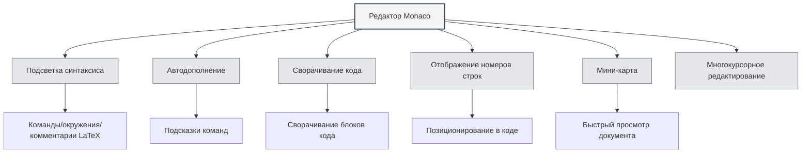

# Руководство по использованию редактора LaTeX

## Обзор

Редактор LaTeX в MetaDoc основан на Monaco Editor и предоставляет профессиональные возможности редактирования кода LaTeX. Редактор поддерживает подсветку синтаксиса, автодополнение, сворачивание кода и другие функции, помогая вам эффективно писать документы LaTeX.

Monaco Editor — это ядро редактора, используемого в Visual Studio Code, обладающее мощными возможностями редактирования кода и богатым набором функций.

<PdfPreviewPanel mode="demo" pdfUrl="" />

<ConsoleTerminal mode="demo" consoleKey="demo" :history='[{"content": "Компиляция завершена", "type": "out"}]' />

<QuickStartLatex mode="demo" />

<LaTeXEditor mode="demo" />

## Введение в редактор Monaco

Monaco Editor предоставляет следующие возможности для редактирования LaTeX:

- **Подсветка синтаксиса**: Команды LaTeX, окружения, комментарии и другие элементы синтаксиса отображаются разными цветами.
- **Автодополнение**: Автоматическое отображение предложений по дополнению при вводе команд LaTeX.
- **Сворачивание кода**: Поддержка сворачивания блоков кода для удобного просмотра длинных документов.
- **Отображение номеров строк**: Отображение номеров строк для удобного позиционирования в коде.
- **Мини-карта**: Отображение миниатюры кода справа для быстрого просмотра структуры документа.
- **Многокурсорное редактирование**: Поддержка одновременного редактирования с несколькими курсорами.

<LaTeXEditorDemo mode="demo" />

## Подсветка кода и синтаксические подсказки

### Подсветка синтаксиса

Редактор LaTeX автоматически распознает и подсвечивает:

- **Команды**: Команды LaTeX, такие как `\documentclass`, `\usepackage`.
- **Окружения**: Маркеры окружений, такие как `\begin{document}`, `\end{document}`.
- **Комментарии**: Строки комментариев, начинающиеся с `%`.
- **Математические формулы**: Области математических формул, заключенные в `$`, `$$`.
- **Специальные символы**: Специальные символы, такие как `&`, `#`, `$`.

Подсветка синтаксиса делает структуру кода более понятной, облегчая чтение и редактирование.

### Синтаксические подсказки

Редактор отображает синтаксические подсказки в следующих случаях:

- **Ввод команды**: Автоматическое отображение доступных команд LaTeX после ввода `\`.
- **Ввод окружения**: Отображение доступных названий окружений после ввода `\begin{`.
- **Ввод имени пакета**: Отображение часто используемых имен пакетов после ввода `\usepackage{`.

Синтаксические подсказки помогают быстро вводить правильные команды LaTeX, уменьшая количество ошибок.

<LaTeXEditor mode="demo" />

## Отображение номеров строк

### Отображение номеров строк

Номера строк отображаются слева в редакторе и помогают:

- **Позиционироваться в коде**: Быстро перейти к определенной строке.
- **Находить ошибки**: Ошибки компиляции отображаются с номерами строк, что упрощает поиск проблем.
- **Ссылаться на код**: Удобно ссылаться на конкретные строки кода в документации.

### Настройка номеров строк

Отображение номеров строк можно настроить в параметрах:

1.  Откройте страницу настроек.
2.  Найдите опцию "Отображение номеров строк".
3.  Переключите переключатель, чтобы включить или отключить номера строк.

Настройка номеров строк влияет на все редакторы Monaco (редактор LaTeX, текстовый редактор и т.д.).

<LaTeXEditorDemo mode="demo" />

## Мини-карта

### Функция мини-карты

Мини-карта (Minimap) — это миниатюра кода справа в редакторе:

- **Быстрый просмотр**: На мини-карте видна структура всего документа.
- **Быстрое позиционирование**: Щелчок по мини-карте позволяет быстро перейти к соответствующему месту.
- **Предварительный просмотр структуры**: По цветовым различиям можно понять различные части документа.

### Показать/скрыть мини-карту

Мини-картой можно управлять следующими способами:

1.  Щелкните правой кнопкой мыши в редакторе.
2.  Найдите опцию "Мини-карта" или "Minimap".
3.  Переключите состояние отображения.

Мини-карта особенно удобна при редактировании длинных документов, помогая быстро понять структуру документа.

## Сворачивание кода

### Функция сворачивания

Сворачивание кода позволяет свернуть блоки кода, скрывая ненужные для просмотра части:

- **Свернуть окружение**: Свернуть блок окружения `\begin{...}...\end{...}`.
- **Свернуть функцию**: Свернуть определение пользовательской команды.
- **Свернуть комментарий**: Свернуть большой блок комментариев.

### Использование сворачивания

- **Свернуть**: Щелкните значок сворачивания слева от номера строки или используйте сочетание клавиш `Ctrl+Shift+[`.
- **Развернуть**: Щелкните маркер свернутого блока или используйте сочетание клавиш `Ctrl+Shift+]`.
- **Свернуть все**: Используйте сочетание клавиш `Ctrl+K Ctrl+0`, чтобы свернуть все блоки кода.
- **Развернуть все**: Используйте сочетание клавиш `Ctrl+K Ctrl+J`, чтобы развернуть все блоки кода.

Сворачивание кода позволяет сосредоточиться на редактируемой в данный момент части, повышая эффективность работы.

<LaTeXEditorDemo mode="demo" />

## Автодополнение

### Триггеры автодополнения

Редактор автоматически отображает предложения по дополнению в следующих случаях:

- **Ввод команды**: Отображение списка команд LaTeX после ввода `\`.
- **Ввод окружения**: Отображение названий окружений после ввода `\begin{`.
- **Ввод имени пакета**: Отображение часто используемых имен пакетов после ввода `\usepackage{`.
- **Другие символы**: Также могут отображаться соответствующие предложения после ввода других символов.

### Принятие дополнения

- **Клавиша Enter**: Принять текущее выбранное предложение дополнения.
- **Клавиша Tab**: Принять текущее выбранное предложение дополнения.
- **Клавиши со стрелками**: Перемещаться вверх/вниз по списку дополнений для выбора.
- **Клавиша Esc**: Отменить предложения дополнения.

### Настройка автодополнения

Функцию автодополнения можно настроить в параметрах редактора:

- **Быстрые предложения**: Автоматическое отображение предложений дополнения после других символов.
- **Триггерные символы**: Автоматическое отображение дополнения после определенных символов (например, `\`).
- **Символы принятия**: Автоматическое принятие дополнения при вводе символов подтверждения.

<LaTeXEditor mode="demo" />

## Функции редактирования

### Многокурсорное редактирование

Редактор Monaco поддерживает одновременное редактирование с несколькими курсорами:

- **Alt+щелчок**: Добавить новый курсор в месте щелчка.
- **Ctrl+Alt+стрелка вверх/вниз**: Добавить курсор выше/ниже.
- **Ctrl+D**: Выделить следующее такое же слово и добавить курсор.
- **Ctrl+Shift+L**: Выделить все такие же слова и добавить курсоры.

Многокурсорное редактирование позволяет одновременно изменять несколько мест, повышая эффективность.

### Выбор столбца

Поддерживается режим выбора столбца:

- **Alt+Shift+перетаскивание**: Выделить прямоугольную область.
- **Alt+Shift+клавиши со стрелками**: Расширить выбор столбца.

Выбор столбца удобен для редактирования таблиц или выровненного кода.

### Форматирование кода

Редактор поддерживает базовое форматирование кода:

- **Автоматический отступ**: Автоматический отступ в соответствии со структурой кода.
- **Автоматический перенос строк**: Длинные строки автоматически переносятся для отображения.
- **Стиль отступа**: Поддержка различных стилей отступа (пробелы, Tab).

<LaTeXEditorDemo mode="demo" />

## Поиск и замена

### Функция поиска

- **Сочетание клавиш**: `Ctrl+F` для открытия диалогового окна поиска.
- **Подсветка результатов**: Результаты поиска подсвечиваются в документе.
- **Циклический поиск**: После достижения конца документа поиск автоматически продолжается с начала.

### Функция замены

- **Сочетание клавиш**: `Ctrl+H` для открытия диалогового окна поиска и замены.
- **Замена по одному**: Замена совпадающего текста по одному.
- **Замена всех**: Замена всего совпадающего текста за один раз.

### Дополнительные опции

Поиск и замена поддерживают следующие опции:

- **С учетом регистра**: Соответствие только тексту, полностью совпадающему по регистру.
- **Только целое слово**: Соответствие только полным словам.
- **Регулярные выражения**: Использование регулярных выражений для сопоставления с образцом.

<LaTeXEditorDemo mode="demo" />

## Справочник по сочетаниям клавиш

### Сочетания клавиш для редактирования

| Действие | Windows/Linux | macOS   |
| -------- | ------------- | ------- |
| Отменить | `Ctrl+Z`      | `Cmd+Z` |
| Повторить | `Ctrl+Y`      | `Cmd+Y` |
| Копировать | `Ctrl+C`      | `Cmd+C` |
| Вставить | `Ctrl+V`      | `Cmd+V` |
| Выделить все | `Ctrl+A`      | `Cmd+A` |
| Найти | `Ctrl+F`      | `Cmd+F` |
| Заменить | `Ctrl+H`      | `Cmd+H` |

### Сочетания клавиш для сворачивания кода

| Действие     | Windows/Linux   | macOS          |
| ------------ | --------------- | -------------- |
| Свернуть     | `Ctrl+Shift+[`  | `Cmd+Option+[` |
| Развернуть   | `Ctrl+Shift+]`  | `Cmd+Option+]` |
| Свернуть все | `Ctrl+K Ctrl+0` | `Cmd+K Cmd+0`  |
| Развернуть все | `Ctrl+K Ctrl+J` | `Cmd+K Cmd+J`  |

### Сочетания клавиш для многокурсорного редактирования

| Действие                     | Windows/Linux  | macOS          |
| ---------------------------- | -------------- | -------------- |
| Добавить курсор              | `Alt+щелчок`   | `Option+щелчок`|
| Добавить курсор выше         | `Ctrl+Alt+↑`   | `Cmd+Option+↑` |
| Добавить курсор ниже         | `Ctrl+Alt+↓`   | `Cmd+Option+↓` |
| Выделить следующее такое же слово | `Ctrl+D`       | `Cmd+D`        |
| Выделить все такие же слова  | `Ctrl+Shift+L` | `Cmd+Shift+L`  |

<LaTeXEditor mode="demo" />

## Советы по использованию

### Быстрый ввод

1.  **Дополнение команд**: После ввода `\` используйте клавиши со стрелками для выбора команды и нажмите Enter для принятия.
2.  **Дополнение окружений**: После ввода `\begin{` выберите название окружения, и редактор автоматически допишет `\end{...}`.
3.  **Дополнение имен пакетов**: После ввода `\usepackage{` выберите имя пакета для быстрого добавления макропакета.

<LaTeXEditor mode="demo" />

### Организация кода

1.  **Используйте сворачивание**: Сворачивайте ненужные для просмотра блоки кода, чтобы область редактирования оставалась чистой.
2.  **Используйте комментарии**: Добавляйте комментарии, объясняющие функциональность кода, для удобства последующего обслуживания.
3.  **Разумные отступы**: Поддерживайте единообразие отступов в коде для повышения читаемости.

<LaTeXEditorDemo mode="demo" />

### Поиск ошибок

1.  **Смотрите номера строк**: Ошибки компиляции отображаются с номерами строк, что позволяет быстро найти их в редакторе.
2.  **Используйте поиск**: Используйте функцию поиска для быстрого нахождения конкретной команды или текста.
3.  **Используйте мини-карту**: Быстро просматривайте структуру документа на мини-карте.

## Часто задаваемые вопросы

### В: Автодополнение не отображается?

О: Проверьте, включена ли опция "Быстрые предложения" в настройках редактора. После ввода `\` предложения дополнения должны появляться автоматически.

### В: Как свернуть код?

О: Щелкните значок сворачивания слева от номера строки или используйте сочетание клавиш `Ctrl+Shift+[`. Свернутые блоки окружений будут отмечены значком сворачивания слева от номера строки.

### В: Мини-карта не отображается?

О: Проверьте, включена ли опция "Мини-карта" в настройках редактора. Мини-карта отображается справа в редакторе.

### В: Как быстро перейти к определенной строке?

О: Используйте сочетание клавиш `Ctrl+G` (Windows/Linux) или `Cmd+G` (macOS), чтобы открыть диалоговое окно "Перейти к строке", введите номер строки для перехода.

### В: Код форматируется неправильно?

О: Редактор Monaco автоматически делает отступы в соответствии с синтаксисом LaTeX. Если отступы неправильные, их можно отрегулировать вручную или использовать клавишу Tab.

## Связанная документация

- [[latex.basics|Синтаксис LaTeX]]
- [[latex.compilation|Компиляция и предварительный просмотр LaTeX]]
- [[latex.pdf-preview|Функция предварительного просмотра PDF]]
- [[latex.console|Вывод консоли]]
- [[core.editor-basics|Основные операции редактора]]
- [[core.editor-settings|Настройки редактора]]