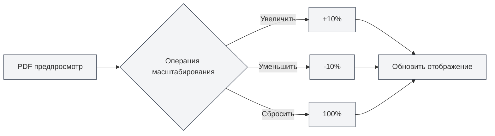

# Функция предварительного просмотра PDF

## Обзор

Функция предварительного просмотра PDF позволяет вам в реальном времени просматривать результат компиляции при редактировании документа LaTeX. Панель предварительного просмотра предоставляет богатые интерактивные возможности, включая масштабирование, перелистывание страниц, навигацию и другие, что позволяет эффективно редактировать и отлаживать документы LaTeX.

Предварительный просмотр PDF автоматически отображается после успешной компиляции LaTeX и поддерживает двустороннюю навигацию между редактором кода и PDF, что позволяет быстро переключаться между PDF и исходным кодом.

<PdfPreviewPanel mode="demo" pdfUrl="" />

## Введение в предварительный просмотр PDF

### Панель предварительного просмотра

Панель предварительного просмотра PDF отображается справа или снизу от редактора LaTeX и содержит:

- **Область содержимого PDF**: отображает содержимое страниц PDF.
- **Панель инструментов**: предоставляет кнопки для операций масштабирования, перелистывания страниц, обновления и других.
- **Информация о странице**: отображает текущий номер страницы и общее количество страниц.

Интерфейс панели предварительного просмотра PDF выглядит следующим образом:

<PdfPreviewPanel mode="demo" pdfUrl="" />

<LaTeXCompilerPanel mode="demo" />

### Автоматическое отображение

Предварительный просмотр PDF автоматически отображается в следующих случаях:

- **Успешная компиляция**: автоматически отображается после успешной компиляции LaTeX.
- **Открытие документа**: автоматически отображается при открытии существующего документа LaTeX с PDF.
- **Ручное открытие**: нажатие кнопки "Предпросмотр" на панели инструментов для ручного открытия.

<PdfPreviewPanel mode="demo" pdfUrl="" />

## Масштабирование PDF

### Увеличение PDF

Увеличение масштаба предварительного просмотра PDF:

- **Кнопка на панели инструментов**: нажмите кнопку "Увеличить" (значок +) на панели инструментов.
- **Колесико мыши**: удерживайте клавишу `Ctrl` и прокрутите колесико мыши вверх.
- **Горячая клавиша**: `Ctrl+=` (если настроено).

Каждое увеличение добавляет 10% к масштабу.

<LaTeXEditorDemo mode="demo" />

### Уменьшение PDF

Уменьшение масштаба предварительного просмотра PDF:

- **Кнопка на панели инструментов**: нажмите кнопку "Уменьшить" (значок -) на панели инструментов.
- **Колесико мыши**: удерживайте клавишу `Ctrl` и прокрутите колесико мыши вниз.
- **Горячая клавиша**: `Ctrl+-` (если настроено).

Каждое уменьшение убавляет 10% от масштаба.

### Сброс масштаба

Сброс масштаба PDF до 100%:

- **Кнопка на панели инструментов**: нажмите кнопку "Сбросить масштаб" на панели инструментов.
- **Горячая клавиша**: `Ctrl+0` (если настроено).

### Диапазон масштабирования

Поддерживаемый диапазон масштабирования PDF:

- **Минимальное значение**: 20% (0.2x)
- **Максимальное значение**: 500% (5x)
- **Значение по умолчанию**: 100% (1x)

Масштаб автоматически ограничивается допустимым диапазоном.

<PdfPreviewPanel mode="demo" pdfUrl="" />

## Обновление PDF

### Ручное обновление

Ручное обновление предварительного просмотра PDF:

- **Кнопка на панели инструментов**: нажмите кнопку "Обновить" на панели инструментов.
- **Горячая клавиша**: `F5` (если настроено).

Обновление перезагрузит PDF-файл, отобразив последние результаты компиляции.

### Автоматическое обновление

Предварительный просмотр PDF автоматически обновляется в следующих случаях:

- **Успешная компиляция**: автоматически обновляется после успешной компиляции LaTeX.
- **Обновление PDF-файла**: автоматически обновляется при обнаружении изменений в PDF-файле.

### Время обновления

Рекомендуется обновлять PDF в следующих случаях:

- **После изменения кода**: после изменения кода LaTeX и повторной компиляции.
- **При аномалиях предпросмотра**: когда предварительный просмотр PDF отображается некорректно или содержимое неверно.
- **При длительном редактировании**: когда после длительного редактирования необходимо увидеть последний результат.

<LaTeXEditorDemo mode="demo" />

## Навигация из PDF в код

### Навигация из PDF в код

При нажатии на определенное место в предварительном просмотре PDF редактор автоматически перейдет к соответствующей позиции в коде LaTeX:

1. **Нажмите на место в PDF**: нажмите на место, которое хотите просмотреть, в предварительном просмотре PDF.
2. **Автоматический переход**: редактор автоматически перейдет к соответствующему коду LaTeX.
3. **Подсветка**: соответствующая строка кода будет подсвечена.

Эта функция позволяет быстро перейти от результата в PDF к исходному коду, что удобно для отладки и внесения изменений.

<PdfPreviewPanel mode="demo" pdfUrl="" />

### Навигация из кода в PDF

В редакторе LaTeX вы можете:

1. **Выделить код**: выделите код LaTeX, который хотите просмотреть.
2. **Контекстное меню**: щелкните правой кнопкой мыши и выберите "Перейти к PDF".
3. **Переход в предпросмотр**: предварительный просмотр PDF автоматически перейдет к соответствующему месту.

### Двусторонняя навигация

Функция двусторонней навигации между PDF и кодом:

- **PDF → Код**: нажмите на место в PDF для перехода к коду.
- **Код → PDF**: выделите код для перехода к месту в PDF.
- **Синхронная прокрутка**: поддерживает синхронную прокрутку PDF и кода.

<ConsoleTerminal mode="demo" consoleKey="demo" :history='[{"content": "Навигация по страницам PDF...", "type": "out"}]' />

## Навигация по страницам PDF

### Операции перелистывания

Предварительный просмотр PDF поддерживает следующие операции перелистывания:

- **Предыдущая страница**: нажмите кнопку "Предыдущая страница" на панели инструментов или используйте клавиши со стрелками.
- **Следующая страница**: нажмите кнопку "Следующая страница" на панели инструментов или используйте клавиши со стрелками.
- **Переход на страницу**: введите номер страницы в поле ввода и нажмите Enter.

### Информация о странице

Предварительный просмотр PDF отображает следующую информацию о странице:

- **Текущая страница**: отображает номер текущей просматриваемой страницы.
- **Всего страниц**: отображает общее количество страниц в PDF.
- **Поле ввода номера страницы**: позволяет напрямую ввести номер страницы для перехода.

### Многостраничный режим

Предварительный просмотр PDF поддерживает многостраничный режим отображения:

- **Одностраничный режим**: отображает одну страницу за раз.
- **Многостраничный режим**: отображает несколько страниц одновременно (в основном предпросмотре).

Многостраничный режим подходит для быстрого просмотра всего документа.

<PdfPreviewPanel mode="demo" pdfUrl="" />

## Сохранение PDF

### Сохранение PDF

Сохранение текущего PDF-файла:

- **Кнопка на панели инструментов**: нажмите кнопку "Сохранить" на панели инструментов.
- **Меню**: выберите "Файл" → "Сохранить PDF".
- **Горячая клавиша**: `Ctrl+S` (если PDF является текущим активным документом).

Сохранение PDF поместит файл в тот же каталог, что и документ.

### Открытие каталога PDF

Открытие каталога, содержащего PDF-файл:

- **Кнопка на панели инструментов**: нажмите кнопку "Открыть каталог" на панели инструментов.
- **Меню**: выберите "Файл" → "Открыть каталог PDF".

После открытия каталога вы можете просматривать и управлять PDF-файлом в файловом менеджере.

<LaTeXEditorDemo mode="demo" />

## Режимы взаимодействия с PDF

### Режим указателя

Режим указателя является режимом взаимодействия по умолчанию:

- **Выделение текста**: можно выделять текст в PDF.
- **Копирование текста**: можно копировать выделенный текст.
- **Нажатие для навигации**: нажатие на место в PDF позволяет перейти к коду.

### Режим руки

Режим руки используется для перетаскивания PDF:

- **Перетаскивание PDF**: удерживайте левую кнопку мыши для перетаскивания содержимого PDF.
- **Перемещение вида**: перемещение позиции просмотра PDF.
- **Подходит для больших PDF**: удобен для просмотра PDF большого размера.

Переключение режимов:

- **Кнопка на панели инструментов**: нажмите кнопку переключения режима на панели инструментов.
- **Горячая клавиша**: клавиша `H` для переключения в режим руки.

## Советы по использованию

### Эффективный предпросмотр

1. **Используйте масштабирование**: настройте подходящий масштаб в зависимости от содержимого.
2. **Используйте навигацию**: используйте функцию навигации для быстрого переключения между кодом и PDF.
3. **Используйте обновление**: своевременно обновляйте для просмотра результатов после изменения кода.

### Советы по отладке

1. **Локализация ошибок**: переходите из PDF в код, чтобы быстро найти проблемное место.
2. **Сравнение результатов**: сравнивайте результат в PDF с кодом, проверяя правильность форматирования.
3. **Многостраничный просмотр**: используйте многостраничный режим для быстрого просмотра всего документа.

### Оптимизация производительности

1. **Разумное масштабирование**: не используйте чрезмерно большой масштаб.
2. **Закрытие предпросмотра**: закрывайте панель предпросмотра, когда она не нужна, для экономии ресурсов.
3. **Стратегия обновления**: выбирайте автоматическое или ручное обновление по необходимости.

## Часто задаваемые вопросы

### В: Предварительный просмотр PDF не отображается?

О: Убедитесь, что документ LaTeX успешно скомпилирован. Если компиляция завершилась неудачей, предварительный просмотр PDF не отобразится. Проверьте сообщения об ошибках в выводе консоли.

### В: Предварительный просмотр PDF не обновляется?

О: Нажмите кнопку "Обновить" для ручного обновления предпросмотра или перекомпилируйте документ LaTeX. Убедитесь, что PDF-файл успешно создан.

### В: Как перейти из PDF в код?

О: Нажмите на место, которое хотите просмотреть, в предварительном просмотре PDF, и редактор автоматически перейдет к соответствующему коду LaTeX.

### В: Как перейти из кода в PDF?

О: Выделите код LaTeX, щелкните правой кнопкой мыши и выберите "Перейти к PDF", и предварительный просмотр PDF автоматически перейдет к соответствующему месту.

### В: Масштабирование PDF не работает?

О: Убедитесь, что панель предварительного просмотра PDF полностью загружена. Если проблема сохраняется, попробуйте обновить предварительный просмотр PDF.

## Связанная документация

- [[latex.compilation|Компиляция и предпросмотр LaTeX]]
- [[latex.editor|Руководство по использованию редактора LaTeX]]
- [[latex.console|Вывод консоли]]

<LaTeXCompilerPanel mode="demo" />

<LaTeXEditorDemo mode="demo" />

<ConsoleTerminal mode="demo" consoleKey="demo" :history='[{"content": "Журнал компиляции...", "type": "out"}]' />