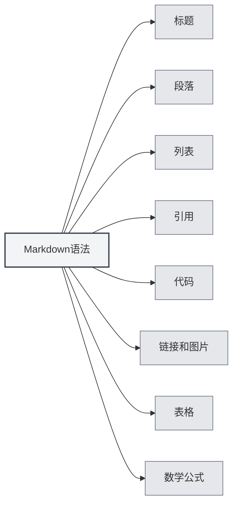

# Синтаксис Markdown

## Обзор

Markdown — это облегченный язык разметки, позволяющий писать документы в удобочитаемом и простом для записи формате обычного текста. MetaDoc предоставляет полную поддержку редактирования и предварительного просмотра Markdown.

<ViewMenuItemsDemo mode="demo" :items='["outline", "preview"]' />

## Основной синтаксис

### Заголовки

Используйте символ `#` для создания заголовков. Количество символов `#` указывает на уровень заголовка:

```markdown
# Заголовок первого уровня

## Заголовок второго уровня

### Заголовок третьего уровня
```



### Абзацы

Разделяйте абзацы пустыми строками.

### Списки

**Маркированный список** использует `-`, `*` или `+`:

```markdown
- Пункт 1
- Пункт 2
- Пункт 3
```

**Нумерованный список** использует цифры:

```markdown
1. Первый пункт
2. Второй пункт
3. Третий пункт
```

### Цитаты

Используйте `>` для создания цитаты:

```markdown
> Это текст цитаты
```

### Код

**Встроенный код** использует обратные кавычки:

```markdown
Используйте `console.log()` для вывода содержимого
```

**Блок кода** использует три обратные кавычки:

````markdown
```javascript
function hello() {
  console.log('Hello, World!')
}
```
````

### Ссылки и изображения

**Ссылка**:

```markdown
[Текст ссылки](https://example.com)
```

**Изображение**:

```markdown

```

### Таблицы

```markdown
| Столбец1 | Столбец2 | Столбец3 |
| -------- | -------- | -------- |
| Данные1  | Данные2  | Данные3  |
```

## Математические формулы

### Встроенные формулы

Используйте `$` для обрамления:

```markdown
Это встроенная формула: $E = mc^2$
```

### Блочные формулы

Используйте `$$` для обрамления:

```markdown
$$
\int_{-\infty}^{\infty} e^{-x^2} dx = \sqrt{\pi}
$$
```

## Расширенные возможности

### Преобразование формул LaTeX

MetaDoc поддерживает преобразование математических формул из Markdown в формат LaTeX. Подробнее см. [[latex.basics|Синтаксис LaTeX]].

### Поддержка диаграмм

MetaDoc поддерживает различные форматы диаграмм:

- [[charts.mermaid|Диаграммы Mermaid]]
- [[charts.plantuml|Диаграммы PlantUML]]
- [[charts.echarts|Диаграммы ECharts]]

## Связанная документация

- [[markdown.editor|Руководство по использованию редактора Markdown]]
- [[markdown.advanced|Расширенные возможности Markdown]]
- [[markdown.features|Функции редактора Markdown]]
- [[core.editor-basics|Основные операции редактора]]

<LaTeXEditorDemo mode="demo" />

<Outline mode="demo" />

<ViewMenuItemsDemo mode="demo" :items='["outline"]' />

<MenuItemsDemo mode="demo" :items='[{"id": "file", "items": ["new", "open", "save"]}]' />

<TitleMenu mode="demo" title="Markdown文档示例" path="1" :tree='{}' />

<ViewMenuItemsDemo mode="demo" :items='["editor", "preview"]' />
