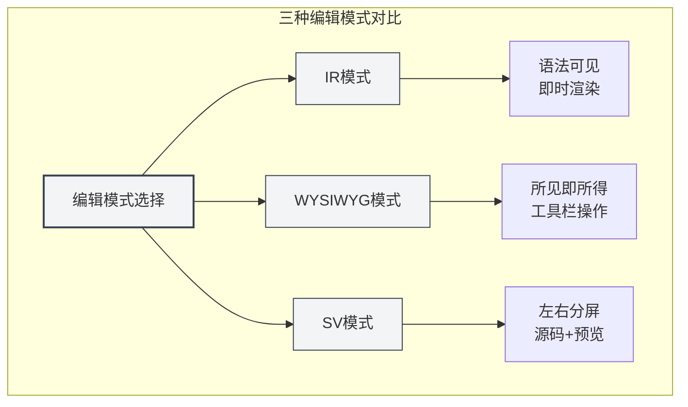
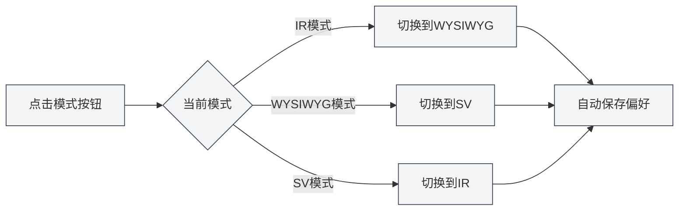
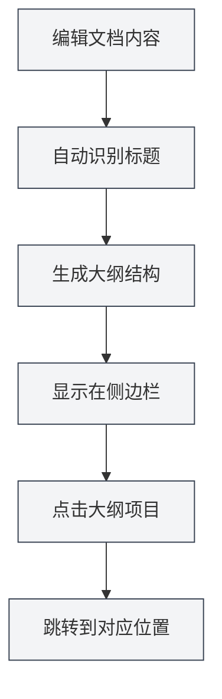
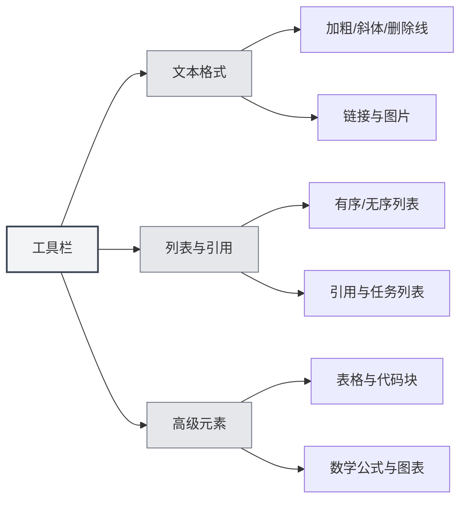

# Руководство по использованию редактора Markdown

## Обзор

Редактор Markdown в MetaDoc предоставляет вам профессиональную и элегантную среду для письма. Это не просто поле для ввода текста, а глубоко оптимизированное пространство для творчества — поддерживающее три гибких режима редактирования, предварительный просмотр в реальном времени и богатый набор инструментов для форматирования, позволяя вам сосредоточиться на содержании, не беспокоясь о формате.

Независимо от того, пишете ли вы технический блог, систематизируете учебные заметки или создаете проектную документацию, этот редактор удовлетворит ваши потребности. Особенно стоит отметить глубоко интегрированные возможности ИИ, которые могут предоставлять интеллектуальное дополнение и предложения во время написания, делая процесс творчества более плавным.

<TitleMenu mode="demo" title="Markdown编辑器示例" path="1" :tree='{}' />

<SectionOptimizer mode="demo" title="段落优化示例" path="1" :tree='{}' language="markdown" :adapter='null' />


## Три режима редактирования

MetaDoc понимает, что у разных пользователей разные привычки редактирования, поэтому предлагает на выбор три режима:

### IR-режим (Мгновенный рендеринг)

Это режим редактирования по умолчанию и предпочтительный выбор для большинства пользователей Markdown. В этом режиме:

- **Мгновенная обратная связь**: Содержание сразу же отображается в отформатированном виде по мере ввода синтаксиса Markdown.
- **Видимый синтаксис**: Символы разметки Markdown (такие как `#`, ` **`) остаются видимыми, что удобно для точного контроля формата.
- **Плавное редактирование**: Высокая скорость рендеринга, даже при редактировании длинных документов не возникает задержек.
- **Удобство для обучения**: Для пользователей, изучающих синтаксис Markdown, можно сразу видеть соответствие между синтаксисом и результатом.

**Подходящие сценарии**:

- Пользователи, знакомые с синтаксисом Markdown.
- Ситуации, требующие точного контроля формата документа.
- Редактирование длинных технических документов или статей в блоге.

### WYSIWYG-режим (Что видишь, то и получаешь)

Если вы больше привыкли к опыту редактирования, подобному Word, этот режим покажется вам знакомым:

- **Прямое редактирование**: Вы видите конечный результат, можно редактировать напрямую кликом.
- **Не нужно запоминать синтаксис**: Операции выделения жирным, создания заголовков, списков и т.д. выполняются с помощью кнопок на панели инструментов.
- **Интуитивные действия**: Выделите текст и нажмите кнопку, чтобы применить формат.
- **Низкий порог входа**: Пользователи, не знакомые с синтаксисом Markdown, могут быстро освоиться.

**Подходящие сценарии**:

- Пользователи, впервые знакомящиеся с Markdown.
- Ситуации, требующие быстрого форматирования без внимания к базовому синтаксису.
- Пользователи, предпочитающие визуальное редактирование.

### SV-режим (Разделенный экран с предпросмотром)

Этот режим делит область редактирования на две части:

- **Сравнение слева и справа**: Слева отображается исходный код Markdown, справа — результат рендеринга.
- **Синхронизация в реальном времени**: При редактировании слева предпросмотр справа немедленно обновляется.
- **Отличный инструмент для обучения**: Можно одновременно видеть синтаксис и конечный результат, углубляя понимание Markdown.
- **Точная проверка**: Удобно проверять правильность сложных форматов (таких как таблицы, вложенные списки).

**Подходящие сценарии**:

- Пользователи, изучающие синтаксис Markdown.
- Ситуации, требующие одновременного просмотра исходного кода и результата для проверки.
- Редактирование документов со сложным форматированием.



### Как переключать режимы

Переключение режимов редактирования очень просто:

1. **Кнопка на панели инструментов**: Найдите кнопку переключения режима на верхней панели инструментов редактора.
2. **Циклическое переключение**: Нажатие на кнопку циклически переключает между тремя режимами.
3. **Запоминание предпочтений**: Система запомнит последний использованный вами режим и автоматически восстановит его при следующем открытии документа.



## Предпросмотр в реальном времени

Функция предпросмотра в реальном времени в MetaDoc делает письмо удовольствием:

- **Автоматический рендеринг**: Вы вводите содержимое слева, и результат рендеринга немедленно отображается справа (или внизу).
- **Полная поддержка**: От базовых заголовков и списков до сложных математических формул и диаграмм — все отображается корректно.
- **Подсветка синтаксиса**: Блоки кода автоматически подсвечиваются в соответствии с типом языка, делая код более читаемым.
- **Математические формулы**: Поддерживаются математические формулы с синтаксисом LaTeX, будь то встроенные формулы `$E=mc^2$` или отдельные блоки формул — все отображается идеально.
- **Адаптация изображений**: Вставленные изображения автоматически адаптируются к ширине редактора, по клику можно увеличить для просмотра.

## Синхронизация оглавления

Навигация по длинным документам никогда не была такой простой:

- **Автоматическое извлечение**: Редактор автоматически распознает заголовки в документе и создает четко структурированное оглавление.
- **Обновление в реальном времени**: Когда вы добавляете, изменяете или удаляете заголовки, оглавление синхронно обновляется.
- **Переход в один клик**: Нажмите на любой заголовок в оглавлении, и редактор немедленно перейдет к соответствующему месту.
- **Предпросмотр структуры**: Через оглавление можно быстро понять структурный каркас всего документа.

Вы можете получить доступ к виду оглавления через боковую панель:

<ViewMenuItemsDemo mode="demo" :items='["editor", "outline"]' />



Подробное описание функции оглавления смотрите в [[outline.basics|Функции вида оглавления]].

## Функции панели инструментов

Верхняя панель инструментов редактора собрала наиболее часто используемые функции форматирования:



### Форматирование текста

- **Жирный** (`Ctrl+B`): Делает ключевой контент более заметным.
- **Курсив** (`Ctrl+I`): Используется для выделения или обозначения особого значения.
- **Зачеркнутый**: Обозначает устаревший или измененный контент.
- **Встроенный код**: Обозначает фрагменты кода или технические термины.
- **Ссылка** (`Ctrl+K`): Вставляет кликаемую гиперссылку.
- **Изображение**: Вставляет локальное или сетевое изображение.

### Списки и цитаты

- **Маркированный список**: Перечисляет элементы с помощью маркеров.
- **Нумерованный список**: Перечисляет элементы с помощью цифр.
- **Блок цитаты**: Цитирует чужое мнение или важное примечание.
- **Список задач**: Список дел с флажками.

### Расширенные элементы

- **Таблица**: Создает структурированные таблицы данных, поддерживает выравнивание и вложение.
- **Блок кода**: Вставляет многострочный код, поддерживает подсветку синтаксиса для десятков языков программирования.
- **Математическая формула**: Вставляет математические формулы с использованием синтаксиса LaTeX.
- **Диаграмма**: Вставляет диаграммы Mermaid, PlantUML, ECharts и другие.

## Горячие клавиши

Умелое использование горячих клавиш может значительно повысить эффективность письма:

### Горячие клавиши форматирования

| Действие     | Windows/Linux  | macOS         |
| ------------ | -------------- | ------------- |
| Жирный       | `Ctrl+B`       | `Cmd+B`       |
| Курсив       | `Ctrl+I`       | `Cmd+I`       |
| Вставить ссылку | `Ctrl+K`       | `Cmd+K`       |
| Вставить код | `Ctrl+Shift+K` | `Cmd+Shift+K` |

### Горячие клавиши редактирования

| Действие | Windows/Linux | macOS         |
| -------- | ------------- | ------------- |
| Отменить | `Ctrl+Z`      | `Cmd+Z`       |
| Повторить | `Ctrl+Y`      | `Cmd+Shift+Z` |
| Выделить все | `Ctrl+A`      | `Cmd+A`       |
| Найти    | `Ctrl+F`      | `Cmd+F`       |

## Советы по использованию

### Быстрый ввод

1. **Быстрое создание заголовка**: Введите `#` и нажмите пробел — автоматически преобразуется в формат заголовка.
2. **Быстрое создание списка**: Введите `-` или `*` и нажмите пробел — автоматически преобразуется в элемент списка.
3. **Быстрая вставка блока кода**: Введите три обратных апострофа ` ``` ` и нажмите Enter.
4. **Быстрая вставка разделительной линии**: Введите три дефиса `---` и нажмите Enter.

### Приемы форматирования

1. **Форматирование после выделения текста**: Сначала выделите текст, затем нажмите кнопку на панели инструментов или используйте горячую клавишу.
2. **Массовая замена**: Используйте функцию поиска и замены (`Ctrl+H`) для массового изменения формата.
3. **Подсветка кода**: Укажите язык в первой строке блока кода, например ````python`.

### Приемы предпросмотра

1. **Предпросмотр при переключении режимов**: В SV-режиме можно одновременно видеть исходный код и результат.
2. **Предпросмотр математических формул**: Введите формулу, окруженную `$`, чтобы сразу видеть результат рендеринга.
3. **Рендеринг диаграмм в реальном времени**: Диаграммы Mermaid автоматически отрисовываются после завершения редактирования.

## Часто задаваемые вопросы

### В: Как вставить изображение?

О: Есть три способа:

1. Нажмите кнопку изображения на панели инструментов.
2. Используйте горячую клавишу `Ctrl+Shift+I`.
3. Просто вставьте изображение из буфера обмена.

Изображения можно сохранять в локальном каталоге документа или загружать на хостинг изображений.

### В: Как создать таблицу?

О: Рекомендуется использовать кнопку таблицы на панели инструментов для визуального создания. Также можно вручную ввести синтаксис таблицы Markdown:

```markdown
| Колонка1 | Колонка2 | Колонка3 |
| -------- | -------- | -------- |
| Содержимое | Содержимое | Содержимое |
```

### В: Что делать, если математическая формула не отображается?

О: Проверьте правильность синтаксиса:

- Встроенная формула: Окружена одинарными `$`, например `$E=mc^2$`.
- Отдельная формула: Окружена двойными `$$`, занимает отдельную строку.

### В: Как просмотреть оглавление документа?

О: Нажмите значок "Оглавление" на боковой панели или переключитесь на вид оглавления с помощью горячей клавиши. Заголовки в документе автоматически извлекаются в оглавление.

### В: Потеряется ли содержимое при переключении режимов редактирования?

О: Нет. Три режима используют одно и то же содержимое документа. Переключение режима меняет только способ отображения и редактирования, содержимое полностью сохраняется.

## Связанная документация

- [[markdown.basics|Синтаксис Markdown]] - Изучите основы синтаксиса Markdown.
- [[markdown.features|Функции редактора Markdown]] - Узнайте больше о расширенных функциях.
- [[core.editor-basics|Основные операции редактора]] - Общие приемы редактирования.
- [[core.editor-settings|Настройки редактора]] - Персонализированная конфигурация.
- [[outline.basics|Функции вида оглавления]] - Подробнее об оглавлении.

<LaTeXEditorDemo mode="demo" />

<Outline mode="demo" />

<MenuItemsDemo mode="demo" :items='[{"id": "file", "items": ["new", "open", "save"]}]' />

<TitleMenu mode="demo" title="Markdown编辑器示例" path="1" :tree='{}' />

<SectionOptimizer mode="demo" title="段落优化示例" path="1" :tree='{}' language="markdown" :adapter='null' />
