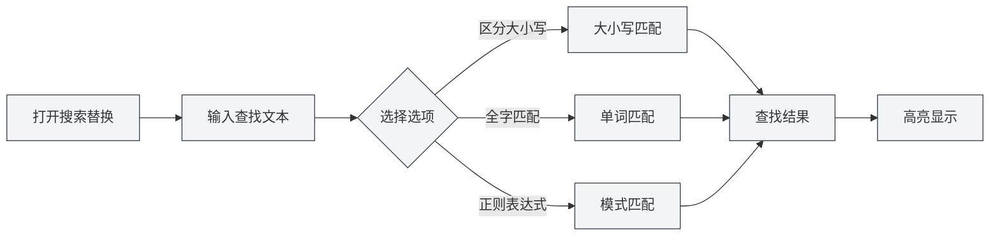
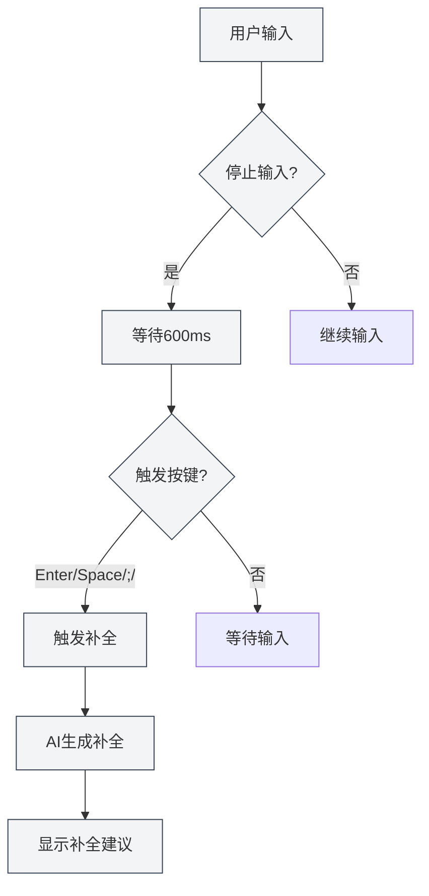

# Функции редактора Markdown

## Обзор

Редактор Markdown предоставляет богатый набор функций, включая поиск и замену, контекстное меню, автодополнение с помощью ИИ, интеграцию с базой знаний и другие. Эти функции могут значительно повысить вашу эффективность редактирования и качество документации.

В этом документе описаны различные функции редактора Markdown и способы их использования.

## Поиск и замена

### Открытие поиска и замены

Есть несколько способов открыть функцию поиска и замены:

- **Горячие клавиши**: `Ctrl+F` для поиска, `Ctrl+H` для поиска и замены
- **Меню**: Нажмите "Правка" → "Найти" или "Найти и заменить"
- **Панель инструментов**: Нажмите значок поиска на панели инструментов

Вы можете получить доступ к операциям с файлами через меню файла в верхней строке меню, а к функциям редактирования — через меню правки:

<MenuItemsDemo mode="demo" :items='[{"id": "file", "items": ["new", "open", "save"]}]' />

### Функция поиска

Функция поиска поддерживает следующие опции:

- **С учётом регистра**: Соответствует только тексту с точно таким же регистром
- **Только слово целиком**: Соответствует только целым словам (не части слова)
- **Регулярное выражение**: Использует регулярные выражения для сопоставления с образцом
- **Сохранить регистр**: Сохраняет регистр исходного текста при замене

Интерфейс меню поиска и замены выглядит следующим образом:

<SearchReplaceMenu mode="demo" :adapter='null' />

### Функция замены

Функция замены поддерживает:

- **Замена по одной**: Замена каждого совпадения по отдельности
- **Заменить все**: Замена всех совпадений за один раз
- **Предварительный просмотр**: Просмотр результата замены перед её выполнением

### Список совпадений

Панель поиска и замены отображает список совпадений:

- **Показывать позицию**: Показывает номер строки и столбца для каждого совпадения
- **Предпросмотр контекста**: Показывает контекстное содержание совпадения
- **Быстрый переход**: Нажатие на совпадение позволяет быстро перейти к соответствующей позиции

### Советы по использованию

1. **Регулярные выражения**: Использование регулярных выражений позволяет реализовать сложные шаблоны поиска и замены
2. **Массовая замена**: Использование "Заменить все" позволяет быстро вносить массовые изменения в документ
3. **Сохранение форматирования**: Использование опции "Сохранить регистр" позволяет сохранить регистр исходного текста

## Контекстное меню

### Основные операции редактирования

Контекстное меню предоставляет следующие основные операции редактирования:

- **Вырезать**: `Ctrl+X` или выбор "Вырезать" в контекстном меню
- **Копировать**: `Ctrl+C` или выбор "Копировать" в контекстном меню
- **Вставить**: `Ctrl+V` или выбор "Вставить" в контекстном меню
- **Выделить всё**: `Ctrl+A` или выбор "Выделить всё" в контекстном меню

### Функции ИИ

Контекстное меню предоставляет следующие функции ИИ:

- **Анализ ИИ**: Анализирует текущее содержимое документа, открывает окно диалога с ИИ
- **Оптимизация абзаца**: Оптимизирует содержание текущего абзаца
- **Вставить диаграмму**: Использует ИИ для генерации кода диаграммы и вставки его в документ

### Включение/выключение функций

Контекстное меню позволяет быстро включать/выключать следующие функции:

- **Автодополнение ИИ**: Включить/выключить функцию автодополнения ИИ
- **Интеграция базы знаний**: Включить/выключить функцию интеграции с базой знаний

### Ручной запуск дополнения

Контекстное меню предоставляет опцию "Ручной запуск дополнения":

- **Горячая клавиша**: `Shift+Tab`
- **Контекстное меню**: Выбор "Ручной запуск дополнения" в контекстном меню

Ручной запуск дополнения немедленно запускает дополнение ИИ, не дожидаясь автоматического срабатывания.

## Автодополнение ИИ

### Включение/выключение

Функцию автодополнения ИИ можно включить или выключить в следующих местах:

- **Контекстное меню**: Выбор "Включить/выключить автодополнение ИИ" в контекстном меню
- **Страница настроек**: Настройка параметров автодополнения ИИ в настройках

### Автоматическое срабатывание

Автодополнение ИИ автоматически срабатывает в следующих случаях:

- **Остановка ввода**: Автоматическое срабатывание через 600 мс после остановки ввода
- **Клавиши-триггеры**: Срабатывание после ввода определённых клавиш (Enter, Space, `;`, `,`)

### Ручной запуск

Способы ручного запуска дополнения:

- **Горячая клавиша**: `Shift+Tab`
- **Контекстное меню**: Выбор "Ручной запуск дополнения" в контекстном меню

Ручной запуск немедленно запускает дополнение, минуя задержку автоматического срабатывания.

### Режимы дополнения

Автодополнение ИИ поддерживает два режима:

- **Полная генерация**: Генерирует полное содержание дополнения
- **Частичная генерация**: Генерирует только часть содержания (в соответствии с настройками)

Режим дополнения можно настроить в настройках.

### Настройка клавиш-триггеров

Клавиши-триггеры дополнения можно настроить в настройках:

- **Enter**: Срабатывание по клавише Enter
- **Space**: Срабатывание по клавише Space (пробел)
- **;**: Срабатывание по точке с запятой
- **,**: Срабатывание по запятой

Можно включить несколько клавиш-триггеров одновременно.

### Максимальное количество токенов для дополнения

Максимальное количество токенов для дополнения можно настроить в настройках:

- **Минимальное значение**: 20 токенов
- **Максимальное значение**: Без ограничений (установка 0 означает без ограничений)
- **Значение по умолчанию**: 50 токенов

Чем больше токенов, тем больше содержание дополнения, но время генерации также будет дольше.

### Принятие дополнения

После отображения предложения дополнения можно:

- **Клавиша Tab**: Принять предложение дополнения
- **Клавиша Esc**: Отклонить предложение дополнения
- **Продолжить ввод**: Отменить дополнение и продолжить ввод

<TitleMenu mode="demo" title="Markdown编辑器示例" path="1" :tree='{}' />

<SectionOptimizer mode="demo" title="段落优化示例" path="1" :tree='{}' language="markdown" :adapter='null' />

<ViewMenuItemsDemo mode="demo" :items='["editor", "outline", "agent"]' />

## Интеграция с базой знаний

### Включение/выключение

Функцию интеграции с базой знаний можно включить или выключить в следующих местах:

- **Контекстное меню**: Выбор "Включить/выключить базу знаний" в контекстном меню
- **Страница настроек**: Настройка параметров базы знаний в настройках

### Контекстный поиск

После включения интеграции с базой знаний функции ИИ будут автоматически искать релевантное содержание в базе знаний:

- **Дополнение ИИ**: При дополнении будет учитываться релевантное содержание из базы знаний
- **Анализ ИИ**: При анализе документа будут использоваться знания из базы знаний
- **Оптимизация абзаца**: При оптимизации абзаца будет учитываться содержание из базы знаний

### Принцип поиска

Поиск в базе знаний использует технологию векторного поиска:

- **Семантическое соответствие**: Соответствие релевантному содержанию на основе семантического сходства
- **Соответствие ключевым словам**: Одновременное использование соответствия по ключевым словам для повышения точности
- **Гибридный поиск**: Комбинация векторного поиска и соответствия по ключевым словам

### Порог уверенности

Поиск в базе знаний поддерживает установку порога уверенности:

- **Диапазон порога**: 0.0 - 1.0
- **Значение по умолчанию**: 0.5
- **Назначение**: Возвращает только содержание со сходством выше порога

Порог уверенности можно настроить в настройках, подробнее см. [[knowledge-base.config|Конфигурация базы знаний]].

## Комбинированное использование функций

### Поиск и замена + Дополнение ИИ

Комбинированное использование поиска и замены с дополнением ИИ:

1. Используйте поиск и замену для нахождения содержания, требующего изменения
2. Используйте дополнение ИИ для генерации нового содержания
3. Используйте функцию замены для массового обновления

### Контекстное меню + База знаний

Комбинированное использование контекстного меню и базы знаний:

1. Включите интеграцию с базой знаний
2. Используйте функции ИИ в контекстном меню
3. Функции ИИ будут автоматически использовать содержание из базы знаний

### Анализ ИИ + Оптимизация абзаца

Комбинированное использование анализа ИИ и оптимизации абзаца:

1. Используйте анализ ИИ для понимания содержания документа
2. Используйте оптимизацию абзаца для улучшения конкретных абзацев
3. Проводите оптимизацию на основе рекомендаций анализа ИИ

## Советы по использованию

### Повышение качества дополнения

1. **Включите базу знаний**: Включение интеграции с базой знаний может повысить качество дополнения
2. **Настройте количество токенов**: Настройте максимальное количество токенов для дополнения в соответствии с потребностями
3. **Ручной запуск**: Используйте ручной запуск при необходимости для получения лучшего результата дополнения

### Эффективный поиск и замена

1. **Используйте регулярные выражения**: Используйте регулярные выражения для сложных шаблонов
2. **Предварительный просмотр замены**: Просматривайте результат замены перед её выполнением
3. **Массовые операции**: Используйте "Заменить все" для быстрого массового изменения

### Использование базы знаний

1. **Добавляйте релевантные документы**: Добавляйте релевантные документы в базу знаний
2. **Настройте порог уверенности**: Настройте порог уверенности в соответствии с потребностями
3. **Регулярное обновление**: Регулярно обновляйте содержание базы знаний

## Часто задаваемые вопросы

### В: Дополнение ИИ не отображается?

О: Проверьте, включено ли автодополнение ИИ, убедитесь, что конфигурация LLM правильная. Попробуйте запустить дополнение вручную (`Shift+Tab`).

### В: Поиск и замена не находит содержание?

О: Проверьте, включены ли опции "С учётом регистра" или "Только слово целиком". Если используете регулярные выражения, проверьте правильность выражения.

### В: Интеграция с базой знаний не работает?

О: Проверьте, включена ли база знаний, убедитесь, что в базе знаний есть релевантные документы. Настройка порога уверенности может помочь найти больше содержания.

### В: Как выключить дополнение ИИ?

О: Выберите "Выключить автодополнение ИИ" в контекстном меню или выключите опцию автодополнения ИИ в настройках.

### В: Содержание дополнения неточное?

О: Попробуйте включить интеграцию с базой знаний, настроить максимальное количество токенов для дополнения или использовать ручной запуск для получения лучшего результата.

## Связанная документация

- [[markdown.editor|Руководство по использованию редактора Markdown]]
- [[markdown.basics|Синтаксис Markdown]]
- [[ai.completion|Автодополнение ИИ]]
- [[knowledge-base.usage|Использование базы знаний]]
- [[core.editor-basics|Основные операции редактора]]

<LaTeXEditorDemo mode="demo" />

<Outline mode="demo" />

<MenuItemsDemo mode="demo" :items='[{"id": "file", "items": ["new", "open", "save"]}]' />

<TitleMenu mode="demo" title="Markdown编辑器功能示例" path="1" :tree='{}' />

<SearchReplaceMenu mode="demo" :adapter='null' />

<ViewMenuItemsDemo mode="demo" :items='["editor", "outline", "agent"]' />

<MenuItemsDemo mode="demo" :items='[{"id": "edit", "items": ["find", "replace"]}]' />
