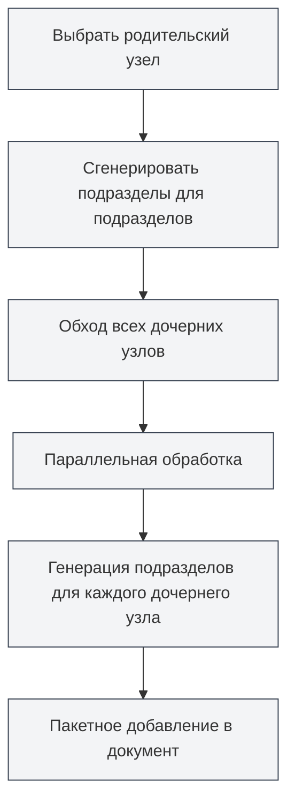

# Функции ИИ для структуры документа

## Обзор

Функции ИИ для структуры документа используют технологии искусственного интеллекта, чтобы помочь вам быстро создавать и оптимизировать структуру документа. С помощью функций ИИ вы можете генерировать подразделы, создавать содержимое разделов, оптимизировать структуру оглавления и многое другое, значительно повышая эффективность создания документов.

<Outline mode="demo" />

Функции ИИ для структуры документа поддерживают несколько режимов работы, включая операции с отдельными узлами и пакетные операции, что позволяет гибко использовать ИИ для помощи в создании документов.

<Outline mode="demo" />

## Генерация подразделов

### Генерация подразделов для узла

Создание подразделов для указанного узла:

<OutlineAiToolbar mode="demo" />

1.  **Выберите узел**: В представлении структуры выберите узел, для которого нужно сгенерировать подразделы.
2.  **Разверните узел**: Нажмите на узел, чтобы развернуть детальную панель.
3.  **Сгенерируйте подразделы**: Нажмите кнопку "Сгенерировать подразделы".
4.  **Введите подсказку**: При желании введите промпт (подсказку), чтобы направить ИИ при генерации.
5.  **Дождитесь генерации**: ИИ сгенерирует подразделы на основе заголовка и содержимого узла.
6.  **Подтвердите принятие**: Просмотрите сгенерированный результат и примите его после подтверждения.

Вы можете получить доступ к представлению структуры через боковую панель:

<ViewMenuItemsDemo mode="demo" :items='["outline"]' />

Сгенерированные подразделы автоматически добавляются в документ и обновляют структуру оглавления.

```mermaid
graph LR
    A[Выбрать узел] --> B[Развернуть панель узла]
    B --> C[Нажать "Сгенерировать подразделы"]
    C --> D[Ввести промпт]
    D --> E[ИИ генерирует подразделы]
    E --> F{Просмотреть результат}
    F -->|Принять| G[Добавить в документ]
    F -->|Отклонить| H[Отменить операцию]
    style A fill:#f3f4f6,stroke:#374151
    style B fill:#f3f4f6,stroke:#374151
    style C fill:#f3f4f6,stroke:#374151
    style D fill:#f3f4f6,stroke:#374151
    style E fill:#f3f4f6,stroke:#374151
    style F fill:#f3f4f6,stroke:#374151
    style G fill:#f3f4f6,stroke:#374151
    style H fill:#f3f4f6,stroke:#374151
```

### Принцип генерации

<OutlineTreeDisplay mode="demo" />

При генерации подразделов ИИ учитывает:

-   **Заголовок узла**: Понимает тему раздела на основе заголовка узла.
-   **Структура документа**: Учитывает общую структуру документа.
-   **Пользовательский промпт**: Корректирует генерируемое содержимое в соответствии с пользовательским промптом.
-   **Требования к формату**: Генерирует правильный формат заголовков в соответствии с форматом документа (Markdown/LaTeX).

### Советы по использованию

1.  **Предоставляйте четкие промпты**: Вводите ясные промпты, чтобы направлять ИИ на создание подразделов, соответствующих требованиям.
2.  **Ориентируйтесь на существующую структуру**: ИИ будет учитывать существующую структуру документа для сохранения единого стиля.
3.  **Генерируйте несколько раз**: Если результат не устраивает, можно сгенерировать несколько раз и выбрать лучший вариант.

## Генерация содержимого разделов

<Outline mode="demo" />

### Генерация содержимого для узла

Создание основного текста для указанного узла:

1.  **Выберите узел**: В представлении структуры выберите узел, для которого нужно сгенерировать содержимое.
2.  **Разверните узел**: Нажмите на узел, чтобы развернуть детальную панель.
3.  **Сгенерируйте содержимое**: Нажмите кнопку "Сгенерировать содержимое".
4.  **Введите подсказку**: При желании введите промпт (подсказку), чтобы направить ИИ при генерации.
5.  **Установите количество слов**: При желании задайте целевое количество слов.
6.  **Дождитесь генерации**: ИИ сгенерирует содержимое на основе заголовка узла и структуры документа.
7.  **Подтвердите принятие**: Просмотрите сгенерированный результат и примите его после подтверждения.

Сгенерированное содержимое автоматически добавляется в соответствующий раздел документа.

### Режимы генерации содержимого

<OutlineAiToolbar mode="demo" />

Генерация содержимого поддерживает следующие режимы:

-   **Полная генерация**: Генерация полного содержимого раздела.
-   **Частичная генерация**: Генерация только части содержимого (в соответствии с настройками).
-   **Добавление содержимого**: Добавление нового содержимого к существующему.

### Контроль количества слов

При генерации содержимого можно задать целевое количество слов:

-   **Установка количества слов**: Введите целевое количество слов в диалоговом окне генерации.
-   **Корректировка ИИ**: ИИ будет регулировать детализацию генерируемого содержимого в соответствии с требованием по количеству слов.
-   **Гибкий контроль**: Можно задавать разное количество слов в зависимости от важности раздела.

<OutlineTreeDisplay mode="demo" />

## Генерация подразделов для подразделов

### Пакетная генерация подразделов

Массовое создание подразделов для всех дочерних узлов указанного узла:

1.  **Выберите узел**: Выберите узел для пакетной операции.
2.  **Разверните узел**: Нажмите на узел, чтобы развернуть детальную панель.
3.  **Сгенерируйте подразделы для подразделов**: Нажмите кнопку "Сгенерировать подразделы для подразделов".
4.  **Введите подсказку**: Введите промпт (подсказку), чтобы направить ИИ при генерации.
5.  **Дождитесь генерации**: ИИ будет обрабатывать все дочерние узлы параллельно, генерируя подразделы для каждого из них.
6.  **Подтвердите принятие**: Просмотрите сгенерированный результат и примите его после подтверждения.

Эта функция использует механизм параллельной обработки, позволяя быстро массово генерировать подразделы для нескольких разделов.



### Преимущества параллельной обработки

<OutlineAiToolbar mode="demo" />

Пакетная генерация использует механизм параллельной обработки:

-   **Эффективная обработка**: Одновременная обработка нескольких узлов увеличивает скорость в десятки раз.
-   **Автоматическая синхронизация**: Автоматическая синхронизация с документом после завершения генерации.
-   **Отображение прогресса**: Отображение прогресса генерации для каждого узла.

### Сценарии использования

Подходит для следующих сценариев:

-   **Массовая генерация**: Когда необходимо сгенерировать подразделы для множества разделов.
-   **Пакетные операции**: Создание подразделов для всех разделов одним нажатием.
-   **Структурированная генерация**: Пакетное создание содержимого в соответствии со структурой оглавления.

## Генерация содержимого подразделов

### Пакетная генерация содержимого

Массовое создание содержимого для всех дочерних узлов указанного узла:

1.  **Выберите узел**: Выберите узел для пакетной операции.
2.  **Разверните узел**: Нажмите на узел, чтобы развернуть детальную панель.
3.  **Сгенерируйте содержимое подразделов**: Нажмите кнопку "Сгенерировать содержимое подразделов".
4.  **Введите подсказку**: Введите промпт (подсказку), чтобы направить ИИ при генерации.
5.  **Установите количество слов**: При желании задайте целевое количество слов.
6.  **Дождитесь генерации**: ИИ будет обрабатывать все дочерние узлы параллельно, генерируя содержимое для каждого из них.
7.  **Подтвердите принятие**: Просмотрите сгенерированный результат и примите его после подтверждения.

Эта функция позволяет быстро сгенерировать содержимое для всех разделов всего документа.

### Рекурсивная генерация

Генерация содержимого подразделов выполняется рекурсивно:

-   **Обход всех дочерних узлов**: Рекурсивный обход всех дочерних узлов.
-   **Генерация содержимого**: Генерация содержимого для каждого дочернего узла.
-   **Сохранение структуры**: Сохранение иерархической структуры документа.

### Отслеживание прогресса

При пакетной генерации отображается прогресс:

-   **Прогресс по узлам**: Отображение текущего обрабатываемого узла.
-   **Общий прогресс**: Отображение общего прогресса генерации.
-   **Обновление в реальном времени**: Реальное время обновления генерируемого содержимого.

<Outline mode="demo" />

## Оптимизация структуры

### Функции оптимизации

Функция оптимизации структуры может помочь вам:

-   **Корректировка структуры**: Оптимизировать структуру и иерархию документа.
-   **Оптимизация заголовков**: Оптимизировать наименование и формат заголовков.
-   **Реорганизация структуры**: Реорганизовать структуру документа.

### Операции оптимизации

Оптимизация структуры поддерживает следующие операции:

-   **Перемещение узла**: Перемещение узла в новое место.
-   **Удаление узла**: Удаление ненужных узлов.
-   **Корректировка уровня**: Изменение иерархического уровня узлов.
-   **Объединение узлов**: Объединение схожих узлов.

### Использование оптимизации

<OutlineTreeDisplay mode="demo" />

1.  **Анализ структуры**: ИИ проанализирует текущую структуру документа.
2.  **Предоставление рекомендаций**: Предоставление рекомендаций по оптимизации.
3.  **Применение оптимизации**: Применение результатов оптимизации после подтверждения.

## Настройка функций ИИ

### Настройка температуры

При генерации ИИ можно установить параметр температуры:

-   **Диапазон температуры**: 0.0 - 1.0
-   **Значение по умолчанию**: Согласно конфигурации.
-   **Назначение**: Контроль креативности генерации ИИ (чем выше температура, тем более креативным будет результат).

### Настройка промптов

Для каждой операции можно задать промпт:

-   **Общий промпт**: Установка общего промпта.
-   **Промпт для операции**: Установка специфического промпта для каждой операции.
-   **Требование к количеству слов**: Включение требования к количеству слов в промпт.

### Распознавание формата

ИИ автоматически распознает формат документа:

-   **Формат Markdown**: Генерация заголовков и содержимого в формате Markdown.
-   **Формат LaTeX**: Генерация заголовков и содержимого в формате LaTeX.
-   **Автоматическая адаптация**: Автоматическая корректировка генерируемого содержимого в соответствии с форматом документа.

## Советы по использованию

### Эффективная генерация

1.  **Используйте пакетные операции**: При необходимости генерации большого объема содержимого используйте пакетные операции для повышения эффективности.
2.  **Предоставляйте четкие промпты**: Вводите ясные промпты для получения лучших результатов генерации.
3.  **Генерируйте поэтапно**: Сначала генерируйте структуру, затем содержимое, постепенно совершенствуя документ.

### Контроль качества

1.  **Проверяйте результаты генерации**: После генерации внимательно проверяйте результат, чтобы убедиться в его соответствии требованиям.
2.  **Генерируйте несколько раз**: Если результат не устраивает, можно сгенерировать несколько раз и выбрать лучший вариант.
3.  **Ручная корректировка**: После генерации можно вручную корректировать и дорабатывать содержимое.

### Планирование структуры

1.  **Сначала планируйте структуру**: Используйте ИИ для генерации подразделов и планирования структуры документа.
2.  **Затем генерируйте содержимое**: После определения структуры генерируйте конкретное содержимое.
3.  **Постепенное совершенствование**: Постепенно совершенствуйте документ, не пытайтесь сгенерировать все содержимое за один раз.

## Часто задаваемые вопросы

### В: Содержимое, сгенерированное ИИ, неточно?

О: Содержимое, сгенерированное ИИ, носит справочный характер. Рекомендуется проверять и корректировать его после генерации. Можно предоставить более подробный промпт для получения лучшего результата.

### В: Пакетная генерация выполняется медленно?

О: Пакетная генерация использует параллельную обработку и уже является быстрой. Если она все еще медленная, это может быть связано с проблемами сети или медленным откликом службы ИИ.

### В: Как отменить генерацию?

О: Во время процесса генерации можно нажать кнопку "Отменить" для отмены операции. Уже сгенерированное содержимое не будет потеряно.

### В: Сгенерированное содержимое имеет неправильный формат?

О: ИИ автоматически распознает формат документа. Если формат неправильный, проверьте настройки формата документа или вручную откорректируйте сгенерированное содержимое.

### В: Можно ли изменять сгенерированное содержимое?

О: Да, можно. Сгенерированное содержимое можно редактировать и изменять в любое время. Генерация — это лишь вспомогательный инструмент для творчества, окончательное содержимое определяете вы.

## Связанная документация

-   [[outline.basics|Функции представления структуры]]
-   [[ai.llm-config|Конфигурация LLM]]
-   [[markdown.editor|Руководство по использованию редактора Markdown]]
-   [[latex.editor|Руководство по использованию редактора LaTeX]]

<Outline mode="demo" />

<OutlineAiToolbar mode="demo" />

<ViewMenuItemsDemo mode="demo" :items='["ai"]' />
