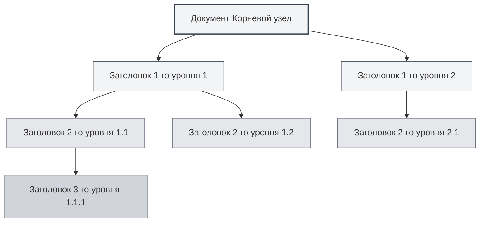
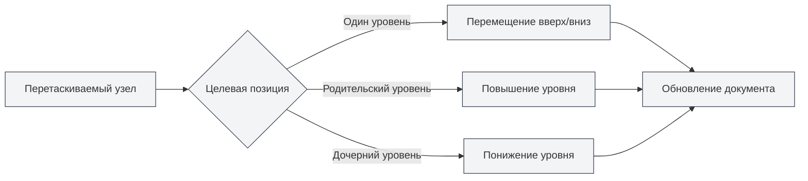

# Функция представления структуры документа

## Обзор

Представление структуры документа отображает иерархию заголовков документа в виде древовидной структуры, помогая быстро просматривать и редактировать структуру документа. С помощью представления структуры вы можете быстро перейти к любому месту в документе, редактировать структуру документа и использовать функции ИИ для генерации контента.

Представление структуры документа в MetaDoc поддерживает такие функции, как автоматическое извлечение, ручное редактирование, сортировка перетаскиванием, генерация с помощью ИИ, что позволяет эффективно организовывать и управлять структурой документа.

## Введение в представление структуры

### Расположение представления

Представление структуры обычно отображается на боковой панели слева или справа от редактора:

- **Боковая панель**: представление структуры отображается как часть боковой панели
- **Независимая панель**: представление структуры можно отображать или скрывать независимо
- **Изменение ширины**: можно регулировать ширину представления структуры

Вы можете получить доступ к представлению структуры через боковую панель, которая предоставляет переключение между представлениями редактора, структуры и другими:

<ViewMenuItemsDemo mode="demo" :items='["editor", "outline"]' />

### Предварительный просмотр интерфейса

Представление структуры отображает иерархию заголовков документа в виде древовидной структуры, поддерживает сортировку перетаскиванием и редактирование узлов:

<Outline mode="demo" />

<ViewMenuItemsDemo mode="demo" :items='["outline"]" />

### Структура оглавления

Представление структуры отображает иерархию заголовков документа в виде древовидной структуры:

- **Корневой узел**: корневой узел документа (обычно не отображается)
- **Заголовок первого уровня**: заголовок первого уровня документа (H1)
- **Заголовок второго уровня**: заголовок второго уровня документа (H2)
- **Многоуровневая вложенность**: поддерживает отображение многоуровневых вложенных заголовков

### Автоматическое извлечение

Представление структуры автоматически извлекает структуру заголовков из документа:

- **Документы Markdown**: извлекает из заголовков Markdown (`#`, `##` и т.д.)
- **Документы LaTeX**: извлекает из команд разделов LaTeX (`\section`, `\subsection` и т.д.)
- **Обновление в реальном времени**: автоматически обновляет структуру оглавления при редактировании документа

## Операции с узлами структуры

### Добавление дочернего узла

Добавление нового дочернего узла в структуру:

1. **Выберите узел**: нажмите на узел, к которому хотите добавить дочерний узел
2. **Кнопка добавления**: нажмите кнопку "Добавить дочерний узел" рядом с узлом (значок +)
3. **Введите заголовок**: введите заголовок нового узла
4. **Подтвердите создание**: после подтверждения создается новый узел

Новый узел будет добавлен в соответствующее место документа, и содержимое документа автоматически обновится.

<Outline mode="demo" />

### Редактирование узла

Редактирование заголовка узла структуры:

1. **Выберите узел**: нажмите на узел, который хотите отредактировать
2. **Кнопка редактирования**: нажмите кнопку "Редактировать" рядом с узлом
3. **Измените заголовок**: измените заголовок узла
4. **Подтвердите сохранение**: после подтверждения изменения сохраняются

Редактирование заголовка узла автоматически обновляет соответствующий заголовок в документе.

<TitleMenu mode="demo" title="Пример заголовка" path="1" :tree='{}' />

<ViewMenuItemsDemo mode="demo" :items='["outline"]' />

### Удаление узла

Удаление узла структуры:

1. **Выберите узел**: нажмите на узел, который хотите удалить
2. **Кнопка удаления**: нажмите кнопку "Удалить" рядом с узлом
3. **Подтвердите удаление**: после подтверждения узел удаляется

Удаление узла также удаляет соответствующий заголовок и содержимое в документе (если настроено).

<SectionOptimizer mode="demo" title="Пример оптимизации узла структуры" path="1" :tree='{}' language="markdown" :adapter='null' />

<OutlineTreeDisplay mode="demo" />

### Перемещение узла

Изменение положения узла структуры:

- **Перемещение вверх/вниз**: используйте кнопки "Вверх" и "Вниз" для изменения порядка узлов
- **Перемещение влево/вправо**: используйте кнопки "Влево" и "Вправо" для изменения уровня узла
- **Перемещение перетаскиванием**: перетащите узел непосредственно в целевую позицию

Перемещение узла автоматически обновляет структуру документа.

<OutlineTreeDisplay mode="demo" />

## Перетаскивание узлов структуры

### Операция перетаскивания

Представление структуры поддерживает операцию перетаскивания для реорганизации структуры документа:

1. **Удерживайте кнопку мыши**: удерживайте левую кнопку мыши на узле
2. **Перетащите узел**: перетащите узел в целевую позицию
3. **Отпустите кнопку мыши**: отпустите кнопку мыши для завершения перемещения

При перетаскивании будет визуальная обратная связь, показывающая целевую позицию узла.

### Режимы перетаскивания

Перетаскивание поддерживает следующие режимы:

- **Перемещение вверх/вниз**: перемещение узла вверх или вниз на одном уровне
- **Перемещение влево/вправо**: изменение уровня узла (повышение или понижение)
- **Перемещение между уровнями**: перемещение узла на другой уровень

### Ограничения перетаскивания

Операция перетаскивания имеет следующие ограничения:

- **Корневой узел**: корневой узел нельзя перетаскивать
- **Самовключение**: нельзя перетащить узел в свой собственный дочерний узел (во избежание циклов)
- **Ограничения по уровням**: некоторые операции могут быть ограничены по уровням

<Outline mode="demo" />

## Развертывание/свертывание структуры

### Развертывание узла

Разверните узел, чтобы увидеть дочерние узлы:

- **Нажмите на узел**: нажмите на заголовок узла, чтобы развернуть или свернуть
- **Значок развертывания**: нажмите значок развертывания перед узлом
- **Развернуть все**: используйте функцию "Развернуть все", чтобы развернуть все узлы

### Свертывание узла

Сверните узел, чтобы скрыть дочерние узлы:

- **Нажмите на узел**: снова нажмите на уже развернутый узел, чтобы свернуть
- **Значок свертывания**: нажмите значок свертывания перед узлом
- **Свернуть все**: используйте функцию "Свернуть все", чтобы свернуть все узлы

### Состояние развертывания

Состояние развертывания структуры сохраняется:

- **Автоматическое сохранение**: состояние развертывания сохраняется автоматически
- **Восстановление состояния**: состояние развертывания восстанавливается при следующем открытии документа
- **Независимое состояние**: состояние развертывания сохраняется отдельно для каждого документа

## Регулировка ширины структуры

### Изменение ширины

Ширину представления структуры можно регулировать:

1. **Перетащите границу**: переместите курсор к границе представления структуры
2. **Удерживайте и перетаскивайте**: удерживайте левую кнопку мыши и перетаскивайте для регулировки ширины
3. **Отпустите кнопку мыши**: отпустите кнопку мыши для завершения регулировки

### Ограничения ширины

Ширина структуры имеет следующие ограничения:

- **Минимальная ширина**: не может быть меньше минимальной ширины (обычно 150px)
- **Максимальная ширина**: не может превышать максимальную ширину (обычно 50% ширины экрана)
- **Автоматическая адаптация**: ширина автоматически регулируется в зависимости от содержимого

<ResizableDivider mode="demo" />

## Быстрый переход

### Переход по клику

Нажатие на узел структуры позволяет быстро перейти к соответствующему месту в документе:

- **Нажмите на узел**: нажмите на заголовок узла для перехода к соответствующему месту
- **Подсветка**: соответствующий заголовок будет подсвечен после перехода
- **Прокрутка к позиции**: редактор автоматически прокрутится к соответствующему месту

### Синхронная прокрутка

Представление структуры поддерживает синхронную прокрутку с редактором:

- **Синхронизация при редактировании**: при редактировании документа структура автоматически подсвечивает текущую позицию редактирования
- **Синхронизация при прокрутке**: при прокрутке редактора структура автоматически подсвечивает видимые заголовки
- **Двусторонняя синхронизация**: двусторонняя синхронизация между структурой и редактором

## Отображение информации об узле

### Заголовок узла

Узел структуры отображает следующую информацию:

- **Текст заголовка**: отображает текстовое содержимое заголовка
- **Уровень заголовка**: отображает уровень заголовка через отступы
- **Состояние узла**: отображает состояние узла (развернут/свернут)

### Операции с узлом

Каждый узел предоставляет следующие кнопки операций:

- **Добавить дочерний узел**: добавить дочерний узел к текущему узлу
- **Редактировать**: редактировать заголовок узла
- **Удалить**: удалить узел
- **Переместить**: переместить узел вверх, вниз, влево, вправо

Кнопки операций отображаются при наведении курсора или выборе узла.

<OutlineTreeDisplay mode="demo" />

<ViewMenuItemsDemo mode="demo" :items='["editor", "outline"]' />

## Советы по использованию

### Организация структуры документа

1. **Используйте структуру для планирования**: сначала спланируйте структуру документа в представлении структуры, затем заполните содержимое
2. **Регулируйте уровни**: используйте перетаскивание для быстрой регулировки уровней заголовков
3. **Массовые операции**: используйте представление структуры для массового управления несколькими заголовками

### Быстрая навигация

1. **Используйте переход**: нажимайте на узлы структуры для быстрого перехода к местам в документе
2. **Используйте поиск**: ищите заголовки в структуре для быстрого позиционирования
3. **Используйте свертывание**: сворачивайте ненужные части, чтобы сосредоточиться на текущем содержимом

### Эффективность редактирования

1. **Сортировка перетаскиванием**: используйте перетаскивание для быстрой корректировки структуры документа
2. **Массовое редактирование**: массово редактируйте несколько заголовков в структуре
3. **Предварительный просмотр структуры**: используйте структуру для предварительного просмотра всей структуры документа

<OutlineTreeDisplay mode="demo" />

## Часто задаваемые вопросы

### В: Структура не обновляется?

О: Структура обновляется автоматически. Если она не обновилась, попробуйте переключить представление или обновить документ. Убедитесь, что в документе используется правильный формат заголовков.

### В: Как быстро добавить несколько заголовков?

О: Используйте функцию "Добавить дочерний узел" для быстрого добавления заголовков или вводите заголовки непосредственно в редакторе, структура обновится автоматически.

### В: Не удается перетащить узел?

О: Проверьте, не перетаскиваете ли вы узел в свой собственный дочерний узел (это приведет к циклу). Убедитесь, что целевая позиция допустима.

### В: Структура отображается некорректно?

О: Проверьте правильность формата заголовков в документе. В Markdown используется `#`, в LaTeX — команды типа `\section` и т.д.

### В: Как сбросить структуру?

О: Структура автоматически извлекается из документа. Если необходимо сбросить, можно заново открыть документ или вручную отредактировать структуру документа.

## Связанная документация

- [[outline.ai-features|Функции ИИ для структуры]]
- [[markdown.editor|Руководство по использованию редактора Markdown]]
- [[latex.editor|Руководство по использованию редактора LaTeX]]
- [[core.editor-basics|Основные операции редактора]]
