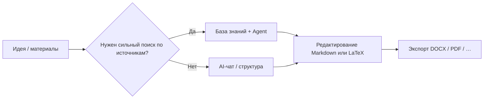

# 🚀 MetaDoc — лучшие практики

MetaDoc — это не программа с **одним жёстким сценарием**.

Это скорее **набор инструментов**: текст, диаграммы, перевод — одну и ту же задачу можно решить **разными путями**.

👉 Это значит:

* У одной задачи часто есть **несколько маршрутов**
* У каждого маршрута свой баланс **скорости, стоимости и контроля**
* Важнее выбрать подходящий путь, чем знать каждый пункт меню

Этот раздел не перечисляет функции. Он отвечает на практический вопрос:

> 👉 **В моей ситуации с чего лучше начать?**

---

## 🧭 Как читать обозначения

| Обозначение | Смысл                                      |
| ----------- | ------------------------------------------ |
| ⭐⭐⭐⭐⭐ | Разумный выбор по умолчанию в большинстве случаев |
| ⭐⭐⭐⭐   | Надёжно; иногда нужен лишний шаг           |
| ⭐⭐⭐     | Особенно уместно в конкретных сценариях    |
| ⚠️       | Риски по качеству, соответствию требованиям |
| 💰         | Выше расход токенов / стоимость API        |

---

Вкладки главного окна (пример):

<MainTabs mode="demo" />

---

# 📝 1. Текст: от идеи к готовому материалу

Обычно выделяют три основных пути. Достаточно того, что совпадает с вашей целью.

---

## ⭐⭐⭐⭐⭐ Путь 1 (рекомендуемый по умолчанию)

### Черновик в AI-чате → правки в Markdown → экспорт

**Цепочка**:
[[ai.chat|AI-чат]] → редактирование Markdown → [[core.export|Экспорт]]

**Подходит, если вы:**

* хотите быстро начать
* ожидаете несколько циклов правок
* итог — Word, PDF или LaTeX

---

**Почему это часто первый выбор**

* Markdown снижает **шум вокруг вёрстки** — в центре смысл
* Сначала структура и текст, оформление потом
* После экспорта можно доработать макет в Word или LaTeX

👉 Коротко: **сначала содержание, потом форма**

---

**На что обратить внимание**

* Проверяйте факты, цитаты и цифры из ответов ИИ
* После экспорта имеет смысл быстро просмотреть вёрстку

---

AI-чат (пример интерфейса):

<AIChat mode="demo" />

---

## ⭐⭐⭐⭐ Путь 2

### Текст с опорой на базу знаний (особенно предметный / с источниками)

**Цепочка**:
[[knowledge-base.usage|База знаний]] → [[agent.introduction|Agent]] → сведение в редакторе

---

**Подходит, если вы:**

* пишете **с опорой на источники** (статьи, обзоры, отчёты)
* уже есть PDF, документы или заметки

---

**Плюсы**

* Генерация может опираться на загруженные файлы
* Проще удерживать текст **в связке с контролируемыми источниками**

---

**Ограничения**

* ⚠️ Качество зависит от файлов и разбиения на фрагменты
* 💰 Длинные диалоги обычно тратят больше токенов

---

👉 В двух словах:

> Если нужно писать **на основе источников**, начните отсюда.

---

База знаний (пример интерфейса):

<KnowledgeBase mode="demo" />

---

## ⭐⭐⭐ Путь 3

### Agent собирает целый проект LaTeX

**Цепочка**:
Agent → проект LaTeX → сборка PDF

---

**Подходит, если вы:**

* нужна типичная «статья» структура
* уже решили использовать LaTeX
* мало времени

---

### ⚠️ Перед тем как полагаться на это

* 💰 Обычно **дороже в токенах**, чем короткий чат или точечные действия в меню
* Пакеты, пути, кодировка могут потребовать ручной доработки
* Конфиденциальный или жёстко регламентированный контент — не стоит полностью отдавать автоматике

---

Agent (пример интерфейса):

<AgentView mode="demo" />

---

**Шаблон запроса (подставьте тему)**

```text
Вы технический редактор LaTeX. Для темы «(название работы здесь)» сгенерируйте компилируемый проект LaTeX в текущей рабочей области.

Требования:
1) Класс article или указанный вами; главный файл main.tex; главы в отдельных .tex с \input.
2) Понятная структура: figures/, sections/, bib/; примеры рисунков и библиографических записей.
3) Стандартные пакеты для формул (amsmath), графики (graphicx), библиографии (biblatex или natbib); перечислите дополнительные пакеты.
4) Рекомендации по сборке (latexmk -pdf; для Unicode/CJK — XeLaTeX или LuaLaTeX).
5) Не сокращайте содержимое файлов; пути согласованы. При нехватке данных сначала перечислите допущения, затем генерируйте.
```

---

# 📊 2. Диаграммы и визуализация

Полезнее спросить не «где кнопка?», а:

> 👉 **Нужна скорость или тонкая настройка?**

---


| Вариант | Действие | Оценка | Когда |
| ------- | -------- | ------ | ----- |
| A | AI-чат или Agent выдаёт код Mermaid / PlantUML / ECharts — вставить в Markdown | ⭐⭐⭐⭐ | Быстрые итерации рядом с текстом |
| B | Окно диаграмм ([[charts.introduction|Диаграммы]]) | ⭐⭐⭐⭐ | Удобнее графический интерфейс |
| C | Выделить текст → контекстное меню → вставить диаграмму | ⭐⭐⭐⭐⭐ | Максимально близко к текущему абзацу |

См. также: [[ai.chat|AI-чат]], [[agent.introduction|Agent]].

---

**Краткие советы**

* Повседневный текст → чаще всего быстрее контекстное меню
* Сложные схемы → окно диаграмм
* Перебор вариантов → код от ИИ

---

Окно диаграмм (пример):

<GraphWindow mode="demo" />

---

# 🌐 3. Перевод

Одной фразой:

> 👉 **Чем короче фрагмент, тем проще инструмент**

---


| Вариант | Оценка | Для чего |
| ------- | ------ | -------- |
| Перевод из контекстного меню | ⭐⭐⭐⭐⭐ | Предложения / короткие абзацы |
| AI-чат | ⭐⭐⭐⭐   | Несколько блоков |
| Agent | ⭐⭐⭐⭐   | Длинные документы |

---

👉 Практическое правило:

* Коротко → контекстное меню
* Длинно → AI-чат или Agent

---

Перетаскиваемый разделитель (пример):

<ResizableDivider mode="demo" />

---

# ✨ 4. Полировка абзацев

Отправлять весь текст целиком часто медленнее и дороже.

Лучше:

---


| Вариант | Оценка | Почему |
| ------- | ------ | ------ |
| Оптимизация через правый клик в абзаце | ⭐⭐⭐⭐⭐ | Малый контекст, ниже стоимость |
| Проходы по дереву структуры | ⭐⭐⭐⭐   | Навести порядок в структуре |
| AI-чат / Agent | ⭐⭐⭐⭐   | Крупные переписывания |

---

👉 Главная мысль:

> **Делить текст на небольшие части**

---

Вид структуры (пример):

<Outline mode="demo" />

---

# 🎯 5. Выбор по сценарию

Если сомневаетесь, читайте только этот раздел.

---

## 🎒 Конспекты лекций

**Идеи**

* ⭐⭐⭐⭐⭐ Быстрый Markdown на паре → развернуть с ИИ после
* ⭐⭐⭐⭐ PDF слайдов в базе → шпаргалки для повторения

👉 Сначала зафиксировать, потом упорядочить

---

## 🧪 Лабораторные отчёты

**Идеи**

* ⭐⭐⭐⭐⭐ Markdown → экспорт DOCX для черновиков
* ⭐⭐⭐⭐ База знаний для разделов анализа

⚠️ Измеренные данные проверяйте сами

---

## 🛠️ Техническая документация

**Идеи**

* ⭐⭐⭐⭐⭐ Markdown + локальная правка через контекстное меню
* ⭐⭐⭐⭐ Agent + база при сверке со старыми документами

👉 Ясность и единообразие важнее «украшений»

---

## 💬 Вопросы и ответы / блог

**Идеи**

* ⭐⭐⭐⭐⭐ Сначала план → потом основной текст
* ⭐⭐⭐⭐ Дерево структуры для длинных материалов

👉 Структура важнее объёма

---

## 📱 Рассылки / авторский контент

**Идеи**

* ⭐⭐⭐⭐⭐ Завершить в Markdown → экспорт → вёрстка в платформе
* ⭐⭐⭐⭐ ИИ для вариантов заголовка и лид-абзаца

⚠️ «Напиши всё сразу» — дорого и сложно удержать стиль

---

# 🔁 Общая схема процесса



---

# 📚 Дополнительно

* [[quick-start.guide|Быстрый старт]]
* [[core.export|Экспорт]]
* [[features.paragraph-optimization|Оптимизация абзацев]]
* [[charts.introduction|Введение в диаграммы]]
