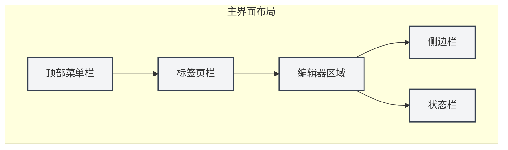
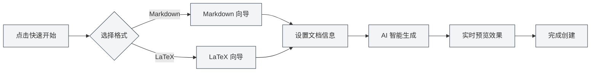

# Руководство по быстрому началу работы

## Обзор

Добро пожаловать в MetaDoc! Это интеллектуальный инструмент для обработки документов, созданный для работников умственного труда. Независимо от того, пишете ли вы технический блог, систематизируете учебные заметки или готовите научную статью, MetaDoc предоставит вам профессиональный и элегантный опыт редактирования.

MetaDoc глубоко интегрирует возможности искусственного интеллекта и поддерживает два основных формата документов: Markdown и LaTeX. Это не просто текстовый редактор, а ваш интеллектуальный помощник в написании — встроенные функции, такие как диалог с ИИ, автодополнение, интеллектуальная проверка правописания, делают создание документов более эффективным и приятным.

## Первое использование

### Запуск приложения

После запуска MetaDoc первое, что вы увидите, — это домашняя страница. Это тщательно продуманная отправная точка, позволяющая быстро приступить к работе:

- **Быстрый старт**: Интеллектуальный мастер проведет вас через выбор формата документа и создание нового документа.
- **Новый документ**: Создайте пустой документ напрямую, выбрав нужный вам формат.
- **Открыть файл**: Найдите и откройте существующий документ.
- **Руководство пользователя**: В любой момент обращайтесь к подробному руководству по использованию.

### Знакомство с интерфейсом

Дизайн интерфейса MetaDoc следует современным принципам компоновки редакторов, он ясный и интуитивно понятный:

1. **Верхняя строка меню**

   Расположена в самой верхней части окна, содержит основные функции, такие как файл, правка, вид и другие. Независимо от того, нужно ли вам создать новый документ, найти и заменить текст или переключить режим просмотра, вы найдете здесь нужный пункт. Строка меню поддерживает настройку, вы можете изменять отображение и порядок пунктов меню в соответствии с вашими привычками.

2. **Панель вкладок**

   Расположена под строкой меню, отображает все открытые в данный момент документы. Каждому документу соответствует вкладка, переключение между ними осуществляется щелчком мыши. Вкладки поддерживают перетаскивание для изменения порядка, также можно закреплять часто используемые документы, чтобы избежать случайного закрытия. При большом количестве вкладок документы можно организовывать между окнами.

3. **Область редактора**

   Это ваша основная рабочая область. MetaDoc предоставляет специализированную среду редактирования для различных типов документов:

   - **Редактор Markdown**: Опыт редактирования по принципу WYSIWYG (What You See Is What You Get), поддерживает предварительный просмотр в реальном времени, математические формулы, диаграммы и другие богатые возможности.
   - **Редактор LaTeX**: Профессиональная среда для академического письма, поддерживает подсветку синтаксиса, интеллектуальные подсказки, компиляцию и предварительный просмотр.

4. **Боковая панель**

   Расположена слева от редактора, является центром навигации по вашему документу. Здесь вы можете:

   - Переключаться между различными представлениями: редактор, структура, Agent и другие.
   - Просматривать структуру документа.
   - Управлять базой знаний и ссылочными материалами.

5. **Строка состояния**

   Расположена в нижней части окна, отображает в реальном времени информацию о состоянии текущего документа, включая статистику слов, статус сохранения, языковые настройки и т.д., что позволяет вам легко отслеживать прогресс работы.

Ниже представлены соответствующие элементы управления реального интерфейса для удобства сопоставления с инструкциями:

**Верхняя строка меню**

Расположена в самой верхней части окна, содержит главные меню, такие как файл, правка, вид, и предоставляет доступ к операциям уровня приложения. Через строку меню вы можете выполнять создание, открытие, сохранение документов, а также получать доступ к различным функциям редактирования и просмотра.

<MenuItemsDemo mode="demo" :items='[{"id": "file", "items": ["new", "open", "save"]}, {"id": "edit", "items": ["undo", "redo", "find"]}, {"id": "view", "items": ["editor", "outline"]}]' />

**Панель вкладок**

Расположена под строкой меню, отображает все открытые в данный момент вкладки документов. Вы можете переключаться между документами, щелкая по вкладкам, перетаскивать вкладки для изменения порядка или щелкать правой кнопкой мыши по вкладке для дополнительных действий (например, закрыть, закрепить, переместить в новое окно и т.д.).

<MainTabs mode="demo" />

**Боковая панель**

Расположена слева от редактора, предоставляет доступ к различным панелям вспомогательных функций. Через боковую панель вы можете быстро переключаться между представлениями редактора, структуры, Agent и другими, повышая эффективность редактирования документов.

<ViewMenuItemsDemo mode="demo" :items='["editor", "outline", "home"]' />

## Быстрое создание документа

### Способ 1: Использование мастера быстрого старта

Мастер быстрого старта MetaDoc — это продуманная функция. Он не просто создает пустой документ, а, подобно опытному помощнику, проводит вас через каждый шаг создания документа:

1. На домашней странице нажмите кнопку "Быстрый старт".
2. В соответствии с вашими потребностями выберите формат документа:
   - **Markdown**: Если вы пишете блог, техническую документацию, протоколы встреч или любой повседневный текстовый контент, это самый легкий выбор. Синтаксис Markdown прост и интуитивно понятен, при этом он удовлетворяет разнообразным потребностям в форматировании.
   - **LaTeX**: Если вы готовите научную статью, диссертацию или технический документ, требующий точного форматирования, LaTeX является общепризнанным стандартом в академических кругах. MetaDoc делает сложную компиляцию LaTeX простой и понятной.
3. В зависимости от вашего выбора мастер предоставит соответствующие шаблоны и функции помощи ИИ.

#### Интерфейс выбора формата

Первый шаг мастера — выбор формата документа. MetaDoc интеллектуально рекомендует подходящие варианты в зависимости от вашего сценария использования:

<QuickStartPanel mode="demo" />

#### Быстрый старт с Markdown

После выбора Markdown мастер предоставит:

- **Интеллектуальные предложения заголовков**: ИИ предложит подходящие заголовки документа на основе вашего первоначального ввода.
- **Структурированный план**: Автоматически сгенерирует каркас документа, помогая организовать мысли.
- **Предварительный просмотр в реальном времени**: Пишите и сразу видите, мгновенно понимая, как будет выглядеть конечный документ.

<QuickStartMarkdown mode="demo" />

#### Быстрый старт с LaTeX

После выбора LaTeX мастер предоставит:

- **Профессиональные шаблоны**: Оптимизированные шаблоны для различных академических сценариев (статьи, отчеты, презентации и т.д.).
- **Структурное руководство**: Автоматически генерирует стандартную структуру документа LaTeX.
- **Интеллектуальное дополнение**: ИИ помогает генерировать код LaTeX, снижая порог вхождения.

<QuickStartLatex mode="demo" />

#### Ключевая ценность мастера

Суть мастера быстрого старта заключается в **снижении порога вхождения и повышении эффективности**:

- **Дружелюбен к новичкам**: Не нужно запоминать сложный синтаксис, мастер проведет вас шаг за шагом.
- **Эффективен для экспертов**: Функции помощи ИИ могут быстро генерировать каркас документа, экономя время на рутинной работе.
- **Контекстно-зависимый**: Если у вас уже есть некоторые идеи, вы можете сразу сообщить их ИИ, и он поможет расширить их до полной структуры документа.

#### Рабочий процесс мастера

### Способ 2: Прямое создание нового документа

Если вы уже знакомы с MetaDoc, вы можете сразу начать работу, создав пустой документ:

1. Нажмите кнопку "Новый документ" на домашней странице или используйте сочетание клавиш `Ctrl+N`.
2. Выберите формат документа (Markdown / LaTeX / Простой текст).
3. Документ немедленно откроется в редакторе, и вы можете начать создавать контент.

Этот способ подходит опытным пользователям или для сценариев, когда есть четкий план написания.

### Способ 3: Открытие существующего файла

Продолжить вашу предыдущую работу также просто:

1. Нажмите кнопку "Открыть файл" на домашней странице или используйте `Ctrl+O`.
2. Найдите ваш документ в проводнике файлов.
3. Выбранный файл откроется на новой вкладке, и вы сможете продолжить редактирование без перерывов.

MetaDoc поддерживает автоматическое запоминание недавно открытых документов, что позволяет вам быстро вернуться к работе.

## Основные операции

### Редактирование документа

Опыт редактирования в MetaDoc тщательно продуман, чтобы ваше внимание было сосредоточено на самом содержании:

- **Плавный ввод**: Независимо от того, быстро ли вы записываете идеи или тщательно шлифуете текст, редактор успевает за вашим ходом мыслей.
- **Интеллектуальное форматирование**: Редактор Markdown поддерживает WYSIWYG, редактор LaTeX предоставляет подсветку синтаксиса и интеллектуальные подсказки.
- **Богатые элементы**: Легко вставляйте изображения, таблицы, блоки кода, математические формулы и другие элементы, делая документ более живым и профессиональным.
- **Предварительный просмотр в реальном времени**: Документы Markdown можно писать и сразу просматривать, мгновенно понимая конечный результат.

### Сохранение документа

MetaDoc предоставляет несколько способов сохранения, гарантируя, что ваша работа не будет потеряна:

- **Мгновенное сохранение**: `Ctrl+S` для быстрого сохранения текущего документа — это наиболее часто используемая операция.
- **Сохранить как новый документ**: `Ctrl+Shift+S` используется, когда вам нужно сохранить текущий документ как копию.
- **Массовое сохранение**: `Ctrl+K S` для одновременного сохранения всех открытых документов, подходит для завершения работы по систематизации.

Кроме того, вы можете включить функцию автосохранения в настройках, чтобы MetaDoc периодически автоматически сохранял ваши документы.

### Переключение представлений

MetaDoc предоставляет несколько режимов просмотра, удовлетворяющих потребности разных этапов работы:

- **Представление редактора**: Основная рабочая область для редактирования документов, предоставляет полный набор функций редактирования.
- **Представление структуры**: Отображает иерархию заголовков документа в виде древовидной структуры, подходит для быстрой навигации и корректировки структуры.
- **Предварительный просмотр PDF**: Просмотр скомпилированного документа LaTeX, удобен для проверки конечного результата верстки.

С помощью боковой панели или сочетаний клавиш вы можете быстро переключаться между различными представлениями.

## Получение помощи

MetaDoc имеет встроенное подробное руководство пользователя, готовое ответить на ваши вопросы в любое время:

1. Нажмите клавишу `F1` или кнопку "Руководство пользователя" на домашней странице.
2. Руководство классифицировано по темам, от основных операций до продвинутых функций.
3. Используйте функцию поиска, чтобы быстро найти нужный вам контент.

Руководство охватывает следующие темы:

- Подробное руководство по использованию редактора.
- Советы по управлению файлами и проектами.
- Углубленные руководства по функциям ИИ.
- Принципы работы фреймворка Agent.
- Опции персонализации настроек.

## Изучение дополнительных возможностей

Завершение быстрого старта — это только первый шаг. MetaDoc имеет множество мощных функций, которые ждут вашего изучения:

1. **Освойте приемы редактирования**: Узнайте о [[core.editor-basics|основных операциях редактора]], чтобы повысить эффективность письма.
2. **Станьте экспертом в управлении файлами**: Изучите лучшие практики [[core.file-operations|работы с файлами]].
3. **Погрузитесь в возможности редактора**:
   - Пользователи Markdown: ознакомьтесь с [[markdown.editor|руководством по использованию редактора Markdown]].
   - Пользователи LaTeX: ознакомьтесь с [[latex.editor|руководством по использованию редактора LaTeX]].
4. **Оцените возможности ИИ**: Попробуйте функции [[ai.chat|диалога с ИИ]] и [[ai.completion|автодополнения от ИИ]].

Философия дизайна MetaDoc заключается в том, чтобы **сделать технологию невидимой, а творчество — свободным**. Надеемся, что этот инструмент станет вашим надежным помощником в интеллектуальной работе.

## Связанная документация

- [[core.file-operations|Работа с файлами]]
- [[core.editor-basics|Основные операции редактора]]
- [[markdown.editor|Руководство по использованию редактора Markdown]]
- [[latex.editor|Руководство по использованию редактора LaTeX]]
- [[settings.basic|Базовые настройки]]