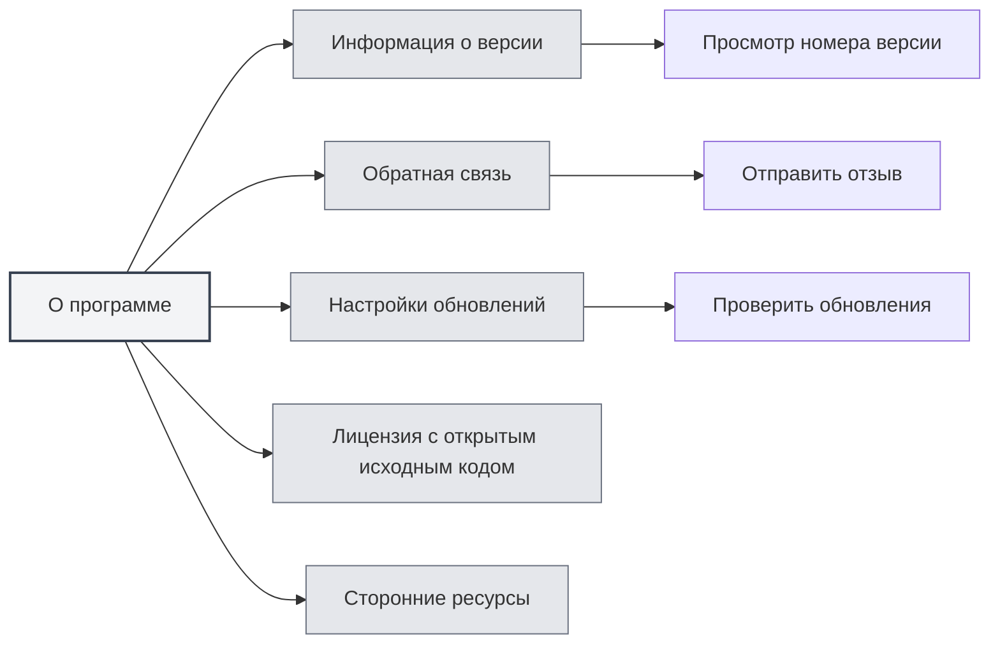
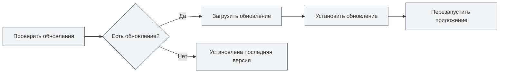

# О программе

## Обзор

Страница "О программе" предоставляет информацию о версии MetaDoc, настройках обновлений, лицензии с открытым исходным кодом и сведения о сторонних ресурсах. На этой странице вы можете узнать информацию о приложении, проверить наличие обновлений, отправить отзыв и т.д.

## Информация о версии

### Просмотр версии

На странице "О программе" вы можете просмотреть следующую информацию:

- **Название приложения**: MetaDoc
- **Номер версии**: номер установленной в данный момент версии
- **Дата выпуска**: дата выпуска текущей версии
- **Среда сборки**: версия для разработки или релизная версия

Вы можете получить доступ к странице "О программе" через верхнюю строку меню:

<MenuItemsDemo mode="demo" :items='[{"id": "settings", "items": ["about"]}]' />



### Формат версии

Номер версии использует семантическое версионирование:

```
Основной_номер.Дополнительный_номер.Номер_исправления
```

Например: `0.12.1`

### Среда сборки

- **Версия для разработки**: версия, собранная в среде разработки, может содержать отладочную информацию
- **Релизная версия**: официально выпущенная версия, прошедшая тестирование и оптимизацию

<SettingAboutSection mode="demo" />

## Обратная связь

### Отправка отзыва

Вы можете отправить отзыв следующими способами:

1. На странице "О программе" нажмите кнопку "Обратная связь"
2. На странице отзыва заполните содержание отзыва
3. Отправьте отзыв

### Содержание отзыва

При отправке отзыва можно включить следующую информацию:

- **Описание проблемы**: подробно опишите возникшую проблему
- **Шаги воспроизведения**: объясните, как воспроизвести проблему
- **Ожидаемое поведение**: объясните ожидаемое поведение
- **Фактическое поведение**: объясните фактически произошедшее поведение
- **Информация о среде**: операционная система, номер версии и т.д.

### Рекомендации по отзывам

- **Подробное описание**: максимально подробно опишите проблему
- **Предоставьте скриншот**: при необходимости предоставьте скриншот или запись экрана
- **Информация о версии**: укажите номер версии и информацию о среде сборки
- **Шаги воспроизведения**: предоставьте четкие шаги для воспроизведения

<UserFeedbackView mode="demo" />

## Официальная группа QQ

### Вступление в группу QQ

Официальная группа QQ MetaDoc: **1079841705**

Вступление в группу QQ позволяет:

- Получать последние новости и уведомления об обновлениях
- Общаться с другими пользователями об опыте использования
- Получать техническую поддержку
- Участвовать в обсуждении функций

### Ресурсы в группе

Группа QQ предоставляет следующие ресурсы:

- **Учебные пособия**: учебные пособия по использованию в файлах группы
- **Ответы на вопросы**: взаимопомощь участников группы
- **Уведомления об обновлениях**: получение информации об обновлениях в первую очередь
- **Предложения по функциям**: участие в обсуждении и предложении функций

## Настройки обновлений

### Автоматическая проверка обновлений

При включении "Автоматической проверки обновлений" MetaDoc будет автоматически проверять наличие новых версий при запуске:

- **Включено**: автоматическая проверка обновлений при запуске
- **Выключено**: отсутствие автоматической проверки обновлений

### Канал обновлений

Можно выбрать канал обновлений:

- **Релизная версия**: использование официально выпущенных версий (рекомендуется)
- **Версия для разработки**: использование версий для разработки (может быть нестабильной)

<MainTabs mode="demo" />

### Ручная проверка обновлений

Вы можете вручную проверить наличие обновлений в любое время:

1. На вкладке "Настройки обновлений" на странице "О программе"
2. Нажмите кнопку "Проверить обновления"
3. Дождитесь завершения проверки

### Статус обновления

После проверки обновлений будет отображен один из следующих статусов:

- **Доступно обновление**: отображается информация о новой версии, можно загрузить обновление
- **Установлена последняя версия**: текущая версия является последней
- **Ошибка проверки**: отображается сообщение об ошибке

### Загрузка и установка обновлений

Если доступно обновление:

1. **Загрузка обновления**: нажмите кнопку "Загрузить обновление"
2. **Ожидание загрузки**: следите за прогрессом загрузки
3. **Установка обновления**: после завершения загрузки нажмите кнопку "Установить и перезапустить"
4. **Автоматический перезапуск**: приложение автоматически перезапустится и установит обновление



<QuickStartPanel mode="demo" />

## Лицензия с открытым исходным кодом

### Просмотр лицензии

На вкладке "Лицензия с открытым исходным кодом" на странице "О программе" можно просмотреть:

- **Лицензия с открытым исходным кодом**: лицензия с открытым исходным кодом, используемая MetaDoc
- **Содержание лицензии**: полный текст лицензии

### Информация о лицензии

MetaDoc следует лицензии с открытым исходным кодом, вы можете:

- Просмотреть содержание лицензии
- Ознакомиться с условиями использования
- Узнать о правах и обязанностях

## Сторонние ресурсы

### Просмотр сторонних ресурсов

На вкладке "Сторонние ресурсы" на странице "О программе" можно просмотреть:

- **Сторонние библиотеки**: сторонние библиотеки с открытым исходным кодом, используемые MetaDoc
- **Информация о ресурсах**: информация о лицензиях и источниках сторонних ресурсов

### Список ресурсов

Список сторонних ресурсов включает:

- **Название библиотеки**: название сторонней библиотеки
- **Версия**: используемый номер версии
- **Лицензия**: тип лицензии библиотеки
- **Источник**: ссылка на источник библиотеки

## Рекомендации

1. **Регулярно обновляйте**: рекомендуется включить автоматическую проверку обновлений для своевременного получения новых версий
2. **Сообщайте о проблемах**: своевременно отправляйте отзыв при возникновении проблем
3. **Вступайте в группу QQ**: присоединяйтесь к официальной группе QQ для получения поддержки и информации
4. **Ознакомьтесь с лицензией**: изучите условия использования лицензии с открытым исходным кодом
5. **Следите за обновлениями**: следите за уведомлениями об обновлениях, чтобы узнавать о новых функциях и исправлениях

## Важные замечания

1. **Резервное копирование перед обновлением**: перед обновлением рекомендуется создать резервную копию важных данных
2. **Сетевое подключение**: для проверки обновлений требуется сетевое подключение
3. **Совместимость версий**: после обновления может потребоваться перенастройка некоторых параметров
4. **Информация в отзывах**: при отправке отзыва обратите внимание на защиту личной информации
5. **Соблюдение лицензии**: при использовании MetaDoc соблюдайте условия лицензии с открытым исходным кодом

<ResizableDivider mode="demo" />

## Связанная документация

- [[settings.basic|Базовые настройки]]
- [[settings.logging|Конфигурация журналов]]
- [[quick-start.guide|Руководство по быстрому началу работы]]

<SettingAboutSection mode="demo" />

<UserFeedbackView mode="demo" />

<MenuItemsDemo mode="demo" :items='[{"id": "settings", "items": ["about"]}]' />

<MainTabs mode="demo" />