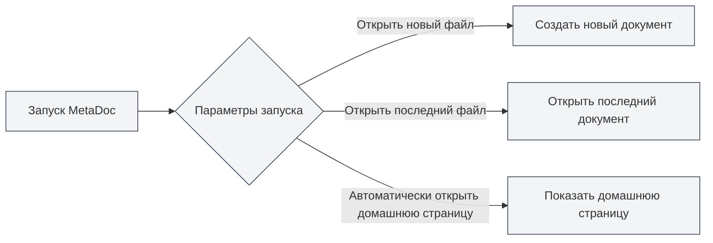
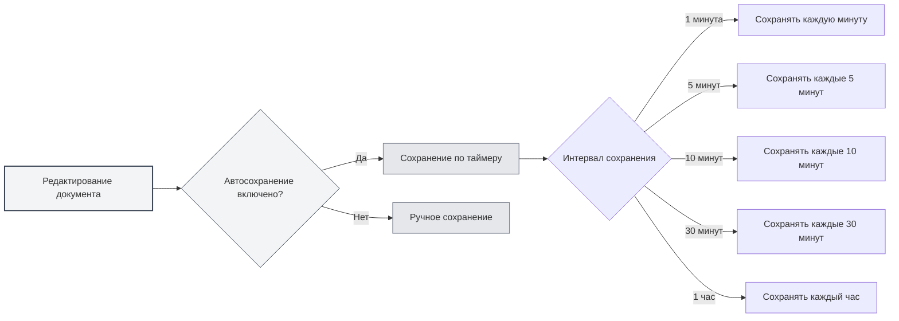
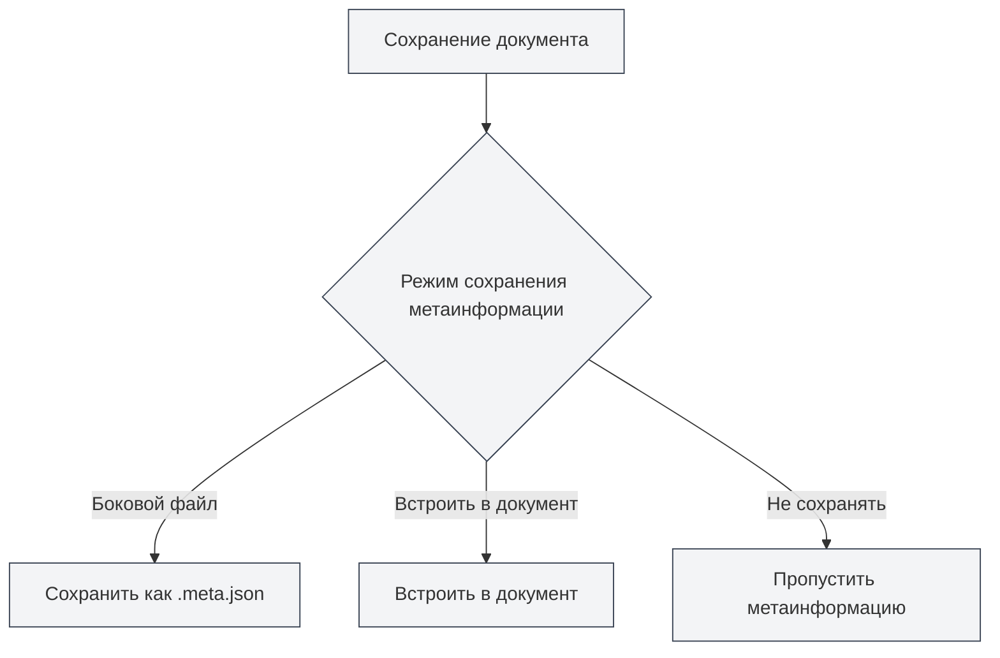

# Базовые настройки

## Обзор

Базовые настройки — это основные параметры конфигурации MetaDoc, охватывающие важные функции, такие как поведение при запуске, автосохранение, статистика документов, управление метаинформацией и другие. Правильная настройка этих параметров может улучшить ваш опыт использования и повысить производительность.

## Параметры запуска

### Настройка поведения при запуске

Параметры запуска определяют поведение MetaDoc по умолчанию при старте:

- **Открыть новый файл**: создавать новый пустой документ при каждом запуске.
- **Открыть последний редактируемый файл**: автоматически открывать документ, который редактировался при последнем закрытии приложения.

Вы можете выбрать подходящий вариант в зависимости от ваших привычек. Если вы часто продолжаете работу с того места, где остановились, рекомендуется выбрать "Открыть последний редактируемый файл".

Доступ к настройкам осуществляется через верхнюю строку меню:

<MenuItemsDemo mode="demo" :items='[{"id": "settings"}]' />

### Интерфейс базовых настроек

На следующем рисунке показан полный интерфейс страницы базовых настроек:

<SettingBasicSection mode="demo" />

Интерфейс базовых настроек включает следующие основные области конфигурации:

- **Параметры запуска**: настройка поведения по умолчанию при запуске приложения (открыть новый файл/последний редактируемый файл).
- **Автосохранение**: настройка интервала автосохранения для предотвращения потери данных.
- **Сохранение метаданных**: выбор способа хранения метаданных (внутри документа/в отдельном файле).
- **Каталог ссылок**: управление местом хранения внешних файлов, на которые ссылается документ.
- **Другие параметры**: расширенные настройки, такие как обработка блоков кода, встраивание изображений, математические формулы и другие.

### Автоматическое открытие домашней страницы при запуске

При включении этой опции MetaDoc будет автоматически открывать вкладку домашней страницы при запуске. Домашняя страница предоставляет функции быстрого старта, список последних документов и другие возможности для удобного доступа к часто используемым функциям.

## Автосохранение

<SettingBasicSection mode="demo" />

### Настройка автосохранения

Функция автосохранения предотвращает потерю содержимого из-за непредвиденных обстоятельств (например, сбой программы, отключение питания и т.д.). MetaDoc поддерживает следующие интервалы автосохранения:

- **Выключено**: автосохранение отключено, требуется ручное сохранение.
- **1 минута**: автоматическое сохранение каждую минуту.
- **5 минут**: автоматическое сохранение каждые 5 минут.
- **10 минут**: автоматическое сохранение каждые 10 минут.
- **30 минут**: автоматическое сохранение каждые 30 минут.
- **1 час**: автоматическое сохранение каждый час.

### Рекомендации по использованию

- **Частое редактирование**: рекомендуется установить короткий интервал автосохранения (1-5 минут), чтобы обеспечить своевременное сохранение содержимого.
- **Длительное написание**: можно установить более длинный интервал (10-30 минут), чтобы уменьшить частоту записи на диск.
- **Важные документы**: рекомендуется включить автосохранение и дополнительно использовать ручное сохранение (`Ctrl+S`) для обеспечения безопасности данных.

Автосохранение выполняется в фоновом режиме и не прерывает вашу работу.

## Настройки статистики документа

<SettingBasicSection mode="demo" />

### Исключить блоки кода из статистики

При включении этой опции содержимое блоков кода будет исключаться при подсчете количества слов, частоты слов и другой статистики документа. Это особенно полезно для технической документации, так как содержимое блоков кода обычно не должно учитываться в текстовой статистике документа.

**Сценарии использования**:

- Техническая документация содержит множество примеров кода.
- Необходим точный подсчет фактического текстового содержимого документа.
- Избежание влияния кода на результаты анализа частоты слов.

## Настройки обработки изображений

<SettingBasicSection mode="demo" />

### Разбор встроенных изображений (функция OCR)

При включении этой опции MetaDoc будет обрабатывать встроенные в документ изображения с помощью OCR (оптического распознавания символов) для извлечения текстового содержимого из изображений. Это особенно полезно при работе с документами, содержащими изображения (например, PDF, Word-документы).

**Описание функции**:

- Изображения в загружаемых файлах DOCX, PPTX, PDF будут обрабатываться с помощью OCR.
- Загружаемые непосредственно файлы изображений также будут обрабатываться OCR (не зависит от этой опции).
- Результаты OCR могут использоваться для поиска в базе знаний и функций с поддержкой ИИ.

**Важные замечания**:

- Обработка OCR требует определенных вычислительных ресурсов и может повлиять на скорость загрузки документов.
- Если извлечение текста из изображений не требуется, эту функцию можно отключить для повышения производительности.

### Встроенные числа в математических формулах

При включении этой опции числа в математических формулах будут отображаться во встроенном режиме, а не в блочном. Это позволяет формулам лучше интегрироваться в текстовый поток и подходит для вставки простых математических выражений в абзацы.

## Режим сохранения метаинформации

<SettingBasicSection mode="demo" />

### Настройка способа сохранения

Метаинформация документа (заголовок, автор, описание, ключевые слова и т.д.) может сохраняться тремя способами:

- **Боковой файл**: сохранение метаинформации в отдельном файле (`.meta.json`) в том же каталоге, что и документ.
  - Преимущества: не влияет на содержимое исходного документа, удобно для контроля версий.
  - Недостатки: необходимо управлять двумя файлами одновременно.
- **Встроить в документ**: встраивание метаинформации внутрь файла документа.
  - Преимущества: управление одним файлом, удобно для обмена.
  - Недостатки: некоторые форматы могут не поддерживать встраивание.
- **Не сохранять**: метаинформация не сохраняется.
  - Сценарии использования: временные документы или документы, не требующие метаинформации.

### Рекомендации по выбору

- **Техническая документация**: рекомендуется использовать режим "Боковой файл" для удобства управления системами контроля версий, такими как Git.
- **Личные заметки**: можно использовать режим "Встроить в документ" для поддержания чистоты одного файла.
- **Временные документы**: можно выбрать режим "Не сохранять".

## Управление каталогом файлов ссылок

<SettingBasicSection mode="demo" />

### Просмотр информации о каталоге

Каталог файлов ссылок используется для хранения внешних файлов, на которые ссылается документ (например, изображения, вложения и т.д.). На странице базовых настроек вы можете:

- **Просмотреть размер каталога**: отображает занимаемое каталогом дисковое пространство.
- **Обновить**: обновить информацию о размере каталога.
- **Открыть каталог**: открыть каталог файлов ссылок в файловом менеджере.
- **Очистить каталог**: удалить все файлы в каталоге (действие необратимо).

### Сценарии использования

Каталог файлов ссылок обычно используется для:

- Хранения изображений, вставленных в документ.
- Сохранения вложений документа.
- Управления ресурсными файлами, связанными с документом.

**Важные замечания**:

- Действие очистки каталога необратимо, выполняйте его с осторожностью.
- Перед очисткой рекомендуется создать резервную копию важных файлов.
- Размер каталога будет увеличиваться по мере добавления файлов, на которые ссылается документ.

## Важные замечания

1. **Параметры запуска**: изменения в параметрах запуска вступят в силу при следующем запуске приложения.
2. **Автосохранение**: автосохранение не перезаписывает ваши действия по ручному сохранению, их можно использовать совместно.
3. **Режим метаинформации**: после изменения режима сохранения метаинформации новые сохраняемые документы будут использовать новый режим, существующие документы не затрагиваются.
4. **Каталог ссылок**: перед очисткой каталога ссылок убедитесь, что ни один документ не использует эти файлы.

## Связанная документация

- [[core.file-operations|Операции с файлами]]
- [[core.document-metadata|Метаданные документа]]
- [[settings.theme|Настройки темы]]
- [[settings.image|Настройки изображений]]

<MenuItemsDemo mode="demo" :items='[{"id": "settings", "items": ["basic"]}]' />
