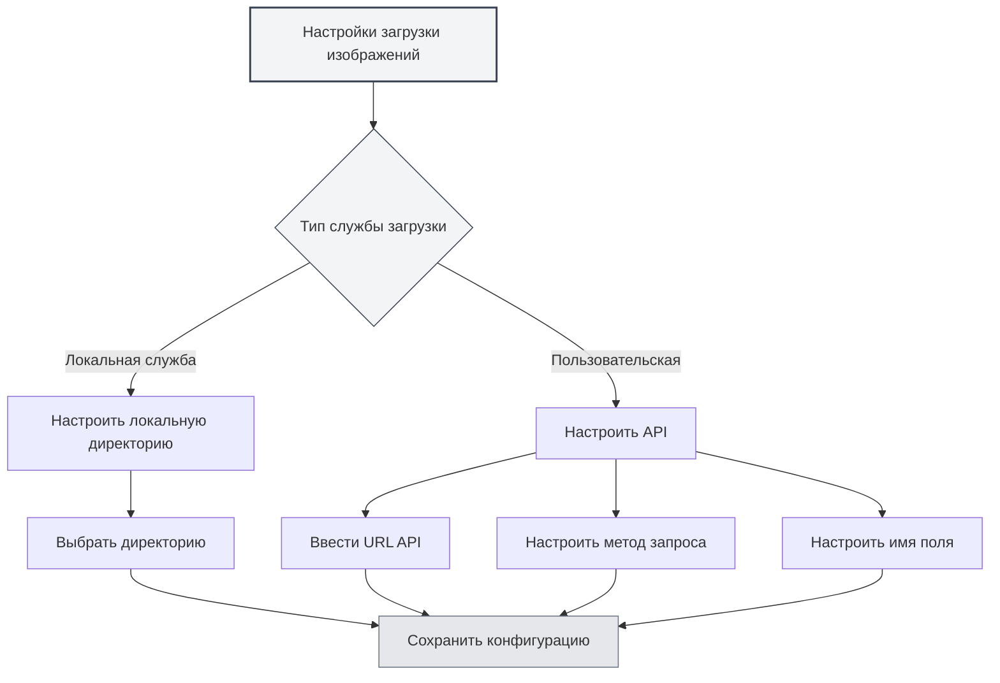

# Настройки службы загрузки

## Обзор

Настройки службы загрузки позволяют настроить целевую службу для загрузки изображений. MetaDoc поддерживает два способа загрузки: локальную службу и пользовательский API. Вы можете выбрать подходящую службу в соответствии с вашими потребностями.

## Типы служб загрузки

### Выбор службы

На странице настроек изображений, когда для параметра "Действие при вставке изображения" установлено значение "Загрузить", можно выбрать службу загрузки:

- **Локальная служба**: сохраняет изображения в локальную директорию.
- **Пользовательская**: использует пользовательский API для загрузки изображений.

Вы можете получить доступ к настройкам загрузки изображений через верхнюю строку меню:

<MenuItemsDemo mode="demo" :items='[{"id": "settings"}]' />



### Локальная служба

Локальная служба сохраняет изображения в локальную файловую систему:

- **Преимущества**: полный локальный контроль, безопасность данных.
- **Недостатки**: требуется настройка локальной директории.
- **Сценарии использования**: локальное использование, высокие требования к конфиденциальности данных.

<SettingImageSection mode="demo" />

### Пользовательская служба

Пользовательская служба использует внешний API для загрузки изображений:

- **Преимущества**: возможность загрузки в облачное хранилище, хостинг изображений и т.д.
- **Недостатки**: требуется настройка API-интерфейса.
- **Сценарии использования**: необходимость облачного хранилища, CDN для изображений и т.д.

<MainTabs mode="demo" />

## Конфигурация локальной директории для изображений

### Настройка директории

При использовании локальной службы необходимо настроить директорию для сохранения изображений:

1.  На странице настроек изображений выберите "Локальная служба".
2.  Нажмите кнопку "Обзор", чтобы выбрать директорию.
3.  Или введите путь к директории непосредственно в поле ввода.
4.  Нажмите кнопку "Открыть", чтобы открыть директорию в файловом менеджере.

### Выбор директории

При выборе директории для изображений:

-   **Кнопка "Обзор"**: открывает диалоговое окно выбора директории.
-   **Ввод пути**: прямой ввод пути к директории.
-   **Кнопка "Открыть"**: открывает уже установленную директорию в файловом менеджере.

### Директория по умолчанию

Если локальная директория для изображений не задана, система использует директорию по умолчанию:

-   **Windows**: `%APPDATA%/MetaDoc/images`
-   **macOS**: `~/Library/Application Support/MetaDoc/images`
-   **Linux**: `~/.config/MetaDoc/images`

<QuickStartPanel mode="demo" />

### Управление директорией

-   **Просмотр директории**: нажмите кнопку "Открыть", чтобы просмотреть содержимое директории.
-   **Изменение директории**: нажмите кнопку "Обзор", чтобы выбрать новую директорию.
-   **Требования к директории**: убедитесь, что директория существует и имеет права на запись.

## Конфигурация пользовательского API для загрузки

### Настройка URL API

При использовании пользовательской службы необходимо настроить адрес API:

1.  На странице настроек изображений выберите службу "Пользовательская".
2.  В поле ввода "URL пользовательского API для загрузки" введите адрес API.
3.  Пример формата: `https://api.example.com/upload`

### Настройка метода API

Настройте метод запроса API:

-   **POST**: использовать метод POST для загрузки (рекомендуется).
-   **PUT**: использовать метод PUT для загрузки.

Большинство API используют метод POST, некоторые специальные API могут использовать метод PUT.

### Настройка имени поля

Настройте имя поля для загружаемого файла:

-   **Значение по умолчанию**: `file`
-   **Пользовательское**: установите имя поля в соответствии с требованиями API.

Разные API могут использовать разные имена полей, такие как `file`, `image`, `upload` и т.д.

### Примеры конфигурации API

**Пример 1: Стандартный API хостинга изображений**

```
API URL: https://api.example.com/upload
Метод: POST
Имя поля: file
```

**Пример 2: API с пользовательским именем поля**

```
API URL: https://api.example.com/image
Метод: POST
Имя поля: image
```

**Пример 3: API с методом PUT**

```
API URL: https://api.example.com/upload
Метод: PUT
Имя поля: file
```

<ViewMenuItemsDemo mode="demo" :items='["home", "editor"]'
/>

## Формат ответа API

### Требования к ответу

Пользовательский API должен возвращать JSON-ответ в следующем формате:

```json
{
  "success": true,
  "imagePath": "https://example.com/image.png"
}
```

### Поля ответа

-   **success**: логическое значение, указывающее, успешна ли загрузка.
-   **imagePath**: строка, возвращающая URL или путь к изображению.

### Обработка ошибок

Если загрузка не удалась, API должен вернуть:

```json
{
  "success": false,
  "message": "Сообщение об ошибке"
}
```

<DialogDemo mode="demo" dialogType="api-config" />

## Проверка конфигурации

### Тестирование конфигурации

После настройки пользовательского API рекомендуется протестировать конфигурацию:

1.  Вставьте изображение в документ.
2.  Проверьте результат загрузки.
3.  Если произошла ошибка, проверьте правильность конфигурации.

### Часто встречающиеся проблемы

**Ошибка соединения**:

-   Проверьте правильность URL API.
-   Проверьте сетевое соединение.
-   Проверьте, работает ли служба API нормально.

**Ошибка загрузки**:

-   Проверьте правильность метода API.
-   Проверьте правильность имени поля.
-   Проверьте, соответствует ли формат ответа API требованиям.

**Проблемы с правами доступа**:

-   Проверьте, требуется ли для API аутентификация.
-   Проверьте правильность API Key или Token.

<SettingBasicSection mode="demo" />

## Конфигурация локальной службы

### Права доступа к директории

При использовании локальной службы убедитесь, что у директории есть права на запись:

-   **Windows**: проверьте настройки разрешений для папки.
-   **macOS/Linux**: проверьте права доступа к директории (chmod).

### Структура директории

Локальная служба сохраняет изображения в указанной директории:

-   **Именование файлов**: используется временная метка + исходное имя файла.
-   **Формат файла**: сохраняется исходный формат.
-   **Структура директории**: все изображения сохраняются в одной директории.

<OcrWindow mode="demo" />

### Доступ к изображениям

К изображениям локальной службы можно получить доступ следующими способами:

-   **HTTP-служба**: доступ через путь `/images/` сервера времени выполнения (адрес по умолчанию настраивается приложением, например, `http://127.0.0.1:52521/images/`).
-   **Путь к файлу**: прямое использование пути файловой системы.

## Рекомендации

1.  **Локальное использование**: для локального использования рекомендуется локальная служба.
2.  **Облачное хранилище**: используйте пользовательский API, когда требуется облачное хранилище.
3.  **Управление директорией**: регулярно очищайте директорию с изображениями, чтобы избежать чрезмерного использования пространства.
4.  **Тестирование API**: после настройки пользовательского API сначала протестируйте его.
5.  **Стратегия резервного копирования**: рекомендуется одновременно создавать резервные копии важных изображений.

<MenuItemsDemo mode="demo" :items='[{"id": "file", "items": ["new", "open", "save"]}]' />

## Важные замечания

1.  **Применение конфигурации**: изменения конфигурации вступят в силу только для вновь вставляемых изображений.
2.  **Совместимость API**: убедитесь, что пользовательский API соответствует требованиям к формату ответа.
3.  **Права доступа к директории**: убедитесь, что у локальной директории есть права на запись.
4.  **Сетевое соединение**: для пользовательского API требуется сетевое соединение.
5.  **Дисковое пространство**: локальная служба занимает локальное дисковое пространство.

## Связанная документация

-   [[settings.image|Конфигурация загрузки изображений]]
-   [[settings.basic|Базовые настройки]]
-   [[core.file-operations|Операции с файлами]]

<ResizableDivider mode="demo" />