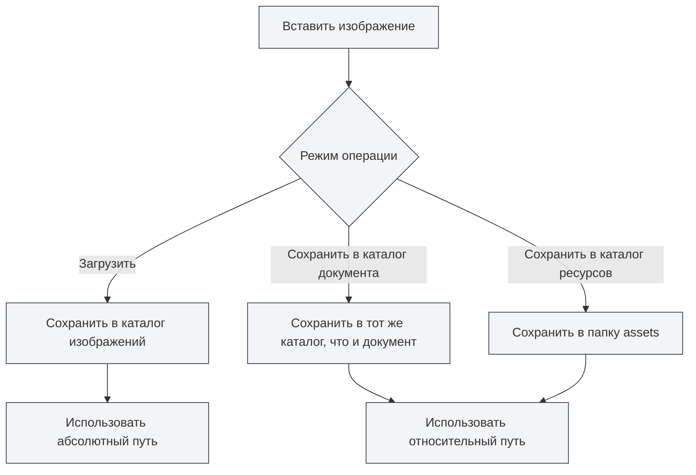

# Настройка загрузки изображений

## Обзор

Настройка загрузки изображений определяет способ обработки изображений при их вставке в документ. MetaDoc поддерживает несколько режимов обработки изображений, вы можете выбрать подходящую конфигурацию в соответствии с вашими потребностями.

## Операция вставки изображения

### Режимы операции

При вставке изображения можно выбрать один из следующих режимов операции:

- **Загрузить**: Загрузить изображение в указанный каталог для изображений
- **Сохранить в каталог документа**: Сохранить изображение в каталоге, где находится документ
- **Сохранить в каталог ресурсов**: Сохранить изображение в папке `assets` внутри каталога документа

Доступ к настройкам изображений можно получить через верхнюю строку меню:

<MenuItemsDemo mode="demo" :items='[{"id": "settings"}]' />

### Интерфейс настроек изображений

На следующем рисунке показан полный интерфейс страницы настроек изображений:

<SettingImageSection mode="demo" />

Интерфейс настроек изображений содержит следующие основные области конфигурации:

- **Сервис загрузки изображений**: Выбор локального хранилища или стороннего хостинга изображений
- **Путь локального хранилища**: Настройка локального каталога для сохранения изображений
- **Обработка сетевых изображений**: Настройка параметров, таких как сохранение исходного URL, автоматическое сохранение и т.д.

### Режим загрузки

Режим загрузки сохраняет изображения в настроенный локальный каталог для изображений:

- **Преимущества**: Централизованное управление всеми изображениями, удобство резервного копирования и переноса
- **Недостатки**: Изображения отделены от документа, при перемещении документа необходимо также перемещать изображения
- **Сценарии использования**: Общие изображения для нескольких документов, централизованное управление ресурсами изображений

<DialogDemo mode="demo" dialogType="image-upload" />

### Сохранение в каталог документа

Сохранение изображения в каталоге, где находится документ:

- **Преимущества**: Изображение и документ находятся в одном каталоге, удобно для управления
- **Недостатки**: В каждом каталоге документа есть изображения, возможны дубликаты
- **Сценарии использования**: Проекты с одним документом, документы, требующие независимой упаковки

<DialogDemo mode="demo" dialogType="file-save" />

### Сохранение в каталог ресурсов

Сохранение изображения в папке `assets` внутри каталога документа:

- **Преимущества**: Изображения хранятся в папке `assets`, структура понятна
- **Недостатки**: Необходимо создавать папку `assets`
- **Сценарии использования**: Требуется четкая файловая структура, документы необходимо экспортировать и делиться

<DialogDemo mode="demo" dialogType="folder-select" />

## Сохранение URL сетевых изображений

### Описание функции

При включении опции "Сохранять URL сетевых изображений" при вставке сетевого изображения оно не загружается, а используется исходный URL:

- **Включено**: Сохраняется исходный URL сетевого изображения, не загружается локально
- **Выключено**: Сетевое изображение загружается локально, используется локальный путь

### Сценарии использования

- **Сценарии включения**:

  - Ресурсы изображений большие, локальное резервное копирование не требуется
  - Изображения регулярно обновляются, необходимо отображать последнюю версию в реальном времени
  - Экономия локального дискового пространства

- **Сценарии выключения**:
  - Требуется офлайн-доступ к изображениям
  - Требуется резервное копирование ресурсов изображений
  - Сетевое изображение может стать недоступным

### Важные замечания

- При сохранении сетевого URL для отображения изображения требуется подключение к сети
- Если сетевое изображение станет недоступным, изображение в документе не отобразится
- Для важных изображений рекомендуется выключать эту опцию, чтобы гарантировать доступность изображений

## Автоматическое экранирование URL изображений

### Описание функции

При включении опции "Автоматически экранировать URL изображений" специальные символы в URL будут автоматически экранироваться при вставке изображения:

- **Включено**: Автоматическое экранирование специальных символов в URL (например, пробелов, китайских символов и т.д.)
- **Выключено**: URL остается как есть, экранирование не выполняется

### Правила экранирования

Система автоматически экранирует следующие символы:

- **Пробел**: Преобразуется в `%20`
- **Китайские символы**: Кодируются в URL
- **Специальные символы**: Экранируются в безопасный для URL формат

### Рекомендации по использованию

- **Включить**: Рекомендуется включить, чтобы гарантировать корректный разбор URL в различных средах
- **Выключить**: Выключать только при уверенности, что формат URL правильный и экранирование не требуется

## Формат пути

### Абсолютный путь

При использовании режима загрузки изображения используют абсолютный путь:

- **Формат**: `/path/to/image.png`
- **Преимущества**: Путь явный, не зависит от местоположения документа
- **Недостатки**: Путь становится недействительным после перемещения документа или изображения

### Относительный путь

При использовании режимов сохранения в каталог документа или ресурсов изображения используют относительный путь:

- **Формат**: `./image.png` или `./assets/image.png`
- **Преимущества**: Документ и изображения можно перемещать вместе
- **Недостатки**: При изменении местоположения документа необходимо корректировать путь

## Применение конфигурации

### Момент вступления в силу

Изменения в настройках загрузки изображений вступают в силу в следующих случаях:

- **Новые вставленные изображения**: Немедленно используют новую конфигурацию
- **Открытые документы**: Необходимо повторно открыть документ для вступления в силу
- **Сохраненные документы**: На сохраненные документы не влияет

### Повторное открытие файла

Некоторые изменения конфигурации требуют повторного открытия файла для вступления в силу:

1. Измените настройки загрузки изображений
2. Закройте текущий документ
3. Снова откройте документ
4. Новая конфигурация вступает в силу

## Лучшие практики

1. **Централизованное управление**: Используйте режим загрузки для централизованного управления изображениями
2. **Независимость документа**: При необходимости независимости документа используйте сохранение в каталог документа
3. **Четкая структура**: Используйте режим каталога ресурсов для поддержания четкой файловой структуры
4. **Сетевые изображения**: Для важных изображений рекомендуется выключать опцию сохранения URL
5. **Экранирование пути**: Рекомендуется включать автоматическое экранирование для обеспечения совместимости

## Важные замечания

1. **Применение конфигурации**: Некоторые настройки требуют повторного открытия файла для вступления в силу
2. **Формат пути**: Обратите внимание на разницу между абсолютным и относительным путями
3. **Сетевые изображения**: При сохранении сетевого URL требуется подключение к сети
4. **Резервное копирование изображений**: Для важных изображений рекомендуется выключать сохранение URL, чтобы обеспечить резервное копирование
5. **Дисковое пространство**: Режим загрузки занимает локальное дисковое пространство

## Связанная документация

- [[settings.image-upload|Настройки сервиса загрузки]]
- [[settings.basic|Базовые настройки]]
- [[core.file-operations|Операции с файлами]]

<SettingImageSection mode="demo" />

<MenuItemsDemo mode="demo" :items='[{"id": "settings", "items": ["image"]}]' />

<DialogDemo mode="demo" dialogType="image-upload" />

<DialogDemo mode="demo" dialogType="file-save" />