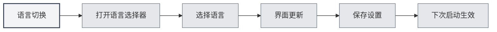

# Поддержка нескольких языков

## Обзор

MetaDoc поддерживает многоязычный интерфейс. Вы можете выбрать подходящий язык в соответствии с вашими привычками использования. После переключения языка интерфейс немедленно обновится на выбранный язык.

## Поддерживаемые языки

В настоящее время MetaDoc поддерживает следующие языки:

- **中文简体** (zh_CN): язык по умолчанию
- **English** (en_US): английский
- **日本語** (ja_JP): японский
- **한국어** (ko_KR): корейский
- **Français** (fr_FR): французский
- **Deutsch** (de_DE): немецкий

## Переключение языка

### Смена языка

1. Нажмите на селектор языка в нижней части левого меню
2. Выберите язык, который хотите использовать
3. Интерфейс немедленно обновится на выбранный язык

Вы можете получить доступ к настройкам языка через верхнюю строку меню:

<MenuItemsDemo mode="demo" :items='[{"id": "settings"}]' />

<SettingBasicSection mode="demo" />

<SettingLlmSection mode="demo" />



### Сохранение языка

Выбранный язык сохраняется автоматически:

- **Автосохранение**: сохраняется сразу после выбора языка
- **Следующий запуск**: при следующем запуске приложения будет использоваться последний выбранный язык
- **Синхронизация окон**: настройки языка автоматически синхронизируются во всех окнах

<SettingThemeSection mode="demo" />

## Локализация интерфейса

### Область локализации

Переключение языка влияет на следующие элементы интерфейса:

- **Пункты меню**: все меню и пункты меню
- **Текст кнопок**: текст всех кнопок
- **Диалоговые окна**: все диалоговые окна и сообщения
- **Страницы настроек**: все метки и описания на страницах настроек
- **Сообщения об ошибках**: сообщения об ошибках и предупреждения

### Язык содержимого

Настройки языка влияют только на язык интерфейса, не затрагивая:

- **Содержимое документов**: содержимое документов остается неизменным
- **Пути к файлам**: пути к файлам остаются неизменными
- **Пользовательский ввод**: вводимое пользователем содержимое не затрагивается

<ViewMenuItemsDemo mode="demo" :items='["settings"]' />

## Рекомендации по выбору языка

### В соответствии с привычками использования

- **Пользователи китайского языка**: используйте 中文简体, интерфейс будет более привычным
- **Пользователи английского языка**: используйте English, что соответствует привычкам использования
- **Другие языки**: выбирайте в соответствии с личными предпочтениями

### В соответствии с языком документа

- **Документы на китайском**: можно использовать китайский интерфейс
- **Документы на английском**: можно использовать английский интерфейс
- **Многоязычные документы**: выберите наиболее часто используемый язык

## Эффект переключения языка

### Мгновенное применение

Переключение языка применяется немедленно:

- **Обновление интерфейса**: все элементы интерфейса обновляются сразу
- **Перезапуск не требуется**: не требуется перезапуск приложения
- **Сохранение состояния**: текущее состояние редактирования не теряется

<MainTabs mode="demo" />

### Синхронизация окон

Все окна автоматически синхронизируют язык:

- **Главное окно**: переключение языка в главном окне
- **Вспомогательные окна**: все вспомогательные окна синхронно обновляются
- **Новые окна**: вновь открытые окна используют текущий язык

## Файлы языков

### Расположение файлов языков

Файлы языков хранятся в каталоге приложения:

- **Формат файла**: формат JSON
- **Расположение файла**: `src/renderer/src/locales/`
- **Именование файлов**: используется код языка (например, `zh_cn.json`)

### Структура файлов языков

Файлы языков используют структуру "ключ-значение":

```json
{
  "common": {
    "confirm": "确认",
    "cancel": "取消"
  },
  "setting": {
    "basic": "基础设置"
  }
}
```

## Важные замечания

1. **Коды языков**: коды языков используют формат с подчеркиванием (например, `zh_CN`)
2. **Полнота перевода**: некоторые новые функции могут временно иметь перевод только на часть языков
3. **Резервный язык**: если перевод отсутствует, произойдет откат к 中文简体
4. **Содержимое документов**: настройки языка не влияют на содержимое документов
5. **Пути к файлам**: настройки языка не влияют на отображение путей к файлам

## Связанная документация

- [[settings.basic|Базовые настройки]]
- [[quick-start.guide|Руководство по быстрому началу работы]]

<ViewMenuItemsDemo mode="demo" :items='["settings"]' />