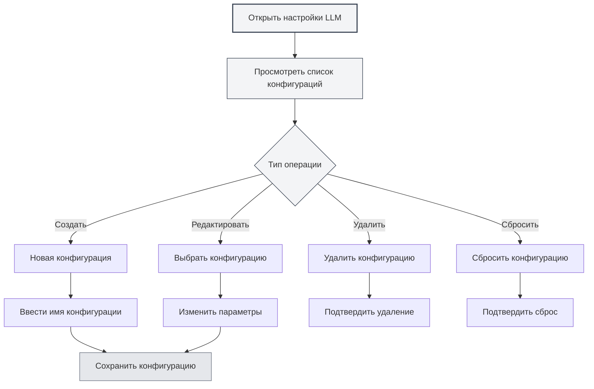

# Управление конфигурациями LLM

## Обзор

Управление конфигурациями LLM позволяет создавать, редактировать, удалять и управлять несколькими конфигурациями LLM. С помощью управления конфигурациями вы можете настраивать различные службы LLM для разных сценариев использования и гибко переключаться между ними для удовлетворения различных потребностей.

## Создание конфигурации

### Создание новой конфигурации

1.  На странице настроек LLM нажмите кнопку "Новая конфигурация" (значок +) над списком конфигураций слева.
2.  В появившемся диалоговом окне введите имя конфигурации.
3.  Система создаст новую конфигурацию на основе текущих настроек.
4.  После успешного создания произойдет автоматическое переключение на новую конфигурацию.

Вы можете получить доступ к настройкам LLM через верхнюю строку меню:

<MenuItemsDemo mode="demo" :items='[{"id": "settings"}]' />

### Демонстрация интерфейса конфигурации

На рисунке ниже показаны основные функции интерфейса управления конфигурациями LLM:

<SettingLlmSection mode="demo" />

**Важные замечания**:

-   Имя конфигурации не может быть пустым.
-   Имя конфигурации должно быть описательным для удобства идентификации.
-   Новая конфигурация унаследует все текущие настройки.
-   Тип конфигурации "manual" (ручная) не поддерживает создание новых конфигураций.



### Создание из текущих настроек

При создании новой конфигурации система:

-   Скопирует текущий выбранный тип LLM.
-   Скопирует все текущие параметры конфигурации (URL API, ключ API, модель и т.д.).
-   Создаст новый идентификатор конфигурации (ID).
-   Добавит новую конфигурацию в список конфигураций.

Вы можете создать новую конфигурацию на основе существующей, а затем изменить параметры, что позволяет быстро создавать похожие конфигурации.

<DialogDemo mode="demo" dialogType="llm-config" />

## Редактирование конфигурации

### Изменение параметров конфигурации

1.  В списке конфигураций выберите конфигурацию для редактирования.
2.  Измените необходимые параметры в форме справа.
3.  После внесения изменений система пометит конфигурацию как "Несохраненные изменения".
4.  Нажмите кнопку "Сохранить изменения", чтобы сохранить правки.

<DialogDemo mode="demo" dialogType="api-config" />

### Описание параметров конфигурации

Параметры конфигурации различаются в зависимости от типа LLM:

-   **MetaDoc API**: Выбор модели.
-   **Ollama**: URL API, выбор модели, максимальное количество токенов.
-   **OpenAI-совместимый**: URL API, ключ API, выбор модели, настройки суффикса.
-   **OpenAI официальный**: Ключ API, выбор модели.
-   **DeepSeek**: Ключ API, выбор модели.
-   **Gemini**: Ключ API, выбор модели.

### Предварительный просмотр в реальном времени

При изменении параметров конфигурации система отслеживает изменения в реальном времени:

-   При наличии несохраненных изменений отображается предупреждающая метка.
-   В любой момент можно нажать "Отменить изменения", чтобы вернуться к исходному состоянию.
-   После сохранения изменения вступают в силу немедленно.

<AIChat mode="demo" />

## Удаление конфигурации

### Удаление конфигурации

1.  Нажмите кнопку "Еще" (значок с тремя точками) справа от элемента конфигурации.
2.  Выберите "Удалить конфигурацию".
3.  Подтвердите операцию удаления.

**Ограничения**:

-   Должна оставаться как минимум одна конфигурация; последнюю конфигурацию удалить нельзя.
-   Конфигурацию по умолчанию (isDefault) нельзя удалить, её можно только сбросить.
-   Операция удаления необратима, действуйте осторожно.

### Подтверждение удаления

Перед удалением конфигурации система запросит подтверждение:

-   После подтверждения конфигурация будет удалена безвозвратно.
-   Если удаляется текущая используемая конфигурация, система автоматически переключится на другую.
-   После удаления восстановление невозможно, убедитесь, что конфигурация больше не нужна.

<DialogDemo mode="demo" dialogType="confirm-delete" />

## Сброс конфигурации

### Сброс конфигурации по умолчанию

Для конфигурации по умолчанию (например, "Ollama (по умолчанию)") вы можете сбросить её к исходным значениям:

1.  Нажмите кнопку "Еще" справа от элемента конфигурации.
2.  Выберите "Сбросить конфигурацию".
3.  Подтвердите операцию сброса.

После сброса конфигурация вернется к значениям по умолчанию, установленным при создании, все пользовательские изменения будут удалены.

**Сценарии использования**:

-   Конфигурация была случайно изменена, требуется восстановить значения по умолчанию.
-   Необходимо сбросить конфигурацию после тестирования.
-   Очистка ненужных пользовательских настроек.

## Экспорт конфигурации

### Экспорт отдельной конфигурации

1.  Нажмите кнопку "Еще" справа от элемента конфигурации.
2.  Выберите "Экспортировать конфигурацию".
3.  Система сгенерирует файл конфигурации в формате JSON.
4.  Сохраните файл локально.

<DialogDemo mode="demo" dialogType="export-config" />

Экспортируемый файл конфигурации содержит:

-   Идентификатор (ID) и имя конфигурации.
-   Тип LLM.
-   Все параметры конфигурации.
-   Время создания и обновления.

### Экспорт всех конфигураций

1.  Нажмите кнопку "Экспортировать все конфигурации" (значок загрузки) над списком конфигураций.
2.  Система экспортирует все конфигурации в один файл JSON.
3.  Сохраните файл локально.

Экспорт всех конфигураций может использоваться для:

-   Резервного копирования всех конфигураций.
-   Переноса на другие устройства.
-   Обмена конфигурациями с другими пользователями.

## Импорт конфигурации

### Импорт конфигурации

1.  Нажмите кнопку "Импортировать конфигурацию" (значок копии документа) над списком конфигураций.
2.  Выберите ранее экспортированный файл конфигурации.
3.  Система проанализирует и импортирует конфигурацию.
4.  Импортированная конфигурация будет добавлена в список конфигураций.

<DialogDemo mode="demo" dialogType="import-config" />

**Правила импорта**:

-   Поддерживается импорт отдельной конфигурации или массива конфигураций.
-   Если импортируемый ID конфигурации уже существует, будет создан новый ID во избежание конфликтов.
-   После импорта необходимо вручную переключиться на новую конфигурацию.

### Формат импорта

Файл конфигурации должен быть в формате JSON и поддерживать следующую структуру:

```json
{
  "id": "config-xxx",
  "name": "Имя конфигурации",
  "type": "ollama",
  "ollama": {
    "apiUrl": "http://localhost:11434/api",
    "selectedModel": "llama2"
  }
}
```

Или массив конфигураций:

```json
[
  { "id": "config-1", ... },
  { "id": "config-2", ... }
]
```

## Сортировка конфигураций

### Сортировка перетаскиванием

Список конфигураций поддерживает сортировку перетаскиванием:

1.  Нажмите и удерживайте элемент конфигурации.
2.  Перетащите его в нужное место.
3.  Отпустите кнопку мыши для завершения сортировки.

Отсортированный порядок сохраняется и будет восстановлен при следующем открытии страницы настроек.

**Сценарии использования**:

-   Размещение часто используемых конфигураций вверху.
-   Сортировка по частоте использования.
-   Группировка по типу LLM.

## Состояние конфигурации

### Текущая конфигурация

Конфигурация, которая используется в данный момент:

-   Выделяется в списке.
-   Отображает метку "Несохраненные изменения" (если есть несохраненные правки).
-   Все функции AI используют службу LLM этой конфигурации.

### Переключение конфигурации

При переключении конфигурации:

-   Система проверит, есть ли у текущей конфигурации несохраненные изменения.
-   Если есть несохраненные изменения, рекомендуется сначала сохранить или отменить их.
-   После переключения изменения вступают в силу немедленно, все функции AI начинают использовать новую конфигурацию.

## Рекомендации

1.  **Соглашение об именовании**: Используйте понятные имена конфигураций, например, "Работа-Ollama", "Эксперимент-OpenAI".
2.  **Регулярное резервное копирование**: Регулярно экспортируйте важные конфигурации для резервного копирования.
3.  **Тестирование конфигураций**: После создания новой конфигурации сначала протестируйте её, убедитесь в работоспособности перед использованием.
4.  **Очистка ненужных конфигураций**: Регулярно удаляйте неиспользуемые конфигурации для поддержания порядка в списке.
5.  **Ведение документации**: Добавляйте примечания или документацию для сложных конфигураций.

## Важные замечания

1.  **Безопасность конфигураций**: Бережно храните конфигурации, содержащие ключи API, не делитесь ими.
2.  **Конфликты конфигураций**: При импорте конфигураций обращайте внимание на возможные конфликты ID.
3.  **Конфигурация по умолчанию**: Конфигурацию по умолчанию нельзя удалить, её можно только сбросить.
4.  **Зависимости конфигураций**: Некоторые функции могут зависеть от конкретных конфигураций, проверяйте перед удалением.
5.  **Синхронизация между окнами**: Изменения конфигураций синхронизируются между всеми открытыми окнами.

## Связанная документация

-   [[settings.llm|Конфигурация LLM]]
-   [[settings.llm-types|Конфигурация типов LLM]]
-   [[ai.chat|Функция AI-диалога]]
-   [[agent.config|Управление конфигурациями Agent]]

<QuickStartPanel mode="demo" />

<MainTabs mode="demo" />