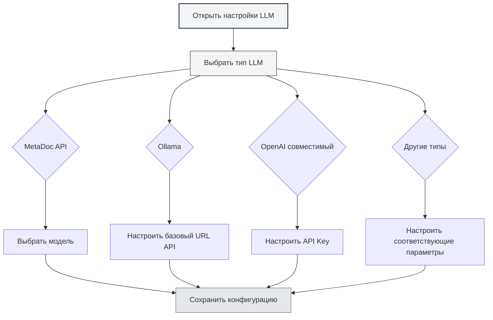

# Конфигурация типов LLM

## Обзор

MetaDoc поддерживает множество поставщиков услуг LLM, каждый тип имеет различные требования к конфигурации. В этом документе объясняется, как настроить различные типы LLM, включая MetaDoc API, Ollama, OpenAI, DeepSeek и Gemini.

## MetaDoc API

### Описание конфигурации

MetaDoc API — это служба LLM, предоставляемая официально MetaDoc. Она проста в использовании и не требует настройки ключа API.

### Шаги настройки

1.  В выпадающем списке "Тип LLM" выберите "MetaDoc"
2.  В выпадающем списке "Выбрать модель" выберите доступную модель
3.  Настройте максимальное количество токенов (опционально)

Вы можете получить доступ к настройкам LLM через верхнюю строку меню:

<MenuItemsDemo mode="demo" :items='[{"id": "settings"}]' />

### Демонстрация интерфейса конфигурации LLM

На следующем рисунке показаны основные функциональные области страницы конфигурации LLM:

<SettingLlmSection mode="demo" />

### Требования к конфигурации

-   **Вход в аккаунт**: требуется войти в аккаунт MetaDoc для использования
-   **Выбор модели**: выберите из списка доступных моделей
-   **Максимальное количество токенов**: опционально, ограничивает максимальное количество токенов для одного запроса

<MainTabs mode="demo" />

### Сценарии применения

-   Быстрый старт использования функций ИИ
-   Не требуется настройка внешних сервисов
-   Использование официального сервиса MetaDoc

<DialogDemo mode="demo" dialogType="llm-config" />

## Ollama

### Описание конфигурации

Ollama — это локальная среда выполнения LLM, которая позволяет запускать большие языковые модели локально без подключения к интернету.

### Шаги настройки

1.  В выпадающем списке "Тип LLM" выберите "Ollama"
2.  Настройте базовый URL API (по умолчанию: `http://localhost:11434/api`)
3.  Нажмите на выпадающий список "Выбрать модель", система автоматически получит список доступных локальных моделей
4.  Выберите модель для использования
5.  Настройте максимальное количество токенов (опционально)

### Требования к конфигурации

-   **Установка Ollama**: необходимо сначала установить Ollama и запустить службу
-   **URL API**: по умолчанию `http://localhost:11434/api`, если Ollama работает по другому адресу, его нужно изменить
-   **Загрузка модели**: необходимо сначала загрузить модель с помощью Ollama (например: `ollama pull llama2`)

### Получение списка моделей

При нажатии на выпадающий список "Выбрать модель" MetaDoc автоматически подключится к службе Ollama и получит список доступных моделей. Если подключение не удалось, проверьте:

-   Запущена ли служба Ollama
-   Правильный ли URL API
-   Исправно ли сетевое подключение

### Сценарии применения

-   Локальный запуск LLM для защиты конфиденциальности данных
-   Не требуется подключение к интернету
-   Наличие достаточных вычислительных ресурсов (рекомендуется GPU)

<DialogDemo mode="demo" dialogType="api-config" />

## OpenAI совместимый

### Описание конфигурации

Совместимый API OpenAI поддерживает все сервисы, совместимые с форматом API OpenAI, включая официальный API OpenAI и сторонние совместимые сервисы.

### Шаги настройки

1.  В выпадающем списке "Тип LLM" выберите "OpenAI совместимый"
2.  Настройте базовый URL API (по умолчанию: `https://api.openai.com/v1`)
3.  Введите API Key
4.  Нажмите на выпадающий список "Выбрать модель", чтобы получить список доступных моделей
5.  Выберите модель для использования
6.  Настройте суффикс Completion и суффикс Chat (опционально, для настройки путей API)
7.  Настройте максимальное количество токенов (опционально)

### Требования к конфигурации

-   **URL API**: адрес API официального OpenAI или совместимого сервиса
-   **API Key**: ключ API, полученный от поставщика услуг
-   **Список моделей**: система автоматически получит список доступных моделей

### Настройка суффиксов API

Некоторые совместимые сервисы могут требовать настройки путей API:

-   **Суффикс Completion**: пользовательский суффикс пути для Completion API
-   **Суффикс Chat**: пользовательский суффикс пути для Chat API

В большинстве случаев настройка не требуется, можно использовать значения по умолчанию.

### Сценарии применения

-   Использование официального API OpenAI
-   Использование сторонних сервисов, совместимых с API OpenAI
-   Сервисы, требующие настройки путей API

<MainTabs mode="demo" />

## OpenAI официальный

### Описание конфигурации

Конфигурация "OpenAI официальный" предназначена специально для официального API OpenAI, настройка проще, URL API фиксирован.

### Шаги настройки

1.  В выпадающем списке "Тип LLM" выберите "OpenAI официальный"
2.  Введите OpenAI API Key
3.  Нажмите на выпадающий список "Выбрать модель", чтобы получить список доступных моделей
4.  Выберите модель для использования
5.  Настройте максимальное количество токенов (опционально)

### Требования к конфигурации

-   **API Key**: ключ API, полученный с официального сайта OpenAI
-   **URL API**: фиксирован как `https://api.openai.com/v1`, не может быть изменен

### Получение API Key

1.  Посетите [официальный сайт OpenAI](https://platform.openai.com/)
2.  Зарегистрируйтесь или войдите в аккаунт
3.  Перейдите на страницу API Keys
4.  Создайте новый API Key
5.  Скопируйте API Key и вставьте его в конфигурацию MetaDoc

<ResizableDivider mode="demo" />

### Сценарии применения

-   Использование официальных моделей GPT от OpenAI
-   Требуется стабильный официальный сервис
-   Наличие аккаунта OpenAI и квоты API

## DeepSeek

### Описание конфигурации

DeepSeek — это высокопроизводительный поставщик услуг LLM, предлагающий мощные возможности понимания китайского языка.

### Шаги настройки

1.  В выпадающем списке "Тип LLM" выберите "DeepSeek"
2.  Введите DeepSeek API Key
3.  Выберите модель (deepseek-chat или deepseek-reasoner)
4.  Настройте максимальное количество токенов (опционально)

### Требования к конфигурации

-   **API Key**: ключ API, полученный с официального сайта DeepSeek
-   **Выбор модели**:
    -   `deepseek-chat`: универсальная модель для диалога
    -   `deepseek-reasoner`: модель для логических рассуждений

### Получение API Key

1.  Посетите [официальный сайт DeepSeek](https://www.deepseek.com/)
2.  Зарегистрируйтесь или войдите в аккаунт
3.  Перейдите на страницу API Keys
4.  Создайте новый API Key
5.  Скопируйте API Key и вставьте его в конфигурацию MetaDoc

### Сценарии применения

-   Требуются мощные возможности понимания китайского языка
-   Требуются возможности логических рассуждений (используйте deepseek-reasoner)
-   Экономически эффективная служба LLM

<SettingKnowledgeBaseSection mode="demo" />

<CompletionSettingsPanel mode="demo" />

## Gemini

### Описание конфигурации

Gemini — это служба LLM от Google, поддерживающая мультимодальные возможности.

### Шаги настройки

1.  В выпадающем списке "Тип LLM" выберите "Gemini"
2.  Введите Gemini API Key
3.  Нажмите на выпадающий список "Выбрать модель", чтобы получить список доступных моделей
4.  Выберите модель для использования
5.  Настройте максимальное количество токенов (опционально)

### Требования к конфигурации

-   **API Key**: ключ API, полученный из Google AI Studio
-   **Выбор модели**: система автоматически получит список доступных моделей

### Получение API Key

1.  Посетите [Google AI Studio](https://makersuite.google.com/app/apikey)
2.  Войдите с помощью аккаунта Google
3.  Создайте новый API Key
4.  Скопируйте API Key и вставьте его в конфигурацию MetaDoc

### Сценарии применения

-   Использование службы LLM от Google
-   Требуются мультимодальные возможности
-   Наличие аккаунта Google

<AgentView mode="demo" />

## Настройка максимального количества токенов

### Описание функции

Максимальное количество токенов ограничивает максимальное количество токенов, которое может быть сгенерировано за один запрос. Включение этой функции позволяет:

-   Контролировать длину генерируемого контента
-   Экономить расходы на API
-   Избегать генерации слишком длинного контента

### Способ настройки

1.  Включите переключатель "Максимальное количество токенов"
2.  Установите количество токенов (диапазон: 1-32768)
3.  Сохраните конфигурацию

### Рекомендации по использованию

-   **Генерация короткого текста**: 100-500 токенов
-   **Средняя длина**: 500-2000 токенов
-   **Генерация длинного текста**: 2000-8000 токенов
-   **Без ограничений**: отключите эту опцию

## Проверка конфигурации

### Тестирование конфигурации

После завершения настройки рекомендуется проверить, работает ли конфигурация нормально:

1.  Сохраните конфигурацию
2.  Включите функцию LLM
3.  Попробуйте использовать функцию диалога с ИИ
4.  Если возникла ошибка, проверьте правильность конфигурации

### Часто задаваемые вопросы

**Ошибка подключения**:

-   Проверьте правильность URL API
-   Проверьте сетевое подключение
-   Проверьте, работает ли служба нормально

**Ошибка аутентификации**:

-   Проверьте правильность API Key
-   Проверьте, не истек ли срок действия API Key
-   Проверьте, есть ли у аккаунта достаточная квота

**Модель недоступна**:

-   Проверьте правильность названия модели
-   Проверьте, есть ли у аккаунта разрешение на использование этой модели
-   Проверьте, поддерживает ли служба эту модель

## Важные замечания

1.  **Безопасность ключей API**: храните ключи API в безопасности, не делитесь ими с другими
2.  **Контроль расходов**: использование внешних API может повлечь расходы, следите за объемом использования
3.  **Требования к сети**: использование внешних API требует стабильного интернет-соединения
4.  **Доступность сервисов**: доступность и стабильность разных сервисов могут различаться
5.  **Выбор модели**: разные модели имеют разные возможности и ограничения, выбирайте в соответствии с потребностями

## Связанная документация

-   [[settings.llm|Конфигурация LLM]]
-   [[settings.llm-management|Управление конфигурацией LLM]]
-   [[ai.chat|Функция диалога с ИИ]]
-   [[ai.completion|Автодополнение ИИ]]

<MenuItemsDemo mode="demo" :items='[{"id": "file"}]' />

<ViewMenuItemsDemo mode="demo" :items='["settings"]' />

<SettingLlmSection mode="demo" />

<DialogDemo mode="demo" dialogType="llm-config" />

<MainTabs mode="demo" />
