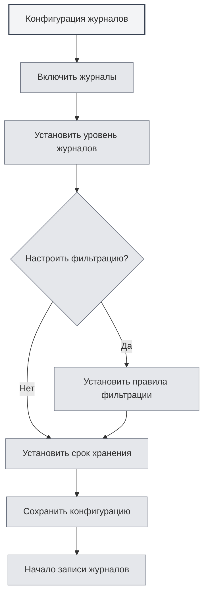

# Конфигурация журналов

## Обзор

Конфигурация журналов позволяет управлять функцией ведения журналов в MetaDoc. Настраивая журналы, вы можете записывать состояние работы приложения, что облегчает устранение неполадок и анализ производительности.

<Demo component="SettingLoggerSection" mode="demo" />

## Включение журналов

### Включение функции журналирования

На странице настроек журналов сначала необходимо включить функцию ведения журналов:

1.  Найдите переключатель "Включить журналы"
2.  Переведите переключатель в состояние "Включено"
3.  Журналы начнут записываться в файл

Вы можете получить доступ к настройкам журналов через верхнюю строку меню:

<MenuItemsDemo mode="demo" :items='[{"id": "settings"}]' />

После включения журналов система будет записывать информацию о работе приложения, включая:

-   Записи операций
-   Сообщения об ошибках
-   Предупреждающие сообщения
-   Отладочную информацию (если включено)



**Важные замечания**:

-   Журналы занимают некоторое дисковое пространство
-   Рекомендуется включать при необходимости устранения неполадок
-   В производственной среде можно отключить для уменьшения потребления ресурсов

## Уровни журналов

### Описание уровней

Уровень журнала определяет, какие уровни журналов записывать:

<ConsoleTerminal mode="demo" consoleKey="log-levels" :history='[{"content": "[INFO] 应用启动完成", "type": "out"}, {"content": "[DEBUG] 加载配置文件", "type": "out"}, {"content": "[WARN] 配置项缺失，使用默认值", "type": "warn"}, {"content": "[ERROR] 连接失败，正在重试...", "type": "error"}]' />

-   **DEBUG**: Подробная отладочная информация, включая все детали операций
-   **INFO**: Общая информация, запись важных операций и состояний
-   **WARN**: Предупреждающие сообщения, запись возможных проблем
-   **ERROR**: Сообщения об ошибках, запись ошибок и исключений

### Приоритет уровней

Уровни журналов имеют отношение приоритета:

```
DEBUG < INFO < WARN < ERROR
```

При выборе определенного уровня будут записываться журналы этого уровня и более высоких уровней. Например:

-   Выбор INFO: запись INFO, WARN, ERROR
-   Выбор WARN: запись только WARN, ERROR
-   Выбор ERROR: запись только ERROR

### Рекомендации по выбору уровня

-   **Разработка и отладка**: Используйте уровень DEBUG для получения подробной информации
-   **Повседневное использование**: Используйте уровень INFO для записи важных операций
-   **Устранение неполадок**: Используйте уровень WARN для отслеживания предупреждений и ошибок
-   **Производственная среда**: Используйте уровень ERROR для записи только ошибок

<SettingLoggerSection mode="demo" />

## Фильтрация журналов

### Функция фильтрации

Фильтрация журналов позволяет записывать журналы только из определенного диапазона:

-   **Фильтрация по scope**: Запись журналов только из определенных модулей
-   **Совпадение по префиксу**: Поддержка совпадения по префиксу, например, "ai-graph" будет соответствовать всем scope, начинающимся с "ai-graph"
-   **Точное совпадение**: Поддержка точного совпадения, например, "[ai-graph][WorkflowTool]"

### Правила фильтрации

Правила фильтрации поддерживают следующие форматы:

-   **Простое совпадение**: `ai-graph` - соответствует всем scope, содержащим "ai-graph"
-   **Совпадение по префиксу**: `ai-` - соответствует всем scope, начинающимся с "ai-"
-   **Точное совпадение**: `[ai-graph][WorkflowTool]` - точное соответствие этому scope

### Сценарии использования

-   **Отладка определенного модуля**: Запись журналов только для одного модуля
-   **Уменьшение объема журналов**: Фильтрация неинтересующих журналов
-   **Локализация проблемы**: Фокусировка на журналах определенной функции

<SettingDebugSection mode="demo" />

### Примеры фильтрации

**Пример 1: Запись только журналов, связанных с ИИ**

```
Условие фильтрации: ai-
```

**Пример 2: Запись только журналов рабочего процесса**

```
Условие фильтрации: workflow
```

**Пример 3: Запись только журналов определенного инструмента**

```
Условие фильтрации: [ai-graph][WorkflowTool]
```

## Срок хранения журналов

### Настройка срока хранения

Срок хранения журналов определяет, как долго хранятся файлы журналов:

-   **Не хранить**: Не очищать журналы автоматически
-   **1 день**: Хранить журналы 1 день
-   **3 дня**: Хранить журналы 3 дня
-   **7 дней**: Хранить журналы 7 дней
-   **1 месяц**: Хранить журналы 1 месяц
-   **3 месяца**: Хранить журналы 3 месяца
-   **6 месяцев**: Хранить журналы 6 месяцев
-   **1 год**: Хранить журналы 1 год
-   **Постоянно**: Хранить журналы постоянно

### Автоматическая очистка

После установки срока хранения система автоматически очищает устаревшие файлы журналов:

-   **Время очистки**: Очистка выполняется немедленно при изменении срока хранения
-   **Правила очистки**: Удаление файлов журналов, превышающих срок хранения
-   **Область очистки**: Очистка только файлов в каталоге журналов

<ConsoleTerminal mode="demo" consoleKey="cleanup" :history='[{"content": "[INFO] 开始清理过期日志文件...", "type": "out"}, {"content": "[INFO] 删除: 2026-02-10 10-30-45.log (超过保留期限)", "type": "out"}, {"content": "[INFO] 删除: 2026-02-11 14-20-30.log (超过保留期限)", "type": "out"}, {"content": "[INFO] 清理完成，共删除 2 个文件", "type": "out"}]' />

### Рекомендации по выбору

-   **Среда разработки**: Используйте короткий срок хранения (1-3 дня)
-   **Производственная среда**: Используйте средний срок хранения (7 дней - 1 месяц)
-   **Важные проекты**: Используйте длительный срок хранения (3-6 месяцев)
-   **Требования аудита**: Используйте постоянное хранение

## Путь к файлам журналов

### Просмотр пути к журналам

На странице настроек журналов можно просмотреть:

-   **Путь к файлу журнала**: Полный путь к текущему файлу журнала
-   **Путь к каталогу журналов**: Путь к каталогу, содержащему файлы журналов

### Открытие файла журнала

1.  На странице настроек журналов найдите "Путь к файлу журнала"
2.  Нажмите кнопку "Открыть файл журнала"
3.  Система откроет файл журнала в текстовом редакторе по умолчанию

### Открытие каталога журналов

1.  На странице настроек журналов найдите "Каталог журналов"
2.  Нажмите кнопку "Открыть каталог журналов"
3.  Система откроет каталог журналов в файловом менеджере

<ViewMenuItemsDemo mode="demo" :items='["home", "editor"]'
/>

## Консоль журналов

### Просмотр журналов в реальном времени

Страница настроек журналов предоставляет консоль журналов для просмотра журналов в реальном времени:

-   **Отображение в реальном времени**: Показывает последние записи журналов
-   **История**: Показывает недавнюю историю журналов (максимум 500 записей)
-   **Уровень журнала**: Журналы разных уровней отображаются разными цветами

<ConsoleTerminal mode="demo" consoleKey="realtime-logs" :history='[{"content": "[2026-02-24 10:30:15] [INFO] [main][App] 应用启动完成", "type": "out"}, {"content": "[2026-02-24 10:30:16] [DEBUG] [renderer][Editor] 编辑器初始化", "type": "out"}, {"content": "[2026-02-24 10:30:18] [INFO] [renderer][Workspace] 加载工作目录", "type": "out"}]' />

### Функции консоли

-   **Просмотр журналов**: Просмотр журналов приложения в реальном времени
-   **Фильтрация отображения**: Фильтрация отображения по уровню журнала
-   **Поиск по журналам**: Поиск содержимого журналов в консоли

## Формат файлов журналов

### Именование файлов

Файлы журналов используют следующий формат именования:

```
YYYY-MM-DD HH-mm-ss.log
```

Например: `2026-02-19 14-30-45.log`

### Формат журнала

Каждая запись журнала содержит следующую информацию:

-   **Временная метка**: Время записи журнала
-   **Уровень**: Уровень журнала (DEBUG/INFO/WARN/ERROR)
-   **Тип процесса**: main (основной процесс) или renderer (процесс рендеринга)
-   **Scope**: Модуль или компонент - источник журнала
-   **Сообщение**: Содержимое сообщения журнала

### Пример журнала

```
[2026-02-19 14:30:45] [INFO] [main][Logger] 日志配置更新: enabled=true, level=info
[2026-02-19 14:30:46] [DEBUG] [renderer][Editor] 文档已保存
[2026-02-19 14:30:47] [WARN] [main][RAG] 知识库文件未找到
[2026-02-19 14:30:48] [ERROR] [renderer][LLM] API调用失败
```

<ConsoleTerminal mode="demo" consoleKey="log-examples" :history='[{"content": "[2026-02-19 14:30:45] [INFO] [main][Logger] 日志配置更新: enabled=true, level=info", "type": "out"}, {"content": "[2026-02-19 14:30:46] [DEBUG] [renderer][Editor] 文档已保存", "type": "out"}, {"content": "[2026-02-19 14:30:47] [WARN] [main][RAG] 知识库文件未找到", "type": "warn"}, {"content": "[2026-02-19 14:30:48] [ERROR] [renderer][LLM] API调用失败", "type": "error"}]' />

## Лучшие практики

1.  **Разумная настройка уровня**: Выбирайте подходящий уровень журнала в зависимости от сценария использования
2.  **Используйте фильтрацию**: Используйте функцию фильтрации для уменьшения объема журналов
3.  **Регулярная очистка**: Устанавливайте разумный срок хранения, чтобы избежать чрезмерного использования пространства
4.  **Устранение неполадок**: При возникновении проблем временно повышайте уровень журнала для получения подробной информации
5.  **Резервное копирование журналов**: Важные журналы рекомендуется сохранять в резервной копии

<MainTabs mode="demo" />

## Важные замечания

1.  **Дисковое пространство**: Журналы занимают дисковое пространство, следите за регулярной очисткой
2.  **Влияние на производительность**: Уровень DEBUG может влиять на производительность, рекомендуется использовать только при отладке
3.  **Конфиденциальность и безопасность**: Журналы могут содержать конфиденциальную информацию, защищайте файлы журналов
4.  **Права доступа к файлам**: Убедитесь, что у каталога журналов есть права на запись
5.  **Расположение журналов**: Расположение файлов журналов управляется системой автоматически, не рекомендуется изменять вручную

## Связанная документация

-   [[settings.basic|Базовые настройки]]
-   [[settings.about|Информация о программе]]

<QuickStartPanel mode="demo" />

<ResizableDivider mode="demo" />