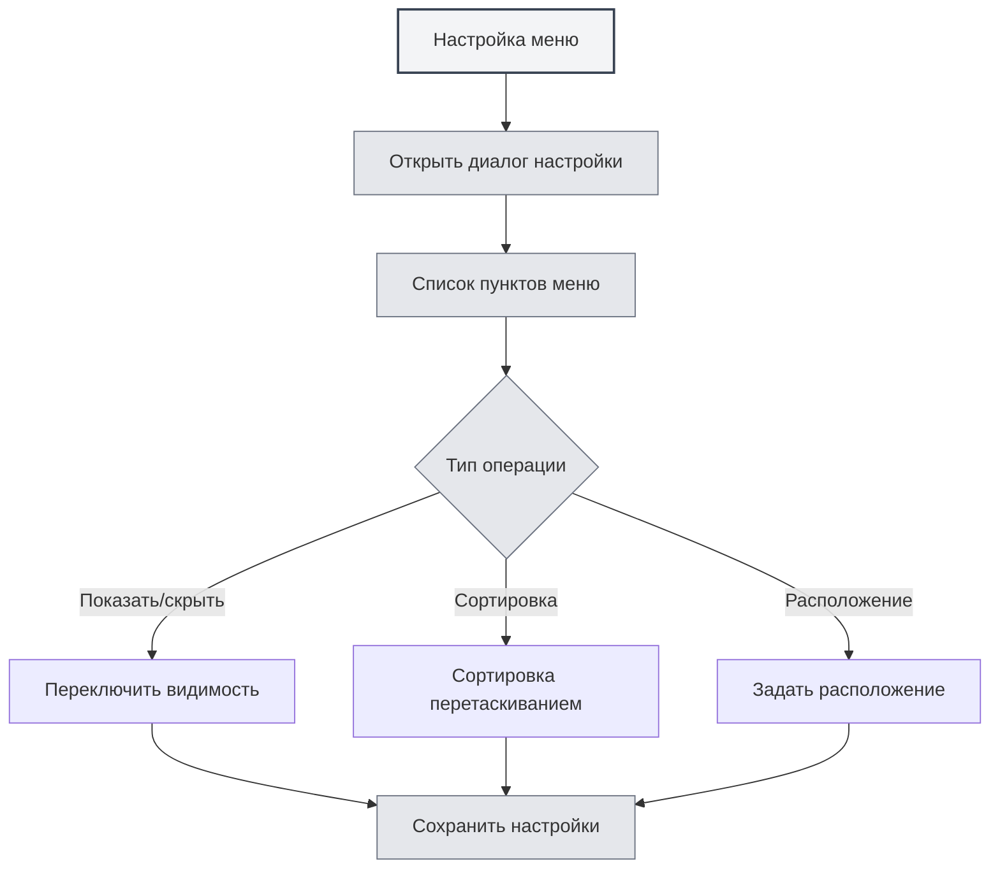

# Настройка меню

## Обзор

Функция настройки меню позволяет настраивать отображение и порядок элементов в левом меню. С помощью настройки меню вы можете скрывать ненужные пункты, изменять их порядок, задавать расположение, создавая персонализированный макет интерфейса.

## Открытие настройки меню

### Способы доступа

Открыть настройку меню можно следующими способами:

- **Страница настроек**: на странице настроек может быть вход в настройку меню
- **Опция меню**: в левом меню в разделе "Дополнительные функции" может быть опция настройки меню
- **Контекстное меню**: некоторые пункты меню могут иметь опции настройки

Вы можете получить доступ к настройке меню через верхнюю панель меню:

<MenuItemsDemo mode="demo" :items='[{"id": "settings"}]' />

## Управление пунктами меню

### Список пунктов меню

На странице настройки меню отображаются все настраиваемые пункты:

- **Название пункта**: отображает название пункта меню
- **Видимость**: показывает, видим ли пункт меню
- **Расположение**: показывает расположение пункта (верх/низ)
- **Ключевой идентификатор**: идентифицирует ключевые пункты меню (нельзя скрыть)

### Типы пунктов меню

Пункты меню делятся на два типа:

- **Ключевые пункты меню**: обязательные для отображения пункты, их нельзя скрыть
  - Главная
  - Файлы
  - Настройки
  - Дополнительные функции
  - Выход
- **Обычные пункты меню**: пункты, которые можно скрыть
  - AI-помощник
  - Недавние файлы
  - База знаний
  - Рабочий каталог
  - Руководство пользователя
  - Обратная связь
  - Статистика LLM
  - Инструменты отладки (среда разработки)

## Показать/скрыть пункты меню

### Скрытие пунктов меню

Можно скрыть ненужные пункты меню:

1. **Открыть настройку**: откройте диалог настройки меню
2. **Найти пункт**: найдите пункт меню, который нужно скрыть
3. **Переключить видимость**: переключите переключатель видимости пункта
4. **Сохранить настройки**: нажмите кнопку "Сохранить"

<DialogDemo mode="demo" dialogType="menu-config" />

### Отображение пунктов меню

Можно показать ранее скрытые пункты меню:

1. **Открыть настройку**: откройте диалог настройки меню
2. **Найти пункт**: найдите пункт меню, который нужно показать
3. **Переключить видимость**: переключите переключатель видимости пункта
4. **Сохранить настройки**: нажмите кнопку "Сохранить"

### Ограничения для ключевых пунктов меню

Ключевые пункты меню нельзя скрыть:

- **Принудительное отображение**: ключевые пункты меню всегда отображаются
- **Невозможно скрыть**: переключатель видимости для ключевых пунктов будет отключен
- **Автовосстановление**: при попытке скрыть ключевой пункт меню он автоматически вернется в состояние "показан"

## Сортировка пунктов меню

### Сортировка перетаскиванием

Можно изменить порядок пунктов меню путем перетаскивания:

1. **Открыть настройку**: откройте диалог настройки меню
2. **Перетащить пункт**: нажмите и перетащите маркер перетаскивания пункта меню
3. **Изменить позицию**: перетащите пункт меню в целевую позицию
4. **Сохранить настройки**: нажмите кнопку "Сохранить"

### Правила сортировки

Сортировка пунктов меню следует следующим правилам:

- **Группировка по расположению**: пункты верхнего и нижнего меню сортируются отдельно
- **Разделитель**: между верхней и нижней частью будет разделительная линия
- **Автоматическая корректировка**: при перетаскивании в другую позицию атрибут расположения изменится автоматически

## Настройка расположения пунктов меню

### Типы расположения

Для пунктов меню можно задать два типа расположения:

- **Верх**: отображается в верхней области панели меню
- **Низ**: отображается в нижней области панели меню

### Установка расположения

Можно задать расположение пункта меню:

1. **Открыть настройку**: откройте диалог настройки меню
2. **Перетащить в область**: перетащите пункт меню в верхнюю или нижнюю область
3. **Автоматическая корректировка**: система автоматически скорректирует атрибут расположения
4. **Сохранить настройки**: нажмите кнопку "Сохранить"

<LeftMenu mode="demo" />

### Разделительная линия расположения

Между верхней и нижней частью будет разделительная линия:

- **Автоматическое отображение**: если есть пункты верхнего и нижнего меню, разделительная линия отобразится автоматически
- **Не перетаскивается**: разделительная линия не перетаскивается, служит для визуального разделения
- **Автоматическое скрытие**: если есть только пункты верхнего или нижнего меню, разделительная линия автоматически скроется

## Сохранение настроек

### Автоматическое сохранение

Некоторые операции сохраняют настройки автоматически:

- **Переключение видимости**: автоматическое сохранение при переключении видимости пункта меню
- **Изменение расположения**: автоматическое сохранение при изменении расположения меню

### Ручное сохранение

Также можно сохранить настройки вручную:

1. **Изменить настройки**: измените порядок и видимость пунктов меню
2. **Нажать "Сохранить"**: нажмите кнопку "Сохранить"
3. **Применение настроек**: настройки вступят в силу немедленно

### Сброс настроек

Можно сбросить настройки меню:

1. **Открыть настройку**: откройте диалог настройки меню
2. **Нажать "Сбросить"**: нажмите кнопку "Сбросить"
3. **Подтвердить сброс**: подтвердите операцию сброса
4. **Восстановить по умолчанию**: настройки вернутся к состоянию по умолчанию

**Важные замечания**:

- Операция сброса необратима
- После сброса ключевые пункты меню останутся видимыми

<DialogDemo mode="demo" dialogType="confirm-reset" />

## Сохранение настроек

### Хранение настроек

Настройки меню сохраняются локально:

- **Локальное хранилище**: настройки сохраняются в локальных параметрах
- **Автозагрузка**: при следующем запуске приложения настройки загрузятся автоматически
- **Синхронизация между окнами**: настройки синхронизируются между всеми окнами

### Миграция настроек

Настройки из старых версий мигрируют автоматически:

- **Миграция расположения**: расположение "middle" из старых версий автоматически мигрирует в "bottom"
- **Обработка совместимости**: система автоматически обрабатывает формат настроек старых версий
- **Плавное обновление**: после обновления настройки автоматически адаптируются к новой версии

## Рекомендации

1. **Упрощение меню**: скрывайте редко используемые пункты меню для поддержания чистоты интерфейса
2. **Рациональная сортировка**: размещайте часто используемые пункты меню в начале для удобного доступа
3. **Группировка по расположению**: размещайте связанные пункты меню в одной области расположения
4. **Регулярная корректировка**: периодически корректируйте настройки меню в соответствии с привычками использования
5. **Резервное копирование настроек**: важные настройки можно резервировать для удобного восстановления

## Важные замечания

1. **Ключевые пункты меню**: ключевые пункты меню нельзя скрыть, они должны отображаться
2. **Сохранение настроек**: некоторые операции сохраняются автоматически, некоторые требуют ручного сохранения
3. **Операция сброса**: операция сброса необратима, используйте с осторожностью
4. **Синхронизация между окнами**: настройки синхронизируются между всеми окнами
5. **Инструменты разработки**: инструменты отладки отображаются только в среде разработки

## Связанная документация

- [[settings.basic|Базовые настройки]]
- [[core.multi-tab|Управление вкладками]]

<MainTabs mode="demo" />

<LeftMenu mode="demo" />

<MenuItemsDemo mode="demo" :items='[{"id": "settings"}]' />

<DialogDemo mode="demo" dialogType="menu-config" />

<MenuItemsDemo mode="demo" :items='[{"id": "file", "items": ["new", "open"]}]' />

<DialogDemo mode="demo" dialogType="confirm-reset" />
