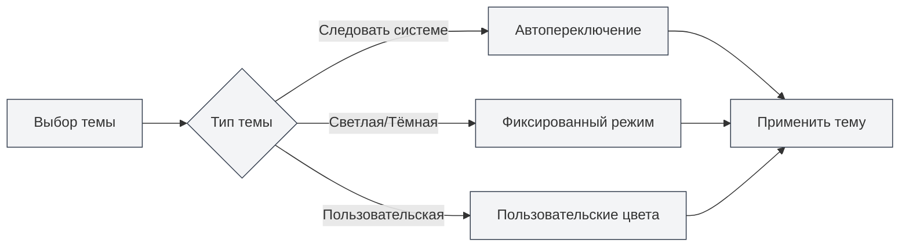

# Настройка темы

## Обзор

Настройка темы позволяет настроить внешний вид MetaDoc, включая глобальную тему, тему содержимого, тему кода и т.д. Правильная настройка темы может улучшить опыт использования и снизить зрительную усталость.

## Глобальная тема

### Типы тем

MetaDoc поддерживает следующие типы глобальных тем:

- **Следовать системной светлой/тёмной теме**: автоматически следует светлому/тёмному режиму операционной системы
- **Следовать системному цвету**: следует цвету темы операционной системы (Windows 11)
- **Светлая**: всегда использовать светлую тему
- **Тёмная**: всегда использовать тёмную тему
- **Пользовательская**: использовать пользовательские цвета темы

### Выбор темы

1. На странице настроек темы просмотрите карточки тем
2. Нажмите на карточку темы, которую хотите использовать
3. Тема будет применена немедленно

Вы можете получить доступ к настройкам темы через верхнюю строку меню:

<MenuItemsDemo mode="demo" :items='[{"id": "settings"}]' />

### Предпросмотр светлой темы

<SettingThemeSection mode="demo" theme="light" />

### Предпросмотр тёмной темы

<SettingThemeSection mode="demo" theme="dark" />

### Интерфейс настроек темы

На рисунке ниже показан полный интерфейс страницы настроек темы:

<SettingThemeSection mode="demo" />

<ViewMenuItemsDemo mode="demo" :items='["editor", "outline"]' />

Интерфейс настроек темы включает следующие основные функциональные области:

- **Глобальная тема**: выбор светлой, тёмной темы, следования системе или пользовательской темы
- **Тема содержимого**: настройка темы отображения области редактора
- **Тема кода**: выбор темы подсветки синтаксиса для блоков кода
- **Отображение номеров строк**: управление отображением номеров строк в блоках кода
- **Пользовательская тема**: создание и управление пользовательскими цветовыми темами

### Предпросмотр темы

Каждая карточка темы отображает:

- **Предпросмотр цвета темы**: показывает основной цвет темы
- **Название темы**: отображает название темы
- **Метка выбора**: текущая используемая тема будет отмечена

## Тема содержимого

<SettingThemeSection mode="demo" />

### Настройка темы содержимого

Тема содержимого управляет темой отображения области редактирования документа:

- **Авто**: следует глобальной теме
- **Светлая**: всегда использовать светлую тему содержимого
- **Тёмная**: всегда использовать тёмную тему содержимого

### Сценарии использования

- **Глобальная тёмная, содержимое светлое**: подходит для редактирования светлых документов в тёмной среде
- **Глобальная светлая, содержимое тёмное**: подходит для редактирования тёмных документов в светлой среде
- **Автоматический режим**: тема содержимого автоматически следует глобальной теме

## Тема кода

<SettingThemeSection mode="demo" />

### Настройка темы кода

Тема кода управляет темой подсветки синтаксиса для блоков кода:

- **Авто**: автоматический выбор в зависимости от глобальной темы
- **Пользовательская**: выбор из списка тем кода

### Список тем кода

MetaDoc поддерживает множество тем кода, включая:

- **Светлые темы**: GitHub, VS, OneLight и др.
- **Тёмные темы**: Monokai, Dracula, OneDark и др.

### Рекомендации по выбору

- **Светлый документ**: используйте светлую тему кода
- **Тёмный документ**: используйте тёмную тему кода
- **Автоматический режим**: позвольте системе выбрать автоматически для сохранения согласованности

## Отображение номеров строк

<SettingThemeSection mode="demo" />

### Показывать номера строк

При включении опции "Показывать номера строк в блоке кода" в блоках кода будут отображаться номера строк:

- **Включено**: номера строк отображаются слева от блока кода
- **Выключено**: номера строк не отображаются

### Сценарии использования

- **Отладка кода**: номера строк помогают определить местоположение кода
- **Обмен кодом**: номера строк облегчают ссылки на конкретные строки
- **Чтение кода**: номера строк помогают понять структуру кода

## Переключение темы

<SettingThemeSection mode="demo" />

<ViewMenuItemsDemo mode="demo" :items='["editor", "outline"]' />

### Переключение в реальном времени

Переключение темы вступает в силу немедленно:

1. Выберите новую тему
2. Интерфейс немедленно обновится
3. Тема будет применена синхронно во всех окнах

### Синхронизация темы

- **Синхронизация нескольких окон**: все окна автоматически синхронизируют тему
- **Сохранение настроек**: выбор темы автоматически сохраняется
- **Следующий запуск**: при следующем запуске будет использована последняя выбранная тема

## Предустановленные темы

<SettingThemeSection mode="demo" />

### Встроенные темы

MetaDoc предоставляет несколько предустановленных тем:

- **Светлые темы**: подходят для яркой среды
- **Тёмные темы**: подходят для тёмной среды
- **Синхронизация с системой**: автоматическое следование системным настройкам

### Особенности предустановленных тем

- **Оптимизированная палитра**: тщательно продуманные цветовые схемы
- **Забота о зрении**: снижение зрительной усталости
- **Согласованность**: обеспечение единообразия элементов интерфейса

## Рекомендации

1. **Адаптация к среде**: выбирайте тему в зависимости от условий использования
2. **Соответствие содержимому**: тема содержимого должна соответствовать типу документа
3. **Читаемость кода**: выбирайте тему кода с высокой читаемостью
4. **Периодическая корректировка**: корректируйте настройки темы на основе опыта использования

## Важные замечания

1. **Совместимость с системой**: для следования системной теме требуется поддержка со стороны операционной системы
2. **Согласованность тем**: рекомендуется сохранять согласованность между глобальной темой и темой содержимого
3. **Тема кода**: тема кода влияет на читаемость кода
4. **Пользовательская тема**: пользовательские темы требуют ручного создания и управления

## Связанная документация

- [[settings.theme-custom|Управление пользовательскими темами]]
- [[settings.basic|Базовые настройки]]
- [[core.editor-settings|Настройки редактора]]
