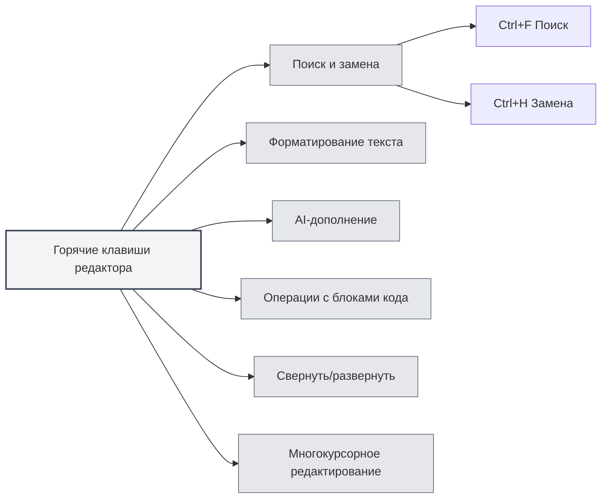

# Горячие клавиши редактора

## Обзор

Горячие клавиши редактора — это сочетания клавиш, используемые в интерфейсе редактора, включая функции редактирования текста, поиска и замены, форматирования и другие. Уверенное владение этими горячими клавишами может повысить эффективность редактирования.

<MenuItemsDemo mode="demo" :items='[{"id": "edit"}]' />

<ViewMenuItemsDemo mode="demo" :items='["editor", "outline"]' />

**Примечание**: Поиск/замена (Ctrl+F, Ctrl+H) реализованы на глобальном уровне приложения; функции жирного/курсив/ссылка/блок кода и т.д. предоставляются базовым редактором (для Markdown используется Vditor, для LaTeX — Monaco). Если они не работают, ориентируйтесь на фактическое поведение редактора.

## Поиск и замена

### Поиск

- **Горячая клавиша**: `Ctrl+F` (Windows/Linux) или `Cmd+F` (macOS)
- **Функция**: Открыть диалоговое окно поиска
- **Сценарий использования**: Поиск определенного текста в документе

### Поиск и замена

- **Горячая клавиша**: `Ctrl+H` (Windows/Linux) или `Cmd+H` (macOS)
- **Функция**: Открыть диалоговое окно поиска и замены
- **Сценарий использования**: Найти и заменить текст

### Функции поиска

Диалоговое окно поиска поддерживает следующие функции:

- **Поиск текста**: Введите текст для поиска
- **Замена текста**: Введите текст для замены
- **Регулярные выражения**: Поддержка поиска по регулярным выражениям
- **Учет регистра**: Различать заглавные и строчные буквы
- **Полное слово**: Сопоставлять целые слова

Интерфейс меню поиска и замены выглядит следующим образом:

<SearchReplaceMenu mode="demo" :position='{"top": 100, "left": 200}' :adapter='null' />

<SearchReplaceMenu mode="demo" :position='{"top": 150, "left": 200}' :adapter='null' />

## Форматирование текста

<TextFormatToolbar mode="demo" />

### Жирный шрифт

- **Горячая клавиша**: `Ctrl+B` (Windows/Linux) или `Cmd+B` (macOS)
- **Функция**: Сделать выделенный текст жирным
- **Сценарий использования**: Выделение важного содержания

### Курсив

- **Горячая клавиша**: `Ctrl+I` (Windows/Linux) или `Cmd+I` (macOS)
- **Функция**: Сделать выделенный текст курсивом
- **Сценарий использования**: Обозначение цитаты или выделение

### Вставить ссылку

- **Горячая клавиша**: `Ctrl+K` (Windows/Linux) или `Cmd+K` (macOS)
- **Функция**: Вставить ссылку
- **Сценарий использования**: Добавление гиперссылки

**Важно**: Это сочетание клавиш может конфликтовать с "Сохранить всё" (Ctrl+K S). Необходимо сначала нажать Ctrl+K, а затем K, а не одновременно.

## AI-дополнение

<AISuggestionGhost mode="demo" />

<CompletionSettingsPanel mode="demo" />

### Ручной запуск дополнения

- **Горячая клавиша**: `Shift+Tab`
- **Функция**: Вручную запустить AI-автодополнение
- **Сценарий использования**: Ручной запуск, когда требуется AI-дополнение

### Клавиши запуска дополнения

AI-дополнение также может автоматически запускаться при нажатии следующих клавиш:

- **Enter**: Запуск по клавише Enter
- **Space**: Запуск по клавише пробела
- **Точка с запятой**: Запуск по точке с запятой (;)
- **Слеш**: Запуск по слешу (/)

Эти клавиши запуска можно настроить в [[settings.llm|конфигурации LLM]].

## Операции с блоками кода

### Вставить блок кода

- **Горячая клавиша**: `Ctrl+Shift+K` (Редактор Markdown)
- **Функция**: Вставить блок кода
- **Сценарий использования**: Добавление примера кода

## Свернуть/развернуть

### Свернуть блок кода

- **Горячая клавиша**: `Ctrl+Shift+[` (Windows/Linux) или `Cmd+Option+[` (macOS)
- **Функция**: Свернуть текущий блок кода или окружение
- **Сценарий использования**: Скрытие кода, который не нужно просматривать

### Развернуть блок кода

- **Горячая клавиша**: `Ctrl+Shift+]` (Windows/Linux) или `Cmd+Option+]` (macOS)
- **Функция**: Развернуть свернутый блок кода или окружение
- **Сценарий использования**: Просмотр свернутого содержимого

## Многокурсорное редактирование

### Выделить все одинаковые слова

- **Горячая клавиша**: `Ctrl+Shift+L` (Windows/Linux) или `Cmd+Shift+L` (macOS)
- **Функция**: Выделить все одинаковые слова в документе и добавить курсоры
- **Сценарий использования**: Массовое редактирование одинакового текста

## Отмена и повтор

### Отмена

- **Горячая клавиша**: `Ctrl+Z` (Windows/Linux) или `Cmd+Z` (macOS)
- **Функция**: Отменить последнее действие
- **Сценарий использования**: Отмена ошибочного действия

### Повтор

- **Горячая клавиша**: `Ctrl+Y` или `Ctrl+Shift+Z` (Windows/Linux) или `Cmd+Shift+Z` (macOS)
- **Функция**: Повторить отмененное действие
- **Сценарий использования**: Восстановление отмененного действия

## Операции выделения

### Выделить все

- **Горячая клавиша**: `Ctrl+A` (Windows/Linux) или `Cmd+A` (macOS)
- **Функция**: Выделить весь текст
- **Сценарий использования**: Выделение всего содержимого для копирования или удаления

### Копировать

- **Горячая клавиша**: `Ctrl+C` (Windows/Linux) или `Cmd+C` (macOS)
- **Функция**: Копировать выделенный текст
- **Сценарий использования**: Копирование содержимого в буфер обмена

### Вставить

- **Горячая клавиша**: `Ctrl+V` (Windows/Linux) или `Cmd+V` (macOS)
- **Функция**: Вставить содержимое буфера обмена
- **Сценарий использования**: Вставка скопированного содержимого

### Вырезать

- **Горячая клавиша**: `Ctrl+X` (Windows/Linux) или `Cmd+X` (macOS)
- **Функция**: Вырезать выделенный текст
- **Сценарий использования**: Перемещение текстового содержимого

## Список горячих клавиш редактора

### Горячие клавиши Windows/Linux

| Функция                     | Горячая клавиша             |
| --------------------------- | --------------------------- |
| Поиск                       | `Ctrl+F`                    |
| Поиск и замена              | `Ctrl+H`                    |
| Жирный шрифт                | `Ctrl+B`                    |
| Курсив                      | `Ctrl+I`                    |
| Вставить ссылку             | `Ctrl+K`                    |
| Вставить блок кода          | `Ctrl+Shift+K`              |
| Свернуть                    | `Ctrl+Shift+[`              |
| Развернуть                  | `Ctrl+Shift+]`              |
| Выделить все одинаковые слова | `Ctrl+Shift+L`              |
| Отмена                      | `Ctrl+Z`                    |
| Повтор                      | `Ctrl+Y` или `Ctrl+Shift+Z` |
| Выделить все                | `Ctrl+A`                    |
| Копировать                  | `Ctrl+C`                    |
| Вставить                    | `Ctrl+V`                    |
| Вырезать                    | `Ctrl+X`                    |
| AI-дополнение               | `Shift+Tab`                 |

### Горячие клавиши macOS

| Функция                     | Горячая клавиша     |
| --------------------------- | ------------------- |
| Поиск                       | `Cmd+F`             |
| Поиск и замена              | `Cmd+H`             |
| Жирный шрифт                | `Cmd+B`             |
| Курсив                      | `Cmd+I`             |
| Вставить ссылку             | `Cmd+K`             |
| Вставить блок кода          | `Cmd+Shift+K`       |
| Свернуть                    | `Cmd+Option+[`      |
| Развернуть                  | `Cmd+Option+]`      |
| Выделить все одинаковые слова | `Cmd+Shift+L`       |
| Отмена                      | `Cmd+Z`             |
| Повтор                      | `Cmd+Shift+Z`       |
| Выделить все                | `Cmd+A`             |
| Копировать                  | `Cmd+C`             |
| Вставить                    | `Cmd+V`             |
| Вырезать                    | `Cmd+X`             |
| AI-дополнение               | `Shift+Tab`         |

## Специфичные горячие клавиши редактора Markdown

<LaTeXEditorDemo mode="demo" />

### Горячие клавиши Vditor

Редактор Markdown основан на Vditor и поддерживает следующие горячие клавиши:

- **Жирный шрифт**: `Ctrl+B`
- **Курсив**: `Ctrl+I`
- **Вставить ссылку**: `Ctrl+K`
- **Вставить блок кода**: `Ctrl+Shift+K`

## Специфичные горячие клавиши редактора LaTeX

<LaTeXEditorDemo mode="demo" />

### Горячие клавиши редактора Monaco

Редактор LaTeX основан на Monaco Editor и поддерживает следующие горячие клавиши:

- **Свернуть**: `Ctrl+Shift+[`
- **Развернуть**: `Ctrl+Shift+]`
- **Выделить все одинаковые слова**: `Ctrl+Shift+L`
- **Многокурсорное редактирование**: `Alt+Click` для добавления курсора

## Советы по использованию горячих клавиш

<LaTeXEditorDemo mode="demo" />

<Outline mode="demo" />

### Комбинированное использование

Можно комбинировать несколько горячих клавиш:

1. **Найти и заменить**: `Ctrl+H` для открытия поиска и замены, затем используйте Tab для переключения между полями ввода.
2. **Форматирование текста**: Выделите текст и используйте `Ctrl+B` или `Ctrl+I` для форматирования.
3. **Массовое редактирование**: Используйте `Ctrl+Shift+L` для выделения всех одинаковых слов, затем редактируйте их одновременно.

### Запоминание горячих клавиш

- **Форматирование**: B (Bold — жирный), I (Italic — курсив) соответствуют жирному шрифту и курсиву.
- **Поиск**: F (Find — найти), H (Hunt / найти и заменить).
- **Свернуть**: `[` и `]` соответствуют свертыванию и развертыванию.

## Лучшие практики

<MainTabs mode="demo" />

1. **Уверенное использование**: Уверенно владейте часто используемыми горячими клавишами редактирования.
2. **Комбинированные операции**: Сочетайте несколько горячих клавиш для выполнения сложного редактирования.
3. **Массовое редактирование**: Используйте функцию многокурсорности для массового редактирования.
4. **Быстрое форматирование**: Используйте горячие клавиши для быстрого форматирования текста.
5. **Поиск и замена**: Используйте функцию поиска и замены для повышения эффективности.

## Важные замечания

1. **Различия платформ**: В Windows/Linux используется Ctrl, в macOS — Cmd.
2. **Конфликты горячих клавиш**: Некоторые сочетания клавиш могут конфликтовать с функциями редактора.
3. **Контекстная зависимость**: Некоторые горячие клавиши работают только в определенном контексте.
4. **Различия редакторов**: Поддерживаемые горячие клавиши могут различаться в редакторах Markdown и LaTeX.
5. **AI-дополнение**: Shift+Tab — это ручной запуск, для автоматического запуска необходимо настроить клавиши триггера.

## Связанная документация

- [[shortcuts.global|Глобальные горячие клавиши]]
- [[core.editor-basics|Основные операции редактора]]
- [[markdown.features|Функции редактора Markdown]]
- [[ai.completion|AI-автодополнение]]

<MenuItemsDemo mode="demo" :items='[{"id": "file"}]' />

<ViewMenuItemsDemo mode="demo" :items='["editor"]' />

<AISuggestionGhost mode="demo" />

<CompletionSettingsPanel mode="demo" />

<LaTeXEditorDemo mode="demo" />