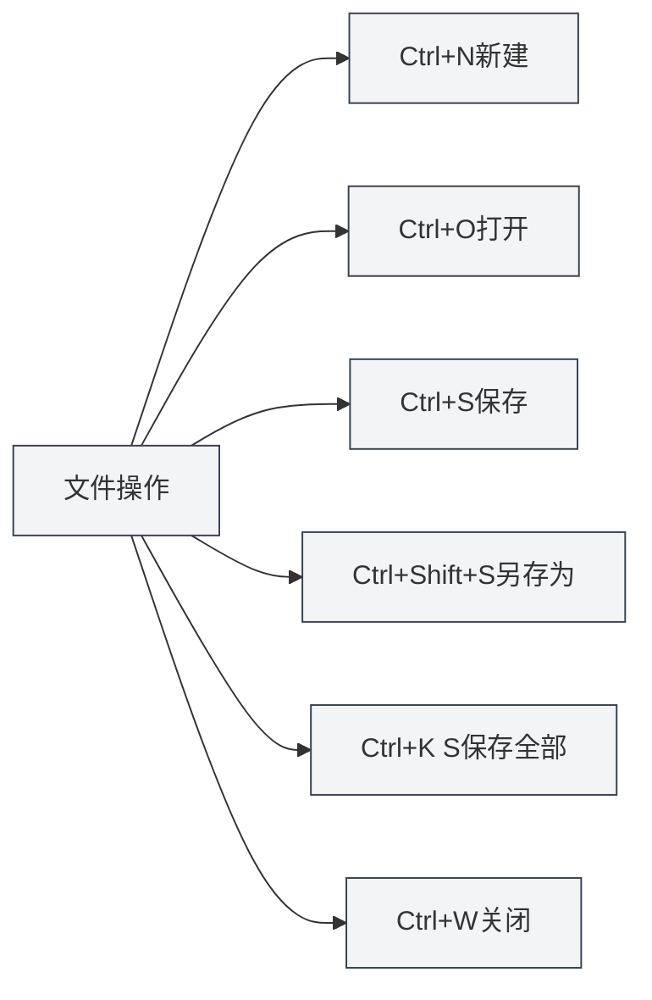

# Глобальные горячие клавиши

## Обзор

Глобальные горячие клавиши — это сочетания клавиш в MetaDoc, которые можно использовать в любом интерфейсе. Уверенное владение этими сочетаниями может значительно повысить эффективность работы.

**Примечание**: Сочетания клавиш в этом документе сверены с текущей реализацией кода, все они реализованы и доступны в основном процессе или процессе рендеринга.

## Операции с файлами

### Создать документ

- **Сочетание клавиш**: `Ctrl+N` (Windows/Linux) или `Cmd+N` (macOS)
- **Функция**: Создать новый пустой документ
- **Сценарий использования**: Быстро начать редактирование нового документа

### Открыть документ

- **Сочетание клавиш**: `Ctrl+O` (Windows/Linux) или `Cmd+O` (macOS)
- **Функция**: Открыть диалоговое окно выбора файла
- **Сценарий использования**: Открыть существующий документ

### Сохранить документ

- **Сочетание клавиш**: `Ctrl+S` (Windows/Linux) или `Cmd+S` (macOS)
- **Функция**: Сохранить текущий документ
- **Сценарий использования**: Сохранить редактируемое содержимое, чтобы предотвратить потерю данных

### Сохранить как

- **Сочетание клавиш**: `Ctrl+Shift+S` (Windows/Linux) или `Cmd+Shift+S` (macOS)
- **Функция**: Сохранить текущий документ как новый файл
- **Сценарий использования**: Создать копию документа или изменить место сохранения

### Сохранить все документы

- **Сочетание клавиш**: `Ctrl+K S` (Windows/Linux) или `Cmd+K S` (macOS)
- **Функция**: Сохранить все открытые документы
- **Инструкция по использованию**: Сначала нажмите `Ctrl+K` (или `Cmd+K`), затем нажмите `S`
- **Сценарий использования**: Сохранить все документы за один раз

<MenuItemsDemo mode="demo" :items='[{"id": "file", "items": ["save-all"]}]' />

### Закрыть файл

- **Сочетание клавиш**: `Ctrl+W` (Windows/Linux) или `Cmd+W` (macOS)
- **Функция**: Закрыть текущую вкладку
- **Сценарий использования**: Закрыть ненужный документ

## Операции с вкладками

Панель вкладок отображает все открытые документы и поддерживает такие операции, как создание, переключение, закрытие:

<MainTabs mode="demo" />

<ViewMenuItemsDemo mode="demo" :items='["editor", "outline"]' />

### Создать новую вкладку

- **Сочетание клавиш**: `Ctrl+T` (Windows/Linux) или `Cmd+T` (macOS)
- **Функция**: Создать новую вкладку
- **Сценарий использования**: Быстро создать новый документ

### Переключение вкладок

#### Следующая вкладка

- **Сочетание клавиш**: `Ctrl+Tab` (Windows/Linux) или `Cmd+Tab` (macOS)
- **Функция**: Переключиться на следующую вкладку
- **Инструкция по использованию**: Удерживание `Ctrl+Tab` отображает всплывающий слой переключения вкладок, можно продолжить нажимать Tab для выбора или просто щелкнуть
- **Сценарий использования**: Быстрое переключение между несколькими документами

<TabSwitcherOverlay mode="demo" />

#### Предыдущая вкладка

- **Сочетание клавиш**: `Ctrl+Shift+Tab` (Windows/Linux) или `Cmd+Shift+Tab` (macOS)
- **Функция**: Переключиться на предыдущую вкладку
- **Сценарий использования**: Обратное переключение вкладок

### Повторно открыть закрытую вкладку

- **Сочетание клавиш**: `Ctrl+Shift+T` (Windows/Linux) или `Cmd+Shift+T` (macOS)
- **Функция**: Повторно открыть последнюю закрытую вкладку
- **Инструкция по использованию**: Можно использовать последовательно, чтобы восстановить последние закрытые вкладки по порядку (максимум 20)
- **Сценарий использования**: Быстрое восстановление после случайного закрытия вкладки

<MainTabs mode="demo" />

## Другие горячие клавиши

### Открыть руководство пользователя

- **Сочетание клавиш**: `F1`
- **Функция**: Открыть страницу руководства пользователя
- **Сценарий использования**: Когда необходимо просмотреть справочную документацию

<MenuItemsDemo mode="demo" :items='[{"id": "help"}]' />

## Список горячих клавиш

### Сочетания клавиш для Windows/Linux

| Функция                     | Сочетание клавиш    |
| --------------------------- | ------------------- |
| Создать документ            | `Ctrl+N`            |
| Открыть документ            | `Ctrl+O`            |
| Сохранить документ          | `Ctrl+S`            |
| Сохранить как               | `Ctrl+Shift+S`      |
| Сохранить все               | `Ctrl+K S`          |
| Закрыть вкладку             | `Ctrl+W`            |
| Создать новую вкладку       | `Ctrl+T`            |
| Следующая вкладка           | `Ctrl+Tab`          |
| Предыдущая вкладка          | `Ctrl+Shift+Tab`    |
| Повторно открыть закрытую   | `Ctrl+Shift+T`      |
| Открыть руководство         | `F1`                |

### Сочетания клавиш для macOS

| Функция                     | Сочетание клавиш    |
| --------------------------- | ------------------- |
| Создать документ            | `Cmd+N`             |
| Открыть документ            | `Cmd+O`             |
| Сохранить документ          | `Cmd+S`             |
| Сохранить как               | `Cmd+Shift+S`       |
| Сохранить все               | `Cmd+K S`           |
| Закрыть вкладку             | `Cmd+W`             |
| Создать новую вкладку       | `Cmd+T`             |
| Следующая вкладка           | `Cmd+Tab`           |
| Предыдущая вкладка          | `Cmd+Shift+Tab`     |
| Повторно открыть закрытую   | `Cmd+Shift+T`       |
| Открыть руководство         | `F1`                |

## Советы по использованию горячих клавиш

### Последовательность нажатия комбинаций

Некоторые сочетания клавиш требуют последовательного нажатия:

- **Сохранить все**: Сначала нажмите `Ctrl+K`, затем нажмите `S` (не одновременно)
- **Переключение вкладок**: Удерживайте `Ctrl+Tab` для отображения всплывающего слоя, затем продолжайте нажимать Tab для выбора

### Настройка горячих клавиш

Вы можете управлять глобальными горячими клавишами в **Настройки → Горячие клавиши**:

- **Схемы клавиш**: Программа предоставляет три схемы по умолчанию: Windows, Linux, macOS. При первом запуске автоматически выбирается в соответствии с текущей системой.
- **Создание/редактирование схемы**: Можно создать пользовательскую схему и изменить клавиши для каждого действия.
- **Импорт/экспорт**: Поддерживается экспорт схемы в файл JSON или импорт схемы из файла.
- **Восстановить по умолчанию**: Для каждого пункта сочетания клавиш, если он отличается от схемы по умолчанию, можно нажать «Восстановить по умолчанию».

После изменения схемы необходимо нажать «Сохранить» внизу, чтобы изменения вступили в силу.

### Конфликты горячих клавиш

Если горячая клавиша конфликтует с системой или другим программным обеспечением:

- **Системные горячие клавиши**: Некоторые системные сочетания клавиш могут иметь приоритет.
- **Другое ПО**: Закройте конфликтующее программное обеспечение или измените его горячие клавиши.
- **Пользовательские горячие клавиши**: В **Настройки → Горячие клавиши** можно изменить на другие клавиши.

### Советы по запоминанию

- **Операции с файлами**: Используйте стандартные сочетания клавиш для операций с файлами (Ctrl+N/O/S).
- **Операции с вкладками**: Используйте комбинации, связанные с клавишей Tab.
- **Сохранить все**: Используйте Ctrl+K в качестве префикса команды.

## Лучшие практики

1.  **Уверенное использование**: Уверенно владейте часто используемыми горячими клавишами для повышения эффективности.
2.  **Комбинированное использование**: Сочетайте несколько горячих клавиш для выполнения сложных операций.
3.  **Переключение вкладок**: Используйте Ctrl+Tab для быстрого переключения, избегая операций с мышью.
4.  **Регулярное сохранение**: Выработайте привычку регулярно сохранять с помощью Ctrl+S.
5.  **Быстрое восстановление**: Используйте Ctrl+Shift+T для быстрого восстановления при случайном закрытии вкладки.

## Важные замечания

1.  **Различия платформ**: В Windows/Linux используется Ctrl, в macOS — Cmd.
2.  **Конфликты горячих клавиш**: Обращайте внимание на конфликты с горячими клавишами другого программного обеспечения.
3.  **Последовательность комбинаций**: Некоторые горячие клавиши требуют последовательного нажатия.
4.  **Переключение вкладок**: Ctrl+Tab отображает всплывающий слой, можно продолжить выбор.
5.  **Сохранить все**: Для Ctrl+K S нужно сначала нажать Ctrl+K, затем S.

## Связанная документация

- [[shortcuts.editor|Горячие клавиши редактора]]
- [[core.file-operations|Операции с файлами]]
- [[core.multi-tab|Управление несколькими вкладками]]

<MenuItemsDemo mode="demo" :items='[{"id": "file"}]' />

<MainTabs mode="demo" />

<ViewMenuItemsDemo mode="demo" :items='["editor", "outline", "agent"]' />

