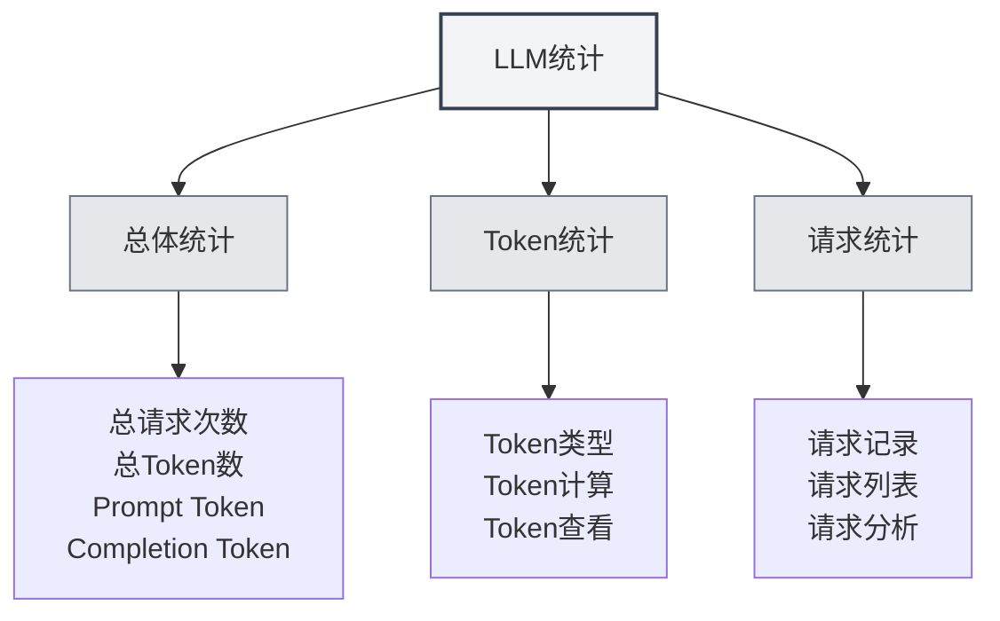

# Статистика LLM

## Обзор

Функция статистики LLM предназначена для отслеживания и просмотра использования LLM API, включая информацию об использовании токенов, количестве запросов, статистике затрат и т.д. Эти статистические данные помогают понять использование LLM и оптимизировать стратегию его применения.

## Открытие статистики LLM

### Способы доступа

Открыть страницу статистики LLM можно следующими способами:

- **Страница настроек**: на странице настроек может быть вход в статистику LLM
- **Пункты меню**: в некоторых меню может быть опция статистики LLM
- **Горячие клавиши**: в некоторых случаях могут быть горячие клавиши (возможно, будут поддерживаться в будущем)

<SettingLlmSection mode="demo" />

## Статистическая информация

<LlmStatisticsView mode="demo" />

<LlmStatisticsContent mode="demo" />

### Общая статистика

На странице статистики LLM отображается следующая общая статистическая информация:

- **Общее количество запросов**: общее количество всех запросов к LLM
- **Общее количество токенов**: общее количество токенов, использованных во всех запросах
- **Prompt Token**: общее количество Prompt Token для всех запросов
- **Completion Token**: общее количество Completion Token для всех запросов

### Фильтрация по временному диапазону

Статистические данные можно фильтровать по временному диапазону:

- **За всё время**: просмотр статистики за всё время
- **Сегодня**: просмотр статистики за сегодня
- **Эта неделя**: просмотр статистики за текущую неделю
- **Этот месяц**: просмотр статистики за текущий месяц
- **Пользовательский диапазон**: выбор пользовательской начальной и конечной даты

### Статистические графики

<ChartGenerationDisplay mode="demo" />

На странице статистики могут присутствовать следующие графики:

- **Тренд использования токенов**: показывает тенденцию изменения объёма использования токенов с течением времени
- **Тренд количества запросов**: показывает тенденцию изменения количества запросов с течением времени
- **Распределение использования моделей**: показывает использование различных моделей
- **Распределение типов запросов**: показывает распределение запросов различных типов

## Статистика токенов

<DataAnalysisDisplay mode="demo" />

### Типы токенов

Статистика токенов включает следующие типы:

- **Prompt Token**: количество токенов во входном промпте
- **Completion Token**: количество токенов в сгенерированном контенте
- **Total Token**: общее количество токенов (Prompt + Completion)

### Расчёт токенов

Способ расчёта токенов:

- **Автоматическая запись**: автоматическая запись объёма использования токенов после каждого запроса к LLM
- **Обновление в реальном времени**: статистические данные обновляются в реальном времени
- **Накопительная статистика**: статистические данные рассчитываются накопительно

### Просмотр токенов

Можно просмотреть следующую информацию о токенах:

- **Общее количество токенов**: общее количество токенов для всех запросов
- **Среднее количество токенов**: среднее количество токенов на один запрос
- **Максимальное количество токенов**: максимальное количество токенов для одного запроса
- **Минимальное количество токенов**: минимальное количество токенов для одного запроса

## Статистика запросов

<LlmStatisticsContent mode="demo" />

### Запись запросов

Каждый запрос к LLM записывает следующую информацию:

- **Временная метка**: время запроса
- **Название модели**: используемое название модели
- **Тип запроса**: тип запроса (chat/completion)
- **Объём использования токенов**: объём использования токенов для данного запроса

### Список запросов

Можно просмотреть список запросов:

- **Сортировка по времени**: сортировка в обратном хронологическом порядке
- **Подробная информация**: просмотр подробной информации по каждому запросу
- **Функция фильтрации**: фильтрация запросов по модели, типу и т.д.

### Анализ запросов

Можно проводить анализ запросов:

- **Частота запросов**: анализ частоты запросов
- **Использование моделей**: анализ использования различных моделей
- **Распределение типов**: анализ распределения запросов различных типов

## Статистика затрат

<LlmStatisticsView mode="demo" />

### Расчёт затрат

Статистика затрат основана на следующей информации:

- **Объём использования токенов**: расчёт затрат на основе объёма использования токенов
- **Ценообразование моделей**: разные модели имеют разное ценообразование
- **Оценка затрат**: предоставление оценки затрат (если поддерживается)

### Просмотр затрат

Можно просмотреть следующую информацию о затратах:

- **Общие затраты**: общие затраты на все запросы
- **Среднесуточные затраты**: средние затраты в день
- **Затраты по моделям**: распределение затрат по разным моделям
- **Тренд затрат**: тенденция изменения затрат с течением времени

**Примечание**: статистика затрат приведена только для справки, фактические затраты следует сверять со счётом от провайдера API.

## Экспорт данных

<DataAnalysisDisplay mode="demo" />

### Функция экспорта

Можно экспортировать статистические данные:

- **Формат экспорта**: может поддерживаться несколько форматов (JSON, CSV и т.д.)
- **Диапазон экспорта**: можно выбрать экспорт всех данных или отфильтрованных данных
- **Содержимое экспорта**: можно выбрать, какую статистическую информацию экспортировать

### Резервное копирование данных

Статистические данные сохраняются автоматически:

- **Локальное хранение**: статистические данные сохраняются локально
- **Автосохранение**: автоматическое сохранение после каждого запроса
- **Сохранение данных**: данные сохраняются после перезапуска приложения

## Очистка статистики

### Операция очистки

Можно очистить статистические данные:

1. Откройте страницу статистики LLM
2. Найдите кнопку очистки статистики
3. Подтвердите операцию очистки
4. Статистические данные будут очищены

**Примечания**:

- Операция очистки необратима
- Перед очисткой рекомендуется сделать резервную копию данных путём экспорта
- После очистки все статистические данные будут утеряны

## Настройки статистики

### Переключатель статистики

Можно управлять функцией статистики:

- **Включить статистику**: включить статистику использования LLM
- **Отключить статистику**: отключить функцию статистики (данные не записываются)

### Точность статистики

Можно установить точность статистики:

- **Подробная запись**: запись подробной информации по каждому запросу
- **Упрощённая запись**: запись только общей статистической информации

## Рекомендации

1. **Регулярный просмотр**: регулярно просматривайте статистику использования LLM, чтобы понимать ситуацию с использованием
2. **Контроль затрат**: контролируйте объём использования на основе статистики затрат
3. **Оптимизация стратегии**: оптимизируйте стратегию использования на основе статистических данных
4. **Резервное копирование данных**: регулярно экспортируйте статистические данные для резервного копирования
5. **Рациональное использование**: рационально используйте функции LLM на основе статистической информации

## Примечания

1. **Точность статистики**: статистические данные основаны на информации о токенах, возвращаемой API
2. **Оценка затрат**: статистика затрат приведена только для справки, фактические затраты следует сверять со счётом
3. **Хранение данных**: статистические данные хранятся локально и не загружаются
4. **Защита конфиденциальности**: статистические данные не содержат конкретного контента, только информацию об объёме использования
5. **Влияние на производительность**: функция статистики оказывает минимальное влияние на производительность, можно использовать без опасений

## Связанная документация

- [[settings.llm|Настройки LLM]]
- [[ai.chat|Функция AI-диалога]]
- [[ai.completion|AI-автодополнение]]

<LlmStatisticsView mode="demo" />

<LlmStatisticsContent mode="demo" />