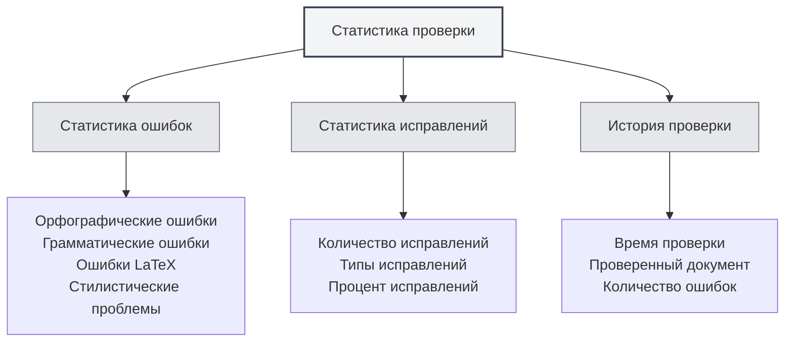

# Статистика инструмента проверки

## Обзор

Функция статистики инструмента проверки предназначена для отслеживания и просмотра данных об использовании проверки документов, включая статистику проверки орфографии, грамматики и т.д. Эти статистические данные помогают понять использование функций проверки и оптимизировать стратегию корректуры.

<ProofreadView mode="demo" />

<ProofreadDisplay mode="demo" />

<DataAnalysisDisplay mode="demo" />

## Введение в статистику проверки

### Что такое статистика проверки

Статистика проверки записывает соответствующую информацию в процессе проверки документов:

- **Статистика ошибок**: записывает количество и типы обнаруженных ошибок
- **Статистика исправлений**: записывает количество исправленных ошибок
- **История проверки**: записывает историю операций проверки

### Типы статистики

Статистика проверки включает следующие типы:

- **Орфографические ошибки**: ошибки, обнаруженные проверкой орфографии
- **Грамматические ошибки**: ошибки, обнаруженные проверкой грамматики
- **Ошибки LaTeX**: ошибки, обнаруженные проверкой синтаксиса LaTeX
- **Стилистические проблемы**: проблемы, обнаруженные проверкой стиля
- **Другие ошибки**: ошибки других типов

## Статистика ошибок

<DataAnalysisDisplay mode="demo" />

<ChartGenerationDisplay mode="demo" />

### Классификация ошибок

Инструмент проверки классифицирует и подсчитывает ошибки:

- **Орфографические ошибки**: количество орфографических ошибок в словах
- **Грамматические ошибки**: количество грамматических ошибок
- **Ошибки LaTeX**: количество синтаксических ошибок LaTeX
- **Стилистические проблемы**: количество проблем с письменным стилем
- **Другие ошибки**: количество ошибок других типов

### Подсчет ошибок

Каждая проверка подсчитывает ошибки:

- **Общее количество ошибок**: общее количество всех ошибок
- **Количество ошибок по типам**: количество ошибок каждого типа
- **Распределение ошибок**: распределение по типам ошибок

## Статистика исправлений

### Запись исправлений

Записывается информация об исправлении ошибок:

- **Количество исправлений**: количество исправленных ошибок
- **Типы исправлений**: типы исправленных ошибок
- **Процент исправлений**: доля исправленных ошибок

### История исправлений

Можно просмотреть историю исправлений:

- **Время исправления**: время исправления ошибки
- **Содержание исправления**: конкретное содержание исправления
- **Способ исправления**: способ исправления (ручной/автоматический)

## История проверки

### Запись истории

Записывается история операций проверки:

- **Время проверки**: время операции проверки
- **Проверенный документ**: документ, который был проверен
- **Количество ошибок**: количество обнаруженных ошибок
- **Количество исправлений**: количество исправленных ошибок

### Просмотр истории

Можно просмотреть историю проверки:

- **Список истории**: отображает все записи истории проверки
- **Подробная информация**: просмотр детальной информации о каждой проверке
- **Статистический анализ**: статистический анализ исторических данных

## Представление статистики

<ProofreadView mode="demo" />

### Единое представление

Единое представление отображает все ошибки:

- **Список ошибок**: отображает все ошибки в порядке их обнаружения
- **Детали ошибки**: отображает подробную информацию о каждой ошибке
- **Локализация ошибки**: можно перейти к местоположению ошибки

<DataAnalysisDisplay mode="demo" />

### Классифицированное представление

Классифицированное представление отображает ошибки по типам:

- **Группировка по типам**: ошибки отображаются сгруппированными по типам
- **Статистика по типам**: отображает количество ошибок каждого типа
- **Фильтрация по типам**: можно фильтровать ошибки определенного типа

## Экспорт статистики

### Функция экспорта

Можно экспортировать статистику проверки:

- **Формат экспорта**: может поддерживать несколько форматов (JSON, CSV и т.д.)
- **Область экспорта**: можно выбрать экспорт всех данных или отфильтрованных данных
- **Содержание экспорта**: можно выбрать, какую статистическую информацию экспортировать

<ChartGenerationDisplay mode="demo" />

## Лучшие практики

1. **Регулярная проверка**: регулярно используйте функцию проверки для контроля документов
2. **Внимание к статистике**: следите за статистикой ошибок, чтобы понимать качество документов
3. **Своевременное исправление**: обнаруженные ошибки исправляйте своевременно
4. **Анализ тенденций**: анализируйте тенденции ошибок, чтобы улучшить привычки письма
5. **Использование истории**: используйте историю записей для отслеживания улучшений документов

## Важные замечания

1. **Точность статистики**: статистические данные основаны на результатах обнаружения инструмента проверки
2. **Обработка ложных срабатываний**: некоторые обнаружения могут быть ложными, требуется ручная проверка
3. **Хранение данных**: статистические данные хранятся локально и не загружаются
4. **Защита конфиденциальности**: статистические данные не содержат конкретного содержания, только статистическую информацию
5. **Влияние на производительность**: функция статистики оказывает минимальное влияние на производительность, можно использовать без опасений

## Связанная документация

- [[ai.proofread|Функция AI-проверки]]
- [[statistics.llm|Статистика LLM]]
