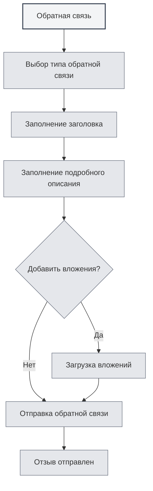

# Обратная связь от пользователей

## Обзор

Функция обратной связи позволяет вам отправлять отчёты о проблемах, предложения по функциям или другие отзывы команде MetaDoc. Ваши отзывы очень важны для нас, чтобы улучшать продукт.

## Открытие формы обратной связи

### Способы доступа

Открыть страницу обратной связи можно следующими способами:

- **Страница настроек**: Нажмите кнопку "Обратная связь" на странице настроек "О программе"
- **Пункт меню**: В некоторых меню может быть пункт для обратной связи
- **Горячая клавиша**: В некоторых случаях может быть горячая клавиша (возможно, будет поддерживаться в будущем)

<SettingAboutSection mode="demo" />

## Типы обратной связи

### Выбор типа обратной связи

При отправке отзыва необходимо выбрать тип:

- **Сообщение об ошибке (BUG)**: Сообщить об ошибке или проблеме в ПО
- **Предложение функции**: Предложить новую функцию или улучшение
- **Сообщение о безопасности**: Сообщить о проблеме безопасности
- **Другое**: Другие типы обратной связи

<DialogDemo mode="demo" dialogType="feedback" />

### Описание типов

- **Сообщение об ошибке (BUG)**: Используется для сообщения об ошибках в ПО, сбоях, аномальном поведении и т.д.
- **Предложение функции**: Используется для запроса новых функций или предложений по улучшению существующих
- **Сообщение о безопасности**: Используется для сообщения об уязвимостях или проблемах безопасности
- **Другое**: Используется для других типов обратной связи, таких как вопросы по использованию, проблемы с документацией и т.д.

## Содержание обратной связи

### Заголовок

Заголовок отзыва должен быть:

- **Кратким и понятным**: Кратко описывать проблему или предложение
- **Конкретным и чётким**: Избегать расплывчатых заголовков
- **Обязательным полем**: Заголовок является обязательным для заполнения

### Подробное описание

Подробное описание должно содержать:

- **Описание проблемы**: Чёткое описание возникшей проблемы
- **Ожидаемый результат**: Указание ожидаемого результата
- **Дополнительная информация**: Предоставление другой информации, помогающей в диагностике
- **Контактные данные**: Необязательные контактные данные для последующего взаимодействия

### Шаблон обратной связи

Система предоставляет шаблон обратной связи, содержащий следующие разделы:

- **Системная информация**: Автоматически заполняемая системная информация
- **Описание проблемы**: Область для описания проблемы
- **Ожидаемый результат**: Область для указания ожидаемого результата
- **Дополнительная информация**: Область для другой информации
- **Контактные данные**: Необязательные контактные данные

<MenuItemsDemo mode="demo" :items='[{"id": "settings"}]' />

## Загрузка вложений

### Поддержка вложений

Можно загружать вложения для пояснения проблемы:

- **Типы файлов**: Поддерживаются файлы любого типа
- **Размер файла**: Один файл не более 10 МБ
- **Общий размер**: Общий размер всех вложений не более 50 МБ
- **Количество файлов**: Максимум 5 вложений

<SettingImageSection mode="demo" />

### Назначение вложений

Вложения можно использовать для:

- **Скриншотов**: Предоставления скриншотов проблемы
- **Файлов журналов (логов)**: Предоставления журналов ошибок
- **Примеров файлов**: Предоставления файлов, демонстрирующих проблему
- **Других файлов**: Предоставления других связанных файлов

### Правила для вложений

- **Ограничение на один файл**: Один файл не более 10 МБ
- **Ограничение общего размера**: Общий размер всех вложений не более 50 МБ
- **Ограничение количества**: Максимум 5 вложений
- **Ограничение типа**: Тип файлов не ограничен, в зависимости от возможностей Gist

## Отправка обратной связи

### Шаги отправки

1. **Выберите тип**: Выберите тип обратной связи
2. **Заполните заголовок**: Заполните заголовок отзыва
3. **Заполните описание**: Заполните подробное описание
4. **Добавьте вложения**: Необязательно, добавьте вложения
5. **Отправьте отзыв**: Нажмите кнопку "Отправить отзыв"

Вы можете получить доступ к обратной связи через страницу настроек:

<MenuItemsDemo mode="demo" :items='[{"id": "settings"}]' />

### Проверка перед отправкой

Перед отправкой проводится проверка:

- **Проверка заголовка**: Убедиться, что заголовок не пуст
- **Проверка описания**: Убедиться, что описание не пусто
- **Проверка вложений**: Убедиться, что вложения соответствуют правилам

<DialogDemo mode="demo" dialogType="submit-confirm" />

### Результат отправки

После отправки отображается результат:

- **Успешная отправка**: Отображается сообщение об успехе
- **Ошибка отправки**: Отображается сообщение об ошибке и её причина

## Другие способы связи

### Обратная связь по электронной почте

Также можно отправить отзыв по электронной почте:

- **Адрес электронной почты**: Отображается в нижней части страницы обратной связи
- **Копирование адреса**: Можно скопировать адрес электронной почты
- **Тема письма**: Рекомендуется использовать чёткую тему

<ViewMenuItemsDemo mode="demo" :items='["settings"]' />

### Группа QQ

Можно присоединиться к официальной группе QQ:

- **Номер группы QQ**: Отображается в нижней части страницы обратной связи
- **Копирование номера группы**: Можно скопировать номер группы QQ
- **Вступление в группу**: После вступления в группу можно оставлять отзывы в реальном времени

## Обработка обратной связи

### Процесс обработки

Процесс обработки после отправки отзыва:

1. **Получение отзыва**: Система получает ваш отзыв
2. **Классификация**: Классификация по типу обратной связи
3. **Анализ проблемы**: Анализ проблемы или предложения
4. **Дальнейшие действия**: Дальнейшие действия в зависимости от ситуации
5. **Ответ на отзыв**: Возможен ответ по электронной почте или в группе QQ

### Приоритет обратной связи

Приоритет устанавливается в зависимости от типа и серьёзности:

- **Сообщения о безопасности**: Наивысший приоритет
- **Критические ошибки (BUG)**: Высокий приоритет
- **Предложения функций**: Средний приоритет
- **Другие отзывы**: Обычный приоритет

<MainTabs mode="demo" />

## Рекомендации

1. **Подробное описание**: Как можно подробнее опишите проблему или предложение
2. **Предоставление скриншотов**: По возможности предоставьте скриншоты проблемы
3. **Предоставление журналов (логов)**: При возникновении ошибки предоставьте журнал ошибок
4. **Предоставление примеров**: По возможности предоставьте файлы, демонстрирующие проблему
5. **Контактные данные**: Укажите контактные данные для последующего взаимодействия

## Важные замечания

1. **Формат отзыва**: Заполняйте отзыв в соответствии с форматом шаблона
2. **Размер вложений**: Обратите внимание на ограничения размера вложений
3. **Контактные данные**: Укажите контактные данные для последующего взаимодействия
4. **Тип обратной связи**: Выберите правильный тип обратной связи
5. **Системная информация**: Системная информация заполняется автоматически, не удаляйте её

## Связанная документация

- [[settings.about|Информация о программе]]
- [[user.profile|Профиль пользователя]]

<AIChat mode="demo" />
