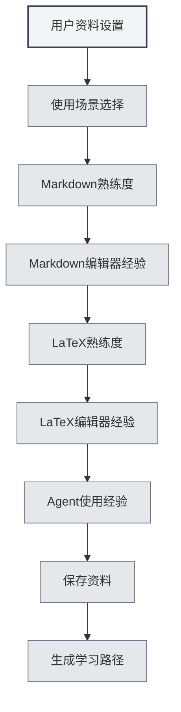

# Профиль пользователя

## Обзор

Функция профиля пользователя позволяет вам установить личную информацию и предпочтения использования, помогая MetaDoc лучше понять ваши потребности и предоставить персонализированный опыт использования и учебный путь.

## Настройки профиля пользователя

### Открытие профиля пользователя

Открыть диалоговое окно профиля пользователя можно следующими способами:

- **Подсказка на главной странице**: При первом использовании главная страница может предложить настроить профиль пользователя
- **Руководство пользователя**: В руководстве пользователя можно получить доступ к настройкам профиля
- **Пункты меню**: В некоторых меню может быть опция профиля пользователя

### Интерфейс профиля пользователя

Интерфейс профиля пользователя содержит следующие основные части:

<UserProfileView mode="demo" />

### Мастер настройки профиля

Настройка профиля пользователя выполняется в виде пошагового мастера:

1. **Сценарий использования**: Выбор основного сценария использования
2. **Уровень владения Markdown**: Оценка степени знакомства с синтаксисом Markdown
3. **Опыт работы с Markdown-редакторами**: Выбор типов использованных Markdown-редакторов
4. **Уровень владения LaTeX**: Оценка степени знакомства с синтаксисом LaTeX
5. **Опыт работы с LaTeX-редакторами**: Выбор типов использованных LaTeX-редакторов
6. **Опыт использования Agent**: Оценка опыта использования фреймворка Agent

## Выбор сценария использования

### Типы сценариев

Можно выбрать следующие сценарии использования:

- **Студент**: Подходит для студентов, акцент на изучение базового редактирования и функций Markdown
- **Исследователь**: Подходит для исследователей, акцент на изучение LaTeX и функций академического письма
- **IT-специалист**: Подходит для IT-специалистов, акцент на изучение фреймворка Agent и продвинутых функций
- **Офисный пользователь**: Подходит для офисных пользователей, акцент на изучение базовых функций и экспорта
- **Другое**: Другие сценарии использования

### Влияние сценария

Выбранный сценарий влияет на:

- **Учебный путь**: Система порекомендует соответствующий учебный путь
- **Рекомендации функций**: Приоритетная рекомендация соответствующих функций
- **Понимание ИИ**: Помогает ИИ лучше понять ваши потребности

## Оценка навыков

### Уровень владения Markdown

Оцените степень вашего знакомства с синтаксисом Markdown:

- **Нет опыта**: Никогда не использовал(а) Markdown
- **Базовый**: Знаком(а) с основным синтаксисом (заголовки, списки, ссылки и т.д.)
- **Средний**: Знаком(а) с распространённым синтаксисом и расширенными функциями
- **Продвинутый**: Владею Markdown в совершенстве, знаком(а) с различными расширенными синтаксисами

### Уровень владения LaTeX

Оцените степень вашего знакомства с синтаксисом LaTeX:

- **Нет опыта**: Никогда не использовал(а) LaTeX
- **Базовый**: Знаком(а) с основным синтаксисом и структурой документа
- **Средний**: Знаком(а) с распространёнными окружениями и командами
- **Продвинутый**: Владею LaTeX в совершенстве, могу писать сложные документы

<MenuItemsDemo mode="demo" :items='[{"id": "file"}]' />

### Опыт использования Agent

Оцените ваш опыт использования фреймворка Agent:

- **Нет опыта**: Никогда не использовал(а) функции Agent
- **Базовый**: Знаком(а) с основными концепциями, использовал(а) простые функции
- **Средний**: Знаком(а) с набором инструментов и рабочими процессами
- **Продвинутый**: Могу создавать сложные конфигурации и рабочие процессы Agent

<AgentView mode="demo" />

## Опыт работы с редакторами

### Опыт работы с Markdown-редакторами

Выберите типы Markdown-редакторов, которые вы использовали:

- **WYSIWYG-редакторы**: Использовал(а) редакторы с режимом "Что видишь, то и получаешь"
- **Другие Markdown-редакторы**: Использовал(а) другие Markdown-редакторы

### Опыт работы с LaTeX-редакторами

Выберите типы LaTeX-редакторов, которые вы использовали:

- **Онлайн LaTeX-редакторы**: Использовал(а) онлайн LaTeX-редакторы
- **Локальные LaTeX-редакторы**: Использовал(а) локальные LaTeX-редакторы

## Настройка предпочтений использования

### Предпочтения редактирования

Можно настроить предпочтения, связанные с редактированием:

- **Режим редактирования**: Предпочитаемый режим редактирования
- **Способ предпросмотра**: Предпочитаемый способ предпросмотра
- **Автосохранение**: Предпочтения автосохранения

<MainTabs mode="demo" />

### Предпочтения функций

Можно настроить предпочтения, связанные с функциями:

- **Часто используемые функции**: Отметить часто используемые функции
- **Приоритет функций**: Установить приоритет функций
- **Макет интерфейса**: Предпочитаемый макет интерфейса

<ViewMenuItemsDemo mode="demo" :items='["settings"]' />

## Настройка пользовательского профиля (аватара)

### Генерация профиля

На основе ваших настроек система генерирует пользовательский профиль:

- **Уровень навыков**: Оценка уровня различных навыков
- **Сценарии использования**: Определение основных сценариев использования
- **Учебные потребности**: Анализ учебных потребностей

### Применение профиля

Пользовательский профиль применяется для:

- **Учебного пути**: Рекомендация персонализированного учебного пути
- **Рекомендации функций**: Приоритетная рекомендация соответствующих функций
- **Помощь ИИ**: Помощь ИИ в лучшем понимании потребностей

## Рекомендация учебного пути

### Типы путей

В соответствии с профилем пользователя система рекомендует соответствующий учебный путь:

- **Путь для студентов**: Учебный путь, подходящий для студентов
- **Путь для исследователей**: Учебный путь, подходящий для исследователей
- **Путь для IT-специалистов**: Учебный путь, подходящий для IT-специалистов
- **Путь для офисных пользователей**: Учебный путь, подходящий для офисных пользователей

<AIChat mode="demo" />

### Содержание пути

Учебный путь включает:

- **Список документов**: Учебные документы, расположенные в порядке изучения
- **Учебные цели**: Цели обучения для каждого документа
- **Предполагаемое время**: Предполагаемое время, необходимое для завершения обучения

## Обновление данных

### Изменение данных

Профиль пользователя можно изменить в любое время:

1. Откройте диалоговое окно профиля пользователя
2. Измените необходимые настройки
3. Сохраните изменения

### Синхронизация данных

Данные профиля пользователя:

- **Сохраняются локально**: Сохраняются на локальном устройстве
- **Синхронизируются между окнами**: Синхронизируются между всеми окнами
- **Сохраняются после перезапуска**: Остаются действительными при следующем запуске

## Рекомендации

1. **Заполняйте честно**: Честно заполняйте всю информацию для получения более точных рекомендаций
2. **Регулярно обновляйте**: Регулярно обновляйте данные по мере повышения навыков
3. **Выбирайте сценарий**: Выбирайте сценарий, наиболее соответствующий реальному использованию
4. **Оценивайте навыки объективно**: Объективно оценивайте свой уровень навыков
5. **Используйте рекомендации**: Полностью используйте рекомендуемые системой учебные пути

## Важные замечания

1. **Конфиденциальность данных**: Данные профиля пользователя хранятся только локально и не загружаются
2. **Данные необязательны**: Настройка профиля пользователя является необязательной, её можно не выполнять
3. **Рекомендации как ориентир**: Рекомендации учебных путей носят рекомендательный характер, их можно корректировать по необходимости
4. **Изменение навыков**: Уровень навыков может меняться, рекомендуется регулярно обновлять данные
5. **Несколько сценариев**: Если используется несколько сценариев, можно выбрать основной

## Связанные документы

- [[home.features|Функции главной страницы]]
- [[user.feedback|Обратная связь пользователя]]
- [[quick-start.guide|Руководство по быстрому началу работы]]

<MenuItemsDemo mode="demo" :items='[{"id": "settings"}]' />

<MainTabs mode="demo" />
