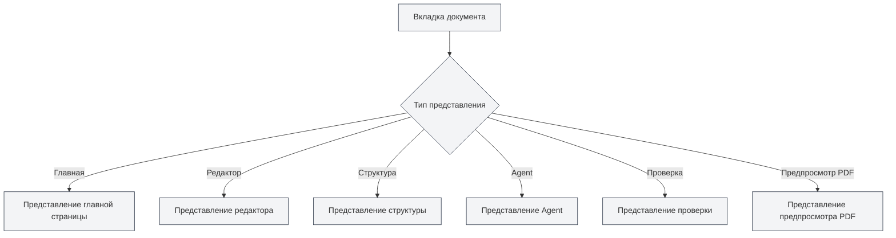

# Типы представлений

## Обзор

MetaDoc поддерживает различные типы представлений, каждое из которых предоставляет различные функции и интерфейс. Вы можете переключаться между разными представлениями по мере необходимости для выполнения различных задач.

## Описание типов представлений

### Представление главной страницы

Представление главной страницы — это входной интерфейс MetaDoc, предоставляющий функции быстрого запуска и недавних документов.

**Основные функции**:

- **Быстрый старт**: выбор формата документа для быстрого создания нового документа
- **Недавние документы**: отображение списка недавно открытых документов
- **Руководство пользователя**: быстрый доступ к руководству пользователя
- **Профиль пользователя**: доступ к настройкам профиля пользователя

**Сценарии использования**:

- Начальный интерфейс после запуска приложения
- Необходимость быстро создать новый документ
- Просмотр недавно использованных документов

Вы можете переключаться между различными представлениями через боковую панель.

### Представление редактора

Представление редактора — это основной интерфейс для редактирования документов, поддерживающий редактирование Markdown, LaTeX и обычного текста.

<LaTeXEditor mode="demo" />

**Основные функции**:

- **Редактирование Markdown**: редактирование документов Markdown с помощью редактора Vditor
- **Редактирование LaTeX**: редактирование документов LaTeX с помощью редактора Monaco
- **Редактирование обычного текста**: редактирование обычного текста с помощью редактора Monaco
- **Предпросмотр в реальном времени**: редактор Markdown поддерживает предпросмотр в реальном времени

**Сценарии использования**:

- Редактирование содержимого документа
- Написание технической документации
- Создание научных статей

### Представление структуры

Представление структуры отображает структурированное оглавление документа, что удобно для просмотра и редактирования структуры документа.

<Outline mode="demo" />

**Основные функции**:

- **Отображение структуры**: отображение заголовков документа в виде древовидной структуры
- **Операции с узлами**: добавление, редактирование, удаление, перемещение узлов
- **Сортировка перетаскиванием**: изменение порядка узлов путем перетаскивания
- **AI-функции**: генерация подразделов, генерация содержимого, оптимизация структуры

**Сценарии использования**:

- Просмотр структуры документа
- Быстрая навигация к определенным разделам
- Редактирование оглавления документа
- Использование ИИ для генерации содержимого

### Представление Agent

Представление Agent предоставляет интерфейс для взаимодействия с фреймворком Agent, предназначенный для создания и управления сессиями Agent.

<AgentView mode="demo" />

**Основные функции**:

- **Управление сессиями**: создание, редактирование, удаление сессий Agent
- **Настройка инструментов**: настройка набора инструментов, используемых Agent
- **Рабочие процессы**: создание и выполнение рабочих процессов
- **Интерактивное общение**: диалог с Agent

**Сценарии использования**:

- Использование Agent для выполнения сложных задач
- Автоматизированная обработка документов
- Массовые операции с документами

### Представление проверки

Представление проверки предоставляет функцию AI-проверки, которая выявляет ошибки в документе и предлагает исправления.

<ProofreadView mode="demo" />

**Основные функции**:

- **Обнаружение ошибок**: обнаружение орфографических, грамматических, синтаксических ошибок LaTeX
- **Список ошибок**: отображение всех обнаруженных ошибок
- **Исправление ошибок**: исправление по одной или всех ошибок одним кликом
- **Управление словарем**: добавление слов в словарь

**Сценарии использования**:

- Проверка документа на ошибки
- Повышение качества документа
- Исправление орфографических и грамматических ошибок

### Представление предпросмотра PDF

Представление предпросмотра PDF отображает предпросмотр PDF, скомпилированного из документа LaTeX (только для документов LaTeX).

<PdfPreviewPanel mode="demo" pdfUrl="" />

**Основные функции**:

- **Отображение PDF**: отображение содержимого скомпилированного PDF
- **Управление масштабом**: увеличение, уменьшение масштаба PDF
- **Обновление PDF**: перекомпиляция и обновление PDF
- **Переход к коду**: переход от позиции в PDF к коду LaTeX

**Сценарии использования**:

- Предпросмотр результата документа LaTeX
- Проверка формата PDF
- Поиск проблем в PDF

## Переключение представлений

### Способы переключения

Переключение между представлениями можно выполнить следующими способами:

<MainTabs mode="demo" />

<ViewMenuItemsDemo mode="demo" :items='["editor", "outline", "agent"]' />

1. **Меню представлений**: нажмите кнопку меню представлений слева
2. **Выбор представления**: в меню представлений выберите представление для переключения
3. **Горячие клавиши**: некоторые представления могут иметь горячие клавиши (возможно, будут поддерживаться в будущем)

### Меню представлений

Меню представлений отображается на левой боковой панели:

- **Главная**: переключение на представление главной страницы
- **Редактор**: переключение на представление редактора
- **Структура**: переключение на представление структуры
- **Agent**: переключение на представление Agent
- **Проверка**: переключение на представление проверки
- **Предпросмотр PDF**: переключение на представление предпросмотра PDF (только для документов LaTeX)

### Состояние представления

Каждая вкладка документа имеет независимое состояние представления:

- **Запоминание представления**: после переключения представления его состояние сохраняется
- **Следующее открытие**: при следующем открытии документа представление восстановится до предыдущего
- **Несколько вкладок**: разные вкладки могут использовать разные представления

## Особенности представлений

### Независимость представлений

Каждое представление является независимым:

- **Независимое состояние**: каждое представление имеет независимое состояние
- **Синхронизация данных**: данные автоматически синхронизируются между представлениями
- **Быстрое переключение**: переключение между представлениями происходит очень быстро, без необходимости перезагрузки

### Комбинирование представлений

Некоторые представления можно использовать в комбинации:

- **Редактор + Структура**: одновременный просмотр редактора и структуры
- **Редактор + Предпросмотр PDF**: редактор LaTeX может одновременно отображать код и PDF
- **Редактор + Проверка**: возможность проверки во время редактирования

## Рекомендации по использованию представлений

### Редактирование документа

- **Представление редактора**: в основном используйте представление редактора для редактирования
- **Представление структуры**: переключайтесь на представление структуры, когда нужно просмотреть структуру
- **Предпросмотр PDF**: используйте предпросмотр PDF при редактировании документов LaTeX для просмотра результата

### Проверка документа

- **Представление проверки**: специально предназначено для проверки документов
- **Представление редактора**: после проверки вернитесь в представление редактора для продолжения редактирования

### Задачи Agent

- **Представление Agent**: создание и управление сессиями Agent
- **Представление редактора**: просмотр документов, обработанных Agent

## Важные замечания

1. **Переключение представлений**: при переключении представлений сохраняется текущее состояние
2. **Предпросмотр PDF**: представление предпросмотра PDF поддерживается только для документов LaTeX
3. **Состояние представления**: состояние представления для каждой вкладки сохраняется независимо
4. **Синхронизация данных**: данные автоматически синхронизируются между представлениями
5. **Производительность**: некоторые представления могут потреблять больше ресурсов

## Связанная документация

- [[core.multi-tab|Управление несколькими вкладками]]
- [[outline.basics|Функции представления структуры]]
- [[agent.session|Управление сессиями Agent]]
- [[ai.proofread|Функция AI-проверки]]
- [[latex.pdf-preview|Функция предпросмотра PDF]]
