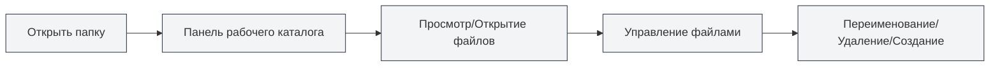

# Управление рабочим каталогом

## Обзор

Управление рабочим каталогом позволяет открывать и управлять папками в MetaDoc, предоставляя функциональность, аналогичную файловому менеджеру. С помощью рабочего каталога вы можете удобно просматривать, открывать и управлять файлами проекта.

## Введение в рабочий каталог

<ViewMenuItemsDemo mode="demo" :items='["workspace"]' />

### Что такое рабочий каталог

Рабочий каталог — это открытая в MetaDoc папка, которая позволяет вам:

- **Просмотр файлов**: просматривать файлы и подпапки в папке
- **Открытие файлов**: открывать файлы непосредственно в MetaDoc
- **Управление файлами**: выполнять такие операции, как переименование, удаление файлов
- **Организация проекта**: организовывать связанные файлы в одном каталоге

### Сценарии использования

Рабочий каталог подходит для следующих сценариев:

- **Управление проектом**: управление всеми документами в проекте
- **Просмотр файлов**: быстрый просмотр и открытие файлов
- **Организация документов**: группировка связанных документов вместе
- **Массовые операции**: выполнение операций над несколькими файлами

## Открытие рабочего каталога

<ViewMenuItemsDemo mode="demo" :items='["workspace", "editor"]' />

### Открытие каталога

1. Нажмите значок "Рабочий каталог" в левом меню
2. Если каталог ещё не открыт, появится диалоговое окно выбора каталога
3. Выберите папку для открытия
4. Каталог отобразится на боковой панели

Вы можете получить доступ к представлению рабочего каталога через боковую панель:

<ViewMenuItemsDemo mode="demo" :items='["workspace"]' />

<ViewMenuItemsDemo mode="demo" :items='["editor", "outline", "home"]' />

### Переключение каталога

Если необходимо переключиться на другой каталог:

1. Нажмите кнопку меню в заголовке рабочего каталога
2. Выберите "Открыть папку"
3. Выберите новую папку
4. Новый каталог заменит текущий

### Закрытие каталога

Вы можете закрыть текущий открытый рабочий каталог:

1. Нажмите кнопку меню в заголовке рабочего каталога
2. Выберите "Закрыть рабочий каталог"
3. Панель рабочего каталога будет скрыта

## Просмотр файлов

<ViewMenuItemsDemo mode="demo" :items='["workspace", "editor", "outline"]' />

### Древовидная структура каталога

Рабочий каталог отображается в виде древовидной структуры:

- **Папки**: отображаются с иконкой папки, можно развернуть/свернуть
- **Файлы**: отображаются с иконкой файла, показывается имя файла
- **Иерархическая структура**: поддерживается вложенность папок на нескольких уровнях

### Развертывание и сворачивание

- **Развернуть папку**: нажмите на иконку папки или её название
- **Свернуть папку**: нажмите на уже развернутую папку снова
- **Развернуть все**: в контекстном меню можно выбрать "Развернуть все"
- **Свернуть все**: в контекстном меню можно выбрать "Свернуть все"

### Распознавание типов файлов

Рабочий каталог распознает типы файлов:

- **Файлы Markdown** (.md): отображаются с иконкой Markdown
- **Файлы LaTeX** (.tex): отображаются с иконкой LaTeX
- **Файлы изображений** (.png, .jpg и др.): отображаются с иконкой изображения
- **Другие файлы**: отображаются с общей иконкой файла

## Операции с файлами

<ViewMenuItemsDemo mode="demo" :items='["workspace"]' />

<MenuItemsDemo mode="demo" :items='[{"id": "file", "items": ["new", "open"]}]' />

### Открытие файлов

Есть несколько способов открыть файл:

- **Двойной щелчок по файлу**: дважды щелкните по иконке или названию файла
- **Контекстное меню**: щелкните правой кнопкой мыши по файлу и выберите "Открыть"
- **Перетаскивание**: перетащите файл в область редактора

После открытия файл откроется на новой вкладке.

### Предварительный просмотр файлов

<ViewMenuItemsDemo mode="demo" :items='["workspace"]' />

Можно просмотреть файл, не открывая его:

- **Контекстное меню**: щелкните правой кнопкой мыши по файлу и выберите "Предпросмотр"
- **Режим предпросмотра**: файл открывается на вкладке предпросмотра
- **Переключение на редактирование**: в режиме предпросмотра можно переключиться в режим редактирования

### Переименование файлов

<ViewMenuItemsDemo mode="demo" :items='["workspace"]' />

1. Щелкните правой кнопкой мыши по файлу, который нужно переименовать
2. Выберите "Переименовать"
3. Введите новое имя файла
4. Нажмите Enter для подтверждения или Esc для отмены

**Важные замечания**:

- Переименование изменит имя файла в файловой системе
- Если файл редактируется, его необходимо сначала сохранить
- После переименования путь к файлу изменится

### Удаление файлов

<ViewMenuItemsDemo mode="demo" :items='["workspace"]' />

1. Щелкните правой кнопкой мыши по файлу, который нужно удалить
2. Выберите "Удалить"
3. Подтвердите операцию удаления

**Важные замечания**:

- Операция удаления необратима
- Если файл редактируется, его необходимо сначала закрыть
- Удаление папки приведет к удалению всех файлов внутри неё

### Создание файлов

1. Щелкните правой кнопкой мыши по папке или пустой области
2. Выберите "Создать файл"
3. Введите имя файла (с расширением)
4. Нажмите Enter для подтверждения

Созданный файл немедленно откроется в редакторе.

### Создание папок

<ViewMenuItemsDemo mode="demo" :items='["workspace"]' />

1. Щелкните правой кнопкой мыши по папке или пустой области
2. Выберите "Создать папку"
3. Введите имя папки
4. Нажмите Enter для подтверждения

## Расширенные функции работы с файлами

<ViewMenuItemsDemo mode="demo" :items='["workspace", "editor"]' />

### Копирование файлов

1. Щелкните правой кнопкой мыши по файлу, который нужно скопировать
2. Выберите "Копировать"
3. Щелкните правой кнопкой мыши по целевому расположению
4. Выберите "Вставить"

### Вырезание файлов

1. Щелкните правой кнопкой мыши по файлу, который нужно вырезать
2. Выберите "Вырезать"
3. Щелкните правой кнопкой мыши по целевому расположению
4. Выберите "Вставить"

### Вставка файлов

1. После копирования или вырезания файла
2. Щелкните правой кнопкой мыши по целевому расположению
3. Выберите "Вставить"

**Важные замечания**:

- Вставка в папку создаст файл внутри этой папки
- Если в целевом расположении уже существует файл с таким именем, будет предложено перезаписать или переименовать его

### Массовые операции

Можно выбрать несколько файлов одновременно для выполнения операций:

- **Множественный выбор**: удерживайте клавишу Ctrl и щелкайте по нескольким файлам
- **Выделить все**: используйте Ctrl+A для выбора всех файлов
- **Массовые операции**: выполнение операций копирования, удаления и т.д. для выбранных файлов

## Поиск файлов

<ViewMenuItemsDemo mode="demo" :items='["workspace"]' />

### Функция поиска

Рабочий каталог поддерживает поиск файлов:

1. На панели рабочего каталога используйте поле поиска
2. Введите имя файла или ключевое слово
3. Результаты поиска будут подсвечены

### Область поиска

Поиск выполняется в следующих пределах:

- **Текущий каталог**: текущий открытый рабочий каталог
- **Подкаталоги**: включая все подпапки
- **Имя файла**: поиск по имени файла, не по содержимому файла

## Отслеживание каталога

<ViewMenuItemsDemo mode="demo" :items='["workspace", "outline"]' />

### Автоматическое обновление

Рабочий каталог автоматически отслеживает изменения в файловой системе:

- **Создание файла**: новый файл автоматически отображается
- **Удаление файла**: удаленный файл автоматически удаляется из списка
- **Переименование файла**: переименованный файл автоматически обновляется
- **Изменение файла**: изменение файла отображается маркером обновления

### Ручное обновление

Если необходимо обновить каталог вручную:

1. Щелкните правой кнопкой мыши по папке или пустой области
2. Выберите "Обновить"
3. Каталог будет перезагружен

## Пути к файлам

### Отображение пути

Рабочий каталог отображает полный путь к файлам:

- **Всплывающая подсказка**: при наведении курсора на файл отображается полный путь
- **Панель пути**: в некоторых представлениях может отображаться панель пути
- **Контекстное меню**: в контекстном меню может отображаться информация о пути

### Операции с путями

- **Копировать путь**: можно скопировать полный путь к файлу
- **Открыть расположение**: можно открыть расположение файла в файловом менеджере
- **Навигация по пути**: можно быстро найти файл по пути

## Рекомендации

1. **Организация проекта**: организуйте связанные файлы в одном рабочем каталоге
2. **Именование файлов**: используйте понятные соглашения об именовании
3. **Регулярное резервное копирование**: регулярно создавайте резервные копии важных файлов
4. **Очистка файлов**: регулярно удаляйте ненужные файлы
5. **Структура каталогов**: поддерживайте четкую структуру каталогов

## Важные замечания

1. **Права доступа к файлам**: убедитесь, что у вас есть права на чтение и запись файлов
2. **Блокировка файлов**: некоторые файлы могут быть заблокированы другими программами
3. **Длина пути**: обратите внимание на ограничения длины пути к файлу
4. **Специальные символы**: избегайте использования специальных символов в именах файлов
5. **Размер файла**: открытие больших файлов может потребовать времени

## Связанная документация

- [[core.file-operations|Операции с файлами]]
- [[core.multi-tab|Управление несколькими вкладками]]
- [[core.multi-window|Управление несколькими окнами]]