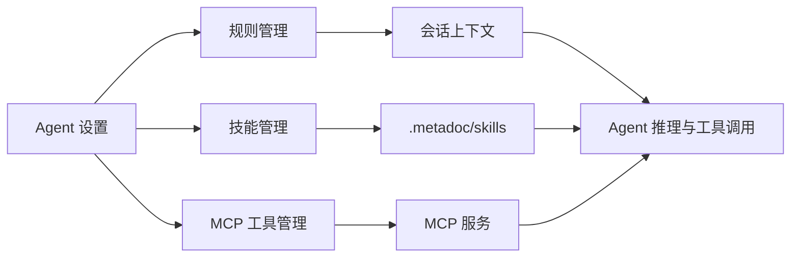

# 规则、技能与 MCP 管理

## 概述

除「工具集」外，Agent 还可通过 **动态规则（Rules）**、**工作区技能（Skills）** 与 **MCP 工具** 扩展行为。三者均在 **Agent 视图** 左下角的 **Agent 设置** 菜单中分别打开（也可在紧凑侧边栏通过齿轮进入相同菜单）。

- **规则**：写入会话上下文的约束与说明，可区分系统规则与用户规则，并支持审批流程。
- **技能**：工作区 `.metadoc/skills` 下的 `SKILL.md` 与元数据，供 Agent 检索与按说明调用。
- **MCP**：通过单一 **JSON 配置文件** 声明外部 MCP 服务（stdio 或 HTTP），检查连通性并将工具同步到本地注册表后，工具会进入当前环境的工具面（具体是否可用仍受工具集与 Agent 配置约束）。

下文分别说明三者的入口、常见操作以及与 [[agent.tools|工具集管理]]、[[agent.session|Agent 会话管理]] 的关系（工具是否在某一 Agent 上可用仍取决于工具集与会话侧行为）。

## 动态规则（Rules）

动态规则用于在运行时为 Agent 补充 **范围、优先级与正文**。系统内置规则不可编辑，用户规则可启用/禁用、编辑与删除；Agent 通过工具创建的规则可能处于 **待审批** 状态，需在界面中批准或拒绝后才会按设定生效。

**常见操作：**

1. 打开 **Agent 设置 → 规则管理**。
2. 使用 **刷新** 从本地数据库重新加载列表。
3. **新建规则**：填写标题、正文、优先级（数值越大越优先）、是否启用；新建用户规则默认优先级约为 90（可按需调整）。
4. **让 AI 辅助创建**：根据自然语言描述生成规则草稿，确认后再保存。
5. 对 **待审批** 规则使用 **批准** 或 **拒绝**。

手册内嵌组件仅作界面示意，点击不会触发真实保存或网络请求。

<AgentCapabilitiesManager mode="demo" initialPanel="rules" />

**与工具的关系：** 产品内提供 `create_dynamic_rule`、`update_dynamic_rule` 等工具，供 Agent 在对话中创建或更新规则（可能进入审批流程）。详见 [[agent.tools|工具集管理]]。

## 工作区技能（Skills）

技能以 **工作区** 为粒度，存放在 **`.metadoc/skills/<技能目录>/`** 下，核心文件为 **`SKILL.md`**（Front Matter 可包含名称、描述等元信息）。索引与向量同步后，Agent 可通过检索匹配到对应技能说明，并在合适场景下遵循其中的指引。

**常见操作：**

1. 打开 **Agent 设置 → 技能管理**。
2. **刷新**：从磁盘同步技能目录与数据库/索引（具体步骤与后台任务以当前版本为准）。
3. 在列表中选择技能，使用内置编辑器查看或编辑 `SKILL.md`。
4. **同步元信息**：从下拉中选择将磁盘元信息写回索引或从索引对齐展示（两项用途不同，请按界面说明选用）。
5. **删除技能**：会删除工作区中对应技能目录，请谨慎操作。

<AgentCapabilitiesManager mode="demo" initialPanel="skills" />

**提示：** 也可通过 Agent 工具（如创建工作区技能、同步技能、检索技能等）维护技能；与手动在界面中操作互为补充。技能内容质量直接影响 Agent 是否「用对」说明，建议保持 `SKILL.md` 简洁、可执行。

## MCP 工具管理

MCP 通过 **用户数据目录下的 `mcp-servers.json`** 集中配置（与 Cursor / Claude Desktop 等产品的 `mcpServers` 风格一致）。界面内使用 **Monaco 编辑器** 编辑 JSON，并具备 **JSON 语法校验** 与 **结构校验**（例如每个服务必须配置 **`command`（stdio）** 或 **`url`（Streamable HTTP）** 之一，不可同时混用）。

**配置文件要点：**

- **路径**：应用会在界面中显示完整路径；文件位于当前用户数据目录（Electron `userData`），首次进入 MCP 管理时会生成 **`mcpServers` 为空对象** 的默认文件，需自行添加服务条目。
- **顶层结构**：`{ "mcpServers": { "<服务名>": { ... } } }`。服务名建议使用字母、数字、`.`、`_`、`-`。
- **stdio 示例**：`"command": "npx"`，`"args": ["-y", "某-mcp-包"]`；可选 `"env"`、`"cwd"`。（具体包名以各 MCP 官方文档为准。）
- **HTTP 示例**：`"url": "https://..."`（当前实现按 **Streamable HTTP** 连接；与旧版 SSE 端点不一定兼容）。

**界面布局与操作：**

1. 打开 **Agent 设置 → MCP 工具管理**。
2. **上方**：说明文字、配置文件路径、**导入 / 导出 JSON**、**同步** 按钮，以及自动保存状态提示。
3. **下方左右分栏**：左侧为 **Monaco** JSON 编辑器；右侧为 **已注册工具树**（每个 MCP 服务为根节点，其子节点为该服务下的工具）。点击某个 **工具** 可弹出对话框查看描述、权限、输入 Schema 等；描述与 Schema 区域使用可滚动视图展示长内容。
4. 在编辑器中修改配置；**结构合法** 时会在短暂停顿后 **自动保存**。若有语法或结构错误，会列出提示且不会写入磁盘。
5. 点击 **同步**：按当前编辑器内容依次连接各 MCP 服务并 `listTools`，将工具写入本地 **SQLite 注册表** 与 **向量索引**；已从配置中删除的服务，其工具会从库中移除；连接或拉取失败的服务会在提示中说明，成功的服务仍会按最新列表更新。
6. 若工具未在某个 Agent 上生效，请到 [[agent.tools|工具集管理]] 与会话侧设置中检查工具集交集与当前 Agent 行为。

<AgentCapabilitiesManager mode="demo" initialPanel="mcp" />

## 相关阅读

- [[agent.introduction|Agent 框架概述]]
- [[agent.tools|工具集管理]]
- [[agent.session|Agent 会话管理]]
