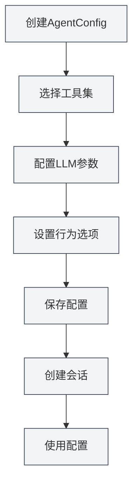

# Agent配置管理

## 概述

Agent配置（AgentConfig）是Agent框架的核心组件，用于定义Agent的身份和能力范围。每个AgentConfig关联一组工具集，决定Agent可以使用哪些工具，并可以配置LLM参数和行为选项。

AgentConfig通过工具集交集机制，灵活控制Agent的能力范围，让您可以为不同场景创建专门的Agent配置。

<AgentView mode="demo" />

## 核心概念

### AgentConfig结构

AgentConfig包含以下主要部分：

- **基本信息**：ID、名称、描述、版本号
- **工具集关联**：关联的工具集ID列表（取交集）
- **LLM配置**：模型、温度、最大Token数、系统提示词等
- **行为配置**：是否允许工具调用、最大调用次数等
- **场景类型**：outline、editor、analysis、visualization、custom

### 工具集交集

当AgentConfig关联多个工具集时，可用的工具是所有工具集的交集：

- 工具集A包含：`[tool1, tool2, tool3]`
- 工具集B包含：`[tool2, tool3, tool4]`
- AgentConfig可用工具为：`[tool2, tool3]`

这种机制让您可以精确控制Agent的能力范围。

<AgentConfigManager mode="demo" />

## 创建AgentConfig

### 创建新配置

创建AgentConfig的步骤：

1. **打开Agent管理**：在Agent视图中点击"管理" → "Agent配置"
2. **创建配置**：点击"新建配置"按钮
3. **填写基本信息**：
   - 名称：配置的名称（支持多语言）
   - 描述：配置的描述（支持多语言）
4. **选择工具集**：从下拉列表中选择一个或多个工具集
5. **配置LLM**（可选）：
   - 系统提示词：自定义系统提示词
   - 注入时间戳：是否在系统提示词中注入当前时间
6. **设置行为**（可选）：
   - 最大工具调用次数：限制Agent的工具调用次数（null表示无限制）
7. **保存配置**：点击"保存"按钮

<AgentView mode="demo" />

您可以通过侧边栏访问Agent视图：

### 默认配置

系统提供一个默认的AgentConfig（`default-agent-config`），包含所有内置工具，不可删除但可以复制。

## 编辑AgentConfig

### 编辑操作

编辑现有AgentConfig：

1. **打开管理界面**：在Agent配置管理界面找到要编辑的配置
2. **点击编辑**：点击配置卡片上的"编辑"按钮
3. **修改配置**：修改名称、描述、工具集、LLM配置或行为配置
4. **保存更改**：点击"保存"按钮

**注意**：默认配置（`default-agent-config`）不允许编辑，但可以复制后编辑。

<AgentConfigManager mode="demo" />

## 删除AgentConfig

### 删除操作

删除不需要的AgentConfig：

1. **打开管理界面**：在Agent配置管理界面找到要删除的配置
2. **点击删除**：点击配置卡片上的"删除"按钮
3. **确认删除**：在弹出的确认对话框中确认删除

<AgentConfigManager mode="demo" />

**注意**：

- 默认配置（`default-agent-config`）不可删除
- 删除配置不会影响已创建的会话，但新会话将无法使用该配置
- 如果配置正在被会话使用，删除前会提示

## 复制AgentConfig

### 复制操作

复制现有AgentConfig：

1. **打开管理界面**：在Agent配置管理界面找到要复制的配置
2. **点击复制**：点击配置卡片上的"复制"按钮
3. **编辑副本**：系统会创建一个副本，名称自动添加"（副本）"后缀
4. **保存修改**：根据需要修改副本并保存

<AgentView mode="demo" />

复制配置会复制所有设置，包括工具集关联、LLM配置和行为配置。

## 导入/导出AgentConfig

### 导出配置

导出AgentConfig为JSON文件：

1. **打开管理界面**：在Agent配置管理界面找到要导出的配置
2. **点击导出**：点击配置卡片上的"导出"按钮
3. **选择位置**：选择保存位置和文件名
4. **保存文件**：点击保存导出配置

导出的JSON文件包含配置的所有信息，可以用于备份或分享。

<AgentConfigManager mode="demo" />

### 导入配置

从JSON文件导入AgentConfig：

1. **打开管理界面**：在Agent配置管理界面
2. **点击导入**：点击"导入配置"按钮
3. **选择文件**：选择要导入的JSON文件
4. **验证数据**：系统验证文件格式和内容
5. **导入配置**：导入成功后创建新配置

导入的配置会创建新的ID，不会覆盖现有配置（除非使用覆盖模式）。

## LLM配置

### 系统提示词

AgentConfig可以配置自定义系统提示词：

- **默认提示词**：如果不设置，使用Agent框架的默认系统提示词
- **自定义提示词**：可以设置专门的系统提示词，定义Agent的角色和行为
- **时间戳注入**：可以选择是否在系统提示词中注入当前时间

### LLM参数

AgentConfig可以覆盖全局LLM配置：

- **模型**：指定使用的LLM模型
- **温度**：控制输出的随机性（0-2）
- **最大Token数**：限制单次调用的最大Token数

**注意**：如果AgentConfig未设置LLM参数，将使用全局LLM配置。

<AgentConfigManager mode="demo" />

## 行为配置

### 工具调用控制

AgentConfig可以控制工具调用行为：

- **允许工具调用**：是否允许Agent调用工具（默认允许）
- **最大工具调用次数**：限制单次任务的最大工具调用次数（null表示无限制）
- **允许工作流调用**：是否允许Agent调用工作流（默认允许）

### 使用场景

不同的行为配置适用于不同场景：

- **纯对话场景**：禁用工具调用，只进行对话
- **有限工具场景**：限制工具调用次数，避免过度调用
- **全功能场景**：允许所有工具调用，无限制

<AgentConfigManager mode="demo" />

## 场景类型

AgentConfig可以设置场景类型，用于分类和管理：

- **outline**：大纲场景，用于文档结构相关任务
- **editor**：编辑器场景，用于文档编辑任务
- **analysis**：分析场景，用于文档分析任务
- **visualization**：可视化场景，用于图表生成任务
- **custom**：自定义场景

场景类型主要用于分类，不影响Agent的实际行为。

## 使用技巧

### 配置组织

1. **命名规范**：使用清晰的名称，如"数据分析Agent"、"文档编辑Agent"
2. **场景分类**：使用场景类型进行分类管理
3. **工具集选择**：根据任务需求选择合适的工具集组合

<AgentConfigManager mode="demo" />

### 工具集交集

1. **精确控制**：使用多个工具集的交集，精确控制Agent的能力
2. **工具集设计**：设计专门的工具集，然后通过交集组合使用
3. **测试验证**：创建配置后，测试工具集交集是否正确

<AgentConfigManager mode="demo" />

### LLM配置

1. **系统提示词**：为不同场景编写专门的系统提示词
2. **参数调优**：根据任务特点调整温度和最大Token数
3. **时间戳注入**：对于需要时间感知的任务，启用时间戳注入

## 常见问题

### Q: 如何创建专门的Agent配置？

A: 创建新配置，选择专门的工具集，设置自定义系统提示词和行为配置。例如，创建"数据分析Agent"，关联数据分析工具集，设置专门的系统提示词。

### Q: 工具集交集是什么意思？

A: 当AgentConfig关联多个工具集时，可用的工具是所有工具集的交集。例如，工具集A包含`[tool1, tool2, tool3]`，工具集B包含`[tool2, tool3, tool4]`，则AgentConfig可用工具为`[tool2, tool3]`。

### Q: 可以修改默认配置吗？

A: 默认配置（`default-agent-config`）不允许编辑，但可以复制后编辑。复制默认配置，然后修改副本。

### Q: LLM配置和全局配置的关系？

A: 如果AgentConfig设置了LLM参数，将使用AgentConfig的设置；否则使用全局LLM配置。AgentConfig的设置优先级更高。

### Q: 如何限制Agent的工具调用次数？

A: 在AgentConfig的行为配置中，设置"最大工具调用次数"。设置为具体数字（如10）限制调用次数，设置为null表示无限制。

### Q: 删除配置会影响现有会话吗？

A: 删除配置不会影响已创建的会话，但新会话将无法使用该配置。如果配置正在被会话使用，删除前会提示。

<AgentView mode="demo" />

## 相关文档

- [[agent.introduction|Agent框架概述]]
- [[agent.tools|工具集管理]]
- [[agent.session|Agent会话管理]]
- [[agent.engine|Agent引擎管理]]
