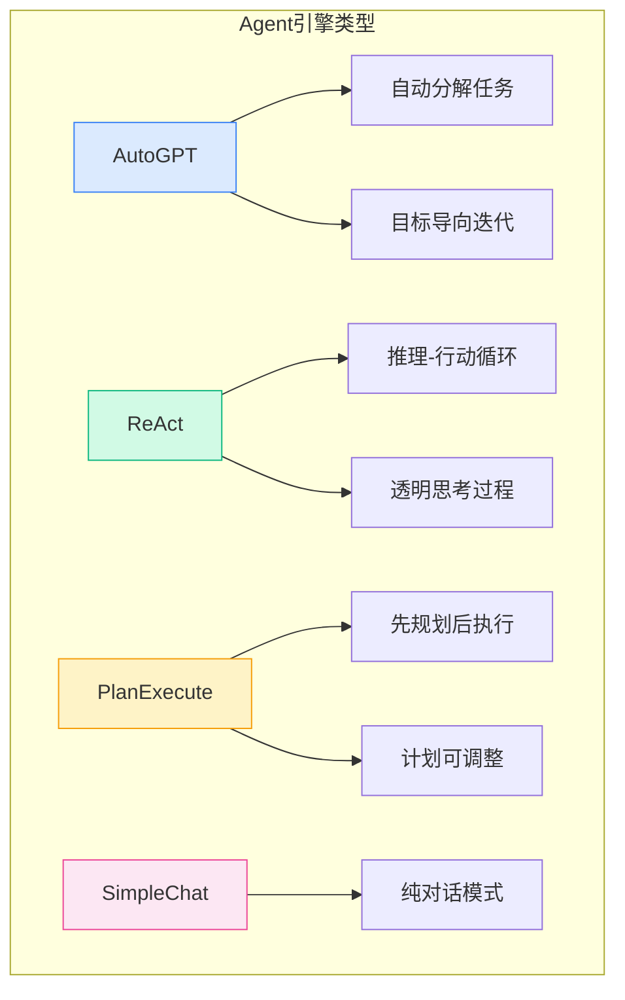
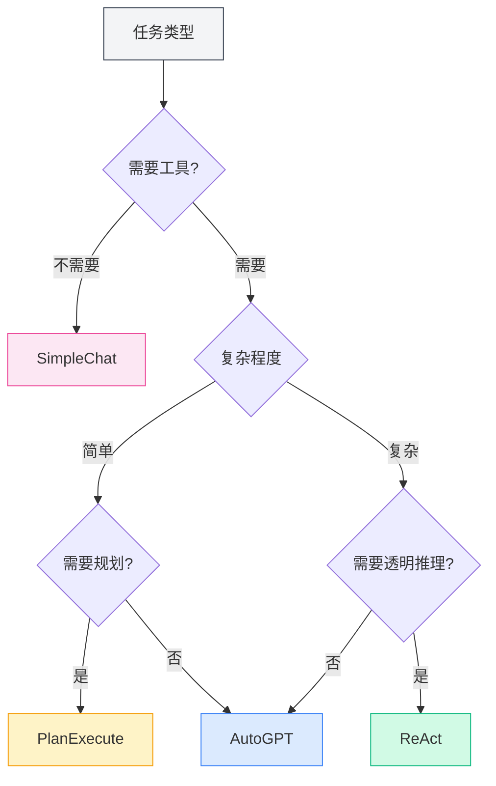
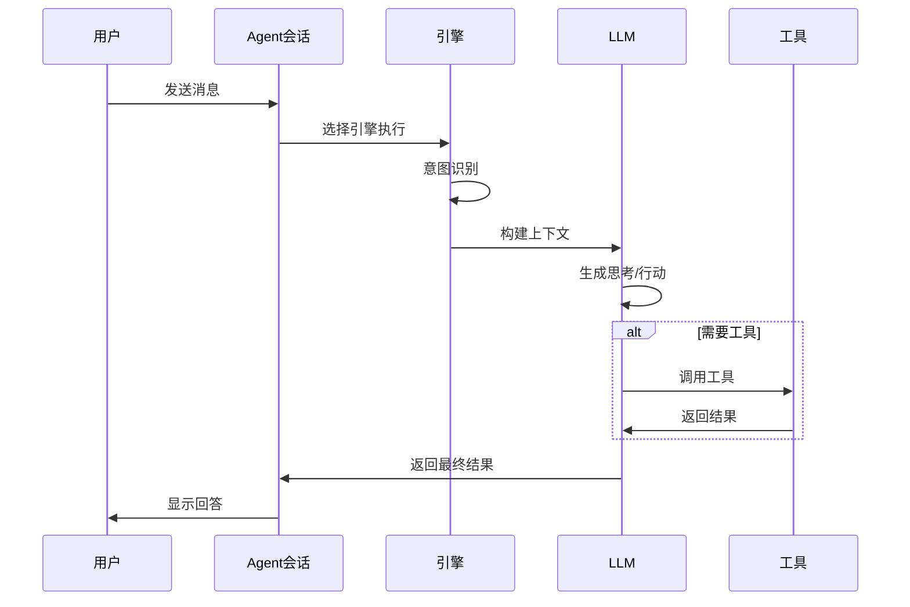

# Agent引擎管理

## 概述

Agent引擎定义了Agent的执行策略和行为方式。MetaDoc提供多种内置引擎，每种引擎采用不同的AI执行范式，适用于不同的任务场景。通过选择合适的引擎，您可以让Agent以最适合的方式完成特定任务。

<AgentView mode="demo" />

## 引擎类型

MetaDoc支持以下Agent引擎：

| 引擎名称        | 特点                        | 适用场景           |
| --------------- | --------------------------- | ------------------ |
| **AutoGPT**     | 自动任务分解，目标导向迭代  | 复杂多步骤任务     |
| **ReAct**       | 推理-行动循环，思考过程透明 | 需要详细推理的任务 |
| **PlanExecute** | 先规划后执行，计划可调整    | 结构化任务         |
| **SimpleChat**  | 纯对话，不调用工具          | 简单问答           |



## 引擎详解

### AutoGPT引擎

**特点**：

- **自动任务分解**：将复杂任务自动分解为子任务
- **目标导向**：围绕最终目标迭代执行
- **自主决策**：Agent自主决定下一步行动

<AgentView mode="demo" />
<AgentEngineManager mode="demo" />

**适用场景**：

- 研究和信息收集
- 多步骤文档处理
- 开放式创作任务

**示例**：

```
用户：帮我写一篇关于人工智能的综述文章
Agent：[自动分解为：1.收集资料 2.整理大纲 3.撰写内容 4.润色修改]
```

### ReAct引擎

**特点**：

- **推理-行动循环**：显式展示思考过程（Reasoning）和行动（Action）
- **可追溯**：每一步都有清晰的推理依据
- **透明可控**：用户可以看到Agent的思考逻辑

<AgentView mode="demo" />
<AgentEngineManager mode="demo" />

**适用场景**：

- 需要解释推理过程的任务
- 逻辑分析任务
- 教学演示场景

**示例**：

```
思考：用户需要我解释这个代码的功能
行动：调用代码分析工具
观察：[工具返回结果]
思考：基于分析结果，我可以解释...
```

### PlanExecute引擎

**特点**：

- **先规划后执行**：首先制定完整计划，然后按计划执行
- **计划可调整**：执行过程中可以修改计划
- **结构化输出**：输出格式规范，易于理解

<AgentView mode="demo" />
<AgentEngineManager mode="demo" />

**适用场景**：

- 项目管理任务
- 结构化文档生成
- 流程化工作

**示例**：

```
计划：
1. 分析需求
2. 设计方案
3. 实现功能
4. 测试验证

执行：按步骤完成每个阶段
```

### SimpleChat引擎

**特点**：

- **纯对话模式**：仅进行对话，不调用任何工具
- **快速响应**：无需等待工具执行
- **简单直接**：适合简单问答

**适用场景**：

- 一般性问答
- 概念解释
- 简单对话

**注意**：此引擎不调用工具，因此无法执行文件操作、数据分析等功能。

<AgentEngineManager mode="demo" />

## 选择引擎

### 如何选择合适的引擎

根据任务特点选择引擎：



<AgentView mode="demo" />

### 选择建议

| 任务场景 | 推荐引擎             |
| -------- | -------------------- |
| 日常问答 | SimpleChat           |
| 文档编辑 | AutoGPT 或 ReAct     |
| 数据分析 | ReAct 或 PlanExecute |
| 代码编写 | ReAct                |
| 研究调研 | AutoGPT              |
| 项目管理 | PlanExecute          |

<AgentView mode="demo" />

## 配置引擎

### 在Agent配置中选择引擎

1. 进入 [[agent.config|Agent配置管理]]
2. 创建或编辑一个Agent配置
3. 在"引擎"选项中选择想要的引擎类型
4. 保存配置

### 引擎参数设置

不同引擎可能有特定的参数设置：

**通用参数**：

- **最大迭代次数**：限制Agent的思考和行动轮数
- **超时时间**：单次调用的最大等待时间
- **温度**：控制输出的创造性程度

**引擎特定参数**：

- **AutoGPT**：目标分解深度
- **ReAct**：思考过程显示选项
- **PlanExecute**：计划调整权限

## 引擎执行流程

### 通用执行流程



### 不同引擎的执行特点

**AutoGPT执行特点**：

1. 分析用户目标
2. 自动分解为子任务
3. 逐个执行子任务
4. 汇总结果返回

**ReAct执行特点**：

1. 生成思考过程
2. 确定下一步行动
3. 执行行动（调用工具或生成回复）
4. 观察结果
5. 循环直到完成任务

**PlanExecute执行特点**：

1. 分析需求
2. 制定完整计划
3. 按步骤执行
4. 返回结构化结果

## 自定义引擎

### 引擎配置自定义

对于高级用户，可以自定义引擎行为：

1. **修改系统提示词**：调整Agent的角色和行为
2. **设置工具偏好**：指定优先使用的工具
3. **调整推理参数**：温度、最大Token数等

### 创建自定义引擎（高级）

开发者可以创建新的引擎类型：

1. 继承基础引擎接口
2. 实现特定的执行逻辑
3. 注册到引擎管理器
4. 在配置中选择使用

## 最佳实践

### 引擎选择原则

1. **从简单开始**：不确定时先用SimpleChat测试
2. **根据复杂度选择**：复杂任务用AutoGPT或ReAct
3. **考虑可解释性**：需要解释时用ReAct

### 优化引擎效果

1. **清晰描述需求**：引擎的效果很大程度上取决于输入的清晰度
2. **合理使用工具**：为Agent配置合适的工具集
3. **设置合理限制**：通过最大迭代次数等参数控制成本
4. **及时反馈**：对Agent的回答给予反馈，帮助改进

## 常见问题

### Q: 为什么Agent没有按预期执行？

A: 可能原因：

- 引擎选择不合适
- 工具集配置不足
- 任务描述不清晰
- 达到了最大迭代次数限制

### Q: 可以在对话中切换引擎吗？

A: 目前不支持在单次对话中切换引擎。如需更换引擎，建议：

1. 结束当前会话
2. 创建新会话
3. 选择使用不同引擎的Agent配置

### Q: 哪种引擎最适合初学者？

A: 建议：

- 先用SimpleChat熟悉对话功能
- 然后尝试ReAct，观察推理过程
- 熟练后再使用AutoGPT处理复杂任务

### Q: 引擎会影响回答质量吗？

A: 会。不同引擎的思考方式和执行策略不同：

- 同样的任务，不同引擎可能给出不同答案
- 选择合适的引擎可以显著提升效果
- 建议针对不同类型的任务配置不同的Agent

## 相关文档

- [[agent.introduction|Agent框架概述]]
- [[agent.config|Agent配置管理]]
- [[agent.session|Agent会话管理]]
- [[agent.tools|工具集管理]]
