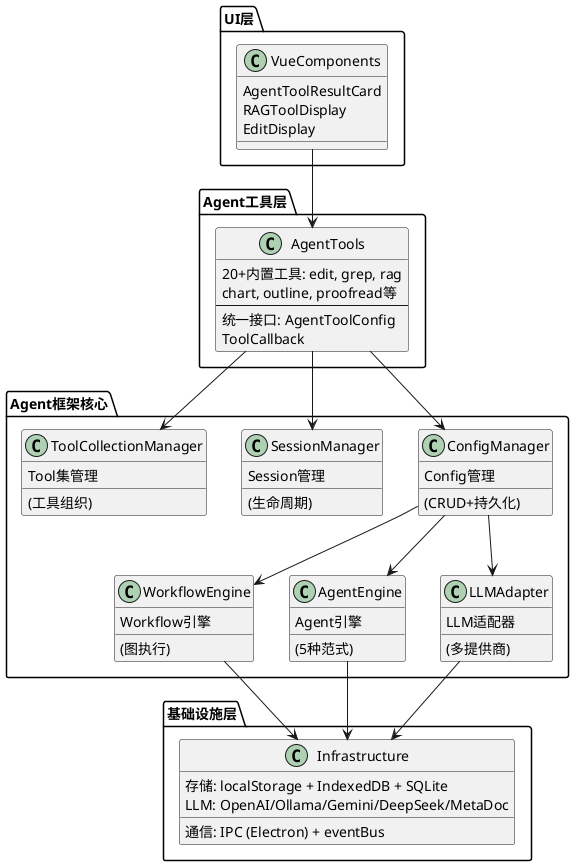
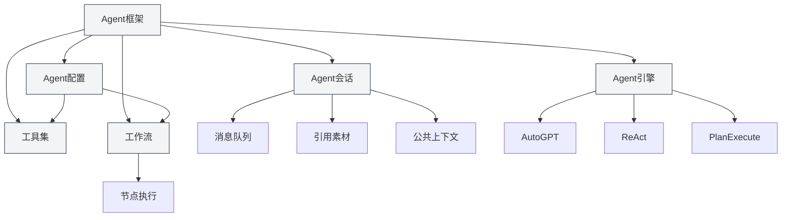
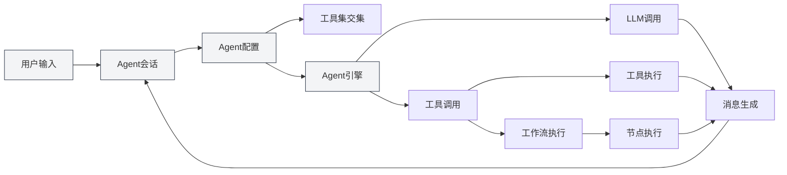
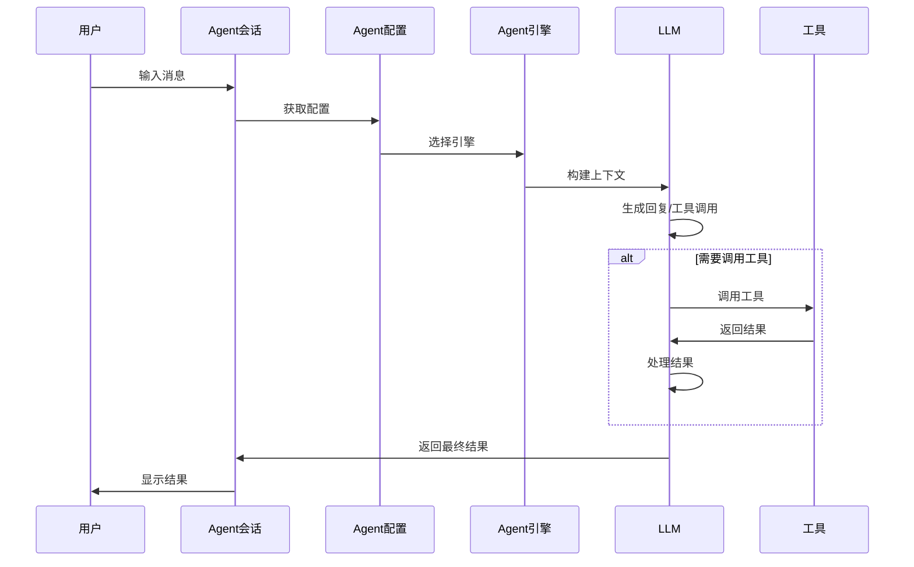

# Agent框架概述

## 概述

Agent框架是MetaDoc中用于构建和管理智能Agent系统的核心框架，采用**分层架构设计**。它提供了完整的Agent生命周期管理，包括会话管理、配置管理、工具集管理、工作流管理和引擎管理等功能。

Agent框架基于已有的Tool系统构建，通过工作流（Workflow）、Agent配置（AgentConfig）、工具集（ToolCollection）和Agent会话（AgentSession）等核心组件，实现了灵活、可扩展的Agent系统。

## 界面预览

Agent框架提供了直观的界面来管理 Agent 会话和工具：

<AgentViewDemo />

## 技术架构

### 架构分层



### 核心文件路径

| 类别           | 文件路径                                                            | 说明                      |
| -------------- | ------------------------------------------------------------------- | ------------------------- |
| **类型定义**   | `src/renderer/src/types/agent-framework.ts`                         | Agent框架核心类型定义     |
| **类型定义**   | `src/renderer/src/types/agent-tool.ts`                              | Agent工具类型定义         |
| **配置管理**   | `src/renderer/src/utils/agent-framework/agent-config-manager.ts`    | AgentConfig的CRUD和持久化 |
| **会话管理**   | `src/renderer/src/utils/agent-framework/agent-session-manager.ts`   | AgentSession生命周期管理  |
| **工具集管理** | `src/renderer/src/utils/agent-framework/tool-collection-manager.ts` | 工具集的组织和管理        |
| **工作流管理** | `src/renderer/src/utils/agent-framework/workflow-manager.ts`        | 工作流CRUD和执行状态      |
| **工作流执行** | `src/renderer/src/utils/agent-framework/workflow-executor.ts`       | 工作流图执行引擎          |
| **引擎管理**   | `src/renderer/src/utils/agent-framework/agent-engine-manager.ts`    | Agent引擎配置管理         |
| **引擎执行**   | `src/renderer/src/utils/agent-framework/agent-engine-executor.ts`   | 5种执行范式实现           |
| **工具运行**   | `src/renderer/src/utils/agent-framework/tool-runner.ts`             | 统一工具调用入口          |
| **LLM适配**    | `src/renderer/src/utils/agent-framework/llm-adapter.ts`             | 多LLM提供商适配           |



## 核心概念

### Agent会话（AgentSession）

Agent会话是AgentConfig的实例，代表一个独立的、有上下文的Agent执行环境。基于 `agent-session-manager.ts` 实现，每个会话维护自己的消息历史、引用素材、公共上下文空间，并支持消息队列、重试、Duplicate等高级功能。

**类型定义**（`types/agent-framework.ts` 第387-424行）：

```typescript
export interface AgentSession {
  entityType: 'agent-session'
  id: string
  title: string
  agentConfigId: string // 关联的AgentConfig
  messages: AgentMessage[] // 消息历史
  messageQueue: QueuedMessage[] // 消息队列
  referenceStore: Reference[] // 引用素材
  publicContext: PublicContext // 公共上下文
  executionNodes: ExecutionNode[] // 执行节点（用于重试）
  status: AgentSessionStatus // 会话状态
}
```

**会话状态机**：

```
idle → thinking → generating → tool-calling → workflow-executing → waiting-input → error
```

详见[[agent.session|Agent会话管理]]。

### Agent配置（AgentConfig）

AgentConfig定义了Agent的身份和能力范围，基于 `agent-config-manager.ts` 实现。

**类型定义**（`types/agent-framework.ts` 第242-289行）：

```typescript
export interface AgentConfig {
  entityType: 'agent-config'
  id: string
  name: LocalizedText // 支持i18n的名称
  description: LocalizedText // 支持i18n的描述
  toolCollectionIds: string[] // 关联的工具集ID（取交集）
  maxToolCalls?: number | null // 最大工具调用次数
  llmConfig?: {
    model?: string
    temperature?: number
    systemPrompt?: string // 系统提示词
    injectTimestamp?: boolean
  }
  behavior?: {
    allowToolCalls?: boolean
    allowWorkflowCalls?: boolean
  }
  scenario?: 'outline' | 'editor' | 'analysis' | 'visualization' | 'custom'
}
```

**核心功能**：

- **默认配置**：`default-agent-config`（内置，不可删除）
- **工具集交集**：关联多个工具集时，可用工具是所有工具集的交集
- **LLM参数覆盖**：可以覆盖全局LLM配置
- **持久化**：存储于 `localStorage`，键为 `'agent-configs'`

详见[[agent.config|Agent配置管理]]。

### 工具集（ToolCollection）

工具集是一组Agent工具的集合，用于组织和管理Agent可用的工具。AgentConfig可以关联多个工具集，可用工具取所有工具集的交集。

详见[[agent.tools|工具集管理]]。

### 工作流（Workflow）

工作流以程序流程图的方式规定了固定的、标准化的执行流程，减少由于大模型随机性造成的结果差异。工作流可以作为工具被Agent调用，也可以嵌套使用。

详见[[agent.workflow|工作流管理]]。

### 引用素材（Reference）

引用素材是Agent会话中引用的文档和文件，Agent可以感知这些内容并基于它们进行推理和操作。支持文件、URL、知识库等多种类型的引用。

详见[[agent.references|引用素材管理]]。

### Agent引擎（AgentEngine）

Agent引擎定义了Agent的执行策略和行为方式，包括AutoGPT、ReAct、PlanExecute等多种范式。不同的引擎适用于不同的任务场景。

详见[[agent.engine|Agent引擎管理]]。

## 系统架构

Agent框架的系统架构如下：



## 执行流程

Agent的基本执行流程：

1. **用户输入**：用户在Agent会话中输入消息
2. **意图识别**：系统识别用户意图，更新可用工具说明
3. **引擎选择**：根据Agent配置选择执行引擎
4. **上下文构建**：构建包含历史消息、引用素材、工具说明的上下文
5. **LLM调用**：调用LLM生成回复或工具调用
6. **工具执行**：如果LLM决定调用工具，执行相应的工具
7. **结果处理**：将工具执行结果作为观察（Observation）返回给LLM
8. **迭代循环**：根据引擎类型，可能进行多轮迭代直到完成任务
9. **结果输出**：将最终结果展示给用户



## 功能特性

### 核心功能

- **会话管理**：创建、删除、复制、导出/导入会话
- **配置管理**：灵活的Agent配置，支持多工具集交集
- **工具集管理**：组织和管理Agent工具
- **工作流管理**：图形化创建工作流，支持复杂执行逻辑
- **引用素材管理**：管理会话中的引用文档和文件
- **引擎管理**：支持多种执行范式，可自定义引擎

### 高级功能

- **消息队列**：在Agent执行过程中插入消息
- **重试机制**：支持重试失败的执行节点
- **Duplicate功能**：复制会话或执行节点
- **公共上下文**：会话级别的共享上下文空间
- **执行节点追踪**：记录每个执行节点的状态和结果

## 使用场景

Agent框架适用于以下场景：

- **文档编辑**：使用Agent工具进行文档编辑和优化
- **数据分析**：使用数据分析工具进行数据处理和可视化
- **内容生成**：使用工作流生成结构化的内容
- **知识检索**：结合知识库进行智能检索和分析
- **自动化任务**：通过工作流实现复杂的自动化任务

## 快速开始

要开始使用Agent框架，建议按以下顺序学习：

1. [[agent.introduction|Agent框架概述]]（本文档）
2. [[agent.config|Agent配置管理]]：了解如何配置Agent
3. [[agent.tools|工具集管理]]：学习如何管理工具集
4. [[agent.session|Agent会话管理]]：创建和管理会话
5. [[agent.workflow|工作流管理]]：创建复杂的工作流
6. [[agent.references|引用素材管理]]：管理引用素材
7. [[agent.engine|Agent引擎管理]]：选择和配置引擎

## 常见问题

### Q: Agent框架和AI对话有什么区别？

A: AI对话是简单的对话功能，而Agent框架提供了完整的Agent系统，包括工具调用、工作流执行、引用素材管理等高级功能。Agent框架可以执行复杂的任务，而不仅仅是对话。

### Q: 如何选择合适的Agent引擎？

A:

- **AutoGPT引擎**：适合大多数智能任务，自主决策能力强
- **ReAct引擎**：适合需要详细推理步骤的任务，显式思考过程
- **PlanExecute引擎**：适合需要结构化执行的任务，先规划再执行
- **SimpleChat引擎**：适合纯对话任务，不调用工具
- **Workflow引擎**：专为执行Workflow工具而设计

### Q: 工具集交集是什么意思？

A: 当AgentConfig关联多个工具集时，可用的工具是所有工具集的交集。例如，工具集A包含`[tool1, tool2, tool3]`，工具集B包含`[tool2, tool3, tool4]`，则AgentConfig可用工具为`[tool2, tool3]`。

### Q: 工作流和Agent有什么区别？

A: 工作流不是Agent，它是一种将多个Tool/Workflow组合封装成一个新的Tool的方式。工作流本质上是复杂的Tool调用，不参与Agent的内部推理逻辑。Agent的执行策略由Agent引擎决定。

## 相关文档

- [[agent.session|Agent会话管理]]
- [[agent.config|Agent配置管理]]
- [[agent.tools|工具集管理]]
- [[agent.workflow|工作流管理]]
- [[agent.references|引用素材管理]]
- [[agent.engine|Agent引擎管理]]
- [[ai.llm-config|LLM配置]]
